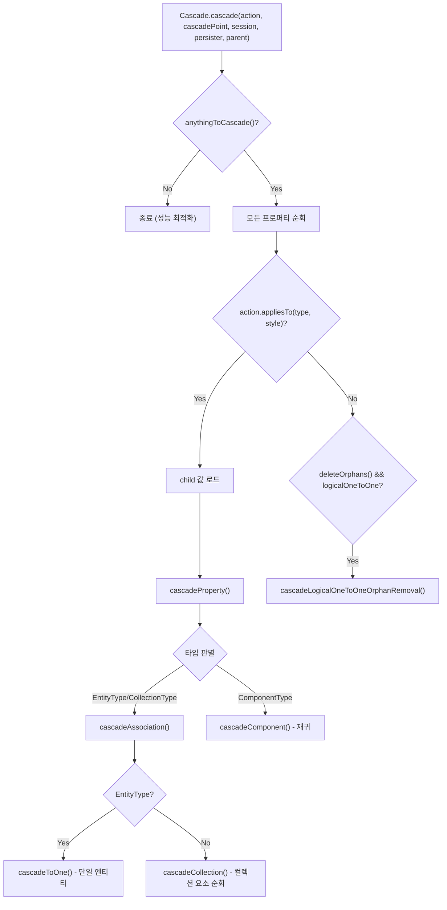
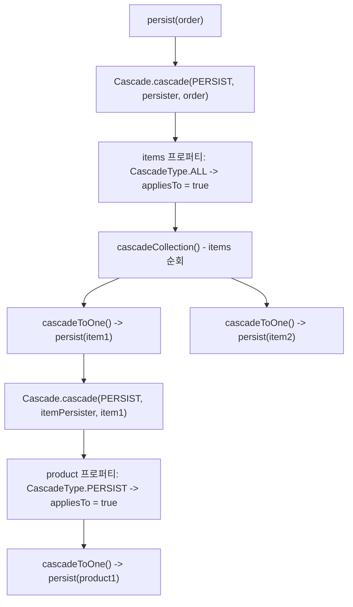

# Cascade 전파 메커니즘

부모 엔티티에 대한 영속성 연산(persist, merge, remove 등)이 자식 엔티티로 자동 전파되는 과정을 Cascade라 한다. Hibernate는 `CascadingAction` 정적 인스턴스와 `Cascade.cascade()` 재귀 탐색을 통해 이를 구현한다.

## 목차
- [1. 핵심 개념 (What)](#1-핵심-개념-what)
- [2. 왜 알아야 하는가 (Why)](#2-왜-알아야-하는가-why)
- [3. 내부 구현 분석 (How)](#3-내부-구현-분석-how)
- [4. 실전 예제](#4-실전-예제)
- [5. 정리](#5-정리)

---

## 1. 핵심 개념 (What)

### CascadingAction: 전파할 연산의 정의

`CascadingActions` 클래스는 각 영속성 연산에 대응하는 정적 `CascadingAction` 인스턴스를 정의한다:

| 인스턴스 | 대응 연산 | `deleteOrphans()` | `performOnLazyProperty()` |
|---------|----------|-------------------|--------------------------|
| `PERSIST` | `session.persist()` | false | false |
| `MERGE` | `session.merge()` | false | true |
| `REMOVE` | `session.remove()` | true | true |
| `REFRESH` | `session.refresh()` | false | true |
| `EVICT` | `session.evict()` | false | false |
| `LOCK` | `session.lock()` | false | true |
| `PERSIST_ON_FLUSH` | flush 시 persist 전파 | true | false |
| `CHECK_ON_FLUSH` | flush 시 transient 참조 검사 | false | false |
| `REPLICATE` | `session.replicate()` | false | true |

### CascadePoint: 전파 시점

`CascadePoint` 열거형은 cascade가 발생하는 시점을 나타낸다:

```java
public enum CascadePoint {
    AFTER_INSERT_BEFORE_DELETE,           // 삽입 후, 삭제 전
    BEFORE_INSERT_AFTER_DELETE,           // 삽입 전, 삭제 후
    AFTER_INSERT_BEFORE_DELETE_VIA_COLLECTION, // 컬렉션 경유
    AFTER_UPDATE,                         // 업데이트 후
    BEFORE_FLUSH,                         // flush 전
    AFTER_EVICT,                          // evict 후
    BEFORE_REFRESH,                       // refresh 전
    AFTER_LOCK,                           // lock 후
    BEFORE_MERGE                          // merge 전
}
```

## 2. 왜 알아야 하는가 (Why)

1. **`CascadeType.ALL`의 위험성 이해**: 무분별한 `ALL` 사용은 의도치 않은 삭제나 영속화를 유발한다. 내부 전파 로직을 알면 정확한 cascade 타입을 선택할 수 있다
2. **orphanRemoval 동작 원리**: `orphanRemoval = true`는 컬렉션에서 제거된 엔티티를 자동 삭제하는데, 이것이 `deleteOrphans()` 플래그와 연결된다
3. **TransientPropertyValueException 해결**: "persist the transient instance before flushing" 오류의 근본 원인이 `CHECK_ON_FLUSH` 액션에 있다
4. **성능 영향 예측**: cascade 전파는 재귀적이므로, 깊은 객체 그래프에서 의도치 않은 대량 연산이 발생할 수 있다

## 3. 내부 구현 분석 (How)

### Cascade.cascade(): 핵심 전파 로직



`Cascade` 클래스의 핵심 메서드를 분석한다:

```java
public static <T> void cascade(
        final CascadingAction<T> action,
        final CascadePoint cascadePoint,
        final EventSource eventSource,
        final EntityPersister persister,
        final Object parent,
        final T anything) throws HibernateException {

    // 성능 최적화: 이 persister에 cascade할 것이 있는지 빠르게 판별
    if (action.anythingToCascade(persister)) {
        final Type[] types = persister.getPropertyTypes();
        final String[] propertyNames = persister.getPropertyNames();
        final var cascadeStyles = persister.getPropertyCascadeStyles();

        for (int i = 0; i < types.length; i++) {
            final var style = cascadeStyles[i];
            final Type type = types[i];

            if (action.appliesTo(type, style)) {
                // child 값을 가져와서 cascadeProperty() 호출
                final Object child = persister.getValue(parent, i);
                cascadeProperty(action, cascadePoint, eventSource,
                    persister.getEntityName(), null, parent, child,
                    type, style, propertyNames[i], anything, ...);
            }
        }
    }
}
```

### 성능 최적화: anythingToCascade()

각 `CascadingAction`은 `anythingToCascade()`를 오버라이드하여 불필요한 순회를 방지한다:

```java
// PERSIST: hasCascadePersist()가 false면 전체 순회 스킵
public static final CascadingAction<PersistContext> PERSIST = new BaseCascadingAction<>() {
    @Override
    public boolean anythingToCascade(EntityPersister persister) {
        return persister.hasCascadePersist();
    }
};

// REMOVE: hasCascadeDelete()가 false면 전체 순회 스킵
public static final CascadingAction<DeleteContext> REMOVE = new BaseCascadingAction<>() {
    @Override
    public boolean anythingToCascade(EntityPersister persister) {
        return persister.hasCascadeDelete();
    }
};
```

### 지연 로딩 프로퍼티 처리

초기화되지 않은 lazy 프로퍼티에 대한 cascade 처리는 `performOnLazyProperty()` 플래그에 따라 다르다:

```java
if (isUninitializedProperty) {
    if (entry == null) {
        continue; // detached 상태면 lazy 속성 무시
    } else if (type instanceof CollectionType collectionType) {
        // 컬렉션은 항상 PersistentCollection 가져옴
        child = collectionType.getCollection(...);
    } else if (action.performOnLazyProperty() && type instanceof EntityType) {
        // MERGE, REMOVE 등은 lazy 엔티티도 초기화
        child = bytecodeEnhancement.extractInterceptor(parent)
                .fetchAttribute(parent, propertyName);
    } else {
        continue; // PERSIST, EVICT 등은 lazy 속성 스킵
    }
}
```

### cascadeToOne(): 단일 연관 엔티티 전파

```java
private static <T> void cascadeToOne(...) {
    if (style.reallyDoCascade(action)) {
        // parent-child 관계 등록 (순환 방지)
        persistenceContext.addChildParent(child, parent);
        try {
            // action.cascade()가 실제 세션 메서드 호출
            action.cascade(eventSource, child, childEntityName, ...);
        } finally {
            persistenceContext.removeChildParent(child);
        }
    }
}
```

각 `CascadingAction`의 `cascade()` 메서드는 해당 세션 메서드를 호출한다:

```java
// PERSIST.cascade() -> session.persist(childEntityName, child, context)
// MERGE.cascade()   -> session.merge(childEntityName, child, context)
// REMOVE.cascade()  -> session.delete(childEntityName, child, isCascadeDeleteEnabled, context)
```

### 컬렉션 순회와 Orphan 삭제

```java
private static <T> void cascadeCollectionElements(...) {
    // 1단계: 컬렉션의 각 요소에 대해 재귀적으로 cascade
    if (style.reallyDoCascade(action)) {
        final var iterator = action.getCascadableChildrenIterator(
            eventSource, collectionType, child);
        while (iterator.hasNext()) {
            cascadeProperty(action, cascadePoint, ..., iterator.next(), ...);
        }
    }

    // 2단계: orphan 삭제 (orphanRemoval = true인 경우)
    if (style.hasOrphanDelete() && action.deleteOrphans()
            && elemType instanceof EntityType
            && persistentCollection != null
            && !persistentCollection.isNewlyInstantiated()) {
        deleteOrphans(eventSource, elementEntityName, persistentCollection);
    }
}
```

### CascadingAction별 컬렉션 초기화 전략

```java
// REMOVE: 초기화되지 않은 컬렉션도 cascade (모든 요소 삭제해야 하므로)
REMOVE.getCascadableChildrenIterator() -> getAllElementsIterator()

// PERSIST, MERGE, REFRESH: 이미 로드된 요소만 cascade
PERSIST.getCascadableChildrenIterator() -> getLoadedElementsIterator()
```

## 4. 실전 예제

### Cascade 전파 추적

```java
@Entity
public class Order {
    @OneToMany(mappedBy = "order", cascade = CascadeType.ALL, orphanRemoval = true)
    private List<OrderItem> items = new ArrayList<>();
}

@Entity
public class OrderItem {
    @ManyToOne
    private Order order;

    @ManyToOne(cascade = CascadeType.PERSIST)
    private Product product;
}
```

`session.persist(order)` 호출 시 내부 전파 흐름:



### orphanRemoval 동작

```java
order.getItems().remove(0); // 컬렉션에서 제거
session.flush(); // flush 시점에 orphan 감지 및 DELETE 실행
```

내부적으로 `PERSIST_ON_FLUSH` 액션의 `deleteOrphans()` 가 `true`를 반환하여, flush 시점에 `PersistentCollection.getOrphans()`로 제거된 요소를 감지하고 DELETE를 스케줄링한다.

### CHECK_ON_FLUSH와 TransientPropertyValueException

```java
// cascade = NONE인 연관관계에서 새 엔티티를 참조하면
order.setCustomer(new Customer()); // transient 객체
session.flush(); // TransientPropertyValueException 발생!
```

`CHECK_ON_FLUSH` 액션은 cascade 설정이 NONE이어도 모든 연관관계를 검사한다:

```java
CHECK_ON_FLUSH.appliesTo(type, style) {
    return super.appliesTo(type, style)
        && (type.isComponentType() || type.isAssociationType());
}
```

## 5. 정리

| 구성 요소 | 역할 |
|-----------|------|
| `CascadingAction<T>` | 전파할 연산 정의 (PERSIST, MERGE, REMOVE 등) |
| `CascadeStyle` | 엔티티 프로퍼티별 cascade 설정 (`@OneToMany(cascade=...)`) |
| `CascadePoint` | cascade 발생 시점 (삽입 전/후, 삭제 전/후 등) |
| `Cascade.cascade()` | 재귀 전파 엔진 - 프로퍼티 순회 + 타입별 분기 |
| `Cascade.cascadeToOne()` | 단일 연관 엔티티에 대한 cascade 실행 |
| `Cascade.cascadeCollectionElements()` | 컬렉션 요소 순회 + orphan 삭제 |

핵심 설계 원칙:
- **Strategy 패턴**: `CascadingAction`이 전파 연산을 추상화하고, `Cascade` 클래스가 탐색 알고리즘을 담당
- **성능 우선**: `anythingToCascade()`, `performOnLazyProperty()` 등의 플래그로 불필요한 초기화와 순회를 방지
- **재귀 구조**: `cascadeProperty()` -> `cascadeComponent()` -> `cascadeProperty()` 형태로 중첩 컴포넌트까지 탐색

---
*참고: Hibernate ORM 6.5.x 기준*
