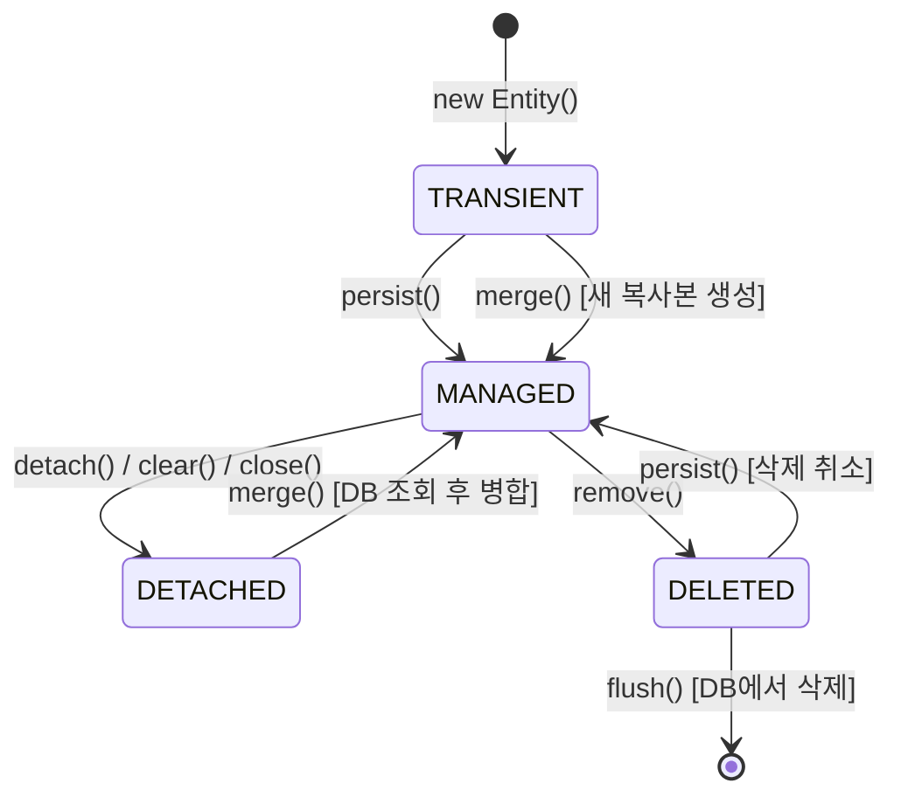
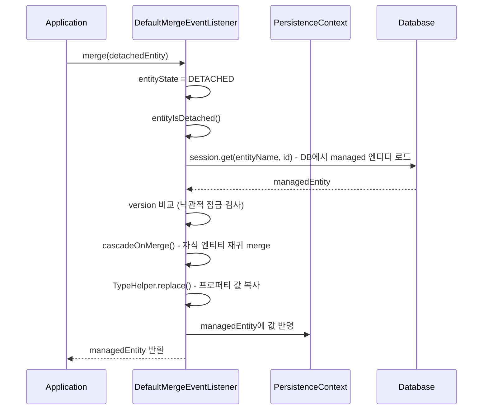

# 엔티티 상태 전이

JPA/Hibernate에서 엔티티는 `TRANSIENT`, `PERSISTENT(MANAGED)`, `DETACHED`, `DELETED` 네 가지 상태를 갖는다. `persist()`, `merge()`, `remove()` 같은 Session 메서드는 이 상태를 전이시키며, 각 전이의 내부 처리는 Default*EventListener 클래스들이 담당한다.

## 목차
- [1. 핵심 개념 (What)](#1-핵심-개념-what)
- [2. 왜 알아야 하는가 (Why)](#2-왜-알아야-하는가-why)
- [3. 내부 구현 분석 (How)](#3-내부-구현-분석-how)
- [4. 실전 예제](#4-실전-예제)
- [5. 정리](#5-정리)

---

## 1. 핵심 개념 (What)

### 네 가지 엔티티 상태



| 상태 | PersistenceContext 포함 여부 | DB 대응 행 | EntityEntry.status |
|------|---------------------------|-----------|-------------------|
| TRANSIENT | X | X | (없음) |
| MANAGED (PERSISTENT) | O | O (또는 INSERT 예정) | `MANAGED` / `READ_ONLY` |
| DETACHED | X | O | (없음) |
| DELETED | O | O (DELETE 예정) | `DELETED` |

### EntityState 열거형

Hibernate 내부에서 엔티티 상태를 판별하는 핵심 로직은 `EntityState.getEntityState()` 메서드에 있다:

```java
public enum EntityState {
    PERSISTENT, TRANSIENT, DETACHED, DELETED;

    public static EntityState getEntityState(
            Object entity, String entityName,
            EntityEntry entry, SessionImplementor source,
            Boolean assumedUnsaved) {

        if (entry != null) { // PersistenceContext에 EntityEntry가 있으면
            if (entry.getStatus() != Status.DELETED) {
                return PERSISTENT;
            } else {
                return DELETED;
            }
        }
        // EntityEntry가 없으면 transient vs detached 판별
        else if (ForeignKeys.isTransient(entityName, entity, assumedUnsaved, source)) {
            return TRANSIENT;
        } else {
            return DETACHED;
        }
    }
}
```

판별 우선순위:
1. `EntityEntry` 존재 여부 확인 (PersistenceContext 조회)
2. `EntityEntry.status`가 `DELETED`인지 확인
3. `ForeignKeys.isTransient()` - ID가 null이거나, unsaved-value 전략으로 transient 판별
4. 위 모두 아니면 DETACHED

## 2. 왜 알아야 하는가 (Why)

1. **예외 원인 이해**: `DetachedObjectException`, `PersistentObjectException`, `TransientPropertyValueException` 등은 모두 잘못된 상태 전이 시도에서 발생한다
2. **merge() vs persist() 선택 기준**: 엔티티 상태에 따라 적절한 메서드가 다르다. merge()는 detached 엔티티용이고, persist()는 transient 엔티티용이다
3. **dirty checking 범위**: MANAGED 상태 엔티티만 flush 시점에 dirty checking 대상이 된다
4. **메모리 관리**: MANAGED 상태가 유지되는 동안 엔티티는 PersistenceContext에 참조되어 GC 대상이 아니다

## 3. 내부 구현 분석 (How)

### TRANSIENT -> MANAGED: DefaultPersistEventListener

```java
public class DefaultPersistEventListener
        extends AbstractSaveEventListener<PersistContext>
        implements PersistEventListener {

    public void onPersist(PersistEvent event, PersistContext createCache) {
        final Object object = event.getObject();
        final var lazyInitializer = extractLazyInitializer(object);
        if (lazyInitializer != null) {
            // 프록시가 전달된 경우: 초기화 상태에 따라 분기
            if (lazyInitializer.isUninitialized()) {
                // 같은 세션의 프록시면 무시, 다른 세션이면 예외
            } else {
                persist(event, createCache, lazyInitializer.getImplementation());
            }
        } else {
            persist(event, createCache, object);
        }
    }
}
```

`persist()` 메서드 내부에서 엔티티 상태에 따라 분기한다:

```java
private void persist(PersistEvent event, PersistContext createCache, Object entity) {
    final var entityEntry = source.getPersistenceContextInternal().getEntry(entity);
    switch (getEntityState(entity, entityName, entityEntry, source, true)) {
        case TRANSIENT:
            entityIsTransient(event, createCache);  // ID 생성 + INSERT 스케줄링
            break;
        case PERSISTENT:
            entityIsPersistent(event, createCache); // cascade만 수행
            break;
        case DETACHED:
            throw new PersistentObjectException(    // detached는 persist 불가
                "Detached entity passed to persist: " + entityName);
        case DELETED:
            entityEntry.setStatus(Status.MANAGED);  // 삭제 취소!
            entityEntry.setDeletedState(null);
            source.getActionQueue().unScheduleDeletion(entityEntry, event.getObject());
            break;
    }
}
```

핵심 포인트:
- **TRANSIENT**: `saveWithGeneratedId()`로 ID를 생성하고 PersistenceContext에 등록
- **PERSISTENT**: 이미 managed이므로 cascade만 수행
- **DETACHED**: `PersistentObjectException` 발생 (persist는 detached 불가)
- **DELETED**: 상태를 `MANAGED`로 되돌리고 삭제 스케줄 취소

### DETACHED -> MANAGED: DefaultMergeEventListener

```java
public class DefaultMergeEventListener
        extends AbstractSaveEventListener<MergeContext>
        implements MergeEventListener {

    private void merge(MergeEvent event, MergeContext copiedAlready, Object entity) {
        switch (entityState) {
            case DETACHED:
                entityIsDetached(event, copiedId, originalId, copiedAlready);
                break;
            case TRANSIENT:
                entityIsTransient(event, copiedId, copiedAlready);
                break;
            case PERSISTENT:
                entityIsPersistent(event, copiedAlready);
                break;
            default: // DELETED
                throw new ObjectDeletedException(...);
        }
    }
}
```

**Detached 엔티티 merge 과정**:



`merge()`의 반환값은 **새로운 managed 인스턴스**이며, 원본 detached 인스턴스는 여전히 detached 상태다:

```java
protected void entityIsDetached(MergeEvent event, ...) {
    // DB에서 기존 엔티티 로드
    final Object result = session.get(entityName, clonedIdentifier);

    if (result == null) {
        // DB에 없으면 -> transient로 처리 또는 StaleObjectStateException
    } else {
        // detached 값을 managed 엔티티로 복사
        copyCache.put(entity, result, true);
        cascadeOnMerge(session, persister, entity, copyCache);

        // 프로퍼티 값을 managed 엔티티에 복사
        final Object[] copiedValues = TypeHelper.replace(
            persister.getValues(entity),   // source: detached
            persister.getValues(target),   // target: managed
            propertyTypes, session, target, copyCache
        );
        persister.setValues(target, copiedValues);
        event.setResult(result); // managed 인스턴스 반환
    }
}
```

### MANAGED -> DELETED: DefaultDeleteEventListener

```java
public class DefaultDeleteEventListener implements DeleteEventListener {

    protected final void deleteEntity(
            final EventSource session,
            final Object entity,
            final EntityEntry entityEntry,
            ...) {

        // 1. deletedState 생성 (현재 상태의 깊은 복사)
        final Object[] deletedState = createDeletedState(persister, entity, currentState, session);
        entityEntry.setDeletedState(deletedState);

        // 2. 인터셉터 알림
        session.getInterceptor().onRemove(entity, entityEntry.getId(), ...);

        // 3. 상태를 DELETED로 변경 (핵심!)
        persistenceContext.setEntryStatus(entityEntry, Status.DELETED);

        // 4. cascade: 자식 엔티티 삭제 전파
        cascadeBeforeDelete(session, persister, entity, transientEntities);

        // 5. FK null 처리
        new ForeignKeys.Nullifier(entity, true, false, session, persister)
                .nullifyTransientReferences(entityEntry.getDeletedState());

        // 6. EntityDeleteAction 스케줄링 (실제 DELETE는 flush 시 실행)
        actionQueue.addAction(new EntityDeleteAction(
            entityEntry.getId(), deletedState, version, entity, persister, ...));

        // 7. cascade: 자식 엔티티 삭제 후처리
        cascadeAfterDelete(session, persister, entity, transientEntities);
    }
}
```

삭제의 cascade 순서가 중요하다:

```java
// 삭제 전: 컬렉션 cascade (부모 삭제 전에 자식 먼저 처리)
cascadeBeforeDelete() -> CascadePoint.AFTER_INSERT_BEFORE_DELETE

// 삭제 후: ManyToOne cascade (부모 삭제 후에 참조 엔티티 처리)
cascadeAfterDelete()  -> CascadePoint.BEFORE_INSERT_AFTER_DELETE
```

### 최적화: 언로드 프록시 삭제

`DefaultDeleteEventListener`는 초기화되지 않은 프록시를 DB에서 로드하지 않고 삭제할 수 있는 최적화를 포함한다:

```java
private boolean canBeDeletedWithoutLoading(EventSource source, EntityPersister persister) {
    return source.getInterceptor() == EmptyInterceptor.INSTANCE
        && !persister.hasSubclasses()
        && !persister.hasCascadeDelete()
        && !persister.hasNaturalIdentifier()
        && !persister.hasCollectionNotReferencingPK()
        && !hasRegisteredRemoveCallbacks(persister)
        && !hasCustomEventListeners(source);
}
```

모든 조건이 충족되면 엔티티를 로드하지 않고 바로 `EntityDeleteAction`을 스케줄링한다.

## 4. 실전 예제

### 상태별 허용/금지 연산

```java
// TRANSIENT 엔티티
Customer customer = new Customer("Alice");

session.persist(customer);    // OK: TRANSIENT -> MANAGED
session.merge(customer);      // OK: TRANSIENT -> 새 MANAGED 복사본 생성
session.remove(customer);     // OK: cascade만 수행 (JPA 스펙)
session.refresh(customer);    // ERROR: TransientObjectException

// MANAGED 엔티티
customer.setName("Bob");      // flush 시 자동 UPDATE (dirty checking)
session.persist(customer);    // OK: 아무 일도 안 함 (cascade만)
session.merge(customer);      // OK: 자기 자신 반환 (cascade + 값 복사)
session.remove(customer);     // OK: MANAGED -> DELETED

// DETACHED 엔티티 (세션 닫힌 후)
session.persist(customer);    // ERROR: PersistentObjectException
Customer managed = session.merge(customer);  // OK: DB 로드 + 값 복사
session.remove(customer);     // ERROR (JPA 모드) 또는 재연관 후 삭제 (native)

// DELETED 엔티티
session.persist(customer);    // OK: DELETED -> MANAGED (삭제 취소!)
session.merge(customer);      // ERROR: ObjectDeletedException
```

### persist() 후 remove() 후 persist() - 삭제 취소 패턴

```java
session.persist(entity);  // TRANSIENT -> MANAGED, INSERT 스케줄링
session.remove(entity);   // MANAGED -> DELETED, DELETE 스케줄링
session.persist(entity);  // DELETED -> MANAGED!
                          // status를 MANAGED로 복원
                          // ActionQueue에서 삭제 언스케줄
```

이 동작은 `DefaultPersistEventListener.persist()`의 `DELETED` 분기에서 처리된다:

```java
case DELETED:
    entityEntry.setStatus(Status.MANAGED);
    entityEntry.setDeletedState(null);
    source.getActionQueue().unScheduleDeletion(entityEntry, event.getObject());
    entityIsDeleted(event, createCache);
    break;
```

## 5. 정리

| 전이 | 메서드 | 내부 처리 클래스 | 핵심 동작 |
|------|--------|----------------|----------|
| TRANSIENT -> MANAGED | `persist()` | `DefaultPersistEventListener` | ID 생성, PersistenceContext 등록, INSERT 스케줄링 |
| DETACHED -> MANAGED | `merge()` | `DefaultMergeEventListener` | DB 로드, 값 복사, 새 managed 인스턴스 반환 |
| MANAGED -> DELETED | `remove()` | `DefaultDeleteEventListener` | 상태 DELETED, CASCADE 전파, DELETE 스케줄링 |
| MANAGED -> DETACHED | `detach()/clear()` | `DefaultEvictEventListener` | PersistenceContext에서 제거 |
| DELETED -> MANAGED | `persist()` | `DefaultPersistEventListener` | 삭제 취소, 상태 복원 |

핵심 설계 원칙:
- **상태 판별 우선**: 모든 이벤트 리스너는 작업 전에 `EntityState.getEntityState()`로 현재 상태를 확인
- **지연 실행**: `remove()`는 즉시 DELETE하지 않고 `EntityDeleteAction`을 스케줄링하여 flush 시 실행
- **안전한 전이**: 금지된 전이(detached -> persist)에 대해 명확한 예외를 발생시킨다

---
*참고: Hibernate ORM 6.5.x 기준*
