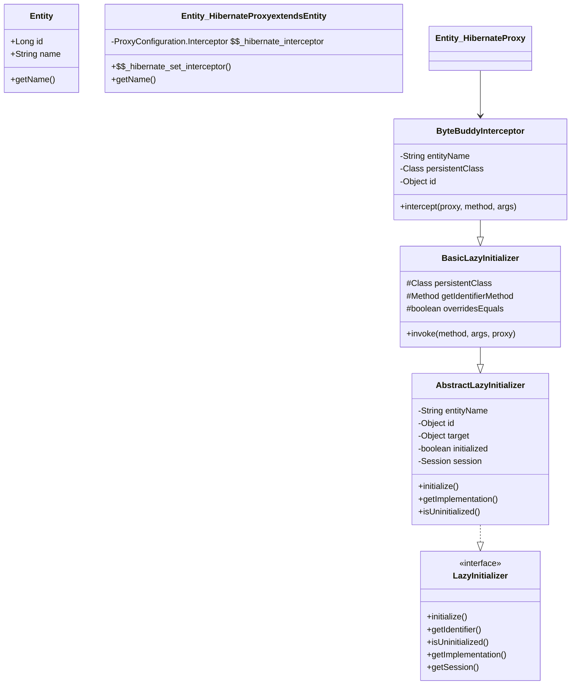
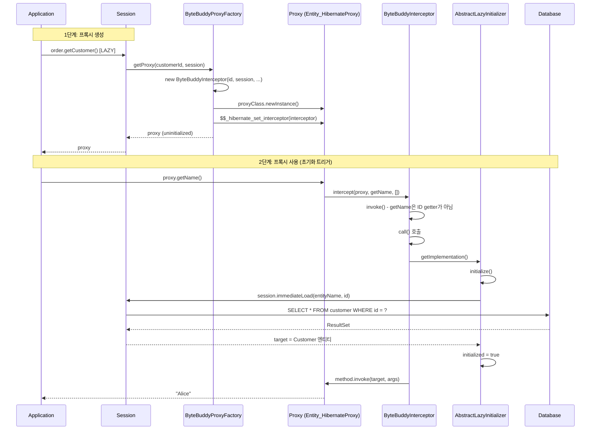

# ByteBuddy Proxy와 지연 로딩

Hibernate는 연관 엔티티의 지연 로딩(lazy loading)을 위해 ByteBuddy 라이브러리로 런타임 프록시를 생성한다. 프록시는 엔티티를 상속한 서브클래스이며, 메서드 호출 시 `LazyInitializer`를 통해 실제 엔티티를 투명하게 로드한다.

## 목차
- [1. 핵심 개념 (What)](#1-핵심-개념-what)
- [2. 왜 알아야 하는가 (Why)](#2-왜-알아야-하는가-why)
- [3. 내부 구현 분석 (How)](#3-내부-구현-분석-how)
- [4. 실전 예제](#4-실전-예제)
- [5. 정리](#5-정리)

---

## 1. 핵심 개념 (What)

### 프록시의 구조



### LazyInitializer 인터페이스

프록시의 초기화를 담당하는 핵심 인터페이스다:

```java
public interface LazyInitializer {
    void initialize() throws HibernateException;
    Object getIdentifier();                        // 초기화 없이 ID 반환 (JPA 호환 모드 제외)
    boolean isUninitialized();                     // 초기화 여부 확인
    Object getImplementation();                    // 실제 엔티티 반환 (초기화 트리거)
    void setImplementation(Object target);         // 수동으로 타겟 주입
    SharedSessionContractImplementor getSession(); // 연결된 세션
    void setSession(SharedSessionContractImplementor session);
    void unsetSession();                           // 세션 연결 해제
    String getEntityName();
    Class<?> getPersistentClass();
    boolean isReadOnly();
    void setReadOnly(boolean readOnly);
}
```

## 2. 왜 알아야 하는가 (Why)

1. **LazyInitializationException 해결**: 세션이 닫힌 후 프록시 접근 시 발생하는 가장 흔한 예외의 근본 원인을 이해해야 한다
2. **`equals()` / `instanceof` 함정**: 프록시는 엔티티의 서브클래스이므로 `getClass()` 비교가 실패할 수 있다
3. **N+1 문제의 기전**: 컬렉션의 각 요소가 프록시이고, 각각 초기화될 때마다 SELECT가 발생하는 N+1 문제의 원리
4. **직렬화 이슈**: 프록시를 JSON이나 Java 직렬화하면 전체 엔티티가 초기화되거나 예외가 발생한다

## 3. 내부 구현 분석 (How)

### ByteBuddyProxyFactory: 프록시 클래스 생성

`ByteBuddyProxyFactory`는 엔티티 클래스를 상속하는 프록시 클래스를 런타임에 생성한다:

```java
public class ByteBuddyProxyFactory implements ProxyFactory, Serializable {
    private Class<?> persistentClass;
    private Class<?> proxyClass; // ByteBuddy가 생성한 프록시 클래스

    @Override
    public void postInstantiate(String entityName, Class<?> persistentClass,
            Set<Class<?>> interfaces, Method getIdentifierMethod,
            Method setIdentifierMethod, CompositeType componentIdType) {
        this.persistentClass = persistentClass;
        this.interfaces = toArray(interfaces);
        this.overridesEquals = ReflectHelper.overridesEquals(persistentClass);
        // ByteBuddy로 프록시 클래스 생성 (EntityClass를 상속하는 서브클래스)
        this.proxyClass = byteBuddyProxyHelper.buildProxy(persistentClass, this.interfaces);
    }
}
```

### 프록시 인스턴스 생성: getProxy()

`session.getReference()` 또는 `@ManyToOne(fetch = LAZY)` 로딩 시 호출된다:

```java
@Override
public HibernateProxy getProxy(Object id, SharedSessionContractImplementor session) {
    // 1. 인터셉터(LazyInitializer) 생성
    final var interceptor = new ByteBuddyInterceptor(
        entityName, persistentClass, interfaces,
        id, getIdentifierMethod, setIdentifierMethod,
        componentIdType, session, overridesEquals
    );

    // 2. 프록시 인스턴스 생성 (기본 생성자 호출)
    final var instance = getHibernateProxy();

    // 3. 인터셉터를 프록시에 주입
    instance.asProxyConfiguration()
            .$$_hibernate_set_interceptor(interceptor);

    return instance;
}
```

이 시점에서 프록시는 **ID만 갖고 있고**, 나머지 프로퍼티는 모두 기본값(null/0)이다. 실제 데이터는 초기화 시점에 로드된다.

### ByteBuddyInterceptor: 메서드 호출 가로채기

프록시의 모든 메서드 호출은 `ByteBuddyInterceptor.intercept()`를 거친다:

```java
public class ByteBuddyInterceptor
        extends BasicLazyInitializer
        implements ProxyConfiguration.Interceptor {

    @Override
    public Object intercept(Object proxy, Method method, Object[] args) throws Throwable {
        return invoke(method, args, proxy);
    }

    @Override
    protected Object call(Object proxy, Method method, Object[] args) throws Throwable {
        // 실제 엔티티(target)를 가져와서 메서드를 위임
        final Object target = getImplementation(); // 초기화 트리거!
        final Object returnValue = method.invoke(target, args);

        // "this" 반환 패턴: target 대신 proxy를 반환하여 프록시 투명성 유지
        if (returnValue == target && returnValueClass.isInstance(proxy)) {
            return proxy;
        }
        return returnValue;
    }
}
```

### BasicLazyInitializer.invoke(): 초기화 판단 로직

```java
protected final Object invoke(Method method, Object[] args, Object proxy) throws Throwable {
    final String methodName = method.getName();
    switch (args.length) {
        case 0:
            if ("writeReplace".equals(methodName)) {
                return getReplacement();      // 직렬화 처리
            }
            else if (!overridesEquals && "hashCode".equals(methodName)) {
                return identityHashCode(proxy); // 초기화 없이 hashCode 반환
            }
            else if (isUninitialized() && method.equals(getIdentifierMethod)) {
                return getIdentifier();       // ID getter는 초기화 없이 반환!
            }
            else if ("getHibernateLazyInitializer".equals(methodName)) {
                return this;                  // LazyInitializer 자체 반환
            }
            break;
        case 1:
            if (!overridesEquals && "equals".equals(methodName)) {
                return args[0] == proxy;      // 초기화 없이 identity 비교
            }
            break;
    }

    // 위 조건에 해당하지 않으면 -> call() 호출 -> 초기화 발생
    return call(proxy, method, args);
}
```

**초기화가 발생하지 않는 메서드** (성능 최적화):
- `getId()` (식별자 getter) - ID는 프록시 생성 시 이미 보유
- `hashCode()` - `equals()`를 오버라이드하지 않은 경우
- `equals()` - `equals()`를 오버라이드하지 않은 경우 (identity 비교)
- `getHibernateLazyInitializer()` - 프록시 메타정보 접근

**초기화가 발생하는 메서드**:
- `getName()`, `getEmail()` 등 비즈니스 프로퍼티 getter
- `toString()` (보통 프로퍼티에 접근)
- 오버라이드된 `equals()` / `hashCode()`

### AbstractLazyInitializer.initialize(): 실제 초기화

```java
public abstract class AbstractLazyInitializer implements LazyInitializer {
    private Object target;       // 실제 엔티티
    private boolean initialized; // 초기화 여부

    @Override
    public final void initialize() throws HibernateException {
        if (!initialized) {
            if (session == null) {
                throw new LazyInitializationException(
                    "Could not initialize proxy [" + entityName + "#" + id + "] - no session");
            }
            else if (!session.isOpenOrWaitingForAutoClose()) {
                throw new LazyInitializationException(
                    "Could not initialize proxy [" + entityName + "#" + id
                    + "] - the owning session was closed");
            }
            else if (!session.isConnected()) {
                throw new LazyInitializationException(
                    "Could not initialize proxy [" + entityName + "#" + id
                    + "] - the owning session is disconnected");
            }
            else {
                // 세션을 통해 DB에서 엔티티 즉시 로드
                target = session.immediateLoad(entityName, id);
                initialized = true;
                checkTargetState(session); // null이면 EntityNotFoundException
            }
        }
    }
}
```

초기화 실패 조건 (LazyInitializationException):
1. `session == null` - 프록시가 세션에서 분리됨 (detach/evict/close)
2. `!session.isOpenOrWaitingForAutoClose()` - 세션이 닫힘
3. `!session.isConnected()` - DB 연결이 끊김

### 프록시 생성부터 초기화까지 전체 흐름



### 세션 연관과 해제

```java
// 세션 설정 시: 프록시와 세션 바인딩
public final void setSession(SharedSessionContractImplementor session) {
    if (session != this.session) {
        if (isConnectedToSession()) {
            throw new HibernateException(
                "Illegally attempted to associate proxy with two open sessions");
        }
        this.session = session;
        // 읽기 전용 설정 적용
        setReadOnly(session.getPersistenceContext().isDefaultReadOnly()
                || !getEntityDescriptor().isMutable());
    }
}

// 세션 해제 시: session 참조 null 처리
public final void unsetSession() {
    prepareForPossibleLoadingOutsideTransaction();
    session = null;
    readOnly = false;
}
```

## 4. 실전 예제

### 초기화 없이 ID 접근

```java
Customer proxy = session.getReference(Customer.class, 1L);
// proxy는 초기화되지 않은 상태

Long id = proxy.getId();
// getId()가 @Id 프로퍼티의 getter이면 -> 초기화 없이 ID 반환
// BasicLazyInitializer.invoke()에서 getIdentifierMethod와 매칭

boolean isInit = Hibernate.isInitialized(proxy); // false
```

### LazyInitializationException 방지 패턴

```java
// 패턴 1: 트랜잭션 범위 내에서 초기화
@Transactional
public OrderDto getOrder(Long id) {
    Order order = session.find(Order.class, id);
    Hibernate.initialize(order.getCustomer()); // 명시적 초기화
    return toDto(order);
}

// 패턴 2: Fetch Join으로 한 번에 로딩
Order order = session.createQuery(
    "SELECT o FROM Order o JOIN FETCH o.customer WHERE o.id = :id",
    Order.class)
    .setParameter("id", id)
    .getSingleResult();
// customer가 이미 초기화된 상태로 로드됨

// 패턴 3: EntityGraph 활용
EntityGraph<Order> graph = session.createEntityGraph(Order.class);
graph.addAttributeNodes("customer");
Order order = session.find(Order.class, id,
    Map.of("jakarta.persistence.fetchgraph", graph));
```

### 프록시와 equals/instanceof 주의사항

```java
Customer proxy = session.getReference(Customer.class, 1L);
Customer real = session.find(Customer.class, 1L);

// 주의: getClass() 비교는 실패할 수 있음
proxy.getClass() == Customer.class        // false! (서브클래스)
proxy instanceof Customer                  // true  (올바른 방법)

// equals() 구현 시 instanceof 사용
@Override
public boolean equals(Object o) {
    if (this == o) return true;
    // getClass() 대신 instanceof 사용해야 프록시와도 비교 가능
    if (!(o instanceof Customer other)) return false;
    return id != null && id.equals(other.getId());
}
```

### 프록시 언래핑

```java
// Hibernate 유틸리티로 실제 엔티티 추출
Customer real = (Customer) Hibernate.unproxy(proxy);

// 또는 LazyInitializer를 통해 직접 접근
HibernateProxy hibernateProxy = (HibernateProxy) proxy;
LazyInitializer initializer = hibernateProxy.getHibernateLazyInitializer();
Customer real = (Customer) initializer.getImplementation();
```

## 5. 정리

| 구성 요소 | 역할 |
|-----------|------|
| `ByteBuddyProxyFactory` | 엔티티 클래스를 상속하는 프록시 클래스 생성 및 인스턴스화 |
| `ByteBuddyInterceptor` | 프록시의 모든 메서드 호출을 가로채어 초기화 여부 결정 |
| `BasicLazyInitializer` | ID getter, hashCode, equals 등 특수 메서드의 초기화 없는 처리 |
| `AbstractLazyInitializer` | 초기화 로직 (session.immediateLoad), 세션 연관 관리 |
| `LazyInitializer` | 프록시 초기화의 공개 인터페이스 |

핵심 설계 원칙:
- **투명한 지연 로딩**: 프록시가 엔티티를 상속하므로 애플리케이션 코드에서 프록시와 실제 엔티티를 동일하게 취급
- **선택적 초기화**: ID getter, hashCode 등 초기화가 불필요한 메서드는 DB 접근 없이 처리
- **세션 바인딩**: 프록시 초기화에 반드시 열린 세션이 필요하며, 이를 통해 1차 캐시와 트랜잭션 컨텍스트를 활용

---
*참고: Hibernate ORM 6.5.x 기준*
