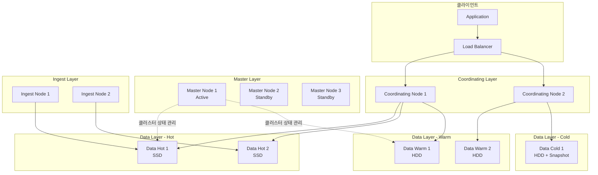

# Elasticsearch 클러스터 구축 및 설정

프로덕션 환경에서 안정적인 Elasticsearch 클러스터를 구축하기 위한 노드 구성 전략, 핵심 설정, JVM 튜닝, 디스커버리 메커니즘을 다룬다.

## 목차
- [1. 핵심 개념 (What)](#1-핵심-개념-what)
- [2. 왜 알아야 하는가 (Why)](#2-왜-알아야-하는가-why)
- [3. 내부 구현 분석 (How)](#3-내부-구현-분석-how)
- [4. 실전 예제](#4-실전-예제)
- [5. 정리](#5-정리)

---

## 1. 핵심 개념 (What)

### 노드 역할(Node Roles)

Elasticsearch 7.9+부터 `node.roles` 설정으로 노드 역할을 명시적으로 지정한다.

| 역할 | 설명 | 리소스 특성 |
|------|------|-------------|
| `master` | 클러스터 상태 관리, 인덱스 생성/삭제, 샤드 할당 | 낮은 CPU/메모리, 안정성 최우선 |
| `data` | 데이터 저장, CRUD, 검색, 집계 수행 | 높은 CPU/메모리/디스크 I/O |
| `data_content` | 일반 콘텐츠 데이터 전용 | 높은 디스크, SSD 권장 |
| `data_hot` | 최신 시계열 데이터 저장 | 높은 I/O, SSD 필수 |
| `data_warm` | 조회 빈도 낮은 시계열 데이터 | 대용량 HDD 가능 |
| `data_cold` | 거의 조회하지 않는 데이터 | 대용량 HDD, Searchable Snapshot |
| `ingest` | 인덱싱 전 파이프라인 처리 | 중간 CPU |
| `coordinating` | 요청 라우팅, 결과 병합 (역할 미지정 시 기본) | 높은 메모리 |
| `ml` | 머신러닝 작업 전용 | 높은 CPU/메모리 |

### 클러스터 구성 최소 요건

- **Master-eligible 노드**: 최소 3개 (Split-brain 방지)
- **Data 노드**: 워크로드에 따라 확장
- **Coordinating 노드**: 대규모 집계/검색 시 별도 구성 권장

## 2. 왜 알아야 하는가 (Why)

### 잘못된 구성의 결과

1. **Split-brain 문제**: Master 노드를 1~2개만 운영하면 네트워크 단절 시 두 개의 독립 클러스터가 형성되어 데이터 불일치 발생
2. **Hot Node 병목**: 모든 노드를 동일 역할로 구성하면 최신 데이터를 처리하는 노드에 부하 집중
3. **JVM OOM**: 힙 크기를 잘못 설정하면 GC 폭주 또는 OOM으로 노드 다운
4. **디스크 워터마크 초과**: 디스크 사용량 관리 없이 운영하면 샤드 할당이 중단되어 인덱싱 실패

### 올바른 구성의 효과

- 노드 역할 분리로 장애 격리 및 독립적 스케일링
- Hot-Warm-Cold 아키텍처로 비용 최적화
- 적절한 JVM 튜닝으로 안정적인 GC 동작 보장

## 3. 내부 구현 분석 (How)

### 클러스터 아키텍처



### 마스터 선출 프로세스

Elasticsearch 7.0+에서는 Zen Discovery 대신 새로운 클러스터 조정 메커니즘을 사용한다.

1. **초기 부트스트래핑**: `cluster.initial_master_nodes`에 지정된 노드들이 첫 번째 선출 수행
2. **투표 구성(Voting Configuration)**: 클러스터가 자동으로 관리하며, 과반수 기반 합의
3. **Term 기반 선출**: 각 선출마다 term이 증가하여 이전 리더의 결정을 무효화

### 샤드 할당 의사결정

```
할당 요청 → Allocation Decider 체인 실행
  ├── DiskThresholdDecider: 디스크 워터마크 확인
  ├── SameShardAllocationDecider: 동일 노드 중복 방지
  ├── FilterAllocationDecider: 사용자 정의 필터 확인
  ├── AwarenessAllocationDecider: rack/zone 인식 배치
  └── RebalanceAllocationDecider: 균형 재조정 판단
```

## 4. 실전 예제

### 4.1 Master Node 설정 (`elasticsearch.yml`)

```yaml
# ===== Master Node =====
cluster.name: prod-search-cluster
node.name: master-01

node.roles: [ master ]

# 네트워크
network.host: 0.0.0.0
http.port: 9200
transport.port: 9300

# 디스커버리
discovery.seed_hosts:
  - master-01:9300
  - master-02:9300
  - master-03:9300

# 최초 클러스터 부트스트래핑 시에만 사용 (이후 제거)
cluster.initial_master_nodes:
  - master-01
  - master-02
  - master-03

# Master 노드는 데이터를 저장하지 않으므로 경로를 최소화
path.data: /var/lib/elasticsearch
path.logs: /var/log/elasticsearch
```

### 4.2 Data Hot Node 설정

```yaml
# ===== Data Hot Node =====
cluster.name: prod-search-cluster
node.name: data-hot-01

node.roles: [ data_hot, ingest ]

# 네트워크
network.host: 0.0.0.0
http.port: 9200
transport.port: 9300

# 디스커버리 (Master 노드를 가리킴)
discovery.seed_hosts:
  - master-01:9300
  - master-02:9300
  - master-03:9300

# 데이터 경로 (SSD 여러 개 마운트)
path.data:
  - /mnt/ssd1/elasticsearch
  - /mnt/ssd2/elasticsearch
path.logs: /var/log/elasticsearch

# 스레드풀 튜닝
thread_pool.write.queue_size: 1000
thread_pool.search.queue_size: 2000

# 인덱싱 성능
indices.memory.index_buffer_size: 20%
```

### 4.3 Data Warm Node 설정

```yaml
# ===== Data Warm Node =====
cluster.name: prod-search-cluster
node.name: data-warm-01

node.roles: [ data_warm ]

network.host: 0.0.0.0

discovery.seed_hosts:
  - master-01:9300
  - master-02:9300
  - master-03:9300

# 대용량 HDD 사용
path.data:
  - /mnt/hdd1/elasticsearch
  - /mnt/hdd2/elasticsearch
  - /mnt/hdd3/elasticsearch
path.logs: /var/log/elasticsearch
```

### 4.4 Coordinating-only Node 설정

```yaml
# ===== Coordinating Node =====
cluster.name: prod-search-cluster
node.name: coord-01

# 빈 배열 = coordinating only
node.roles: [ ]

network.host: 0.0.0.0

discovery.seed_hosts:
  - master-01:9300
  - master-02:9300
  - master-03:9300

path.logs: /var/log/elasticsearch
```

### 4.5 JVM 옵션 (`jvm.options`)

```bash
# ===== Master Node JVM (4GB) =====
-Xms4g
-Xmx4g

# ===== Data Hot Node JVM (31GB 상한) =====
# 물리 메모리의 50% 이하, 최대 31GB (Compressed OOPs 한계)
-Xms31g
-Xmx31g

# GC 설정 (ES 8.x 기본값: G1GC)
-XX:+UseG1GC
-XX:G1HeapRegionSize=16m
-XX:MaxGCPauseMillis=200
-XX:InitiatingHeapOccupancyPercent=30

# GC 로깅
-Xlog:gc*,gc+age=trace,safepoint:file=/var/log/elasticsearch/gc.log:utctime,pid,tags:filecount=32,filesize=64m

# OOM 시 힙 덤프
-XX:+HeapDumpOnOutOfMemoryError
-XX:HeapDumpPath=/var/lib/elasticsearch/heapdump

# 임시 디렉터리
-Djava.io.tmpdir=${ES_TMPDIR}
```

### 4.6 OS 레벨 설정 (Linux)

```bash
# /etc/sysctl.conf
vm.max_map_count=262144
vm.swappiness=1
net.core.somaxconn=65535
net.ipv4.tcp_max_syn_backlog=65535

# /etc/security/limits.conf
elasticsearch  soft  nofile  65535
elasticsearch  hard  nofile  65535
elasticsearch  soft  nproc   4096
elasticsearch  hard  nproc   4096
elasticsearch  soft  memlock unlimited
elasticsearch  hard  memlock unlimited
```

### 4.7 디스크 워터마크 설정

```yaml
# elasticsearch.yml 또는 Cluster Settings API
cluster.routing.allocation.disk.threshold_enabled: true
cluster.routing.allocation.disk.watermark.low: 85%
cluster.routing.allocation.disk.watermark.high: 90%
cluster.routing.allocation.disk.watermark.flood_stage: 95%

# 동적 설정 (API)
# PUT _cluster/settings
# {
#   "persistent": {
#     "cluster.routing.allocation.disk.watermark.low": "85%",
#     "cluster.routing.allocation.disk.watermark.high": "90%",
#     "cluster.routing.allocation.disk.watermark.flood_stage": "95%"
#   }
# }
```

### 4.8 보안 설정 (xpack.security)

```yaml
# elasticsearch.yml
xpack.security.enabled: true
xpack.security.enrollment.enabled: true

# TLS - Transport Layer
xpack.security.transport.ssl.enabled: true
xpack.security.transport.ssl.verification_mode: certificate
xpack.security.transport.ssl.keystore.path: elastic-certificates.p12
xpack.security.transport.ssl.truststore.path: elastic-certificates.p12

# TLS - HTTP Layer
xpack.security.http.ssl.enabled: true
xpack.security.http.ssl.keystore.path: http.p12
```

```bash
# 인증서 생성
bin/elasticsearch-certutil ca
bin/elasticsearch-certutil cert --ca elastic-stack-ca.p12
bin/elasticsearch-certutil http
```

### 4.9 프로덕션 체크리스트

```bash
# 클러스터 상태 확인
GET _cluster/health
# green = 모든 샤드 정상
# yellow = 레플리카 미할당
# red = 프라이머리 샤드 미할당

# 노드 정보 확인
GET _cat/nodes?v&h=name,ip,role,heap.percent,ram.percent,cpu,load_1m

# 샤드 분배 확인
GET _cat/shards?v&h=index,shard,prirep,state,docs,store,node&s=index

# Hot threads 확인
GET _nodes/hot_threads

# Pending tasks 확인
GET _cluster/pending_tasks
```

### 4.10 Docker Compose 개발 환경

```yaml
version: '3.8'
services:
  es-master-01:
    image: docker.elastic.co/elasticsearch/elasticsearch:8.12.0
    container_name: es-master-01
    environment:
      - node.name=es-master-01
      - node.roles=master
      - cluster.name=dev-cluster
      - discovery.seed_hosts=es-master-02,es-master-03
      - cluster.initial_master_nodes=es-master-01,es-master-02,es-master-03
      - "ES_JAVA_OPTS=-Xms1g -Xmx1g"
      - xpack.security.enabled=false
    ulimits:
      memlock:
        soft: -1
        hard: -1
    ports:
      - "9200:9200"
    networks:
      - elastic

  es-data-hot-01:
    image: docker.elastic.co/elasticsearch/elasticsearch:8.12.0
    container_name: es-data-hot-01
    environment:
      - node.name=es-data-hot-01
      - node.roles=data_hot,ingest
      - cluster.name=dev-cluster
      - discovery.seed_hosts=es-master-01,es-master-02,es-master-03
      - "ES_JAVA_OPTS=-Xms2g -Xmx2g"
      - xpack.security.enabled=false
    ulimits:
      memlock:
        soft: -1
        hard: -1
    volumes:
      - es-data-hot:/usr/share/elasticsearch/data
    networks:
      - elastic

  es-data-warm-01:
    image: docker.elastic.co/elasticsearch/elasticsearch:8.12.0
    container_name: es-data-warm-01
    environment:
      - node.name=es-data-warm-01
      - node.roles=data_warm
      - cluster.name=dev-cluster
      - discovery.seed_hosts=es-master-01,es-master-02,es-master-03
      - "ES_JAVA_OPTS=-Xms1g -Xmx1g"
      - xpack.security.enabled=false
    volumes:
      - es-data-warm:/usr/share/elasticsearch/data
    networks:
      - elastic

volumes:
  es-data-hot:
  es-data-warm:

networks:
  elastic:
    driver: bridge
```

## 5. 정리

| 항목 | 권장 사항 |
|------|-----------|
| Master 노드 | 최소 3개, 전용 역할, 4GB 힙 |
| Data Hot 노드 | SSD 필수, 힙 31GB 이하, 물리 메모리의 50% |
| Data Warm/Cold 노드 | 대용량 HDD, ILM과 연계하여 자동 전환 |
| Coordinating 노드 | 대규모 쿼리/집계 워크로드 시 별도 구성 |
| JVM | Xms=Xmx, 31GB 상한, G1GC 사용 |
| OS | `vm.max_map_count=262144`, swap 비활성화, `memlock unlimited` |
| 디스크 | 워터마크 low=85%, high=90%, flood_stage=95% |
| 보안 | TLS 활성화, xpack.security 필수 |
| 디스커버리 | `discovery.seed_hosts`에 모든 Master 노드 등록 |
| 모니터링 | `_cluster/health`, `_cat/nodes`, `_nodes/hot_threads` 정기 확인 |

---

*마지막 업데이트: 2026년 03월*
