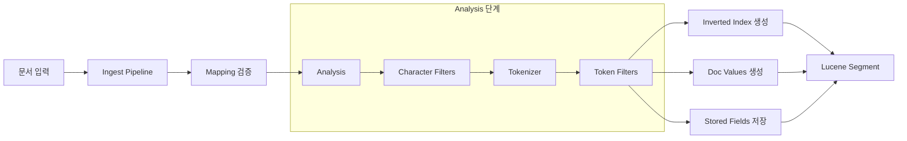
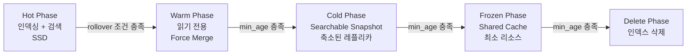

# 인덱스 설계 및 매핑 전략

Elasticsearch에서 효율적인 데이터 모델링을 위한 매핑 설계, Analyzer 커스터마이징, Index Template, ILM, Data Stream 활용 전략을 다룬다.

## 목차
- [1. 핵심 개념 (What)](#1-핵심-개념-what)
- [2. 왜 알아야 하는가 (Why)](#2-왜-알아야-하는가-why)
- [3. 내부 구현 분석 (How)](#3-내부-구현-분석-how)
- [4. 실전 예제](#4-실전-예제)
- [5. 정리](#5-정리)

---

## 1. 핵심 개념 (What)

### Mapping이란

Mapping은 인덱스에 저장되는 문서의 스키마 정의다. 각 필드의 데이터 타입, 분석 방식, 저장 여부를 결정한다.

### 주요 필드 타입

| 타입 | 용도 | 특징 |
|------|------|------|
| `text` | 전문 검색 | Analyzer로 토큰화, 정확한 매칭 불가 |
| `keyword` | 정확한 매칭, 집계, 정렬 | 분석하지 않음, 256자 기본 제한 |
| `integer/long/float/double` | 숫자 | 범위 쿼리, 집계에 최적화 |
| `date` | 날짜/시간 | 포맷 지정 가능, 범위 쿼리 지원 |
| `boolean` | 참/거짓 | 필터 쿼리에 사용 |
| `object` | 중첩 JSON | 내부적으로 플랫하게 저장 |
| `nested` | 독립적 중첩 문서 | 별도 Lucene 문서, 쿼리 비용 높음 |
| `geo_point` | 위치 좌표 | 거리 계산, 범위 검색 |
| `dense_vector` | 벡터 검색 | kNN 검색, 유사도 계산 |

### Dynamic Mapping 모드

| 모드 | 동작 |
|------|------|
| `true` (기본) | 새 필드 자동 매핑 생성 |
| `runtime` | 새 필드를 runtime field로 생성 |
| `false` | 새 필드 무시 (저장은 하되 검색/집계 불가) |
| `strict` | 새 필드가 있으면 인덱싱 거부 |

## 2. 왜 알아야 하는가 (Why)

### 매핑 실수의 대가

1. **타입 충돌**: Dynamic mapping이 숫자 문자열을 `text`로 매핑하면 이후 집계 불가
2. **Mapping Explosion**: 제한 없이 동적 필드를 허용하면 클러스터 메모리 고갈
3. **비효율적 저장**: `text`+`keyword` 멀티필드를 무분별하게 사용하면 디스크 2배 소모
4. **검색 품질 저하**: 부적절한 Analyzer 선택으로 한국어 검색 시 형태소 미분리

### 매핑은 변경 불가

한번 생성된 필드의 타입은 변경할 수 없다. 변경하려면 새 인덱스를 만들고 Reindex해야 한다. 따라서 **사전 설계가 핵심**이다.

## 3. 내부 구현 분석 (How)

### 인덱싱 파이프라인



### Analyzer 구성 요소

```
Analyzer = Character Filter(0~N) + Tokenizer(1) + Token Filter(0~N)

예시: "The Quick Brown FOX!" 분석
  Character Filter (html_strip): "The Quick Brown FOX!"
  Tokenizer (standard):          ["The", "Quick", "Brown", "FOX"]
  Token Filter (lowercase):      ["the", "quick", "brown", "fox"]
```

### ILM Phase 전환 흐름



## 4. 실전 예제

### 4.1 Strict Mapping 정의 (API 로그)

```json
PUT api-logs-template
{
  "index_patterns": ["api-logs-*"],
  "template": {
    "settings": {
      "number_of_shards": 3,
      "number_of_replicas": 1,
      "index.mapping.total_fields.limit": 200,
      "index.mapping.depth.limit": 5,
      "index.mapping.nested_fields.limit": 20
    },
    "mappings": {
      "dynamic": "strict",
      "properties": {
        "@timestamp": {
          "type": "date",
          "format": "strict_date_optional_time||epoch_millis"
        },
        "method": {
          "type": "keyword"
        },
        "path": {
          "type": "keyword",
          "fields": {
            "text": {
              "type": "text",
              "analyzer": "path_analyzer"
            }
          }
        },
        "status_code": {
          "type": "short"
        },
        "response_time_ms": {
          "type": "integer"
        },
        "client_ip": {
          "type": "ip"
        },
        "user_agent": {
          "type": "text",
          "fields": {
            "keyword": {
              "type": "keyword",
              "ignore_above": 512
            }
          }
        },
        "request_body": {
          "type": "text",
          "index": false
        },
        "response_body": {
          "enabled": false
        },
        "tags": {
          "type": "keyword"
        },
        "service": {
          "type": "keyword"
        }
      }
    }
  }
}
```

### 4.2 한국어 분석기 구성

```json
PUT korean-products
{
  "settings": {
    "analysis": {
      "char_filter": {
        "special_char_filter": {
          "type": "mapping",
          "mappings": [
            "& => and",
            "+ => plus"
          ]
        }
      },
      "tokenizer": {
        "nori_mixed": {
          "type": "nori_tokenizer",
          "decompound_mode": "mixed",
          "discard_punctuation": true,
          "user_dictionary_rules": [
            "삼성전자",
            "갤럭시노트",
            "에어팟프로"
          ]
        }
      },
      "filter": {
        "nori_pos_filter": {
          "type": "nori_part_of_speech",
          "stoptags": [
            "E", "IC", "J", "MAG", "MAJ",
            "MM", "SP", "SSC", "SSO", "SC",
            "SE", "XPN", "XSA", "XSN", "XSV",
            "UNA", "NA", "VSV"
          ]
        },
        "nori_readingform_filter": {
          "type": "nori_readingform"
        }
      },
      "analyzer": {
        "korean_analyzer": {
          "type": "custom",
          "char_filter": ["special_char_filter"],
          "tokenizer": "nori_mixed",
          "filter": [
            "nori_pos_filter",
            "nori_readingform_filter",
            "lowercase"
          ]
        },
        "korean_search_analyzer": {
          "type": "custom",
          "tokenizer": "nori_mixed",
          "filter": [
            "nori_pos_filter",
            "nori_readingform_filter",
            "lowercase"
          ]
        }
      }
    }
  },
  "mappings": {
    "properties": {
      "name": {
        "type": "text",
        "analyzer": "korean_analyzer",
        "search_analyzer": "korean_search_analyzer",
        "fields": {
          "keyword": {
            "type": "keyword"
          },
          "ngram": {
            "type": "text",
            "analyzer": "ngram_analyzer"
          }
        }
      },
      "description": {
        "type": "text",
        "analyzer": "korean_analyzer"
      },
      "category": {
        "type": "keyword"
      },
      "price": {
        "type": "integer"
      }
    }
  }
}
```

### 4.3 Component Template + Index Template (ES 7.8+)

```json
// 공통 설정 Component Template
PUT _component_template/common-settings
{
  "template": {
    "settings": {
      "number_of_replicas": 1,
      "refresh_interval": "5s",
      "codec": "best_compression"
    }
  }
}

// 공통 매핑 Component Template
PUT _component_template/common-mappings
{
  "template": {
    "mappings": {
      "properties": {
        "@timestamp": {
          "type": "date"
        },
        "host": {
          "properties": {
            "name": { "type": "keyword" },
            "ip": { "type": "ip" }
          }
        },
        "environment": {
          "type": "keyword"
        }
      }
    }
  }
}

// ILM 정책 Component Template
PUT _component_template/ilm-settings
{
  "template": {
    "settings": {
      "index.lifecycle.name": "logs-policy",
      "index.lifecycle.rollover_alias": "logs"
    }
  }
}

// 조합한 Index Template
PUT _index_template/logs-template
{
  "index_patterns": ["logs-*"],
  "composed_of": [
    "common-settings",
    "common-mappings",
    "ilm-settings"
  ],
  "priority": 200,
  "template": {
    "settings": {
      "number_of_shards": 3
    },
    "mappings": {
      "properties": {
        "message": {
          "type": "text"
        },
        "level": {
          "type": "keyword"
        }
      }
    }
  }
}
```

### 4.4 ILM(Index Lifecycle Management) 정책

```json
PUT _ilm/policy/logs-policy
{
  "policy": {
    "phases": {
      "hot": {
        "min_age": "0ms",
        "actions": {
          "rollover": {
            "max_primary_shard_size": "50gb",
            "max_age": "1d",
            "max_docs": 100000000
          },
          "set_priority": {
            "priority": 100
          }
        }
      },
      "warm": {
        "min_age": "3d",
        "actions": {
          "shrink": {
            "number_of_shards": 1
          },
          "forcemerge": {
            "max_num_segments": 1
          },
          "allocate": {
            "require": {
              "data": "warm"
            }
          },
          "set_priority": {
            "priority": 50
          }
        }
      },
      "cold": {
        "min_age": "30d",
        "actions": {
          "allocate": {
            "number_of_replicas": 0,
            "require": {
              "data": "cold"
            }
          },
          "set_priority": {
            "priority": 0
          }
        }
      },
      "delete": {
        "min_age": "90d",
        "actions": {
          "delete": {}
        }
      }
    }
  }
}
```

### 4.5 Data Stream (시계열 데이터)

```json
// Data Stream용 Index Template
PUT _index_template/metrics-template
{
  "index_patterns": ["metrics-*"],
  "data_stream": {},
  "composed_of": ["common-settings", "common-mappings"],
  "priority": 300,
  "template": {
    "settings": {
      "number_of_shards": 2,
      "number_of_replicas": 1,
      "index.lifecycle.name": "logs-policy"
    },
    "mappings": {
      "properties": {
        "metric_name": { "type": "keyword" },
        "metric_value": { "type": "double" },
        "unit": { "type": "keyword" },
        "dimensions": {
          "type": "object",
          "dynamic": true
        }
      }
    }
  }
}

// Data Stream에 문서 인덱싱 (POST만 가능, _id 지정 불가)
POST metrics-app/_doc
{
  "@timestamp": "2026-03-07T10:00:00Z",
  "metric_name": "cpu_usage",
  "metric_value": 72.5,
  "unit": "percent",
  "dimensions": {
    "host": "web-server-01",
    "region": "ap-northeast-2"
  }
}

// Data Stream 상태 확인
GET _data_stream/metrics-*
```

### 4.6 Nested vs Flattened 필드

```json
// Nested: 배열 내 객체 간 관계를 보존해야 할 때
PUT orders
{
  "mappings": {
    "properties": {
      "order_id": { "type": "keyword" },
      "items": {
        "type": "nested",
        "properties": {
          "product_name": { "type": "keyword" },
          "quantity": { "type": "integer" },
          "price": { "type": "integer" }
        }
      }
    }
  }
}

// Nested 쿼리
GET orders/_search
{
  "query": {
    "nested": {
      "path": "items",
      "query": {
        "bool": {
          "must": [
            { "term": { "items.product_name": "keyboard" } },
            { "range": { "items.price": { "lte": 50000 } } }
          ]
        }
      }
    }
  }
}

// Flattened: 키가 동적으로 변하는 라벨/태그에 적합
PUT kubernetes-events
{
  "mappings": {
    "properties": {
      "labels": {
        "type": "flattened"
      }
    }
  }
}
```

### 4.7 샤드 크기 설계 가이드

```
적정 샤드 크기: 10GB ~ 50GB (primary shard 기준)

계산 예시:
  - 일일 데이터량: 100GB
  - 보존 기간: 30일
  - 총 데이터량: 3TB
  - 샤드 크기 목표: 30GB
  - 필요 샤드 수: 3TB / 30GB = 100 샤드

  - 일별 인덱스 사용 시: 100GB/30GB ≈ 3~4 샤드/일
  - ILM rollover 사용 시: max_primary_shard_size=30gb

주의:
  - 노드당 샤드 수 1000개 이하 권장
  - 힙 1GB당 샤드 20개 이하 권장
  - 너무 작은 샤드: 오버헤드 증가
  - 너무 큰 샤드: 복구 시간 증가, 재할당 어려움
```

## 5. 정리

| 항목 | 권장 사항 |
|------|-----------|
| Dynamic Mapping | 프로덕션에서는 `strict` 또는 `false` 사용 |
| 필드 타입 | 용도에 맞게 명시적 지정 (text vs keyword 구분) |
| Analyzer | 한국어는 nori_tokenizer, 영문은 standard + lowercase |
| Index Template | Component Template으로 재사용 가능한 단위로 분리 |
| ILM | Hot-Warm-Cold-Delete 자동 전환, rollover 조건 설정 |
| Data Stream | 시계열 데이터는 Data Stream 활용, append-only 워크로드 |
| Nested 필드 | 객체 배열의 관계 보존 필요 시에만 사용, 성능 비용 인지 |
| 샤드 크기 | Primary shard 10~50GB, 노드당 1000개 이하 |
| Mapping 제한 | `total_fields.limit`, `depth.limit`, `nested_fields.limit` 명시 설정 |
| 멀티필드 | 검색과 집계 모두 필요한 필드만 `text` + `keyword` 구성 |

---

*마지막 업데이트: 2026년 03월*
