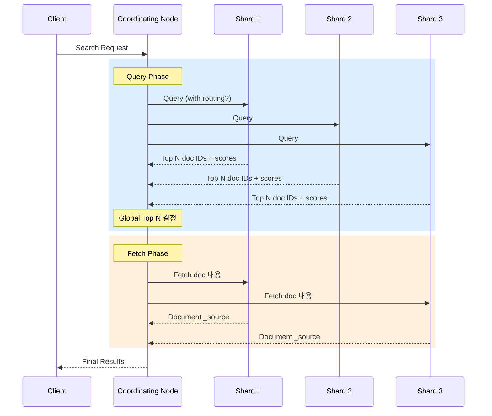

# Elasticsearch 쿼리 최적화

Query Context와 Filter Context의 차이, Bool Query 패턴, Routing 최적화, Profile API 활용, Slow Log 분석, 캐싱 전략을 통해 검색 성능을 극대화하는 방법을 다룬다.

## 목차
- [1. 핵심 개념 (What)](#1-핵심-개념-what)
- [2. 왜 알아야 하는가 (Why)](#2-왜-알아야-하는가-why)
- [3. 내부 구현 분석 (How)](#3-내부-구현-분석-how)
- [4. 실전 예제](#4-실전-예제)
- [5. 정리](#5-정리)

---

## 1. 핵심 개념 (What)

### Query Context vs Filter Context

| 구분 | Query Context | Filter Context |
|------|---------------|----------------|
| 목적 | "이 문서가 쿼리와 얼마나 관련되는가?" | "이 문서가 조건에 맞는가?" |
| 점수 계산 | O (_score 계산) | X (0.0 고정) |
| 캐싱 | X | O (자동 캐싱) |
| 사용 위치 | `must`, `should` | `filter`, `must_not` |
| 성능 | 상대적으로 느림 | 빠름 (비트셋 캐싱) |

### Bool Query 구조

| 절 | 동작 | Context |
|----|------|---------|
| `must` | 모두 만족해야 함, 점수에 기여 | Query |
| `filter` | 모두 만족해야 함, 점수 무관 | Filter |
| `should` | 하나 이상 만족 시 점수 보너스 | Query |
| `must_not` | 만족하면 제외 | Filter |

### 캐싱 메커니즘

- **Node Query Cache**: Filter context 쿼리 결과를 비트셋으로 캐싱 (노드 레벨)
- **Shard Request Cache**: 전체 검색 결과를 캐싱 (size=0인 집계 요청 등)
- **Fielddata Cache**: text 필드의 집계/정렬 시 사용 (비권장, doc_values 사용)

## 2. 왜 알아야 하는가 (Why)

### 최적화 전후 성능 차이

```
시나리오: 1억 건 로그에서 특정 서비스의 최근 24시간 에러 로그 검색

비최적화 쿼리:
  - match + range를 모두 must에 배치
  - 1억 건 전체 스코어링
  - 응답 시간: ~2,500ms

최적화 쿼리:
  - range, term을 filter로 이동
  - routing으로 대상 샤드 제한
  - 응답 시간: ~120ms (95% 개선)
```

### 쿼리 최적화가 중요한 이유

1. **비용 절감**: 같은 하드웨어로 더 많은 쿼리 처리
2. **사용자 경험**: 검색 응답 시간은 서비스 품질에 직결
3. **클러스터 안정성**: 비효율적 쿼리는 전체 클러스터 성능에 영향
4. **스케일 효율**: 쿼리 최적화 없이 노드만 추가하면 비용 대비 효과 낮음

## 3. 내부 구현 분석 (How)

### 검색 실행 흐름



### Filter 캐싱 동작 원리

```
1. 첫 번째 Filter 실행:
   Segment A: [1, 0, 1, 1, 0, 0, 1, 0]  (비트셋 생성)
   Segment B: [0, 1, 0, 0, 1, 1, 0, 1]

2. 캐시 저장 조건:
   - 세그먼트 크기 > 10,000 문서
   - 동일 필터가 일정 횟수 이상 실행
   - LRU 정책으로 관리

3. 이후 동일 Filter:
   캐시에서 비트셋 즉시 반환 → 디스크 I/O 없음
```

### 쿼리 최적화 결정 트리

```
검색 요청 수신
├── 점수가 필요한가?
│   ├── YES → must 사용
│   └── NO → filter 사용 (캐싱 + 스코어링 생략)
├── 결과 제외가 필요한가?
│   └── YES → must_not 사용 (Filter context)
├── 특정 샤드만 대상인가?
│   └── YES → routing 또는 preference 사용
├── 전체 결과가 아닌 상위 N개만 필요한가?
│   └── YES → terminate_after 또는 적절한 size 설정
└── 실시간성이 필요한가?
    ├── YES → refresh_interval 조정 고려
    └── NO → 캐싱 극대화
```

## 4. 실전 예제

### 4.1 Filter Context 최적화

```json
// BAD: 모든 조건이 Query Context
GET logs-*/_search
{
  "query": {
    "bool": {
      "must": [
        { "match": { "message": "connection timeout" } },
        { "term": { "service": "payment-api" } },
        { "range": { "@timestamp": { "gte": "now-24h" } } },
        { "term": { "level": "ERROR" } }
      ]
    }
  }
}

// GOOD: 점수 불필요한 조건은 filter로 분리
GET logs-*/_search
{
  "query": {
    "bool": {
      "must": [
        { "match": { "message": "connection timeout" } }
      ],
      "filter": [
        { "term": { "service": "payment-api" } },
        { "range": { "@timestamp": { "gte": "now-24h" } } },
        { "term": { "level": "ERROR" } }
      ]
    }
  }
}
```

### 4.2 Routing 최적화

```json
// 인덱스 생성 시 routing 설정
PUT tenant-data
{
  "settings": {
    "number_of_shards": 5,
    "index.routing.allocation.require.data": "hot"
  },
  "mappings": {
    "_routing": {
      "required": true
    },
    "properties": {
      "tenant_id": { "type": "keyword" },
      "data": { "type": "text" }
    }
  }
}

// 문서 인덱싱 시 routing 지정
PUT tenant-data/_doc/1?routing=tenant-abc
{
  "tenant_id": "tenant-abc",
  "data": "important document"
}

// 검색 시 routing으로 대상 샤드 제한
GET tenant-data/_search?routing=tenant-abc
{
  "query": {
    "bool": {
      "filter": [
        { "term": { "tenant_id": "tenant-abc" } }
      ],
      "must": [
        { "match": { "data": "important" } }
      ]
    }
  }
}
```

### 4.3 Profile API 활용

```json
GET logs-*/_search
{
  "profile": true,
  "query": {
    "bool": {
      "must": [
        { "match": { "message": "error" } }
      ],
      "filter": [
        { "range": { "@timestamp": { "gte": "now-1h" } } }
      ]
    }
  }
}

// 응답 분석 포인트
// {
//   "profile": {
//     "shards": [{
//       "searches": [{
//         "query": [{
//           "type": "BooleanQuery",
//           "description": "...",
//           "time_in_nanos": 1234567,    // 전체 소요 시간
//           "breakdown": {
//             "score": 500000,            // 스코어링 시간
//             "build_scorer": 200000,     // 스코어러 생성
//             "create_weight": 100000,    // 가중치 생성
//             "advance": 300000,          // 반복자 전진
//             "match": 0                  // 매칭
//           },
//           "children": [...]            // 하위 쿼리 상세
//         }]
//       }]
//     }]
//   }
// }
```

### 4.4 Slow Log 설정 및 분석

```json
// 인덱스별 Slow Log 설정
PUT logs-*/_settings
{
  "index.search.slowlog.threshold.query.warn": "5s",
  "index.search.slowlog.threshold.query.info": "2s",
  "index.search.slowlog.threshold.query.debug": "1s",
  "index.search.slowlog.threshold.query.trace": "500ms",

  "index.search.slowlog.threshold.fetch.warn": "1s",
  "index.search.slowlog.threshold.fetch.info": "500ms",

  "index.indexing.slowlog.threshold.index.warn": "10s",
  "index.indexing.slowlog.threshold.index.info": "5s",

  "index.search.slowlog.level": "info"
}
```

```bash
# Slow Log 파일 위치
# /var/log/elasticsearch/<cluster-name>_index_search_slowlog.json

# 로그 예시:
# {
#   "type": "index_search_slowlog",
#   "timestamp": "2026-03-07T10:30:00",
#   "level": "WARN",
#   "took": "5.2s",
#   "total_shards": 15,
#   "source": "{\"query\":{\"match_all\":{}},\"size\":10000}"
# }
```

### 4.5 검색 성능 패턴 모음

```json
// 1. 대량 결과 페이지네이션: search_after (deep pagination 회피)
GET logs-*/_search
{
  "size": 100,
  "query": {
    "bool": {
      "filter": [
        { "range": { "@timestamp": { "gte": "now-7d" } } }
      ]
    }
  },
  "sort": [
    { "@timestamp": "desc" },
    { "_id": "asc" }
  ],
  "search_after": ["2026-03-06T23:59:59.999Z", "doc-id-12345"]
}

// 2. 필요한 필드만 반환: _source filtering
GET logs-*/_search
{
  "size": 50,
  "_source": ["@timestamp", "level", "message", "service"],
  "query": {
    "bool": {
      "filter": [
        { "term": { "level": "ERROR" } }
      ]
    }
  }
}

// 3. 카운트만 필요한 경우: size=0 + track_total_hits
GET logs-*/_search
{
  "size": 0,
  "track_total_hits": true,
  "query": {
    "bool": {
      "filter": [
        { "term": { "service": "auth-api" } },
        { "term": { "level": "ERROR" } },
        { "range": { "@timestamp": { "gte": "now-1h" } } }
      ]
    }
  }
}

// 4. 존재 여부만 확인: terminate_after
GET logs-*/_search
{
  "size": 1,
  "terminate_after": 1,
  "query": {
    "bool": {
      "filter": [
        { "term": { "error_code": "CRITICAL_FAILURE" } }
      ]
    }
  }
}

// 5. Wildcard/Regex 대신 Prefix 사용
// BAD
{ "wildcard": { "path": "*api/v2*" } }

// GOOD
{ "prefix": { "path": "/api/v2" } }

// 6. index_prefixes로 Prefix 쿼리 가속
PUT optimized-index
{
  "mappings": {
    "properties": {
      "url_path": {
        "type": "text",
        "index_prefixes": {
          "min_chars": 2,
          "max_chars": 10
        }
      }
    }
  }
}
```

### 4.6 캐싱 전략 상세

```json
// Node Query Cache 설정 (elasticsearch.yml)
// indices.queries.cache.size: 20%   (노드 힙의 비율)

// Shard Request Cache 활성화/비활성화
GET logs-*/_search?request_cache=true
{
  "size": 0,
  "aggs": {
    "error_count_by_service": {
      "terms": { "field": "service", "size": 20 }
    }
  }
}

// 캐시 상태 확인
GET _nodes/stats/indices/query_cache
GET _nodes/stats/indices/request_cache

// 캐시 무효화 (인덱스 refresh 시 자동 무효화됨)
POST logs-*/_cache/clear?query=true
POST logs-*/_cache/clear?request=true

// 캐시 활용 극대화 팁
// 1. 날짜 범위를 "now-1h" 대신 라운드 처리
//    "gte": "now-1h/h"  → 시간 단위로 라운드 → 캐시 히트율 증가
// 2. size=0 집계는 자동으로 Shard Request Cache 대상
// 3. 자주 사용하는 필터 조합을 표준화
```

### 4.7 Multi-Search API 활용

```json
// 여러 쿼리를 한 번의 HTTP 요청으로 실행
GET _msearch
{"index": "logs-*"}
{"size": 0, "query": {"bool": {"filter": [{"term": {"level": "ERROR"}}]}}, "aggs": {"by_service": {"terms": {"field": "service"}}}}
{"index": "logs-*"}
{"size": 0, "query": {"bool": {"filter": [{"range": {"@timestamp": {"gte": "now-1h"}}}]}}, "aggs": {"status_dist": {"terms": {"field": "status_code"}}}}
{"index": "metrics-*"}
{"size": 0, "aggs": {"avg_response": {"avg": {"field": "response_time_ms"}}}}
```

### 4.8 쿼리 최적화 체크리스트

```bash
# 1. 쿼리 실행 계획 확인
GET logs-*/_validate/query?explain
{
  "query": {
    "match": { "message": "timeout error" }
  }
}

# 2. 샤드별 문서 수 확인 (데이터 편향 탐지)
GET logs-*/_cat/shards?v&h=index,shard,prirep,docs,store,node&s=docs:desc

# 3. 필드 데이터 사용량 확인
GET _cat/fielddata?v&fields=*

# 4. 세그먼트 정보 확인
GET logs-*/_segments

# 5. 인덱스 통계 확인
GET logs-*/_stats/search,indexing
```

## 5. 정리

| 항목 | 권장 사항 |
|------|-----------|
| Query vs Filter | 점수 불필요한 조건은 반드시 `filter`로 이동 |
| Bool Query | `must`는 스코어링 필요 시에만, 나머지는 `filter`/`must_not` |
| Routing | 멀티테넌시, 파티셔닝된 데이터에 routing 적용 |
| 페이지네이션 | `from`+`size` 대신 `search_after` 사용 (10,000건 이상) |
| _source | 필요한 필드만 지정하여 네트워크/파싱 비용 절감 |
| 캐싱 | 날짜 범위 라운딩(`now-1h/h`), 표준화된 필터 조합 |
| Wildcard | 가능한 `prefix` 또는 `index_prefixes`로 대체 |
| Profile API | 느린 쿼리 분석 시 `"profile": true`로 병목 구간 식별 |
| Slow Log | 임계값 설정하여 느린 쿼리 자동 로깅 |
| 집계 전용 | `size: 0`으로 Request Cache 활용 극대화 |

---

*마지막 업데이트: 2026년 03월*
