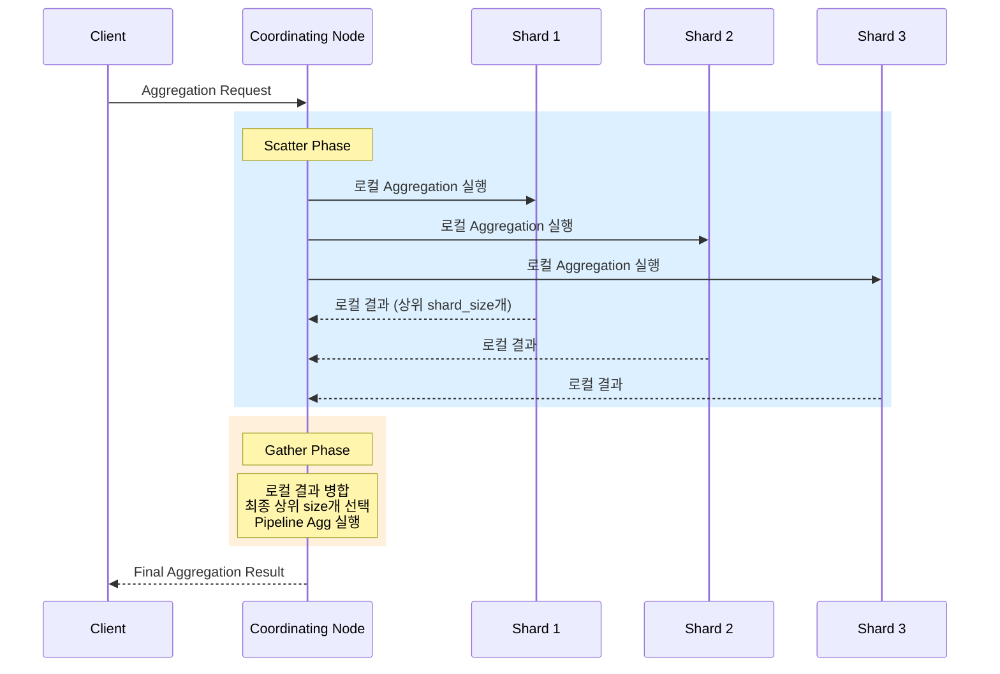

# Elasticsearch Aggregation 활용

Bucket, Metric, Pipeline Aggregation의 핵심 패턴과 Composite Aggregation을 활용한 대용량 페이지네이션, 실시간 분석 대시보드 구축, 성능 최적화 전략을 다룬다.

## 목차
- [1. 핵심 개념 (What)](#1-핵심-개념-what)
- [2. 왜 알아야 하는가 (Why)](#2-왜-알아야-하는가-why)
- [3. 내부 구현 분석 (How)](#3-내부-구현-분석-how)
- [4. 실전 예제](#4-실전-예제)
- [5. 정리](#5-정리)

---

## 1. 핵심 개념 (What)

### Aggregation 유형

| 유형 | 설명 | 대표 예시 |
|------|------|-----------|
| **Bucket** | 문서를 그룹으로 분류 | `terms`, `date_histogram`, `range`, `filters`, `composite` |
| **Metric** | 수치 계산 | `avg`, `sum`, `min`, `max`, `cardinality`, `percentiles`, `stats` |
| **Pipeline** | 다른 Aggregation 결과를 입력으로 받아 2차 계산 | `derivative`, `moving_avg`, `cumulative_sum`, `bucket_sort` |

### Aggregation 중첩 구조

Aggregation은 트리 형태로 중첩이 가능하다. Bucket Aggregation 안에 Metric이나 또 다른 Bucket을 넣어 다차원 분석을 수행한다.

```
Terms Agg (서비스별)
├── Date Histogram Agg (시간대별)
│   ├── Avg Agg (평균 응답시간)
│   └── Percentiles Agg (P95, P99)
└── Cardinality Agg (고유 사용자 수)
```

### 핵심 개념 정리

- **doc_values**: 집계/정렬에 사용되는 컬럼 기반 자료구조, `keyword`와 숫자 타입에 기본 활성화
- **Bucket 크기 제한**: `terms` agg의 `size` 파라미터로 반환할 버킷 수 제한
- **Precision vs Performance**: `cardinality`는 HyperLogLog++ 알고리즘 기반 근사값
- **shard_size**: 각 샤드에서 수집하는 버킷 수, 정확도와 성능의 트레이드오프

## 2. 왜 알아야 하는가 (Why)

### SQL 대비 Aggregation의 강점

1. **분산 처리**: 수십억 건의 데이터를 여러 샤드에서 병렬 집계
2. **실시간 분석**: 인덱싱 직후 집계 가능 (near real-time)
3. **유연한 중첩**: SQL의 GROUP BY + HAVING보다 자유로운 다차원 분석
4. **근사 집계**: `cardinality`, `percentiles`는 정확성을 약간 희생하여 대용량 처리

### 잘못 사용하면

- `terms` agg에 `size: 1000000` 지정 시 메모리 폭주
- High cardinality 필드(UUID 등)에 `terms` agg 사용 시 성능 저하
- 중첩 depth가 깊어질수록 지수적 버킷 증가 (Bucket Explosion)

## 3. 내부 구현 분석 (How)

### 분산 Aggregation 실행 흐름



### Terms Aggregation 정확도 문제

```
예시: size=3, shard_size=5, 3개 샤드

Shard 1:  A(100), B(90), C(80), D(70), E(60)
Shard 2:  B(95), C(85), A(75), E(65), F(55)
Shard 3:  C(110), A(50), D(80), B(40), G(30)

Coordinating Node 병합:
  C: 80+85+110 = 275
  A: 100+75+50 = 225
  B: 90+95+40  = 225

실제 전체 순위 (만약 모든 버킷을 가져왔다면):
  C: 275, A: 225, B: 225, D: 150, E: 125, ...

→ shard_size가 작으면 일부 샤드에서 누락되어 부정확할 수 있음
→ 기본값: shard_size = size * 1.5 + 10
```

### Composite Aggregation 페이지네이션 원리

```
첫 번째 요청 → after_key 없음
  결과: [{service: "api", status: 200}, {service: "api", status: 500}, ...]
  after_key: {service: "api", status: 500}

두 번째 요청 → after_key: {service: "api", status: 500}
  결과: [{service: "auth", status: 200}, ...]
  after_key: {service: "auth", status: 401}

... 반복 (after_key가 null이면 종료)
```

## 4. 실전 예제

### 4.1 Metric Aggregation 패턴

```json
// 기본 통계 집계
GET api-logs-*/_search
{
  "size": 0,
  "query": {
    "bool": {
      "filter": [
        { "range": { "@timestamp": { "gte": "now-24h" } } },
        { "term": { "service": "payment-api" } }
      ]
    }
  },
  "aggs": {
    "response_stats": {
      "extended_stats": {
        "field": "response_time_ms"
      }
    },
    "response_percentiles": {
      "percentiles": {
        "field": "response_time_ms",
        "percents": [50, 90, 95, 99, 99.9]
      }
    },
    "unique_users": {
      "cardinality": {
        "field": "user_id",
        "precision_threshold": 10000
      }
    },
    "total_request_size": {
      "sum": {
        "field": "request_size_bytes"
      }
    }
  }
}
```

### 4.2 Bucket Aggregation: 다차원 분석

```json
// 서비스별 → 시간대별 → 상태 코드별 분석
GET api-logs-*/_search
{
  "size": 0,
  "query": {
    "bool": {
      "filter": [
        { "range": { "@timestamp": { "gte": "now-7d" } } }
      ]
    }
  },
  "aggs": {
    "by_service": {
      "terms": {
        "field": "service",
        "size": 20,
        "order": { "error_rate": "desc" }
      },
      "aggs": {
        "by_hour": {
          "date_histogram": {
            "field": "@timestamp",
            "fixed_interval": "1h",
            "min_doc_count": 0,
            "extended_bounds": {
              "min": "now-7d",
              "max": "now"
            }
          },
          "aggs": {
            "avg_response": {
              "avg": { "field": "response_time_ms" }
            },
            "error_count": {
              "filter": {
                "range": { "status_code": { "gte": 500 } }
              }
            }
          }
        },
        "total_requests": {
          "value_count": { "field": "_id" }
        },
        "error_requests": {
          "filter": {
            "range": { "status_code": { "gte": 500 } }
          }
        },
        "error_rate": {
          "bucket_script": {
            "buckets_path": {
              "errors": "error_requests._count",
              "total": "total_requests"
            },
            "script": "params.errors / params.total * 100"
          }
        }
      }
    }
  }
}
```

### 4.3 Filters Aggregation: 명명된 버킷

```json
GET api-logs-*/_search
{
  "size": 0,
  "aggs": {
    "status_groups": {
      "filters": {
        "filters": {
          "success": { "range": { "status_code": { "gte": 200, "lt": 300 } } },
          "redirect": { "range": { "status_code": { "gte": 300, "lt": 400 } } },
          "client_error": { "range": { "status_code": { "gte": 400, "lt": 500 } } },
          "server_error": { "range": { "status_code": { "gte": 500 } } }
        }
      },
      "aggs": {
        "avg_response_time": {
          "avg": { "field": "response_time_ms" }
        },
        "top_paths": {
          "terms": {
            "field": "path",
            "size": 5
          }
        }
      }
    }
  }
}
```

### 4.4 Composite Aggregation: 전체 버킷 순회

```json
// 첫 번째 페이지
GET api-logs-*/_search
{
  "size": 0,
  "aggs": {
    "all_combinations": {
      "composite": {
        "size": 1000,
        "sources": [
          { "service": { "terms": { "field": "service" } } },
          { "status": { "terms": { "field": "status_code" } } },
          { "date": { "date_histogram": { "field": "@timestamp", "calendar_interval": "1d" } } }
        ]
      },
      "aggs": {
        "avg_response": {
          "avg": { "field": "response_time_ms" }
        },
        "request_count": {
          "value_count": { "field": "_id" }
        }
      }
    }
  }
}

// 다음 페이지: after_key 사용
GET api-logs-*/_search
{
  "size": 0,
  "aggs": {
    "all_combinations": {
      "composite": {
        "size": 1000,
        "sources": [
          { "service": { "terms": { "field": "service" } } },
          { "status": { "terms": { "field": "status_code" } } },
          { "date": { "date_histogram": { "field": "@timestamp", "calendar_interval": "1d" } } }
        ],
        "after": {
          "service": "payment-api",
          "status": 500,
          "date": 1741305600000
        }
      },
      "aggs": {
        "avg_response": {
          "avg": { "field": "response_time_ms" }
        },
        "request_count": {
          "value_count": { "field": "_id" }
        }
      }
    }
  }
}
```

### 4.5 Pipeline Aggregation: 시계열 분석

```json
// 이동 평균, 변화율, 누적합
GET api-logs-*/_search
{
  "size": 0,
  "query": {
    "bool": {
      "filter": [
        { "range": { "@timestamp": { "gte": "now-30d" } } }
      ]
    }
  },
  "aggs": {
    "daily": {
      "date_histogram": {
        "field": "@timestamp",
        "calendar_interval": "1d"
      },
      "aggs": {
        "total_errors": {
          "filter": {
            "range": { "status_code": { "gte": 500 } }
          }
        },
        "avg_latency": {
          "avg": { "field": "response_time_ms" }
        }
      }
    },
    "latency_moving_avg": {
      "moving_fn": {
        "buckets_path": "daily>avg_latency",
        "window": 7,
        "script": "MovingFunctions.unweightedAvg(values)"
      }
    },
    "error_derivative": {
      "derivative": {
        "buckets_path": "daily>total_errors._count"
      }
    },
    "cumulative_errors": {
      "cumulative_sum": {
        "buckets_path": "daily>total_errors._count"
      }
    }
  }
}

// bucket_sort로 상위 N개 버킷 추출
GET api-logs-*/_search
{
  "size": 0,
  "aggs": {
    "by_endpoint": {
      "terms": {
        "field": "path",
        "size": 1000
      },
      "aggs": {
        "p99_latency": {
          "percentiles": {
            "field": "response_time_ms",
            "percents": [99]
          }
        },
        "sort_by_p99": {
          "bucket_sort": {
            "sort": [
              { "p99_latency.99.0": { "order": "desc" } }
            ],
            "size": 10
          }
        }
      }
    }
  }
}
```

### 4.6 실시간 분석 대시보드 쿼리

```json
// SLA 모니터링 대시보드 (단일 쿼리로 여러 지표)
GET api-logs-*/_search
{
  "size": 0,
  "query": {
    "bool": {
      "filter": [
        { "range": { "@timestamp": { "gte": "now-1h" } } }
      ]
    }
  },
  "aggs": {
    "total_requests": {
      "value_count": { "field": "_id" }
    },
    "successful_requests": {
      "filter": {
        "range": { "status_code": { "lt": 500 } }
      }
    },
    "availability": {
      "bucket_script": {
        "buckets_path": {
          "success": "successful_requests._count",
          "total": "total_requests"
        },
        "script": "params.success / params.total * 100"
      }
    },
    "latency_by_percentile": {
      "percentiles": {
        "field": "response_time_ms",
        "percents": [50, 95, 99]
      }
    },
    "throughput_per_minute": {
      "date_histogram": {
        "field": "@timestamp",
        "fixed_interval": "1m"
      },
      "aggs": {
        "requests_per_min": {
          "value_count": { "field": "_id" }
        }
      }
    },
    "top_errors": {
      "filter": {
        "range": { "status_code": { "gte": 400 } }
      },
      "aggs": {
        "by_path": {
          "terms": {
            "field": "path",
            "size": 10,
            "order": { "_count": "desc" }
          },
          "aggs": {
            "by_status": {
              "terms": { "field": "status_code", "size": 5 }
            }
          }
        }
      }
    },
    "geo_distribution": {
      "terms": {
        "field": "geo.country",
        "size": 20
      },
      "aggs": {
        "avg_latency": {
          "avg": { "field": "response_time_ms" }
        }
      }
    }
  }
}
```

### 4.7 Histogram과 Range Aggregation

```json
// 응답시간 분포 히스토그램
GET api-logs-*/_search
{
  "size": 0,
  "aggs": {
    "latency_distribution": {
      "histogram": {
        "field": "response_time_ms",
        "interval": 100,
        "min_doc_count": 0,
        "extended_bounds": {
          "min": 0,
          "max": 2000
        }
      }
    },
    "latency_ranges": {
      "range": {
        "field": "response_time_ms",
        "keyed": true,
        "ranges": [
          { "key": "fast",   "to": 100 },
          { "key": "normal", "from": 100, "to": 500 },
          { "key": "slow",   "from": 500, "to": 1000 },
          { "key": "critical", "from": 1000 }
        ]
      }
    }
  }
}
```

### 4.8 성능 최적화 전략

```json
// 1. execution_hint로 메모리 최적화
{
  "aggs": {
    "by_service": {
      "terms": {
        "field": "service",
        "size": 10,
        "execution_hint": "map"
      }
    }
  }
}
// execution_hint 옵션:
//   "map": 작은 세그먼트에 유리, 글로벌 ordinal 생성 불필요
//   "global_ordinals" (기본): 대규모 데이터에 유리, 초기 빌드 비용 있음

// 2. eager_global_ordinals로 사전 빌드
PUT api-logs-template
{
  "mappings": {
    "properties": {
      "service": {
        "type": "keyword",
        "eager_global_ordinals": true
      }
    }
  }
}

// 3. 집계 전용 쿼리 최적화
{
  "size": 0,
  "track_total_hits": false,
  "query": {
    "bool": {
      "filter": [...]
    }
  },
  "aggs": { ... }
}

// 4. 불필요한 _source 비활성화 (집계만 필요 시)
{
  "size": 0,
  "_source": false,
  "aggs": { ... }
}

// 5. sampler로 대용량 데이터 샘플링
{
  "size": 0,
  "aggs": {
    "sample": {
      "sampler": {
        "shard_size": 5000
      },
      "aggs": {
        "keywords": {
          "significant_terms": {
            "field": "message.keyword",
            "size": 10
          }
        }
      }
    }
  }
}
```

### 4.9 Scripted Metric Aggregation

```json
// 복잡한 비즈니스 로직: 가중 평균 응답시간
GET api-logs-*/_search
{
  "size": 0,
  "aggs": {
    "weighted_avg_latency": {
      "scripted_metric": {
        "init_script": "state.weighted_sum = 0.0; state.weight_total = 0.0",
        "map_script": """
          double weight = doc['request_size_bytes'].value;
          double latency = doc['response_time_ms'].value;
          state.weighted_sum += latency * weight;
          state.weight_total += weight;
        """,
        "combine_script": "return ['ws': state.weighted_sum, 'wt': state.weight_total]",
        "reduce_script": """
          double ws = 0; double wt = 0;
          for (s in states) { ws += s.ws; wt += s.wt; }
          return wt > 0 ? ws / wt : 0;
        """
      }
    }
  }
}
```

## 5. 정리

| 항목 | 권장 사항 |
|------|-----------|
| Bucket Agg | 중첩 depth를 3단계 이하로 제한, Bucket Explosion 주의 |
| Metric Agg | `cardinality`는 근사값임을 인지, `precision_threshold` 조정 |
| Pipeline Agg | `bucket_sort`로 상위 N개 추출, `moving_fn`으로 시계열 분석 |
| Composite Agg | 전체 버킷 순회 시 사용, `after` 키로 페이지네이션 |
| 성능 | `size: 0`, `track_total_hits: false`, Filter context 활용 |
| 정확도 | `shard_size` 증가로 terms 정확도 향상 (기본: size * 1.5 + 10) |
| High Cardinality | UUID 등 고유값 필드에 `terms` agg 지양, `composite` 또는 `cardinality` 사용 |
| Global Ordinals | 자주 집계되는 keyword 필드에 `eager_global_ordinals: true` |
| 대시보드 | 단일 쿼리에 여러 agg을 조합, `_msearch`로 병렬 요청 |
| Scripted Metric | 복잡한 비즈니스 로직에 활용, 성능 비용이 높으므로 최소한으로 사용 |

---

*마지막 업데이트: 2026년 03월*
