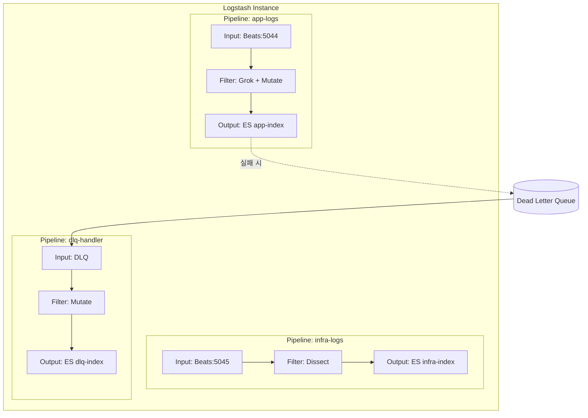
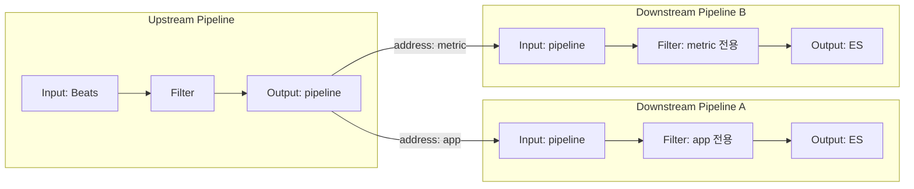

# Logstash 파이프라인 설계 패턴

Logstash의 Multi-pipeline 아키텍처, 조건 분기, Grok/Dissect 파싱 패턴, Dead Letter Queue, Pipeline-to-Pipeline 통신까지 실전 파이프라인 설계 패턴을 다룬다.

## 목차
- [1. 핵심 개념 (What)](#1-핵심-개념-what)
- [2. 왜 알아야 하는가 (Why)](#2-왜-알아야-하는가-why)
- [3. 내부 구현 분석 (How)](#3-내부-구현-분석-how)
- [4. 실전 예제](#4-실전-예제)
- [5. 정리](#5-정리)

---

## 1. 핵심 개념 (What)

### Logstash 파이프라인 3단계

Logstash 파이프라인은 **Input -> Filter -> Output** 세 단계로 구성된다.

| 단계 | 역할 | 대표 플러그인 |
|------|------|--------------|
| Input | 데이터 수집 | beats, kafka, file, http |
| Filter | 데이터 변환/파싱 | grok, dissect, mutate, date |
| Output | 데이터 전송 | elasticsearch, kafka, stdout |

### Multi-pipeline 아키텍처

단일 Logstash 인스턴스에서 여러 파이프라인을 독립적으로 실행하는 구조다. 각 파이프라인은 자체 worker, queue, 설정을 가진다.

### Pipeline-to-Pipeline (P2P) 통신

파이프라인 간 내부 통신을 위한 virtual input/output 플러그인이다. 네트워크 오버헤드 없이 파이프라인 간 데이터를 전달한다.

### Dead Letter Queue (DLQ)

처리 실패한 이벤트를 별도 큐에 저장하여 데이터 유실을 방지하는 메커니즘이다.

---

## 2. 왜 알아야 하는가 (Why)

### 단일 파이프라인의 한계

- **장애 전파**: 하나의 output 장애가 전체 파이프라인을 차단한다
- **리소스 경합**: 서로 다른 성격의 로그가 같은 worker를 공유한다
- **설정 복잡도**: 조건 분기가 깊어지면 유지보수가 어렵다

### Multi-pipeline이 해결하는 문제

- **격리(Isolation)**: 파이프라인별 독립 실행으로 장애 전파 차단
- **성능 최적화**: 파이프라인별 worker 수, batch size 개별 튜닝
- **운영 유연성**: 개별 파이프라인 재시작, 독립 배포 가능

### Grok vs Dissect 선택 기준

- **Grok**: 정규표현식 기반, 유연하지만 CPU 비용 높음
- **Dissect**: 구분자 기반, 빠르지만 고정 형식만 처리 가능
- 정형 로그에는 Dissect, 비정형 로그에는 Grok이 적합하다

---

## 3. 내부 구현 분석 (How)

### Multi-pipeline 아키텍처



### Pipeline-to-Pipeline 통신 흐름



### 이벤트 처리 내부 흐름

```
Event 수신 → Persistent Queue(PQ)에 저장
  → Worker Thread가 PQ에서 batch 단위로 읽기
    → Filter 체인 순차 실행
      → Output 전송
        → 성공: PQ에서 checkpoint
        → 실패: DLQ에 저장 (활성화 시)
```

---

## 4. 실전 예제

### 4.1 pipelines.yml - Multi-pipeline 설정

```yaml
# /etc/logstash/pipelines.yml

- pipeline.id: app-logs
  path.config: "/etc/logstash/pipelines/app-logs.conf"
  pipeline.workers: 4
  pipeline.batch.size: 250
  queue.type: persisted
  queue.max_bytes: 4gb

- pipeline.id: infra-logs
  path.config: "/etc/logstash/pipelines/infra-logs.conf"
  pipeline.workers: 2
  pipeline.batch.size: 500
  queue.type: persisted

- pipeline.id: dlq-handler
  path.config: "/etc/logstash/pipelines/dlq-handler.conf"
  pipeline.workers: 1
  dead_letter_queue.enable: false
```

### 4.2 Conditional 분기 패턴

```ruby
# /etc/logstash/pipelines/app-logs.conf

input {
  beats {
    port => 5044
  }
}

filter {
  # 타입별 분기 처리
  if [fields][log_type] == "nginx" {
    grok {
      match => {
        "message" => '%{IPORHOST:client_ip} - %{DATA:user} \[%{HTTPDATE:timestamp}\] "%{WORD:method} %{URIPATHPARAM:request} HTTP/%{NUMBER:http_version}" %{NUMBER:status:int} %{NUMBER:bytes:int} "%{DATA:referrer}" "%{DATA:user_agent}"'
      }
      tag_on_failure => ["_grok_nginx_failure"]
    }
    date {
      match => ["timestamp", "dd/MMM/yyyy:HH:mm:ss Z"]
      target => "@timestamp"
      remove_field => ["timestamp"]
    }
    geoip {
      source => "client_ip"
      target => "geoip"
    }
  } else if [fields][log_type] == "spring" {
    # Spring Boot 로그는 Dissect로 처리 (고정 형식)
    dissect {
      mapping => {
        "message" => "%{timestamp} %{+timestamp} %{log_level} %{pid} --- [%{thread}] %{logger} : %{log_message}"
      }
    }
    date {
      match => ["timestamp", "yyyy-MM-dd HH:mm:ss.SSS"]
      target => "@timestamp"
      remove_field => ["timestamp"]
    }
    # 에러 로그에 스택트레이스 병합
    if [log_level] == "ERROR" {
      mutate {
        add_tag => ["error"]
      }
    }
  }

  # 공통 처리: 불필요 필드 제거
  mutate {
    remove_field => ["agent", "ecs", "host.name"]
  }
}

output {
  if "_grok_nginx_failure" in [tags] {
    # 파싱 실패 로그를 별도 인덱스에 저장
    elasticsearch {
      hosts => ["https://es-node:9200"]
      index => "parse-failures-%{+YYYY.MM.dd}"
      user => "logstash_writer"
      password => "${ES_PASSWORD}"
      ssl_certificate_authorities => ["/etc/logstash/certs/ca.crt"]
    }
  } else {
    elasticsearch {
      hosts => ["https://es-node:9200"]
      index => "%{[fields][log_type]}-%{+YYYY.MM.dd}"
      user => "logstash_writer"
      password => "${ES_PASSWORD}"
      ssl_certificate_authorities => ["/etc/logstash/certs/ca.crt"]
    }
  }
}
```

### 4.3 Grok vs Dissect 성능 비교

```ruby
# Grok 방식 - CPU 집약적, 유연함
filter {
  grok {
    match => {
      "message" => "%{TIMESTAMP_ISO8601:timestamp} %{LOGLEVEL:level} %{GREEDYDATA:msg}"
    }
  }
}

# Dissect 방식 - 훨씬 빠름, 고정 형식 전용
filter {
  dissect {
    mapping => {
      "message" => "%{timestamp} %{level} %{msg}"
    }
  }
}
```

| 비교 항목 | Grok | Dissect |
|-----------|------|---------|
| 처리 방식 | 정규표현식 | 구분자 기반 |
| 처리 속도 | 상대적 느림 | 약 3-5배 빠름 |
| CPU 사용량 | 높음 | 낮음 |
| 유연성 | 비정형 로그 처리 가능 | 고정 형식만 가능 |
| 디버깅 | 어려움 (복잡한 정규식) | 쉬움 |
| 권장 사용처 | Nginx/Apache 로그, 비정형 | 애플리케이션 구조화 로그 |

### 4.4 Pipeline-to-Pipeline 통신 설정

```ruby
# upstream.conf - 수집 후 분기
input {
  beats {
    port => 5044
  }
}

filter {
  # 최소한의 공통 처리
  mutate {
    add_field => { "received_at" => "%{@timestamp}" }
  }
}

output {
  if [fields][log_type] == "app" {
    pipeline {
      send_to => ["app-processing"]
    }
  } else if [fields][log_type] == "metric" {
    pipeline {
      send_to => ["metric-processing"]
    }
  } else {
    pipeline {
      send_to => ["default-processing"]
    }
  }
}
```

```ruby
# app-processing.conf
input {
  pipeline {
    address => "app-processing"
  }
}

filter {
  grok {
    match => { "message" => "%{TIMESTAMP_ISO8601:ts} \[%{DATA:thread}\] %{LOGLEVEL:level} %{JAVACLASS:class} - %{GREEDYDATA:msg}" }
  }
  if [level] == "ERROR" {
    mutate { add_tag => ["alert"] }
  }
}

output {
  elasticsearch {
    hosts => ["https://es-node:9200"]
    index => "app-logs-%{+YYYY.MM.dd}"
    user => "logstash_writer"
    password => "${ES_PASSWORD}"
  }
}
```

### 4.5 Dead Letter Queue 활용

```yaml
# logstash.yml - DLQ 활성화
dead_letter_queue.enable: true
dead_letter_queue.max_bytes: 4096mb
dead_letter_queue.storage_policy: drop_newer
dead_letter_queue.retain.age: 7d
```

```ruby
# dlq-handler.conf - DLQ 재처리 파이프라인
input {
  dead_letter_queue {
    path => "/var/lib/logstash/dead_letter_queue"
    pipeline_id => "app-logs"
    commit_offsets => true
  }
}

filter {
  # DLQ 메타데이터에서 실패 원인 추출
  mutate {
    add_field => {
      "dlq_reason" => "%{[@metadata][dead_letter_queue][reason]}"
      "dlq_plugin_type" => "%{[@metadata][dead_letter_queue][plugin_type]}"
      "dlq_plugin_id" => "%{[@metadata][dead_letter_queue][plugin_id]}"
      "dlq_entry_time" => "%{[@metadata][dead_letter_queue][entry_time]}"
    }
  }

  # 매핑 오류 시 필드 타입 변환 시도
  if [dlq_reason] =~ /mapper_parsing_exception/ {
    mutate {
      convert => {
        "status" => "integer"
        "bytes" => "integer"
        "duration" => "float"
      }
    }
  }
}

output {
  elasticsearch {
    hosts => ["https://es-node:9200"]
    index => "recovered-%{+YYYY.MM.dd}"
    user => "logstash_writer"
    password => "${ES_PASSWORD}"
  }
}
```

### 4.6 커스텀 Grok 패턴 정의

```ruby
# /etc/logstash/patterns/custom_patterns
CUSTOM_TIMESTAMP %{YEAR}-%{MONTHNUM}-%{MONTHDAY}[T ]%{HOUR}:%{MINUTE}:%{SECOND}
APP_LOG %{CUSTOM_TIMESTAMP:timestamp} \[%{DATA:service}\] %{LOGLEVEL:level} %{GREEDYDATA:message}
DURATION_MS %{NUMBER:duration_ms:float}ms
REQUEST_ID [a-f0-9]{8}-[a-f0-9]{4}-[a-f0-9]{4}-[a-f0-9]{4}-[a-f0-9]{12}
```

```ruby
# 커스텀 패턴 사용
filter {
  grok {
    patterns_dir => ["/etc/logstash/patterns"]
    match => {
      "message" => "%{APP_LOG} \[rid:%{REQUEST_ID:request_id}\] took %{DURATION_MS}"
    }
  }
}
```

### 4.7 Logstash 성능 튜닝 설정

```yaml
# logstash.yml
pipeline.workers: 4                    # CPU 코어 수에 맞춤
pipeline.batch.size: 250               # 배치 크기 (메모리와 트레이드오프)
pipeline.batch.delay: 50               # 배치 대기 시간 (ms)
pipeline.ordered: auto                 # 순서 보장 필요 시 true

queue.type: persisted                  # 영속 큐 사용 (데이터 유실 방지)
queue.max_bytes: 4gb                   # 큐 최대 크기
queue.checkpoint.writes: 1024          # 체크포인트 주기

config.reload.automatic: true          # 설정 자동 리로드
config.reload.interval: 3s             # 리로드 확인 주기
```

---

## 5. 정리

| 패턴 | 적용 상황 | 핵심 이점 |
|------|----------|----------|
| Multi-pipeline | 서로 다른 소스/형식의 로그 처리 | 장애 격리, 독립 튜닝 |
| Pipeline-to-Pipeline | 공통 수집 후 분기 처리 | 네트워크 오버헤드 제거, 구조화 |
| Conditional 분기 | 단일 파이프라인 내 타입별 처리 | 간단한 구성, 빠른 설정 |
| Grok | 비정형/가변 형식 로그 | 유연한 패턴 매칭 |
| Dissect | 고정 형식 로그 | 높은 처리 성능 |
| Dead Letter Queue | 처리 실패 이벤트 복구 | 데이터 유실 방지 |
| Persistent Queue | 안정적 이벤트 전달 보장 | 장애 시 데이터 보존 |

---

*마지막 업데이트: 2026년 03월*
