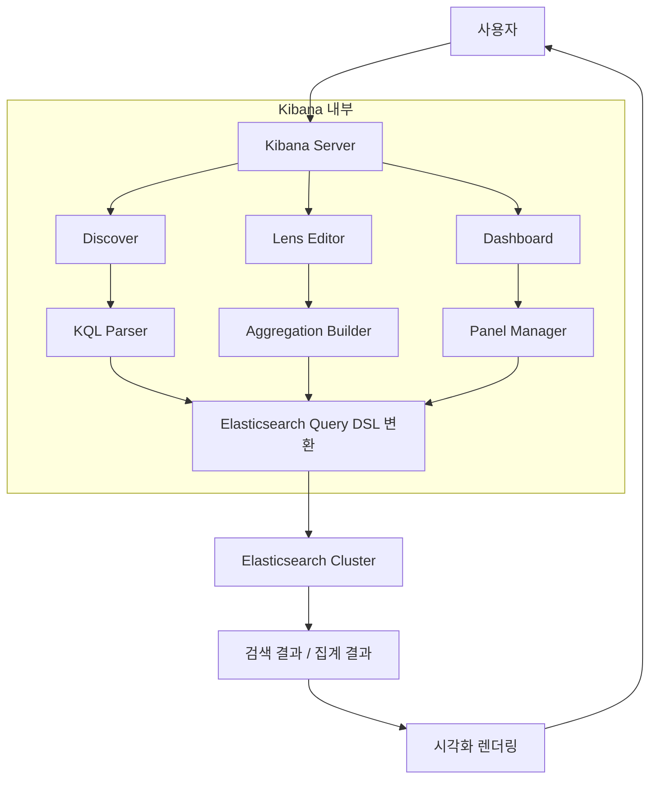

# Kibana 대시보드 & 시각화 구축

Kibana의 Lens 시각화 빌더, Discover 로그 탐색, Dashboard 설계 원칙, KQL/ES|QL 쿼리 언어, Saved Objects 관리를 통해 실전 모니터링 대시보드를 구축하는 방법을 다룬다.

## 목차
- [1. 핵심 개념 (What)](#1-핵심-개념-what)
- [2. 왜 알아야 하는가 (Why)](#2-왜-알아야-하는가-why)
- [3. 내부 구현 분석 (How)](#3-내부-구현-분석-how)
- [4. 실전 예제](#4-실전-예제)
- [5. 정리](#5-정리)

---

## 1. 핵심 개념 (What)

### Kibana 핵심 기능

| 기능 | 설명 |
|------|------|
| **Discover** | 로그 데이터 실시간 탐색 및 필터링 |
| **Lens** | 드래그 앤 드롭 기반 시각화 빌더 |
| **Dashboard** | 여러 시각화를 조합한 모니터링 화면 |
| **Canvas** | 프레젠테이션용 인포그래픽 |
| **Maps** | 지리 데이터 시각화 |

### 쿼리 언어

- **KQL (Kibana Query Language)**: Kibana 기본 쿼리 언어. 자동완성 지원, 간결한 문법
- **ES|QL (Elasticsearch Query Language)**: Elasticsearch 8.11+에서 도입된 파이프 기반 쿼리 언어
- **Lucene**: 전통적인 전문 검색 쿼리 문법

### Data View (구 Index Pattern)

Kibana가 Elasticsearch 인덱스에 접근하기 위한 논리적 뷰 정의다. 와일드카드 패턴으로 여러 인덱스를 하나의 Data View로 묶을 수 있다.

### Saved Objects

Dashboard, Visualization, Data View 등 Kibana의 모든 설정을 저장하는 단위다. JSON 형태로 export/import가 가능하다.

---

## 2. 왜 알아야 하는가 (Why)

### 로그 데이터의 가치는 시각화에서 나온다

- 수백만 건의 로그를 텍스트로 읽는 것은 불가능하다
- 적절한 시각화는 패턴, 이상 징후, 트렌드를 즉시 드러낸다
- 팀 전체가 공유하는 대시보드는 운영 커뮤니케이션 비용을 줄인다

### 대시보드 설계가 중요한 이유

- 잘못 설계된 대시보드는 오히려 혼란을 야기한다
- 목적에 맞는 시각화 타입 선택이 인사이트 품질을 결정한다
- 성능을 고려하지 않은 대시보드는 Elasticsearch 클러스터에 부담을 준다

### KQL/ES|QL 숙달의 효과

- 정확한 필터링으로 원하는 로그를 빠르게 찾을 수 있다
- 복잡한 집계도 쿼리 레벨에서 처리 가능하다
- 장애 대응 시 MTTR(Mean Time To Resolve)을 단축한다

---

## 3. 내부 구현 분석 (How)

### Kibana 시각화 아키텍처



### Dashboard 렌더링 흐름

```
Dashboard 로드
  → 각 Panel의 Saved Object 읽기
    → Data View 기반 인덱스 확인
      → 시간 범위 + 필터 + KQL 조합
        → Elasticsearch Query DSL 생성
          → _search / _msearch API 호출
            → 결과를 시각화 타입에 맞게 렌더링
```

### KQL이 Query DSL로 변환되는 과정

```
KQL: status >= 400 and service: "api-gateway"
                    ↓
Query DSL:
{
  "bool": {
    "filter": [
      { "range": { "status": { "gte": 400 } } },
      { "match_phrase": { "service": "api-gateway" } }
    ]
  }
}
```

---

## 4. 실전 예제

### 4.1 KQL 쿼리 패턴

```
# 기본 필드 검색
status: 500
service: "api-gateway"

# 범위 검색
response_time > 1000
status >= 400 and status < 500

# 와일드카드
message: *timeout*
host.name: web-server-*

# 논리 연산
status: 500 and service: "api-gateway"
status: 404 or status: 503
not status: 200

# 중첩 필드
kubernetes.pod.name: "app-deployment-*"
http.request.method: "POST"

# 존재 여부
error.message: *
not response_time: *
```

### 4.2 ES|QL 쿼리 패턴

```sql
-- 기본 조회 및 필터링
FROM app-logs-*
| WHERE status >= 400
| SORT @timestamp DESC
| LIMIT 100

-- 집계: 서비스별 에러 비율
FROM app-logs-*
| WHERE @timestamp > NOW() - 1 hour
| STATS total = COUNT(*),
        errors = COUNT(*) WHERE status >= 500,
        error_rate = ROUND(COUNT(*) WHERE status >= 500 / COUNT(*) * 100, 2)
  BY service
| SORT error_rate DESC

-- 시계열 분석: 5분 단위 요청 추이
FROM app-logs-*
| WHERE @timestamp > NOW() - 24 hours
| EVAL time_bucket = DATE_TRUNC(5 minutes, @timestamp)
| STATS request_count = COUNT(*),
        avg_response = AVG(response_time),
        p99_response = PERCENTILE(response_time, 99)
  BY time_bucket
| SORT time_bucket

-- 패턴 분석: 에러 메시지 그룹화
FROM app-logs-*
| WHERE log_level == "ERROR" AND @timestamp > NOW() - 6 hours
| STATS count = COUNT(*) BY error.type, error.message
| SORT count DESC
| LIMIT 20
```

### 4.3 Data View 생성 (API)

```bash
# Data View 생성
curl -X POST "http://localhost:5601/api/data_views/data_view" \
  -H "kbn-xsrf: true" \
  -H "Content-Type: application/json" \
  -d '{
    "data_view": {
      "title": "app-logs-*",
      "name": "Application Logs",
      "timeFieldName": "@timestamp",
      "runtimeFieldMap": {
        "response_time_category": {
          "type": "keyword",
          "script": {
            "source": "if (doc[\"response_time\"].size() > 0) { long rt = doc[\"response_time\"].value; if (rt < 200) emit(\"fast\"); else if (rt < 1000) emit(\"normal\"); else emit(\"slow\"); }"
          }
        }
      }
    }
  }'
```

### 4.4 Lens 시각화 타입별 활용 가이드

| 시각화 타입 | 적합한 데이터 | 예시 |
|------------|-------------|------|
| **Line** | 시계열 트렌드 | 요청 수 추이, 응답 시간 변화 |
| **Bar** | 카테고리 비교 | 서비스별 에러 수, HTTP 상태 코드 분포 |
| **Area** | 누적/비율 트렌드 | 트래픽 구성, 에러율 추이 |
| **Pie / Donut** | 비율 분포 | 상태 코드 비율, 서비스 트래픽 비중 |
| **Metric** | 단일 KPI | 총 요청 수, 에러율, P99 응답시간 |
| **Table** | 상세 데이터 비교 | Top 10 느린 엔드포인트 |
| **Heatmap** | 2차원 분포 | 시간대별/서비스별 에러 히트맵 |
| **Gauge** | 임계값 기반 상태 | SLA 달성률, 디스크 사용량 |

### 4.5 Dashboard 설계 원칙

```
+------------------------------------------------------------------+
|  [KQL Filter Bar]    Time Range: Last 24 hours    Auto-refresh: 30s |
+------------------------------------------------------------------+
|                                                                    |
|  [Metric]     [Metric]      [Metric]       [Metric]               |
|  Total Req    Error Rate    P99 Latency    Active Users            |
|  1.2M         0.3%          245ms          8,432                   |
|                                                                    |
+------------------------------------------------------------------+
|                                                                    |
|  [Line Chart - 전체 트래픽 추이]                                    |
|  ▁▂▃▅▇█▇▅▃▂▁▂▃▅▇█▇▅▃▂▁                                          |
|                                                                    |
+----------------------------------+-------------------------------+
|                                  |                               |
|  [Bar - 서비스별 에러]            |  [Pie - HTTP 상태 코드]        |
|  api-gateway  ████████           |        200: 85%               |
|  user-svc     ████               |        301: 8%                |
|  order-svc    ██                 |        4xx: 5%                |
|                                  |        5xx: 2%                |
+----------------------------------+-------------------------------+
|                                                                    |
|  [Table - Top 10 Slow Endpoints]                                   |
|  Endpoint          | Avg(ms) | P99(ms) | Count                    |
|  /api/search       | 450     | 2100    | 15,234                   |
|  /api/orders       | 320     | 1800    | 8,901                    |
|                                                                    |
+------------------------------------------------------------------+
```

**Dashboard 설계 3원칙**:

1. **위에서 아래로**: 요약(Metric) -> 트렌드(Line) -> 상세(Table) 순서
2. **왼쪽에서 오른쪽으로**: 중요도 높은 시각화를 왼쪽 상단에 배치
3. **필터 연동**: 대시보드 레벨 필터가 모든 패널에 전파되도록 설정

### 4.6 Saved Objects 관리

```bash
# Dashboard Export (NDJSON 형식)
curl -X POST "http://localhost:5601/api/saved_objects/_export" \
  -H "kbn-xsrf: true" \
  -H "Content-Type: application/json" \
  -d '{
    "type": ["dashboard", "visualization", "lens", "search"],
    "includeReferencesDeep": true
  }' \
  --output dashboards-export.ndjson

# Dashboard Import
curl -X POST "http://localhost:5601/api/saved_objects/_import?overwrite=true" \
  -H "kbn-xsrf: true" \
  --form file=@dashboards-export.ndjson

# 특정 Dashboard만 Export
curl -X POST "http://localhost:5601/api/saved_objects/_export" \
  -H "kbn-xsrf: true" \
  -H "Content-Type: application/json" \
  -d '{
    "objects": [
      { "type": "dashboard", "id": "my-dashboard-id" }
    ],
    "includeReferencesDeep": true
  }' \
  --output specific-dashboard.ndjson
```

### 4.7 Kibana Spaces를 활용한 다중 팀 대시보드

```bash
# Space 생성
curl -X POST "http://localhost:5601/api/spaces/space" \
  -H "kbn-xsrf: true" \
  -H "Content-Type: application/json" \
  -d '{
    "id": "platform-team",
    "name": "Platform Team",
    "description": "인프라 및 플랫폼 모니터링",
    "disabledFeatures": ["canvas", "maps"],
    "color": "#2196F3"
  }'

# Space 간 Saved Objects 복사
curl -X POST "http://localhost:5601/api/spaces/_copy_saved_objects" \
  -H "kbn-xsrf: true" \
  -H "Content-Type: application/json" \
  -d '{
    "spaces": ["platform-team"],
    "objects": [
      { "type": "dashboard", "id": "overview-dashboard" }
    ],
    "includeReferences": true,
    "overwrite": true
  }'
```

### 4.8 kibana.yml 프로덕션 설정

```yaml
# kibana.yml

server.host: "0.0.0.0"
server.port: 5601
server.name: "kibana-prod"

# Elasticsearch 연결
elasticsearch.hosts: ["https://es-node-1:9200", "https://es-node-2:9200"]
elasticsearch.username: "kibana_system"
elasticsearch.password: "${KIBANA_ES_PASSWORD}"
elasticsearch.ssl.certificateAuthorities: ["/etc/kibana/certs/ca.crt"]

# 보안
server.ssl.enabled: true
server.ssl.certificate: /etc/kibana/certs/kibana.crt
server.ssl.key: /etc/kibana/certs/kibana.key
xpack.security.encryptionKey: "min-32-byte-encryption-key-here!!"
xpack.encryptedSavedObjects.encryptionKey: "another-32-byte-key-for-objects!!"
xpack.reporting.encryptionKey: "reporting-32-byte-key-here-now!!"

# 로깅
logging.root.level: warn
logging.appenders.file:
  type: file
  fileName: /var/log/kibana/kibana.log
  layout:
    type: json

# 성능
elasticsearch.requestTimeout: 60000
elasticsearch.shardTimeout: 30000
```

---

## 5. 정리

| 기능 | 용도 | 핵심 포인트 |
|------|------|------------|
| Discover | 실시간 로그 탐색 | KQL 필터 + 시간 범위로 빠른 검색 |
| Lens | 시각화 생성 | 드래그 앤 드롭, 자동 차트 추천 |
| Dashboard | 모니터링 화면 | 요약→트렌드→상세 순서 배치 |
| KQL | 기본 쿼리 | 자동완성, 간결한 문법 |
| ES\|QL | 고급 집계 쿼리 | 파이프 기반, SQL과 유사 |
| Data View | 인덱스 접근 | 와일드카드 패턴, Runtime Field |
| Saved Objects | 설정 관리 | NDJSON export/import로 환경 이관 |
| Spaces | 팀별 격리 | 팀별 대시보드, 기능 제한 |

---

*마지막 업데이트: 2026년 03월*
