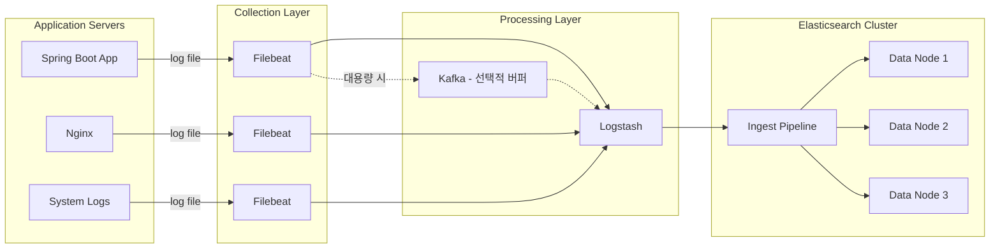

# ELK 로그 수집 파이프라인 구축

Filebeat에서 Logstash를 거쳐 Elasticsearch까지 이어지는 로그 수집 파이프라인을 구축한다. Spring Boot, Nginx 등 실제 애플리케이션 로그 수집, 구조화 로깅, Ingest Pipeline 설정을 다룬다.

## 목차
- [1. 핵심 개념 (What)](#1-핵심-개념-what)
- [2. 왜 알아야 하는가 (Why)](#2-왜-알아야-하는가-why)
- [3. 내부 구현 분석 (How)](#3-내부-구현-분석-how)
- [4. 실전 예제](#4-실전-예제)
- [5. 정리](#5-정리)

---

## 1. 핵심 개념 (What)

### 로그 수집 파이프라인 구성 요소

| 구성 요소 | 역할 | 특징 |
|-----------|------|------|
| **Filebeat** | 경량 로그 수집기 (Shipper) | 낮은 리소스 사용, 백프레셔 지원 |
| **Logstash** | 로그 변환/가공 엔진 | 풍부한 필터 플러그인, 복잡한 변환 |
| **Ingest Pipeline** | ES 내장 전처리기 | Logstash 없이 ES에서 직접 변환 |
| **Elasticsearch** | 저장/검색 엔진 | 인덱싱, 풀텍스트 검색 |

### 구조화 로깅 (Structured Logging)

로그를 사람이 읽기 좋은 텍스트가 아니라, 기계가 파싱하기 쉬운 JSON 등의 구조화된 형식으로 출력하는 방식이다. ELK 파이프라인의 복잡도와 성능을 크게 개선한다.

### Ingest Pipeline vs Logstash

| 항목 | Ingest Pipeline | Logstash |
|------|-----------------|----------|
| 실행 위치 | Elasticsearch 노드 | 별도 프로세스 |
| 리소스 | ES 클러스터 리소스 사용 | 독립 리소스 |
| 복잡한 변환 | 제한적 | 풍부한 플러그인 |
| 조건 분기 | 지원 (if 조건) | 강력한 분기 지원 |
| 외부 연동 | 불가 | Kafka, Redis 등 연동 |
| 적합한 경우 | 간단한 변환, 소규모 | 복잡한 변환, 대규모 |

---

## 2. 왜 알아야 하는가 (Why)

### 로그 수집은 관측 가능성의 기반이다

- 애플리케이션 로그는 장애 진단의 1차 데이터 소스다
- 체계적인 수집 없이는 분산 시스템의 문제를 추적할 수 없다
- 로그 → 메트릭 → 트레이스의 관측 가능성 3요소 중 가장 기본이다

### 잘못된 파이프라인의 비용

- **데이터 유실**: 백프레셔 미설정 시 피크 트래픽에서 로그 손실
- **성능 저하**: 비효율적 파싱(Grok 남용)으로 Logstash 병목
- **저장 비용 증가**: 불필요한 필드를 그대로 인덱싱하여 스토리지 낭비
- **검색 지연**: 비구조화 로그로 인한 느린 쿼리 성능

### 구조화 로깅이 가져오는 변화

- Grok/Dissect 파싱 불필요 → Logstash 부하 감소
- 필드가 사전 정의되어 Elasticsearch 매핑 안정화
- 검색 성능 향상 및 Kibana 시각화 즉시 활용 가능

---

## 3. 내부 구현 분석 (How)

### 전체 로그 수집 파이프라인 아키텍처



### Filebeat 내부 동작

```
Log File 감시 (Harvester)
  → 새 라인 감지
    → 멀티라인 병합 (스택트레이스 등)
      → 메모리 큐에 적재
        → Output으로 전송 (Logstash / ES)
          → ACK 수신 → Registry 업데이트 (오프셋 저장)
          → 실패 → 백프레셔 → 큐가 가득 차면 수집 일시 중지
```

### Ingest Pipeline 처리 흐름

```
_bulk / _index 요청 수신
  → pipeline 파라미터 확인
    → Processor 체인 순차 실행
      → grok, dissect, date, geoip, set, remove ...
        → on_failure 핸들러 (실패 시)
          → 처리된 문서를 인덱스에 저장
```

---

## 4. 실전 예제

### 4.1 Spring Boot 구조화 로깅 설정

```xml
<!-- pom.xml - Logstash Logback Encoder -->
<dependency>
    <groupId>net.logstash.logback</groupId>
    <artifactId>logstash-logback-encoder</artifactId>
    <version>7.4</version>
</dependency>
```

```xml
<!-- logback-spring.xml -->
<configuration>
    <!-- 콘솔 출력 (개발 환경) -->
    <springProfile name="local">
        <appender name="CONSOLE" class="ch.qos.logback.core.ConsoleAppender">
            <encoder>
                <pattern>%d{HH:mm:ss.SSS} [%thread] %-5level %logger{36} - %msg%n</pattern>
            </encoder>
        </appender>
        <root level="INFO">
            <appender-ref ref="CONSOLE"/>
        </root>
    </springProfile>

    <!-- JSON 파일 출력 (운영 환경) -->
    <springProfile name="prod">
        <appender name="JSON_FILE" class="ch.qos.logback.core.rolling.RollingFileAppender">
            <file>/var/log/app/application.log</file>
            <rollingPolicy class="ch.qos.logback.core.rolling.SizeAndTimeBasedRollingPolicy">
                <fileNamePattern>/var/log/app/application.%d{yyyy-MM-dd}.%i.log</fileNamePattern>
                <maxFileSize>100MB</maxFileSize>
                <maxHistory>7</maxHistory>
                <totalSizeCap>2GB</totalSizeCap>
            </rollingPolicy>
            <encoder class="net.logstash.logback.encoder.LogstashEncoder">
                <includeMdcKeyName>requestId</includeMdcKeyName>
                <includeMdcKeyName>userId</includeMdcKeyName>
                <customFields>{"service":"order-service","env":"prod"}</customFields>
                <fieldNames>
                    <timestamp>@timestamp</timestamp>
                    <message>message</message>
                    <logger>logger</logger>
                    <thread>thread</thread>
                    <level>log_level</level>
                    <stackTrace>stack_trace</stackTrace>
                </fieldNames>
            </encoder>
        </appender>
        <root level="INFO">
            <appender-ref ref="JSON_FILE"/>
        </root>
    </springProfile>
</configuration>
```

출력 예시:
```json
{
  "@timestamp": "2026-03-07T10:15:30.123+09:00",
  "message": "Order created successfully",
  "log_level": "INFO",
  "logger": "com.example.order.OrderService",
  "thread": "http-nio-8080-exec-5",
  "service": "order-service",
  "env": "prod",
  "requestId": "a1b2c3d4-e5f6-7890-abcd-ef1234567890",
  "userId": "user-12345"
}
```

### 4.2 Filebeat 설정 - Spring Boot 로그 수집

```yaml
# filebeat.yml

filebeat.inputs:
  # Spring Boot JSON 로그
  - type: log
    id: spring-boot-logs
    paths:
      - /var/log/app/application*.log
    json.keys_under_root: true
    json.add_error_key: true
    json.message_key: message
    json.overwrite_keys: true
    # 멀티라인: JSON이 여러 줄에 걸쳐 있을 경우
    multiline.type: pattern
    multiline.pattern: '^\{'
    multiline.negate: true
    multiline.match: after
    fields:
      log_type: spring
      service: order-service
    fields_under_root: false

  # Nginx Access 로그
  - type: log
    id: nginx-access
    paths:
      - /var/log/nginx/access.log
    fields:
      log_type: nginx-access
    fields_under_root: false

  # Nginx Error 로그
  - type: log
    id: nginx-error
    paths:
      - /var/log/nginx/error.log
    multiline.type: pattern
    multiline.pattern: '^\d{4}/\d{2}/\d{2}'
    multiline.negate: true
    multiline.match: after
    fields:
      log_type: nginx-error
    fields_under_root: false

# 프로세서: 수집 단계에서 경량 처리
processors:
  - add_host_metadata:
      when.not.contains.tags: forwarded
  - add_cloud_metadata: ~
  - drop_fields:
      fields: ["agent.ephemeral_id", "agent.hostname", "agent.id", "ecs"]
      ignore_missing: true

# Output: Logstash로 전송
output.logstash:
  hosts: ["logstash-1:5044", "logstash-2:5044"]
  loadbalance: true
  ssl.certificate_authorities: ["/etc/filebeat/certs/ca.crt"]

# 백프레셔 및 큐 설정
queue.mem:
  events: 4096
  flush.min_events: 512
  flush.timeout: 5s

# 모니터링
monitoring.enabled: true
monitoring.elasticsearch:
  hosts: ["https://es-monitoring:9200"]
  username: "beats_system"
  password: "${BEATS_MONITORING_PASSWORD}"
```

### 4.3 Nginx JSON 로그 형식 설정

```nginx
# nginx.conf - JSON 형식 로그 정의
http {
    log_format json_combined escape=json
        '{'
            '"@timestamp":"$time_iso8601",'
            '"remote_addr":"$remote_addr",'
            '"request_method":"$request_method",'
            '"request_uri":"$request_uri",'
            '"status":$status,'
            '"body_bytes_sent":$body_bytes_sent,'
            '"request_time":$request_time,'
            '"http_referrer":"$http_referer",'
            '"http_user_agent":"$http_user_agent",'
            '"upstream_response_time":"$upstream_response_time",'
            '"upstream_addr":"$upstream_addr",'
            '"request_id":"$request_id"'
        '}';

    access_log /var/log/nginx/access.log json_combined;
}
```

### 4.4 Logstash 파이프라인 - 로그 타입별 처리

```ruby
# /etc/logstash/pipelines/log-collector.conf

input {
  beats {
    port => 5044
    ssl_enabled => true
    ssl_certificate => "/etc/logstash/certs/logstash.crt"
    ssl_key => "/etc/logstash/certs/logstash.key"
    ssl_certificate_authorities => ["/etc/logstash/certs/ca.crt"]
  }
}

filter {
  # Spring Boot JSON 로그 (이미 구조화됨)
  if [fields][log_type] == "spring" {
    # JSON 로그는 파싱 불필요, 보강만 수행
    mutate {
      rename => { "[fields][service]" => "service" }
    }
    # 스택트레이스 fingerprint 생성 (중복 에러 그룹화)
    if [stack_trace] {
      fingerprint {
        source => ["stack_trace"]
        target => "error_fingerprint"
        method => "SHA256"
      }
    }
  }

  # Nginx Access 로그 (JSON 형식이 아닌 경우)
  else if [fields][log_type] == "nginx-access" {
    # Nginx가 JSON 로그를 출력하면 json 필터 사용
    json {
      source => "message"
      target => "nginx"
    }
    # 또는 기존 텍스트 형식이면 grok 사용
    # grok {
    #   match => { "message" => "%{COMBINEDAPACHELOG}" }
    # }

    mutate {
      convert => {
        "[nginx][status]" => "integer"
        "[nginx][body_bytes_sent]" => "integer"
        "[nginx][request_time]" => "float"
      }
    }
    geoip {
      source => "[nginx][remote_addr]"
      target => "geoip"
    }
    useragent {
      source => "[nginx][http_user_agent]"
      target => "user_agent"
    }
  }

  # Nginx Error 로그
  else if [fields][log_type] == "nginx-error" {
    grok {
      match => {
        "message" => "%{DATA:timestamp} \[%{LOGLEVEL:log_level}\] %{POSINT:pid}#%{NUMBER}: %{GREEDYDATA:error_message}"
      }
    }
  }

  # 공통 처리
  mutate {
    remove_field => ["agent", "ecs", "input", "log"]
    add_field => { "pipeline_version" => "2.1" }
  }
}

output {
  elasticsearch {
    hosts => ["https://es-node-1:9200", "https://es-node-2:9200"]
    index => "%{[fields][log_type]}-%{+YYYY.MM.dd}"
    user => "logstash_writer"
    password => "${ES_PASSWORD}"
    ssl_certificate_authorities => ["/etc/logstash/certs/ca.crt"]
    ilm_enabled => true
    ilm_rollover_alias => "%{[fields][log_type]}"
    ilm_pattern => "000001"
    ilm_policy => "logs-lifecycle-policy"
  }
}
```

### 4.5 Elasticsearch Ingest Pipeline

```bash
# Ingest Pipeline 생성 - Logstash 없이 Filebeat → ES 직접 전송 시 사용
curl -X PUT "http://localhost:9200/_ingest/pipeline/spring-logs-pipeline" \
  -H "Content-Type: application/json" \
  -d '{
    "description": "Spring Boot JSON 로그 처리 파이프라인",
    "processors": [
      {
        "json": {
          "field": "message",
          "target_field": "parsed",
          "if": "ctx.message != null && ctx.message.startsWith(\"{\")"
        }
      },
      {
        "set": {
          "field": "log_level",
          "value": "{{parsed.log_level}}",
          "if": "ctx.parsed?.log_level != null"
        }
      },
      {
        "set": {
          "field": "service",
          "value": "{{parsed.service}}",
          "if": "ctx.parsed?.service != null"
        }
      },
      {
        "date": {
          "field": "parsed.@timestamp",
          "target_field": "@timestamp",
          "formats": ["ISO8601"],
          "if": "ctx.parsed != null && ctx.parsed.containsKey(\"@timestamp\")"
        }
      },
      {
        "script": {
          "description": "응답 시간 카테고리 분류",
          "source": "if (ctx.response_time != null) { if (ctx.response_time < 200) { ctx.response_category = \"fast\"; } else if (ctx.response_time < 1000) { ctx.response_category = \"normal\"; } else { ctx.response_category = \"slow\"; } }"
        }
      },
      {
        "remove": {
          "field": ["parsed", "agent", "ecs"],
          "ignore_missing": true
        }
      }
    ],
    "on_failure": [
      {
        "set": {
          "field": "_index",
          "value": "failed-logs-{{{_index}}}"
        }
      },
      {
        "set": {
          "field": "error.pipeline",
          "value": "spring-logs-pipeline"
        }
      },
      {
        "set": {
          "field": "error.message",
          "value": "{{_ingest.on_failure_message}}"
        }
      }
    ]
  }'
```

### 4.6 Filebeat → Elasticsearch 직접 전송 (Ingest Pipeline 활용)

```yaml
# filebeat.yml - Logstash 없이 ES 직접 전송
filebeat.inputs:
  - type: log
    paths:
      - /var/log/app/application*.log
    json.keys_under_root: true
    json.add_error_key: true

output.elasticsearch:
  hosts: ["https://es-node-1:9200", "https://es-node-2:9200"]
  username: "filebeat_writer"
  password: "${FB_ES_PASSWORD}"
  ssl.certificate_authorities: ["/etc/filebeat/certs/ca.crt"]
  pipeline: "spring-logs-pipeline"
  index: "spring-logs-%{+yyyy.MM.dd}"

setup.ilm.enabled: true
setup.ilm.rollover_alias: "spring-logs"
setup.ilm.policy_name: "logs-lifecycle-policy"
setup.template.name: "spring-logs"
setup.template.pattern: "spring-logs-*"
```

### 4.7 Index Template 설정

```bash
# Index Template 생성
curl -X PUT "http://localhost:9200/_index_template/spring-logs-template" \
  -H "Content-Type: application/json" \
  -d '{
    "index_patterns": ["spring-logs-*"],
    "template": {
      "settings": {
        "number_of_shards": 2,
        "number_of_replicas": 1,
        "index.lifecycle.name": "logs-lifecycle-policy",
        "index.lifecycle.rollover_alias": "spring-logs",
        "index.default_pipeline": "spring-logs-pipeline",
        "index.refresh_interval": "10s"
      },
      "mappings": {
        "properties": {
          "@timestamp": { "type": "date" },
          "message": { "type": "text" },
          "log_level": { "type": "keyword" },
          "service": { "type": "keyword" },
          "logger": { "type": "keyword" },
          "thread": { "type": "keyword" },
          "requestId": { "type": "keyword" },
          "userId": { "type": "keyword" },
          "stack_trace": {
            "type": "text",
            "fields": {
              "keyword": { "type": "keyword", "ignore_above": 8191 }
            }
          },
          "response_time": { "type": "long" },
          "response_category": { "type": "keyword" }
        },
        "dynamic_templates": [
          {
            "strings_as_keywords": {
              "match_mapping_type": "string",
              "mapping": {
                "type": "keyword",
                "ignore_above": 1024
              }
            }
          }
        ]
      }
    },
    "priority": 200
  }'
```

### 4.8 ILM (Index Lifecycle Management) 정책

```bash
# ILM 정책 생성
curl -X PUT "http://localhost:9200/_ilm/policy/logs-lifecycle-policy" \
  -H "Content-Type: application/json" \
  -d '{
    "policy": {
      "phases": {
        "hot": {
          "min_age": "0ms",
          "actions": {
            "rollover": {
              "max_primary_shard_size": "30gb",
              "max_age": "1d"
            },
            "set_priority": { "priority": 100 }
          }
        },
        "warm": {
          "min_age": "3d",
          "actions": {
            "shrink": { "number_of_shards": 1 },
            "forcemerge": { "max_num_segments": 1 },
            "set_priority": { "priority": 50 },
            "allocate": {
              "require": { "data": "warm" }
            }
          }
        },
        "cold": {
          "min_age": "14d",
          "actions": {
            "allocate": {
              "require": { "data": "cold" }
            },
            "set_priority": { "priority": 0 }
          }
        },
        "delete": {
          "min_age": "30d",
          "actions": {
            "delete": {}
          }
        }
      }
    }
  }'
```

---

## 5. 정리

| 구성 요소 | 역할 | 핵심 설정 포인트 |
|-----------|------|-----------------|
| Spring Boot 구조화 로깅 | JSON 형식 로그 출력 | LogstashEncoder, MDC 활용 |
| Nginx JSON 로그 | 구조화된 접근 로그 | log_format json_combined |
| Filebeat | 경량 로그 수집/전송 | json.keys_under_root, multiline, backpressure |
| Logstash | 로그 변환/라우팅 | conditional 분기, grok/dissect/json filter |
| Ingest Pipeline | ES 내장 전처리 | on_failure 핸들러, 경량 변환 |
| Index Template | 인덱스 매핑/설정 | 필드 타입 정의, dynamic_templates |
| ILM | 인덱스 수명주기 관리 | hot→warm→cold→delete 단계 |

---

*마지막 업데이트: 2026년 03월*
