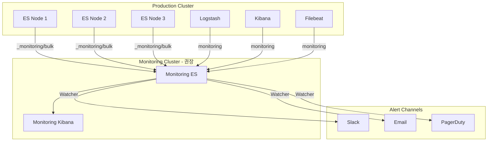

# ELK 모니터링 및 운영

Elasticsearch Cluster Health API, Cat API, Stack Monitoring, Watcher 알림 설정, 운영 체크리스트, 백업/복원까지 ELK 스택의 안정적 운영에 필요한 핵심 내용을 다룬다.

## 목차
- [1. 핵심 개념 (What)](#1-핵심-개념-what)
- [2. 왜 알아야 하는가 (Why)](#2-왜-알아야-하는가-why)
- [3. 내부 구현 분석 (How)](#3-내부-구현-분석-how)
- [4. 실전 예제](#4-실전-예제)
- [5. 정리](#5-정리)

---

## 1. 핵심 개념 (What)

### Cluster Health 3단계

| 상태 | 의미 | 조치 |
|------|------|------|
| **Green** | 모든 Primary + Replica 샤드 정상 | 정상 상태 |
| **Yellow** | 모든 Primary 정상, 일부 Replica 미할당 | Replica 할당 확인 |
| **Red** | 일부 Primary 샤드 미할당 | 즉시 조치 필요 (데이터 유실 위험) |

### Cat API

사람이 읽기 쉬운 텍스트 형식으로 클러스터 정보를 제공하는 API다. `_cat/nodes`, `_cat/indices`, `_cat/shards` 등 운영에 필수적인 빠른 상태 확인 도구다.

### Stack Monitoring

Elasticsearch, Logstash, Kibana, Beats의 성능 지표를 수집하여 Kibana에서 시각화하는 내장 모니터링 기능이다.

### Watcher

Elasticsearch에 내장된 알림 프레임워크다. 주기적으로 쿼리를 실행하고, 조건에 부합하면 이메일, Slack, Webhook 등으로 알림을 전송한다.

### Snapshot & Restore

Elasticsearch 인덱스를 외부 저장소(S3, GCS, 공유 파일시스템)에 백업하고 복원하는 기능이다.

---

## 2. 왜 알아야 하는가 (Why)

### ELK 자체도 모니터링이 필요하다

- 로그 시스템이 다운되면 모든 관측 가능성이 사라진다
- 클러스터 상태 악화를 조기에 감지하지 못하면 데이터 유실로 이어진다
- 디스크, 메모리, JVM Heap 등 리소스 한계를 사전에 파악해야 한다

### 사전 예방적 운영의 중요성

- Red 상태가 된 후 대응하면 이미 늦다
- 인덱스 크기, 샤드 수, 세그먼트 수를 지속적으로 관리해야 한다
- 백업 없이 운영하면 하드웨어 장애 시 복구 불가능하다

### 알림 자동화가 필요한 이유

- 24/7 수동 모니터링은 불가능하다
- 임계값 기반 알림으로 이상 징후를 즉시 인지해야 한다
- 반복적인 확인 작업을 자동화하여 운영 부담을 줄인다

---

## 3. 내부 구현 분석 (How)

### ELK 모니터링 아키텍처



### Watcher 실행 흐름

```
Schedule (Trigger)
  → Input: Elasticsearch 쿼리 실행
    → Condition: 결과가 조건 충족하는지 판단
      → Transform: 알림 데이터 가공 (선택적)
        → Action: Slack/Email/Webhook 전송
          → Throttle: 중복 알림 방지
```

### Snapshot 내부 동작

```
Snapshot 요청
  → Master 노드가 클러스터 메타데이터 저장
    → 각 Data 노드가 자신의 샤드 데이터를 저장소에 전송
      → Incremental: 이전 스냅샷 이후 변경된 세그먼트만 전송
        → 완료 시 스냅샷 메타데이터 업데이트
```

---

## 4. 실전 예제

### 4.1 Cluster Health API

```bash
# 클러스터 상태 확인
curl -s "http://localhost:9200/_cluster/health?pretty"
# 응답 예시:
# {
#   "cluster_name": "prod-elk",
#   "status": "green",
#   "number_of_nodes": 6,
#   "number_of_data_nodes": 3,
#   "active_primary_shards": 150,
#   "active_shards": 300,
#   "relocating_shards": 0,
#   "initializing_shards": 0,
#   "unassigned_shards": 0,
#   "delayed_unassigned_shards": 0,
#   "number_of_pending_tasks": 0,
#   "task_max_waiting_in_queue_millis": 0,
#   "active_shards_percent_as_number": 100.0
# }

# 인덱스 레벨 health
curl -s "http://localhost:9200/_cluster/health?level=indices&pretty"

# Yellow/Red 원인 진단
curl -s "http://localhost:9200/_cluster/allocation/explain?pretty"
```

### 4.2 Cat API 핵심 명령어

```bash
# 노드 상태 (CPU, 메모리, 디스크, Heap)
curl -s "http://localhost:9200/_cat/nodes?v&h=name,ip,heap.percent,ram.percent,cpu,load_1m,disk.used_percent,node.role,master"
# name        ip         heap.percent ram.percent cpu load_1m disk.used_percent node.role master
# es-node-1   10.0.1.1           45          78   5    1.2              62      dim       *
# es-node-2   10.0.1.2           52          82   8    2.1              58      dim       -

# 인덱스 목록 (크기순 정렬)
curl -s "http://localhost:9200/_cat/indices?v&h=index,health,status,pri,rep,docs.count,store.size&s=store.size:desc"

# 샤드 분포 확인
curl -s "http://localhost:9200/_cat/shards?v&h=index,shard,prirep,state,docs,store,node&s=store:desc"

# 미할당 샤드 원인 확인
curl -s "http://localhost:9200/_cat/shards?v&h=index,shard,prirep,state,unassigned.reason&s=state"

# 세그먼트 수 확인 (forcemerge 필요 여부)
curl -s "http://localhost:9200/_cat/segments?v&h=index,shard,segment,size,docs.count&s=index"

# 스레드풀 상태 (rejected 확인)
curl -s "http://localhost:9200/_cat/thread_pool?v&h=node_name,name,active,rejected,completed&s=rejected:desc"

# 펜딩 태스크
curl -s "http://localhost:9200/_cat/pending_tasks?v"

# recovery 진행 상황
curl -s "http://localhost:9200/_cat/recovery?v&active_only=true"
```

### 4.3 주요 Node Stats 모니터링 지표

```bash
# 노드별 상세 통계
curl -s "http://localhost:9200/_nodes/stats?pretty" | jq '{
  nodes: .nodes | to_entries[] | {
    name: .value.name,
    jvm_heap_used_percent: .value.jvm.mem.heap_used_percent,
    jvm_gc_old_collection_count: .value.jvm.gc.collectors.old.collection_count,
    jvm_gc_old_collection_time_ms: .value.jvm.gc.collectors.old.collection_time_in_millis,
    os_cpu_percent: .value.os.cpu.percent,
    fs_total_available_gb: (.value.fs.total.available_in_bytes / 1073741824 | floor),
    indexing_rate: .value.indices.indexing.index_total,
    search_rate: .value.indices.search.query_total,
    search_latency_ms: (if .value.indices.search.query_total > 0 then (.value.indices.search.query_time_in_millis / .value.indices.search.query_total | floor) else 0 end)
  }
}'
```

### 4.4 Stack Monitoring 활성화

```yaml
# elasticsearch.yml - Self-monitoring (소규모 환경)
xpack.monitoring.collection.enabled: true
xpack.monitoring.collection.interval: 10s

# elasticsearch.yml - 별도 모니터링 클러스터 사용 (권장)
xpack.monitoring.collection.enabled: true
xpack.monitoring.exporters:
  monitoring_cluster:
    type: http
    host: ["https://monitoring-es:9200"]
    auth.username: remote_monitoring_user
    auth.password: "${MONITORING_PASSWORD}"
    ssl.certificate_authorities: ["/etc/elasticsearch/certs/ca.crt"]
```

```yaml
# logstash.yml - Logstash 모니터링
xpack.monitoring.enabled: true
xpack.monitoring.elasticsearch.hosts: ["https://monitoring-es:9200"]
xpack.monitoring.elasticsearch.username: "logstash_system"
xpack.monitoring.elasticsearch.password: "${LOGSTASH_MONITORING_PASSWORD}"
xpack.monitoring.elasticsearch.ssl.certificate_authority: "/etc/logstash/certs/ca.crt"
```

### 4.5 Watcher 알림 설정

#### 클러스터 상태 알림

```bash
curl -X PUT "http://localhost:9200/_watcher/watch/cluster-health-alert" \
  -H "Content-Type: application/json" \
  -d '{
    "trigger": {
      "schedule": { "interval": "1m" }
    },
    "input": {
      "http": {
        "request": {
          "host": "localhost",
          "port": 9200,
          "path": "/_cluster/health",
          "scheme": "http"
        }
      }
    },
    "condition": {
      "compare": {
        "ctx.payload.status": { "not_eq": "green" }
      }
    },
    "throttle_period": "15m",
    "actions": {
      "notify_slack": {
        "webhook": {
          "scheme": "https",
          "host": "hooks.slack.com",
          "port": 443,
          "method": "post",
          "path": "/services/T00/B00/XXXX",
          "headers": { "Content-Type": "application/json" },
          "body": "{\"text\": \"[ELK Alert] Cluster status: {{ctx.payload.status}} | Unassigned shards: {{ctx.payload.unassigned_shards}} | Nodes: {{ctx.payload.number_of_nodes}}\"}"
        }
      }
    }
  }'
```

#### 디스크 사용량 알림

```bash
curl -X PUT "http://localhost:9200/_watcher/watch/disk-usage-alert" \
  -H "Content-Type: application/json" \
  -d '{
    "trigger": {
      "schedule": { "interval": "5m" }
    },
    "input": {
      "http": {
        "request": {
          "host": "localhost",
          "port": 9200,
          "path": "/_nodes/stats/fs",
          "scheme": "http"
        }
      }
    },
    "condition": {
      "script": {
        "source": "for (entry in ctx.payload.nodes.entrySet()) { def node = entry.getValue(); def total = node.fs.total.total_in_bytes; def available = node.fs.total.available_in_bytes; def usedPercent = (total - available) * 100.0 / total; if (usedPercent > 80) { return true; } } return false;",
        "lang": "painless"
      }
    },
    "throttle_period": "30m",
    "actions": {
      "notify_slack": {
        "webhook": {
          "scheme": "https",
          "host": "hooks.slack.com",
          "port": 443,
          "method": "post",
          "path": "/services/T00/B00/XXXX",
          "headers": { "Content-Type": "application/json" },
          "body": "{\"text\": \"[ELK Alert] Disk usage exceeds 80% on one or more nodes. Check immediately.\"}"
        }
      }
    }
  }'
```

#### 에러 로그 급증 알림

```bash
curl -X PUT "http://localhost:9200/_watcher/watch/error-spike-alert" \
  -H "Content-Type: application/json" \
  -d '{
    "trigger": {
      "schedule": { "interval": "5m" }
    },
    "input": {
      "search": {
        "request": {
          "indices": ["app-logs-*"],
          "body": {
            "size": 0,
            "query": {
              "bool": {
                "filter": [
                  { "term": { "log_level": "ERROR" } },
                  { "range": { "@timestamp": { "gte": "now-5m" } } }
                ]
              }
            },
            "aggs": {
              "by_service": {
                "terms": { "field": "service", "size": 10 },
                "aggs": {
                  "error_count": { "value_count": { "field": "_id" } }
                }
              }
            }
          }
        }
      }
    },
    "condition": {
      "compare": {
        "ctx.payload.hits.total.value": { "gt": 100 }
      }
    },
    "throttle_period": "15m",
    "actions": {
      "notify_slack": {
        "webhook": {
          "scheme": "https",
          "host": "hooks.slack.com",
          "port": 443,
          "method": "post",
          "path": "/services/T00/B00/XXXX",
          "headers": { "Content-Type": "application/json" },
          "body": "{\"text\": \"[ELK Alert] Error spike detected: {{ctx.payload.hits.total.value}} errors in last 5 minutes\"}"
        }
      }
    }
  }'
```

### 4.6 Snapshot & Restore (백업/복원)

```bash
# 1. 스냅샷 리포지토리 등록 (S3)
curl -X PUT "http://localhost:9200/_snapshot/s3_backup" \
  -H "Content-Type: application/json" \
  -d '{
    "type": "s3",
    "settings": {
      "bucket": "elk-snapshots-prod",
      "region": "ap-northeast-2",
      "base_path": "elasticsearch/snapshots",
      "compress": true,
      "server_side_encryption": true,
      "max_snapshot_bytes_per_sec": "200mb",
      "max_restore_bytes_per_sec": "200mb"
    }
  }'

# 2. 수동 스냅샷 생성
curl -X PUT "http://localhost:9200/_snapshot/s3_backup/snapshot_$(date +%Y%m%d_%H%M)?wait_for_completion=false" \
  -H "Content-Type: application/json" \
  -d '{
    "indices": "app-logs-*,spring-logs-*,nginx-*",
    "ignore_unavailable": true,
    "include_global_state": true
  }'

# 3. 스냅샷 상태 확인
curl -s "http://localhost:9200/_snapshot/s3_backup/_status?pretty"

# 4. 스냅샷 목록 확인
curl -s "http://localhost:9200/_snapshot/s3_backup/_all?pretty" | jq '.snapshots[] | {snapshot: .snapshot, state: .state, start_time: .start_time, indices: (.indices | length)}'

# 5. 스냅샷 복원
curl -X POST "http://localhost:9200/_snapshot/s3_backup/snapshot_20260307_0200/_restore" \
  -H "Content-Type: application/json" \
  -d '{
    "indices": "app-logs-2026.03.06",
    "ignore_unavailable": true,
    "rename_pattern": "(.+)",
    "rename_replacement": "restored_$1",
    "index_settings": {
      "index.number_of_replicas": 0
    }
  }'

# 6. 오래된 스냅샷 삭제
curl -X DELETE "http://localhost:9200/_snapshot/s3_backup/snapshot_20260201_0200"
```

### 4.7 SLM (Snapshot Lifecycle Management) 자동 백업

```bash
# 자동 스냅샷 정책 생성 - 매일 02:00 UTC
curl -X PUT "http://localhost:9200/_slm/policy/daily-snapshots" \
  -H "Content-Type: application/json" \
  -d '{
    "schedule": "0 0 2 * * ?",
    "name": "<daily-snap-{now/d}>",
    "repository": "s3_backup",
    "config": {
      "indices": ["*"],
      "ignore_unavailable": true,
      "include_global_state": true
    },
    "retention": {
      "expire_after": "30d",
      "min_count": 7,
      "max_count": 60
    }
  }'

# SLM 정책 실행 상태 확인
curl -s "http://localhost:9200/_slm/stats?pretty"

# 수동 실행
curl -X POST "http://localhost:9200/_slm/policy/daily-snapshots/_execute"
```

### 4.8 운영 체크리스트

#### 일일 점검

```bash
#!/bin/bash
# daily-health-check.sh

ES_HOST="http://localhost:9200"

echo "=== ELK Daily Health Check ==="
echo "Date: $(date)"
echo ""

# 1. 클러스터 상태
echo "--- Cluster Health ---"
curl -s "$ES_HOST/_cluster/health" | jq '{status, number_of_nodes, unassigned_shards, active_shards_percent_as_number}'

# 2. 노드 리소스
echo ""
echo "--- Node Resources ---"
curl -s "$ES_HOST/_cat/nodes?v&h=name,heap.percent,ram.percent,cpu,disk.used_percent,node.role"

# 3. 인덱스 크기 Top 10
echo ""
echo "--- Top 10 Indices by Size ---"
curl -s "$ES_HOST/_cat/indices?v&h=index,store.size,docs.count&s=store.size:desc" | head -11

# 4. 미할당 샤드
echo ""
echo "--- Unassigned Shards ---"
UNASSIGNED=$(curl -s "$ES_HOST/_cat/shards?h=state" | grep -c UNASSIGNED)
echo "Unassigned shards: $UNASSIGNED"

# 5. 스레드풀 rejected 확인
echo ""
echo "--- Thread Pool Rejected ---"
curl -s "$ES_HOST/_cat/thread_pool?v&h=node_name,name,rejected&s=rejected:desc" | head -20

# 6. JVM GC 상태
echo ""
echo "--- JVM GC Stats ---"
curl -s "$ES_HOST/_nodes/stats/jvm" | jq '.nodes | to_entries[] | {name: .value.name, heap_used_percent: .value.jvm.mem.heap_used_percent, gc_old_count: .value.jvm.gc.collectors.old.collection_count}'

# 7. 최근 스냅샷 상태
echo ""
echo "--- Latest Snapshot ---"
curl -s "$ES_HOST/_slm/stats" | jq '{snapshots_taken: .snapshots_taken, snapshots_failed: .snapshots_failed, snapshots_deleted: .snapshots_deleted}'
```

#### 주요 모니터링 임계값

| 지표 | Warning | Critical | 조치 |
|------|---------|----------|------|
| Cluster Status | Yellow | Red | 미할당 샤드 원인 분석 |
| JVM Heap Usage | > 75% | > 85% | 힙 크기 조정 또는 노드 추가 |
| Disk Usage | > 75% | > 85% | 오래된 인덱스 삭제, 디스크 증설 |
| CPU Usage | > 70% | > 90% | 쿼리 최적화, 노드 추가 |
| GC Pause | > 500ms | > 1s | 힙 크기/GC 튜닝 |
| Search Latency (P99) | > 500ms | > 2s | 쿼리/매핑 최적화 |
| Indexing Rejected | > 0 | 지속 발생 | bulk queue 크기 조정 |
| Pending Tasks | > 0 (지속) | > 10 | Master 노드 부하 확인 |

#### 장애 대응 절차

```
1. 클러스터 Red 상태
   → _cluster/allocation/explain 으로 원인 확인
   → 노드 다운 시: 노드 복구 또는 reroute
   → 디스크 부족 시: 오래된 인덱스 삭제 후 cluster.routing.allocation 활성화

2. JVM Heap 85% 초과
   → 불필요한 인덱스 close/delete
   → fielddata circuit breaker 확인
   → 노드 추가 또는 샤드 재배치

3. Indexing Rejected
   → _cat/thread_pool 로 bulk rejected 확인
   → bulk queue 크기 증가 (thread_pool.write.queue_size)
   → Logstash batch size 줄이기
```

---

## 5. 정리

| 운영 영역 | 핵심 도구/API | 모니터링 주기 |
|-----------|-------------|-------------|
| 클러스터 상태 | _cluster/health, _cat/nodes | 1분 |
| 인덱스 관리 | _cat/indices, _cat/shards | 일 1회 |
| JVM/리소스 | _nodes/stats | 5분 |
| 알림 | Watcher | 실시간 (1-5분) |
| 백업 | Snapshot/SLM | 일 1회 + 수동 |
| 성능 진단 | _cat/thread_pool, _nodes/hot_threads | 필요 시 |
| 전체 현황 | Stack Monitoring (Kibana) | 상시 대시보드 |

---

*마지막 업데이트: 2026년 03월*
