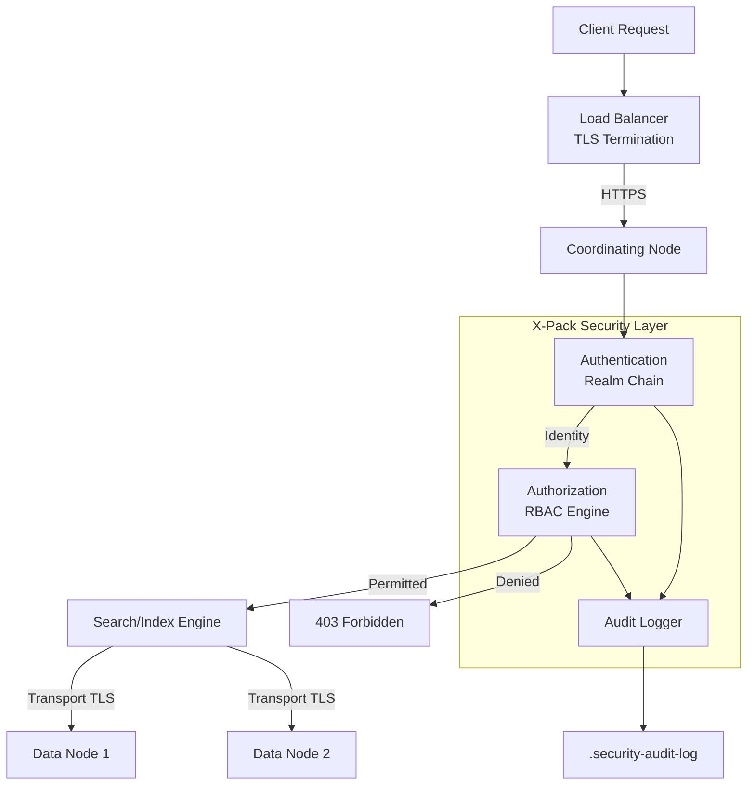
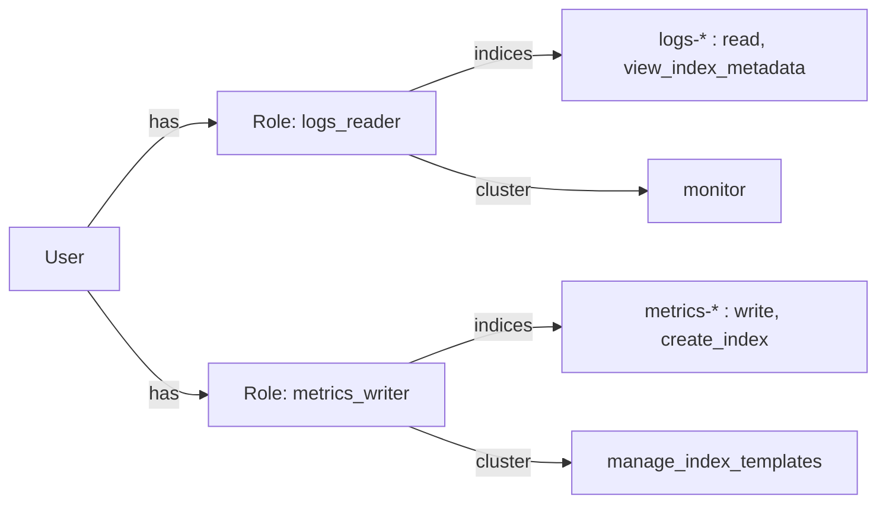

# ELK 보안 설정 (X-Pack Security)

X-Pack Security를 활용하여 Elasticsearch 클러스터의 인증, 암호화, 접근제어를 구성하는 실전 가이드다.

## 목차
- [1. 핵심 개념 (What)](#1-핵심-개념-what)
- [2. 왜 알아야 하는가 (Why)](#2-왜-알아야-하는가-why)
- [3. 내부 구현 분석 (How)](#3-내부-구현-분석-how)
- [4. 실전 예제](#4-실전-예제)
- [5. 정리](#5-정리)

---

## 1. 핵심 개념 (What)

X-Pack Security는 Elasticsearch의 내장 보안 기능으로, 다음 핵심 영역을 다룬다.

| 영역 | 설명 |
|------|------|
| **TLS/SSL** | 노드 간(Transport), 클라이언트-노드 간(HTTP) 통신 암호화 |
| **Authentication** | 사용자 신원 확인 (Native, LDAP, SAML, OIDC, PKI) |
| **Authorization (RBAC)** | 역할 기반 인덱스/클러스터 수준 접근제어 |
| **API Key** | 서비스 간 인증을 위한 토큰 기반 인증 |
| **Audit Logging** | 보안 이벤트 추적 및 감사 로그 |

### Security Realm Chain

인증 요청은 Realm Chain을 순서대로 통과하며, 첫 번째로 인증에 성공하는 Realm이 사용된다.

```
요청 → [Native Realm] → [LDAP Realm] → [SAML Realm] → [PKI Realm] → 인증 실패
              ↓                ↓              ↓              ↓
         인증 성공         인증 성공      인증 성공      인증 성공
```

---

## 2. 왜 알아야 하는가 (Why)

### 보안 미설정 시 위험

- **무인가 접근**: 기본 설정에서는 누구나 클러스터에 접근 가능
- **데이터 유출**: Transport 레이어 스니핑으로 인덱스 데이터 탈취 가능
- **권한 남용**: 모든 사용자가 `DELETE /_all` 같은 파괴적 API 실행 가능
- **컴플라이언스 위반**: GDPR, HIPAA 등 규정에서 암호화 및 접근제어 필수

### 실제 사고 사례

2019년 Elasticsearch 인스턴스 무단 노출로 인한 대규모 데이터 유출 사고가 반복적으로 발생했다. 대부분 TLS 미설정 + 인증 미활성화가 원인이었다.

---

## 3. 내부 구현 분석 (How)

### 보안 아키텍처 전체 흐름



### TLS 동작 원리

Elasticsearch는 두 계층에서 TLS를 사용한다.

| 계층 | 포트 | 용도 | 필수 여부 |
|------|------|------|-----------|
| **Transport** | 9300 | 노드 간 통신 | 필수 (Security 활성화 시) |
| **HTTP** | 9200 | 클라이언트 통신 | 강력 권장 |

### RBAC 평가 흐름



역할은 **합집합(union)** 으로 평가된다. 사용자에게 할당된 모든 역할의 권한이 합쳐진다.

---

## 4. 실전 예제

### 4.1 TLS/SSL 인증서 생성 및 설정

#### CA 및 노드 인증서 생성

```bash
# CA 생성
bin/elasticsearch-certutil ca \
  --out elastic-stack-ca.p12 \
  --pass "ca-password"

# 노드 인증서 생성 (CA 서명)
bin/elasticsearch-certutil cert \
  --ca elastic-stack-ca.p12 \
  --ca-pass "ca-password" \
  --out elastic-certificates.p12 \
  --pass "cert-password" \
  --dns "es-node-01.example.com,es-node-02.example.com" \
  --ip "10.0.1.10,10.0.1.11"

# HTTP용 인증서 생성 (PEM 형식)
bin/elasticsearch-certutil http
```

#### elasticsearch.yml - TLS 설정

```yaml
# ── Security 활성화 ──
xpack.security.enabled: true

# ── Transport Layer TLS (노드 간 통신) ──
xpack.security.transport.ssl:
  enabled: true
  verification_mode: certificate
  keystore.path: elastic-certificates.p12
  truststore.path: elastic-certificates.p12

# ── HTTP Layer TLS (클라이언트 통신) ──
xpack.security.http.ssl:
  enabled: true
  keystore.path: http.p12
  truststore.path: http.p12
```

#### Keystore에 비밀번호 저장

```bash
# Transport 인증서 비밀번호
bin/elasticsearch-keystore add xpack.security.transport.ssl.keystore.secure_password
bin/elasticsearch-keystore add xpack.security.transport.ssl.truststore.secure_password

# HTTP 인증서 비밀번호
bin/elasticsearch-keystore add xpack.security.http.ssl.keystore.secure_password
bin/elasticsearch-keystore add xpack.security.http.ssl.truststore.secure_password
```

### 4.2 사용자 인증 설정

#### Native Realm - 내장 사용자 설정

```bash
# 내장 사용자 비밀번호 초기 설정
bin/elasticsearch-setup-passwords interactive

# 사용자 생성 (API)
curl -X POST "https://localhost:9200/_security/user/app_user" \
  -H "Content-Type: application/json" \
  -u "elastic:changeme" \
  --cacert ca.crt \
  -d '{
    "password": "s3cur3P@ssw0rd!",
    "roles": ["logs_reader", "kibana_user"],
    "full_name": "Application User",
    "email": "app@example.com",
    "metadata": { "team": "backend" }
  }'
```

#### LDAP Realm 설정

```yaml
# elasticsearch.yml
xpack.security.authc.realms.ldap:
  ldap1:
    order: 1
    url: "ldaps://ldap.example.com:636"
    bind_dn: "cn=elasticsearch,ou=services,dc=example,dc=com"
    user_search:
      base_dn: "ou=users,dc=example,dc=com"
      filter: "(uid={0})"
    group_search:
      base_dn: "ou=groups,dc=example,dc=com"
    ssl:
      certificate_authorities: ["/etc/elasticsearch/ldap-ca.pem"]
      verification_mode: full
    unmapped_groups_as_roles: false
```

#### SAML Realm 설정 (Kibana SSO)

```yaml
# elasticsearch.yml
xpack.security.authc.realms.saml:
  saml1:
    order: 2
    idp.metadata.path: "https://idp.example.com/metadata.xml"
    idp.entity_id: "https://idp.example.com"
    sp.entity_id: "https://kibana.example.com"
    sp.acs: "https://kibana.example.com/api/security/saml/callback"
    sp.logout: "https://kibana.example.com/logout"
    attributes.principal: "nameid"
    attributes.groups: "groups"

# kibana.yml
xpack.security.authc.providers:
  saml.saml1:
    order: 0
    realm: saml1
  basic.basic1:
    order: 1
```

### 4.3 RBAC 역할 정의

#### 읽기 전용 역할

```bash
curl -X PUT "https://localhost:9200/_security/role/logs_reader" \
  -H "Content-Type: application/json" \
  -u "elastic:changeme" \
  --cacert ca.crt \
  -d '{
    "cluster": ["monitor"],
    "indices": [
      {
        "names": ["logs-*", "filebeat-*"],
        "privileges": ["read", "view_index_metadata"],
        "field_security": {
          "grant": ["timestamp", "message", "level", "service"]
        },
        "query": "{\"match\": {\"environment\": \"production\"}}"
      }
    ],
    "applications": [
      {
        "application": "kibana-.kibana",
        "privileges": ["feature_discover.read", "feature_dashboard.read"],
        "resources": ["space:production"]
      }
    ]
  }'
```

#### 쓰기 전용 역할 (Ingestion)

```bash
curl -X PUT "https://localhost:9200/_security/role/log_writer" \
  -H "Content-Type: application/json" \
  -u "elastic:changeme" \
  --cacert ca.crt \
  -d '{
    "cluster": ["manage_index_templates", "manage_ilm", "monitor"],
    "indices": [
      {
        "names": ["logs-*", "metrics-*"],
        "privileges": ["write", "create_index", "auto_configure"]
      }
    ]
  }'
```

#### 관리자 역할

```bash
curl -X PUT "https://localhost:9200/_security/role/cluster_admin" \
  -H "Content-Type: application/json" \
  -u "elastic:changeme" \
  --cacert ca.crt \
  -d '{
    "cluster": ["all"],
    "indices": [
      {
        "names": ["*"],
        "privileges": ["all"]
      }
    ],
    "run_as": ["*"]
  }'
```

### 4.4 API Key 관리

#### API Key 생성

```bash
# 제한된 권한의 API Key 생성
curl -X POST "https://localhost:9200/_security/api_key" \
  -H "Content-Type: application/json" \
  -u "elastic:changeme" \
  --cacert ca.crt \
  -d '{
    "name": "filebeat-shipper-key",
    "expiration": "30d",
    "role_descriptors": {
      "filebeat_writer": {
        "cluster": ["monitor"],
        "index": [
          {
            "names": ["filebeat-*"],
            "privileges": ["write", "create_index"]
          }
        ]
      }
    },
    "metadata": {
      "application": "filebeat",
      "environment": "production"
    }
  }'

# 응답에서 id와 api_key를 base64 인코딩하여 사용
# Authorization: ApiKey <base64(id:api_key)>
```

#### API Key 조회 및 무효화

```bash
# 모든 API Key 조회
curl -X GET "https://localhost:9200/_security/api_key?owner=false" \
  -u "elastic:changeme" --cacert ca.crt

# 특정 API Key 무효화
curl -X DELETE "https://localhost:9200/_security/api_key" \
  -H "Content-Type: application/json" \
  -u "elastic:changeme" \
  --cacert ca.crt \
  -d '{"name": "filebeat-shipper-key"}'
```

### 4.5 Audit Logging 설정

```yaml
# elasticsearch.yml
xpack.security.audit.enabled: true
xpack.security.audit.logfile.events.include:
  - access_denied
  - access_granted
  - anonymous_access_denied
  - authentication_failed
  - connection_denied
  - run_as_denied
  - security_config_change

xpack.security.audit.logfile.events.exclude:
  - access_granted  # 너무 많은 로그가 쌓일 수 있음

xpack.security.audit.logfile.events.emit_request_body: false

# 특정 사용자 제외 (헬스체크 등)
xpack.security.audit.logfile.events.ignore_filters:
  system_filter:
    users: ["_xpack_security", "beats_system"]
    realms: ["_service_account"]
```

### 4.6 Kibana 보안 설정

```yaml
# kibana.yml
server.ssl.enabled: true
server.ssl.certificate: /etc/kibana/certs/kibana.crt
server.ssl.key: /etc/kibana/certs/kibana.key

elasticsearch.ssl.certificateAuthorities: ["/etc/kibana/certs/ca.crt"]
elasticsearch.ssl.verificationMode: full

# Elasticsearch 연결 인증
elasticsearch.username: "kibana_system"
elasticsearch.password: "${KIBANA_ES_PASSWORD}"

# 암호화 키 설정 (Saved Objects, Reporting 등)
xpack.encryptedSavedObjects.encryptionKey: "min-32-byte-key-for-saved-objects!!"
xpack.reporting.encryptionKey: "min-32-byte-key-for-reporting!!!!"
xpack.security.encryptionKey: "min-32-byte-key-for-security!!!!!"

# 세션 설정
xpack.security.session.idleTimeout: "1h"
xpack.security.session.lifespan: "24h"
```

### 4.7 Logstash/Beats 보안 연결

```yaml
# filebeat.yml - API Key 인증
output.elasticsearch:
  hosts: ["https://es-node-01:9200", "https://es-node-02:9200"]
  api_key: "VnVhQ2ZTMEJ...=="
  ssl:
    certificate_authorities: ["/etc/filebeat/ca.crt"]
    verification_mode: full

# logstash.conf - 인증서 기반
output {
  elasticsearch {
    hosts => ["https://es-node-01:9200"]
    user => "logstash_writer"
    password => "${LOGSTASH_ES_PASSWORD}"
    ssl_enabled => true
    ssl_certificate_authorities => ["/etc/logstash/ca.crt"]
    ssl_verification_mode => "full"
  }
}
```

### 4.8 보안 모범 사례 체크리스트

```bash
# 1. 보안 상태 점검
curl -X GET "https://localhost:9200/_xpack/security/_authenticate" \
  -u "elastic:changeme" --cacert ca.crt

# 2. 불필요한 내장 사용자 비활성화
curl -X PUT "https://localhost:9200/_security/user/remote_monitoring_user/_disable" \
  -u "elastic:changeme" --cacert ca.crt

# 3. 비밀번호 정책 확인 (최소 6자)
# 4. 정기 API Key 회전 스크립트
#!/bin/bash
# rotate-api-keys.sh
OLD_KEYS=$(curl -s -X GET "https://localhost:9200/_security/api_key?owner=true" \
  -u "elastic:${ES_PASSWORD}" --cacert ca.crt \
  | jq -r '.api_keys[] | select(.expiration < now*1000) | .id')

for KEY_ID in $OLD_KEYS; do
  curl -X DELETE "https://localhost:9200/_security/api_key" \
    -H "Content-Type: application/json" \
    -u "elastic:${ES_PASSWORD}" --cacert ca.crt \
    -d "{\"ids\": [\"$KEY_ID\"]}"
done
```

---

## 5. 정리

| 보안 영역 | 핵심 설정 | 우선순위 |
|-----------|----------|---------|
| **TLS/SSL** | Transport + HTTP 모두 활성화, 인증서 자동 회전 | 최우선 |
| **Authentication** | Native(소규모), LDAP/SAML(엔터프라이즈) | 필수 |
| **RBAC** | 최소 권한 원칙, field/document 수준 제어 | 필수 |
| **API Key** | 만료 기간 설정, 정기 회전, 최소 권한 | 권장 |
| **Audit Logging** | 인증 실패, 접근 거부 이벤트 중심 수집 | 권장 |
| **Kibana** | SSL + 암호화 키 + 세션 타임아웃 | 필수 |
| **Beats/Logstash** | API Key 또는 인증서 기반 인증 | 필수 |

---

*마지막 업데이트: 2026년 03월*
