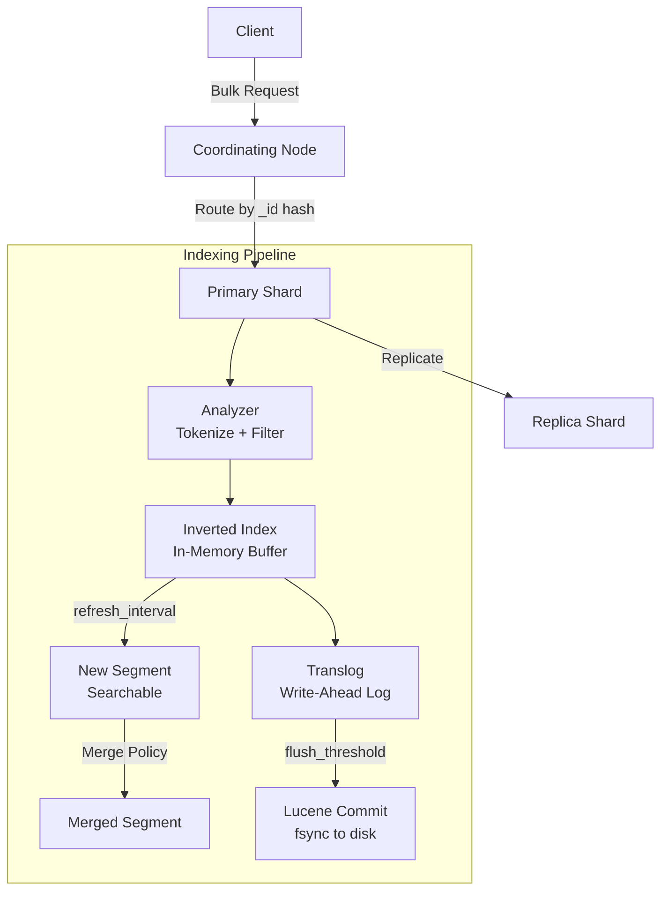
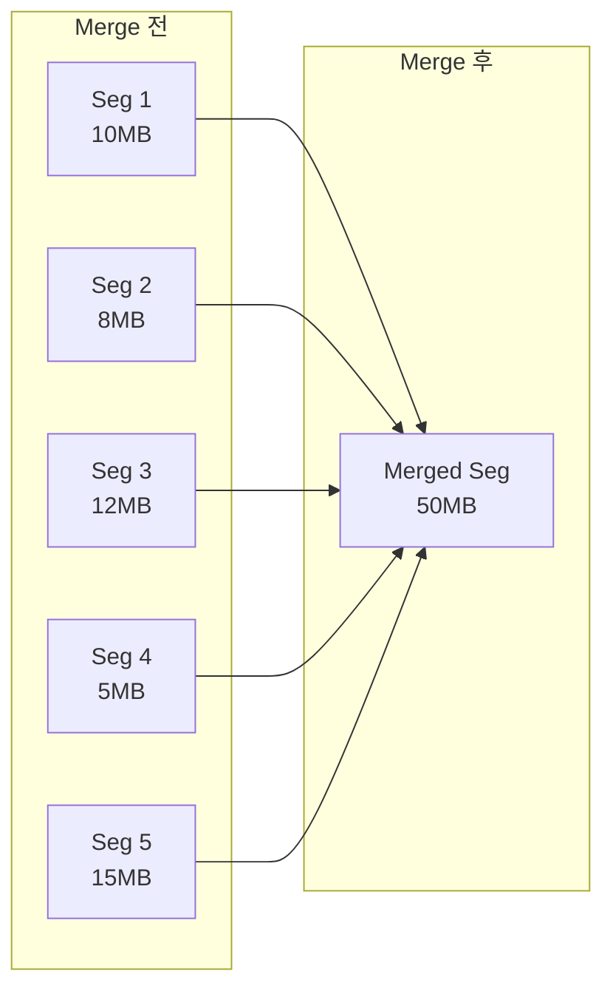

# Elasticsearch 성능 튜닝

Elasticsearch 클러스터의 쓰기/읽기 성능을 극대화하기 위한 JVM, 인덱싱, 검색, 하드웨어 전반의 튜닝 전략을 다룬다.

## 목차
- [1. 핵심 개념 (What)](#1-핵심-개념-what)
- [2. 왜 알아야 하는가 (Why)](#2-왜-알아야-하는가-why)
- [3. 내부 구현 분석 (How)](#3-내부-구현-분석-how)
- [4. 실전 예제](#4-실전-예제)
- [5. 정리](#5-정리)

---

## 1. 핵심 개념 (What)

Elasticsearch 성능 튜닝은 크게 5개 계층으로 나뉜다.

| 계층 | 튜닝 대상 | 영향 범위 |
|------|----------|----------|
| **JVM** | Heap 크기, GC 정책 | 전체 노드 안정성 |
| **Indexing** | Bulk 크기, Refresh Interval, Translog | 쓰기 처리량 |
| **Search** | 캐시, Shard 수, Routing | 읽기 지연시간 |
| **Merge** | Merge 정책, 스레드 수 | I/O 부하 및 검색 성능 |
| **Hardware** | 디스크, 메모리, CPU, 네트워크 | 전체 성능 상한 |

### 성능 핵심 지표

- **Indexing Rate**: 초당 인덱싱 문서 수 (docs/sec)
- **Search Latency**: 쿼리 응답 시간 (p50, p95, p99)
- **Refresh Time**: 인덱싱된 문서가 검색 가능해지는 시간
- **Merge Time**: 세그먼트 병합에 소요되는 시간
- **GC Pause**: JVM Garbage Collection 정지 시간

---

## 2. 왜 알아야 하는가 (Why)

### 기본 설정의 한계

Elasticsearch의 기본 설정은 범용적 사용을 가정한다. 실제 프로덕션 환경에서는 워크로드 특성에 따라 기본값이 병목이 된다.

| 시나리오 | 기본값 문제 | 튜닝 효과 |
|---------|-----------|----------|
| 대량 로그 수집 | refresh_interval=1s가 I/O 병목 | 30s로 변경 시 쓰기 처리량 2-3x 향상 |
| 실시간 검색 | 큰 Shard에서 검색 지연 | 적정 Shard 크기로 분할 시 latency 50% 감소 |
| 메모리 부족 | Heap 31GB 초과 시 Compressed OOP 비활성화 | 31GB 이하 유지로 메모리 효율 40% 향상 |

---

## 3. 내부 구현 분석 (How)

### 인덱싱 파이프라인 내부 구조



### JVM 메모리 구조

```
┌─────────────────────────────────────────────────┐
│                   시스템 메모리 (64GB)              │
│                                                 │
│  ┌──────────────────┐  ┌──────────────────────┐ │
│  │   JVM Heap (31GB) │  │  OS File Cache (33GB)│ │
│  │                  │  │                      │ │
│  │  ┌─────────────┐ │  │  Lucene Segments     │ │
│  │  │  Young Gen   │ │  │  (Memory-mapped)     │ │
│  │  │  (Eden+S0+S1)│ │  │                      │ │
│  │  ├─────────────┤ │  │  Doc Values           │ │
│  │  │  Old Gen     │ │  │  (columnar store)    │ │
│  │  │  (Field Data,│ │  │                      │ │
│  │  │   Caches,    │ │  │  Stored Fields       │ │
│  │  │   Buffers)   │ │  │                      │ │
│  │  └─────────────┘ │  └──────────────────────┘ │
│  └──────────────────┘                           │
└─────────────────────────────────────────────────┘
```

**핵심 원칙**: Heap은 물리 메모리의 50% 이하, 최대 31GB(Compressed OOP 임계값)로 설정한다. 나머지는 OS File Cache가 Lucene 세그먼트를 캐싱하는 데 사용한다.

### Segment Merge 동작



Merge는 작은 세그먼트들을 하나의 큰 세그먼트로 합치고, 삭제 표시된 문서를 실제로 제거한다. I/O 집약적 작업이므로 적절한 제어가 필요하다.

---

## 4. 실전 예제

### 4.1 JVM 설정

#### jvm.options

```bash
# /etc/elasticsearch/jvm.options

# Heap 크기: 물리 메모리의 50% 이하, 최대 31GB
-Xms31g
-Xmx31g

# G1GC 사용 (Elasticsearch 7.x+ 기본값)
-XX:+UseG1GC

# G1GC 튜닝
-XX:G1HeapRegionSize=16m
-XX:InitiatingHeapOccupancyPercent=30
-XX:G1ReservePercent=25

# GC 로깅
-Xlog:gc*,gc+age=trace,safepoint:file=/var/log/elasticsearch/gc.log:utctime,pid,tags:filecount=32,filesize=64m

# OOM 시 Heap Dump
-XX:+HeapDumpOnOutOfMemoryError
-XX:HeapDumpPath=/var/lib/elasticsearch/heapdump
-XX:+ExitOnOutOfMemoryError
```

#### Heap 크기 결정 가이드

```bash
# 현재 Heap 사용량 확인
curl -s "localhost:9200/_nodes/stats/jvm" | jq '
  .nodes | to_entries[] | {
    node: .value.name,
    heap_used_percent: .value.jvm.mem.heap_used_percent,
    heap_used: .value.jvm.mem.heap_used_in_bytes,
    heap_max: .value.jvm.mem.heap_max_in_bytes,
    gc_old_count: .value.jvm.gc.collectors.old.collection_count,
    gc_old_time_ms: .value.jvm.gc.collectors.old.collection_time_in_millis
  }'
```

### 4.2 Bulk API 최적화

#### 최적 Bulk 크기 결정

```bash
# 벤치마크 스크립트: bulk 크기별 성능 측정
#!/bin/bash
for SIZE in 500 1000 2000 5000 10000; do
  echo "Testing bulk_size=$SIZE"

  START=$(date +%s%N)

  # esrally를 사용한 벤치마크
  esrally race \
    --track=geonames \
    --challenge=append-no-conflicts \
    --track-params="bulk_size:$SIZE" \
    --pipeline=benchmark-only \
    --target-hosts=localhost:9200

  END=$(date +%s%N)
  echo "Bulk size $SIZE: $(( (END - START) / 1000000 ))ms"
done
```

#### Bulk 인덱싱 최적화 설정

```bash
# 1. 인덱싱 전 최적화 설정 적용
curl -X PUT "localhost:9200/logs-2026.03/_settings" \
  -H "Content-Type: application/json" \
  -d '{
    "index": {
      "refresh_interval": "30s",
      "number_of_replicas": 0,
      "translog": {
        "durability": "async",
        "sync_interval": "30s",
        "flush_threshold_size": "1gb"
      }
    }
  }'

# 2. Bulk 인덱싱 실행 (최적 크기: 5-15MB per request)
curl -X POST "localhost:9200/_bulk" \
  -H "Content-Type: application/x-ndjson" \
  --data-binary @bulk_data.ndjson

# 3. 인덱싱 완료 후 설정 복원
curl -X PUT "localhost:9200/logs-2026.03/_settings" \
  -H "Content-Type: application/json" \
  -d '{
    "index": {
      "refresh_interval": "1s",
      "number_of_replicas": 1,
      "translog": {
        "durability": "request"
      }
    }
  }'
```

### 4.3 Refresh Interval 조정

```bash
# 워크로드별 권장 설정

# 로그/메트릭 수집 (near-realtime 불필요)
curl -X PUT "localhost:9200/logs-*/_settings" \
  -H "Content-Type: application/json" \
  -d '{"index": {"refresh_interval": "30s"}}'

# 실시간 검색 (기본값 유지)
curl -X PUT "localhost:9200/products/_settings" \
  -H "Content-Type: application/json" \
  -d '{"index": {"refresh_interval": "1s"}}'

# 대량 리인덱싱 (완료 후 수동 refresh)
curl -X PUT "localhost:9200/reindex-target/_settings" \
  -H "Content-Type: application/json" \
  -d '{"index": {"refresh_interval": "-1"}}'

# 수동 refresh 실행
curl -X POST "localhost:9200/reindex-target/_refresh"
```

### 4.4 Merge 정책 튜닝

```bash
# Merge 정책 설정
curl -X PUT "localhost:9200/logs-*/_settings" \
  -H "Content-Type: application/json" \
  -d '{
    "index": {
      "merge": {
        "scheduler": {
          "max_thread_count": 1
        },
        "policy": {
          "max_merged_segment": "5gb",
          "segments_per_tier": 10,
          "floor_segment": "2mb"
        }
      }
    }
  }'

# Force Merge (읽기 전용 인덱스에서만 사용)
# 주의: 진행 중인 인덱싱이 있으면 절대 실행하지 않는다
curl -X POST "localhost:9200/logs-2026.02/_forcemerge?max_num_segments=1"
```

### 4.5 검색 성능 최적화

#### Shard 크기 및 수 최적화

```bash
# 현재 Shard 크기 확인
curl -s "localhost:9200/_cat/shards?v&s=store:desc" | head -20

# 권장 Shard 크기: 10GB ~ 50GB
# 권장 Shard 수: 노드당 Heap 1GB에 20개 이하

# 인덱스 템플릿으로 Shard 수 제어
curl -X PUT "localhost:9200/_index_template/logs_template" \
  -H "Content-Type: application/json" \
  -d '{
    "index_patterns": ["logs-*"],
    "template": {
      "settings": {
        "number_of_shards": 3,
        "number_of_replicas": 1,
        "routing.allocation.total_shards_per_node": 2
      }
    }
  }'
```

#### 쿼리 레벨 최적화

```bash
# 1. Filter Context 활용 (캐싱 가능, 스코어링 불필요)
curl -X GET "localhost:9200/logs-*/_search" \
  -H "Content-Type: application/json" \
  -d '{
    "query": {
      "bool": {
        "filter": [
          {"term": {"status": "error"}},
          {"range": {"@timestamp": {"gte": "now-1h"}}}
        ]
      }
    }
  }'

# 2. _source 필드 제한
curl -X GET "localhost:9200/logs-*/_search" \
  -H "Content-Type: application/json" \
  -d '{
    "query": {"match_all": {}},
    "_source": ["@timestamp", "message", "level"],
    "size": 100
  }'

# 3. 검색 프로파일링
curl -X GET "localhost:9200/logs-*/_search" \
  -H "Content-Type: application/json" \
  -d '{
    "profile": true,
    "query": {
      "match": {"message": "timeout error"}
    }
  }'
```

### 4.6 쓰기/읽기 노드 분리

```yaml
# Hot 노드 (쓰기 중심) - elasticsearch.yml
node.roles: [data_hot, ingest]
# SSD 사용, 높은 CPU

# Warm 노드 (읽기 중심) - elasticsearch.yml
node.roles: [data_warm]
# HDD 가능, 높은 디스크 용량

# Cold 노드 (아카이브) - elasticsearch.yml
node.roles: [data_cold]
# 대용량 HDD, 최소 리소스
```

```bash
# ILM으로 자동 데이터 이동
curl -X PUT "localhost:9200/_ilm/policy/logs_policy" \
  -H "Content-Type: application/json" \
  -d '{
    "policy": {
      "phases": {
        "hot": {
          "min_age": "0ms",
          "actions": {
            "rollover": {"max_primary_shard_size": "50gb", "max_age": "1d"},
            "set_priority": {"priority": 100}
          }
        },
        "warm": {
          "min_age": "3d",
          "actions": {
            "shrink": {"number_of_shards": 1},
            "forcemerge": {"max_num_segments": 1},
            "set_priority": {"priority": 50},
            "allocate": {"require": {"data": "warm"}}
          }
        },
        "cold": {
          "min_age": "30d",
          "actions": {
            "set_priority": {"priority": 0},
            "allocate": {"require": {"data": "cold"}}
          }
        },
        "delete": {
          "min_age": "90d",
          "actions": {"delete": {}}
        }
      }
    }
  }'
```

### 4.7 하드웨어 사이징 가이드

```
┌──────────────────────────────────────────────────────────────┐
│                    하드웨어 사이징 기준                         │
├──────────┬────────────┬────────────┬────────────┬────────────┤
│  역할     │  CPU       │  메모리     │  디스크     │  네트워크   │
├──────────┼────────────┼────────────┼────────────┼────────────┤
│ Master   │ 4 cores    │ 16GB       │ 50GB SSD   │ 1Gbps      │
│ Hot Data │ 16+ cores  │ 64GB       │ 2TB NVMe   │ 10Gbps     │
│ Warm     │ 8 cores    │ 64GB       │ 8TB HDD    │ 1Gbps      │
│ Cold     │ 4 cores    │ 32GB       │ 16TB HDD   │ 1Gbps      │
│ Coord    │ 8 cores    │ 32GB       │ 100GB SSD  │ 10Gbps     │
│ Ingest   │ 16 cores   │ 32GB       │ 100GB SSD  │ 10Gbps     │
└──────────┴────────────┴────────────┴────────────┴────────────┘
```

### 4.8 성능 모니터링 쿼리

```bash
# 클러스터 전체 인덱싱/검색 통계
curl -s "localhost:9200/_cluster/stats" | jq '{
  indexing_rate: .indices.docs.count,
  total_shards: .indices.shards.total,
  heap_used_percent: .nodes.jvm.mem.heap_used_in_bytes,
  fs_available: .nodes.fs.available_in_bytes
}'

# 느린 쿼리 로그 설정
curl -X PUT "localhost:9200/logs-*/_settings" \
  -H "Content-Type: application/json" \
  -d '{
    "index.search.slowlog.threshold.query.warn": "10s",
    "index.search.slowlog.threshold.query.info": "5s",
    "index.search.slowlog.threshold.fetch.warn": "1s",
    "index.indexing.slowlog.threshold.index.warn": "10s",
    "index.indexing.slowlog.threshold.index.info": "5s"
  }'

# Thread Pool 상태 확인
curl -s "localhost:9200/_cat/thread_pool?v&h=node_name,name,active,rejected,completed" \
  | grep -E "write|search|bulk"

# Hot Threads 분석
curl -X GET "localhost:9200/_nodes/hot_threads?threads=5"
```

---

## 5. 정리

| 튜닝 영역 | 핵심 설정 | 권장 값 | 효과 |
|-----------|----------|--------|------|
| **JVM Heap** | -Xmx | 물리 메모리 50%, max 31GB | OOP 압축 유지, GC 안정화 |
| **Refresh Interval** | refresh_interval | 로그: 30s, 검색: 1s | 쓰기 처리량 2-3x 향상 |
| **Bulk Size** | 요청당 크기 | 5-15MB | 최적 인덱싱 처리량 |
| **Translog** | flush_threshold_size | 512MB-1GB | 디스크 I/O 감소 |
| **Merge** | max_thread_count | HDD: 1, SSD: 기본값 | I/O 경합 감소 |
| **Shard 크기** | number_of_shards | 10-50GB per shard | 검색/복구 성능 균형 |
| **노드 분리** | node.roles | hot/warm/cold | 워크로드 격리 |
| **Force Merge** | max_num_segments | 1 (읽기 전용만) | 검색 성능 향상 |

---

*마지막 업데이트: 2026년 03월*
