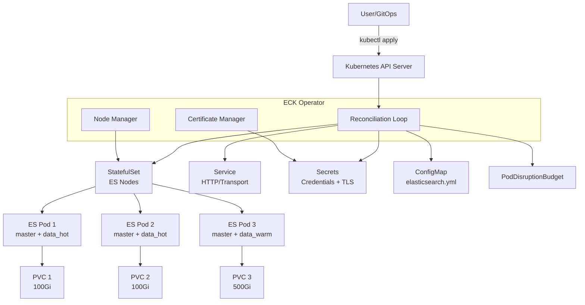
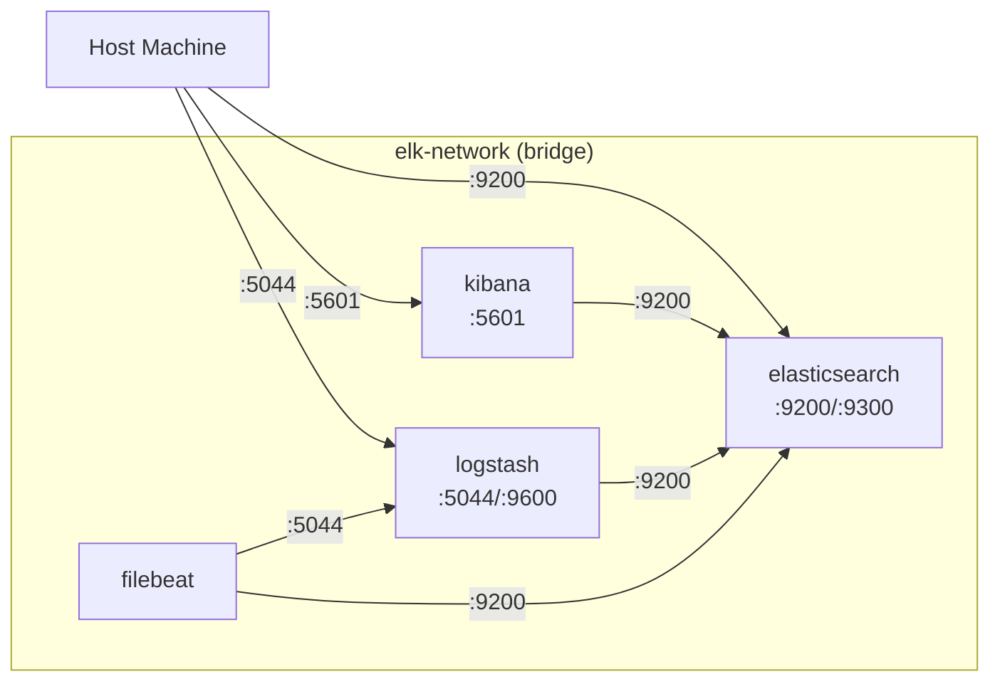

# ELK Docker/Kubernetes 배포

Docker Compose를 활용한 로컬/소규모 배포부터 ECK(Elastic Cloud on Kubernetes) Operator를 활용한 프로덕션급 Kubernetes 배포까지 실전 구성을 다룬다.

## 목차
- [1. 핵심 개념 (What)](#1-핵심-개념-what)
- [2. 왜 알아야 하는가 (Why)](#2-왜-알아야-하는가-why)
- [3. 내부 구현 분석 (How)](#3-내부-구현-분석-how)
- [4. 실전 예제](#4-실전-예제)
- [5. 정리](#5-정리)

---

## 1. 핵심 개념 (What)

ELK 스택의 컨테이너화 배포는 크게 두 가지 접근 방식이 있다.

| 방식 | 사용 환경 | 복잡도 | 운영 자동화 |
|------|----------|--------|------------|
| **Docker Compose** | 개발/테스트, 소규모 프로덕션 | 낮음 | 수동 |
| **ECK Operator** | 프로덕션 Kubernetes | 중간 | CRD 기반 자동화 |
| **Helm Chart** | Kubernetes (ECK 미사용) | 중간 | Helm 릴리스 관리 |

### ECK (Elastic Cloud on Kubernetes) Operator

ECK는 Kubernetes Custom Resource Definition(CRD)을 통해 Elasticsearch, Kibana, Beats, Logstash 등을 선언적으로 관리하는 Operator 패턴 구현체다.

주요 CRD:
- `Elasticsearch` - 클러스터 구성
- `Kibana` - Kibana 인스턴스
- `Beat` - Filebeat, Metricbeat 등
- `ElasticMapsServer` - Maps 서비스
- `Logstash` - Logstash 파이프라인

---

## 2. 왜 알아야 하는가 (Why)

### 컨테이너 배포의 이점

| 관점 | VM 배포 | 컨테이너 배포 |
|------|---------|-------------|
| **환경 일관성** | OS/버전 차이 발생 | 동일 이미지 보장 |
| **스케일링** | 수동 서버 프로비저닝 | 선언적 replica 조정 |
| **롤링 업데이트** | 수동 + 다운타임 위험 | 자동 무중단 업데이트 |
| **장애 복구** | 수동 재시작 | 자동 Pod 재시작 |
| **리소스 효율** | 서버당 1인스턴스 | 리소스 공유 가능 |

### ECK Operator의 가치

- TLS 인증서를 자동 생성 및 회전
- 노드 추가/제거 시 Shard 재배치 자동 처리
- Rolling Upgrade 시 Shard 마이그레이션을 고려한 순서 보장
- `elastic` 사용자 비밀번호 자동 생성 및 Secret 관리

---

## 3. 내부 구현 분석 (How)

### ECK Operator 아키텍처



### Docker Compose 네트워크 구조



---

## 4. 실전 예제

### 4.1 Docker Compose 전체 구성

#### docker-compose.yml

```yaml
version: "3.8"

services:
  # ── Elasticsearch ──
  elasticsearch:
    image: docker.elastic.co/elasticsearch/elasticsearch:8.17.0
    container_name: elasticsearch
    environment:
      - node.name=es-node-01
      - cluster.name=elk-docker
      - discovery.type=single-node
      - bootstrap.memory_lock=true
      - xpack.security.enabled=true
      - xpack.security.http.ssl.enabled=false
      - ELASTIC_PASSWORD=${ELASTIC_PASSWORD:-changeme}
      - "ES_JAVA_OPTS=-Xms4g -Xmx4g"
    ulimits:
      memlock:
        soft: -1
        hard: -1
      nofile:
        soft: 65536
        hard: 65536
    volumes:
      - es-data:/usr/share/elasticsearch/data
    ports:
      - "9200:9200"
      - "9300:9300"
    networks:
      - elk
    healthcheck:
      test: ["CMD-SHELL", "curl -s -u elastic:${ELASTIC_PASSWORD:-changeme} http://localhost:9200/_cluster/health | grep -q '\"status\":\"green\"\\|\"status\":\"yellow\"'"]
      interval: 30s
      timeout: 10s
      retries: 5

  # ── Logstash ──
  logstash:
    image: docker.elastic.co/logstash/logstash:8.17.0
    container_name: logstash
    environment:
      - "LS_JAVA_OPTS=-Xms1g -Xmx1g"
      - ELASTIC_PASSWORD=${ELASTIC_PASSWORD:-changeme}
    volumes:
      - ./logstash/pipeline:/usr/share/logstash/pipeline:ro
      - ./logstash/config/logstash.yml:/usr/share/logstash/config/logstash.yml:ro
    ports:
      - "5044:5044"
      - "9600:9600"
    networks:
      - elk
    depends_on:
      elasticsearch:
        condition: service_healthy

  # ── Kibana ──
  kibana:
    image: docker.elastic.co/kibana/kibana:8.17.0
    container_name: kibana
    environment:
      - ELASTICSEARCH_HOSTS=http://elasticsearch:9200
      - ELASTICSEARCH_USERNAME=kibana_system
      - ELASTICSEARCH_PASSWORD=${KIBANA_PASSWORD:-changeme}
      - xpack.security.encryptionKey=${ENCRYPTION_KEY:-a]3h@#$!sdf234klj23lkjasdf09823kj}
    ports:
      - "5601:5601"
    networks:
      - elk
    depends_on:
      elasticsearch:
        condition: service_healthy

  # ── Filebeat ──
  filebeat:
    image: docker.elastic.co/beats/filebeat:8.17.0
    container_name: filebeat
    user: root
    command: filebeat -e --strict.perms=false
    volumes:
      - ./filebeat/filebeat.yml:/usr/share/filebeat/filebeat.yml:ro
      - /var/lib/docker/containers:/var/lib/docker/containers:ro
      - /var/run/docker.sock:/var/run/docker.sock:ro
    networks:
      - elk
    depends_on:
      elasticsearch:
        condition: service_healthy

volumes:
  es-data:
    driver: local

networks:
  elk:
    driver: bridge
```

#### .env

```bash
ELASTIC_PASSWORD=s3cur3P@ssw0rd
KIBANA_PASSWORD=k1ban@P@ss
ENCRYPTION_KEY=min-32-byte-encryption-key-here!!
ELASTIC_VERSION=8.17.0
```

#### 멀티노드 구성 (docker-compose.cluster.yml)

```yaml
version: "3.8"

services:
  es-master:
    image: docker.elastic.co/elasticsearch/elasticsearch:8.17.0
    environment:
      - node.name=es-master
      - node.roles=master
      - cluster.name=elk-cluster
      - cluster.initial_master_nodes=es-master
      - discovery.seed_hosts=es-hot-01,es-hot-02,es-warm-01
      - bootstrap.memory_lock=true
      - xpack.security.enabled=true
      - ELASTIC_PASSWORD=${ELASTIC_PASSWORD}
      - "ES_JAVA_OPTS=-Xms2g -Xmx2g"
    ulimits:
      memlock: { soft: -1, hard: -1 }
    volumes:
      - es-master-data:/usr/share/elasticsearch/data
    networks:
      - elk

  es-hot-01:
    image: docker.elastic.co/elasticsearch/elasticsearch:8.17.0
    environment:
      - node.name=es-hot-01
      - node.roles=data_hot,data_content,ingest
      - cluster.name=elk-cluster
      - discovery.seed_hosts=es-master,es-hot-02,es-warm-01
      - bootstrap.memory_lock=true
      - "ES_JAVA_OPTS=-Xms8g -Xmx8g"
    ulimits:
      memlock: { soft: -1, hard: -1 }
    volumes:
      - es-hot-01-data:/usr/share/elasticsearch/data
    networks:
      - elk

  es-hot-02:
    image: docker.elastic.co/elasticsearch/elasticsearch:8.17.0
    environment:
      - node.name=es-hot-02
      - node.roles=data_hot,data_content,ingest
      - cluster.name=elk-cluster
      - discovery.seed_hosts=es-master,es-hot-01,es-warm-01
      - bootstrap.memory_lock=true
      - "ES_JAVA_OPTS=-Xms8g -Xmx8g"
    ulimits:
      memlock: { soft: -1, hard: -1 }
    volumes:
      - es-hot-02-data:/usr/share/elasticsearch/data
    networks:
      - elk

  es-warm-01:
    image: docker.elastic.co/elasticsearch/elasticsearch:8.17.0
    environment:
      - node.name=es-warm-01
      - node.roles=data_warm
      - cluster.name=elk-cluster
      - discovery.seed_hosts=es-master,es-hot-01,es-hot-02
      - bootstrap.memory_lock=true
      - "ES_JAVA_OPTS=-Xms8g -Xmx8g"
    ulimits:
      memlock: { soft: -1, hard: -1 }
    volumes:
      - es-warm-01-data:/usr/share/elasticsearch/data
    networks:
      - elk

volumes:
  es-master-data:
  es-hot-01-data:
  es-hot-02-data:
  es-warm-01-data:

networks:
  elk:
    driver: bridge
```

### 4.2 ECK Operator 설치 및 설정

#### ECK Operator 설치

```bash
# CRD 및 Operator 설치
kubectl create -f https://download.elastic.co/downloads/eck/2.14.0/crds.yaml
kubectl apply -f https://download.elastic.co/downloads/eck/2.14.0/operator.yaml

# 설치 확인
kubectl -n elastic-system get pods
kubectl -n elastic-system logs -f statefulset.apps/elastic-operator
```

#### Elasticsearch 클러스터 CRD

```yaml
# elasticsearch-cluster.yaml
apiVersion: elasticsearch.k8s.elastic.co/v1
kind: Elasticsearch
metadata:
  name: production
  namespace: elastic
spec:
  version: 8.17.0

  # HTTP 설정
  http:
    tls:
      selfSignedCertificate:
        disabled: false
        subjectAltNames:
          - dns: "elasticsearch.example.com"

  # 노드 세트 정의
  nodeSets:
    # Master 노드
    - name: master
      count: 3
      config:
        node.roles: ["master"]
        xpack.ml.enabled: false
      podTemplate:
        spec:
          containers:
            - name: elasticsearch
              resources:
                requests:
                  memory: 4Gi
                  cpu: 2
                limits:
                  memory: 4Gi
              env:
                - name: ES_JAVA_OPTS
                  value: "-Xms2g -Xmx2g"
          affinity:
            podAntiAffinity:
              requiredDuringSchedulingIgnoredDuringExecution:
                - labelSelector:
                    matchLabels:
                      elasticsearch.k8s.elastic.co/cluster-name: production
                      elasticsearch.k8s.elastic.co/statefulset-name: production-es-master
                  topologyKey: kubernetes.io/hostname
      volumeClaimTemplates:
        - metadata:
            name: elasticsearch-data
          spec:
            accessModes: ["ReadWriteOnce"]
            storageClassName: fast-ssd
            resources:
              requests:
                storage: 10Gi

    # Hot Data 노드
    - name: hot
      count: 3
      config:
        node.roles: ["data_hot", "data_content", "ingest"]
      podTemplate:
        spec:
          containers:
            - name: elasticsearch
              resources:
                requests:
                  memory: 32Gi
                  cpu: 8
                limits:
                  memory: 32Gi
              env:
                - name: ES_JAVA_OPTS
                  value: "-Xms16g -Xmx16g"
          affinity:
            podAntiAffinity:
              preferredDuringSchedulingIgnoredDuringExecution:
                - weight: 100
                  podAffinityTerm:
                    labelSelector:
                      matchLabels:
                        elasticsearch.k8s.elastic.co/statefulset-name: production-es-hot
                    topologyKey: kubernetes.io/hostname
          nodeSelector:
            node-type: high-performance
          tolerations:
            - key: "dedicated"
              operator: "Equal"
              value: "elasticsearch"
              effect: "NoSchedule"
      volumeClaimTemplates:
        - metadata:
            name: elasticsearch-data
          spec:
            accessModes: ["ReadWriteOnce"]
            storageClassName: fast-nvme
            resources:
              requests:
                storage: 500Gi

    # Warm Data 노드
    - name: warm
      count: 2
      config:
        node.roles: ["data_warm"]
      podTemplate:
        spec:
          containers:
            - name: elasticsearch
              resources:
                requests:
                  memory: 32Gi
                  cpu: 4
                limits:
                  memory: 32Gi
              env:
                - name: ES_JAVA_OPTS
                  value: "-Xms16g -Xmx16g"
          nodeSelector:
            node-type: storage-optimized
      volumeClaimTemplates:
        - metadata:
            name: elasticsearch-data
          spec:
            accessModes: ["ReadWriteOnce"]
            storageClassName: standard-hdd
            resources:
              requests:
                storage: 2Ti
```

#### Kibana CRD

```yaml
# kibana.yaml
apiVersion: kibana.k8s.elastic.co/v1
kind: Kibana
metadata:
  name: production
  namespace: elastic
spec:
  version: 8.17.0
  count: 2
  elasticsearchRef:
    name: production
  http:
    tls:
      selfSignedCertificate:
        disabled: false
  podTemplate:
    spec:
      containers:
        - name: kibana
          resources:
            requests:
              memory: 2Gi
              cpu: 1
            limits:
              memory: 2Gi
  config:
    xpack.reporting.roles.enabled: false
    xpack.security.session.idleTimeout: "1h"
    xpack.security.session.lifespan: "24h"
```

#### Filebeat CRD

```yaml
# filebeat.yaml
apiVersion: beat.k8s.elastic.co/v1beta1
kind: Beat
metadata:
  name: filebeat
  namespace: elastic
spec:
  type: filebeat
  version: 8.17.0
  elasticsearchRef:
    name: production
  config:
    filebeat.autodiscover:
      providers:
        - type: kubernetes
          node: ${NODE_NAME}
          hints.enabled: true
          hints.default_config:
            type: container
            paths:
              - /var/log/containers/*${data.kubernetes.container.id}.log
    processors:
      - add_kubernetes_metadata:
          host: ${NODE_NAME}
          matchers:
            - logs_path:
                logs_path: /var/log/containers/
  daemonSet:
    podTemplate:
      spec:
        serviceAccountName: filebeat
        automountServiceAccountToken: true
        dnsPolicy: ClusterFirstWithHostNet
        hostNetwork: true
        containers:
          - name: filebeat
            securityContext:
              runAsUser: 0
            volumeMounts:
              - name: varlogcontainers
                mountPath: /var/log/containers
              - name: varlogpods
                mountPath: /var/log/pods
        volumes:
          - name: varlogcontainers
            hostPath:
              path: /var/log/containers
          - name: varlogpods
            hostPath:
              path: /var/log/pods
```

### 4.3 스케일링 전략

#### 수평 스케일링 (ECK)

```bash
# Hot 노드 3 -> 5로 확장
kubectl patch elasticsearch production -n elastic --type merge -p '{
  "spec": {
    "nodeSets": [
      {"name": "master", "count": 3},
      {"name": "hot", "count": 5},
      {"name": "warm", "count": 2}
    ]
  }
}'

# 스케일링 진행 상황 확인
kubectl get elasticsearch production -n elastic -w
kubectl get pods -n elastic -l elasticsearch.k8s.elastic.co/cluster-name=production
```

#### Kibana HPA (Horizontal Pod Autoscaler)

```yaml
apiVersion: autoscaling/v2
kind: HorizontalPodAutoscaler
metadata:
  name: kibana-hpa
  namespace: elastic
spec:
  scaleTargetRef:
    apiVersion: kibana.k8s.elastic.co/v1
    kind: Kibana
    name: production
  minReplicas: 2
  maxReplicas: 5
  metrics:
    - type: Resource
      resource:
        name: cpu
        target:
          type: Utilization
          averageUtilization: 70
```

### 4.4 볼륨 관리 및 백업

#### StorageClass 정의

```yaml
# NVMe SSD (Hot 노드용)
apiVersion: storage.k8s.io/v1
kind: StorageClass
metadata:
  name: fast-nvme
provisioner: ebs.csi.aws.com
parameters:
  type: io2
  iopsPerGB: "50"
  encrypted: "true"
reclaimPolicy: Retain
allowVolumeExpansion: true
volumeBindingMode: WaitForFirstConsumer

# Standard HDD (Warm/Cold 노드용)
apiVersion: storage.k8s.io/v1
kind: StorageClass
metadata:
  name: standard-hdd
provisioner: ebs.csi.aws.com
parameters:
  type: st1
  encrypted: "true"
reclaimPolicy: Retain
allowVolumeExpansion: true
volumeBindingMode: WaitForFirstConsumer
```

#### 볼륨 확장

```bash
# PVC 크기 확장 (StorageClass가 allowVolumeExpansion: true여야 함)
kubectl patch pvc elasticsearch-data-production-es-hot-0 -n elastic \
  -p '{"spec": {"resources": {"requests": {"storage": "1Ti"}}}}'
```

### 4.5 운영 필수 명령어

```bash
# ECK 클러스터 상태 확인
kubectl get elasticsearch -n elastic
kubectl get kibana -n elastic
kubectl get beat -n elastic

# Elasticsearch 비밀번호 확인
kubectl get secret production-es-elastic-user -n elastic \
  -o jsonpath='{.data.elastic}' | base64 -d; echo

# Elasticsearch 로그 확인
kubectl logs -n elastic production-es-hot-0 -c elasticsearch --tail=100

# Pod 내부에서 클러스터 상태 확인
kubectl exec -n elastic production-es-hot-0 -c elasticsearch -- \
  curl -s -u "elastic:$(kubectl get secret production-es-elastic-user -n elastic -o jsonpath='{.data.elastic}' | base64 -d)" \
  -k "https://localhost:9200/_cluster/health?pretty"

# Rolling Restart
kubectl delete pod production-es-hot-0 -n elastic
# ECK Operator가 자동으로 순차적 재시작 처리
```

---

## 5. 정리

| 항목 | Docker Compose | ECK Operator | Helm Chart |
|------|---------------|-------------|------------|
| **사용 환경** | 개발/테스트 | 프로덕션 K8s | 프로덕션 K8s |
| **TLS 관리** | 수동 인증서 | 자동 생성/회전 | 수동 또는 cert-manager |
| **스케일링** | 수동 서비스 추가 | `count` 변경 | `replicas` 변경 |
| **업그레이드** | 이미지 태그 변경 | `version` 변경 (자동 롤링) | `helm upgrade` |
| **볼륨 관리** | Docker Volume | PVC + StorageClass | PVC + StorageClass |
| **모니터링** | 수동 구성 | Stack Monitoring 내장 | 수동 구성 |
| **장애 복구** | restart_policy | Pod 자동 재시작 + Shard 재배치 | Pod 자동 재시작 |
| **적합 규모** | 1-3 노드 | 3-100+ 노드 | 3-50 노드 |

---

*마지막 업데이트: 2026년 03월*
