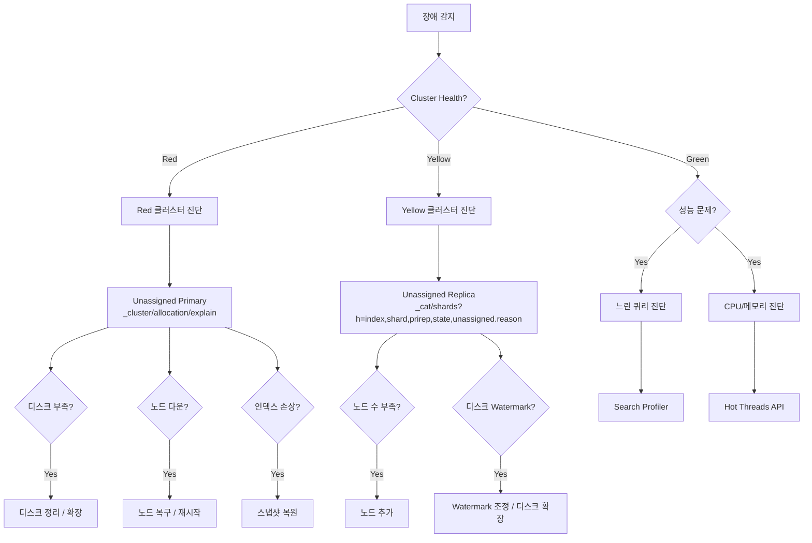
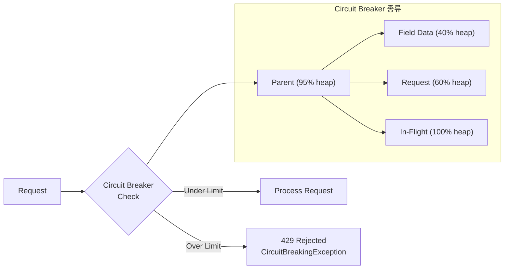

# ELK 트러블슈팅 가이드

Elasticsearch 클러스터 운영 중 발생하는 주요 장애 패턴의 진단 방법과 해결 절차를 다룬다.

## 목차
- [1. 핵심 개념 (What)](#1-핵심-개념-what)
- [2. 왜 알아야 하는가 (Why)](#2-왜-알아야-하는가-why)
- [3. 내부 구현 분석 (How)](#3-내부-구현-분석-how)
- [4. 실전 예제](#4-실전-예제)
- [5. 정리](#5-정리)

---

## 1. 핵심 개념 (What)

Elasticsearch 장애는 크게 4가지 범주로 분류된다.

| 범주 | 대표 증상 | 심각도 |
|------|----------|--------|
| **Cluster Health** | Yellow/Red 상태, Unassigned Shards | 높음 |
| **Performance** | 느린 쿼리, 높은 지연시간, 낮은 처리량 | 중간-높음 |
| **Resource** | OOM, 디스크 부족, CPU 포화 | 높음 |
| **Data** | 데이터 유실, 인덱스 손상, 매핑 충돌 | 치명적 |

### 클러스터 상태 의미

```
Green  → 모든 Primary + Replica Shard 할당 완료
Yellow → 모든 Primary 할당, 일부 Replica 미할당
Red    → 일부 Primary Shard 미할당 (데이터 접근 불가)
```

---

## 2. 왜 알아야 하는가 (Why)

### 장애 대응 시간과 비즈니스 영향

| 장애 유형 | 미대응 시 영향 | 평균 복구 시간 |
|-----------|-------------|-------------|
| Red 클러스터 | 데이터 유실, 서비스 중단 | 30분 ~ 수시간 |
| Unassigned Shard | 검색 결과 누락 | 10분 ~ 1시간 |
| OOM Crash | 노드 반복 재시작 | 15분 ~ 1시간 |
| 디스크 풀 | 인덱싱 차단, 읽기 전용 전환 | 즉시 ~ 30분 |
| 느린 쿼리 | 사용자 경험 저하 | 수분 ~ 수시간 |

체계적인 트러블슈팅 절차를 갖추면 MTTR(Mean Time To Recovery)을 크게 줄일 수 있다.

---

## 3. 내부 구현 분석 (How)

### 장애 진단 흐름



### Circuit Breaker 동작 원리



Circuit Breaker는 메모리 사용량이 임계값을 초과하기 전에 요청을 거부하여 OOM을 예방한다.

---

## 4. 실전 예제

### 4.1 클러스터 상태 진단 기본 명령어

```bash
# 1. 클러스터 전체 상태
curl -s "localhost:9200/_cluster/health?pretty"

# 2. 노드별 상태
curl -s "localhost:9200/_cat/nodes?v&h=name,heap.percent,ram.percent,cpu,load_1m,disk.used_percent,node.role,master"

# 3. 인덱스별 상태
curl -s "localhost:9200/_cat/indices?v&health=red&s=index"
curl -s "localhost:9200/_cat/indices?v&health=yellow&s=index"

# 4. Shard 상태
curl -s "localhost:9200/_cat/shards?v&h=index,shard,prirep,state,docs,store,node,unassigned.reason&s=state"

# 5. Pending Tasks (클러스터 작업 대기열)
curl -s "localhost:9200/_cluster/pending_tasks?pretty"

# 6. 클러스터 전체 통계
curl -s "localhost:9200/_cluster/stats?pretty" | jq '{
  status: .status,
  nodes: .nodes.count,
  indices: .indices.count,
  total_shards: .indices.shards.total,
  docs: .indices.docs.count,
  store_size: .indices.store.size_in_bytes
}'
```

### 4.2 Unassigned Shard 진단 및 해결

#### 원인 파악

```bash
# Unassigned Shard 목록 확인
curl -s "localhost:9200/_cat/shards?v&h=index,shard,prirep,state,unassigned.reason,unassigned.details&s=state:desc" \
  | grep UNASSIGNED

# 특정 Shard의 할당 실패 원인 상세 분석
curl -s "localhost:9200/_cluster/allocation/explain?pretty" \
  -H "Content-Type: application/json" \
  -d '{
    "index": "logs-2026.03.07",
    "shard": 0,
    "primary": true
  }'
```

#### 주요 Unassigned 원인과 해결법

```bash
# 원인 1: INDEX_CREATED - 노드 부족으로 Replica 할당 불가
# 해결: Replica 수 줄이기 (단일 노드 환경)
curl -X PUT "localhost:9200/logs-*/_settings" \
  -H "Content-Type: application/json" \
  -d '{"index": {"number_of_replicas": 0}}'

# 원인 2: NODE_LEFT - 노드 이탈로 Shard 미할당
# 해결: 노드 복구 후 할당 재시도
curl -X POST "localhost:9200/_cluster/reroute?retry_failed=true"

# 원인 3: ALLOCATION_FAILED - 할당 실패 (5회 이상 재시도 실패)
# 해결: 최대 재시도 횟수 증가 후 재할당
curl -X PUT "localhost:9200/_cluster/settings" \
  -H "Content-Type: application/json" \
  -d '{
    "transient": {
      "cluster.routing.allocation.node_concurrent_recoveries": 4,
      "index.allocation.max_retries": 10
    }
  }'
curl -X POST "localhost:9200/_cluster/reroute?retry_failed=true"

# 원인 4: DISK_THRESHOLD - 디스크 Watermark 초과
# 확인
curl -s "localhost:9200/_cat/allocation?v"

# 해결: Watermark 임시 조정
curl -X PUT "localhost:9200/_cluster/settings" \
  -H "Content-Type: application/json" \
  -d '{
    "transient": {
      "cluster.routing.allocation.disk.watermark.low": "90%",
      "cluster.routing.allocation.disk.watermark.high": "95%",
      "cluster.routing.allocation.disk.watermark.flood_stage": "97%"
    }
  }'
```

#### 강제 Shard 할당 (최후의 수단)

```bash
# 데이터 유실을 감수하고 Primary Shard 강제 할당
# 주의: 빈 Shard로 시작하므로 기존 데이터는 유실됨
curl -X POST "localhost:9200/_cluster/reroute" \
  -H "Content-Type: application/json" \
  -d '{
    "commands": [
      {
        "allocate_empty_primary": {
          "index": "logs-2026.03.07",
          "shard": 0,
          "node": "es-node-01",
          "accept_data_loss": true
        }
      }
    ]
  }'

# Stale Copy에서 복구 (일부 데이터 유실 가능)
curl -X POST "localhost:9200/_cluster/reroute" \
  -H "Content-Type: application/json" \
  -d '{
    "commands": [
      {
        "allocate_stale_primary": {
          "index": "logs-2026.03.07",
          "shard": 0,
          "node": "es-node-01",
          "accept_data_loss": true
        }
      }
    ]
  }'
```

### 4.3 느린 쿼리 진단

#### Slow Log 설정 및 분석

```bash
# Slow Log 활성화
curl -X PUT "localhost:9200/logs-*/_settings" \
  -H "Content-Type: application/json" \
  -d '{
    "index.search.slowlog.threshold.query.warn": "10s",
    "index.search.slowlog.threshold.query.info": "2s",
    "index.search.slowlog.threshold.query.debug": "500ms",
    "index.search.slowlog.threshold.fetch.warn": "1s",
    "index.search.slowlog.threshold.fetch.info": "500ms",
    "index.search.slowlog.level": "info"
  }'

# Slow Log 파일 위치
# /var/log/elasticsearch/<cluster-name>_index_search_slowlog.json
```

#### Search Profiler 사용

```bash
# 쿼리 프로파일링
curl -X GET "localhost:9200/logs-*/_search" \
  -H "Content-Type: application/json" \
  -d '{
    "profile": true,
    "query": {
      "bool": {
        "must": [
          {"match": {"message": "error timeout"}}
        ],
        "filter": [
          {"range": {"@timestamp": {"gte": "now-1h"}}}
        ]
      }
    }
  }' | jq '.profile.shards[0].searches[0].query[0] | {
    type: .type,
    description: .description,
    time_in_nanos: .time_in_nanos,
    breakdown: .breakdown
  }'
```

#### 쿼리 최적화 패턴

```bash
# Bad: wildcard leading (인덱스 전체 스캔)
# {"query": {"wildcard": {"message": {"value": "*error*"}}}}

# Good: match 쿼리 사용
curl -X GET "localhost:9200/logs-*/_search" \
  -H "Content-Type: application/json" \
  -d '{
    "query": {
      "match": {"message": "error"}
    }
  }'

# Bad: 대량 결과 deep pagination
# {"from": 10000, "size": 10}

# Good: search_after 사용
curl -X GET "localhost:9200/logs-*/_search" \
  -H "Content-Type: application/json" \
  -d '{
    "size": 100,
    "sort": [{"@timestamp": "desc"}, {"_id": "asc"}],
    "search_after": ["2026-03-07T10:00:00.000Z", "doc_id_123"],
    "query": {"match_all": {}}
  }'

# Bad: 모든 필드 반환
# {"_source": true}

# Good: 필요한 필드만 반환
curl -X GET "localhost:9200/logs-*/_search" \
  -H "Content-Type: application/json" \
  -d '{
    "query": {"match_all": {}},
    "_source": ["@timestamp", "level", "message"],
    "size": 100
  }'
```

### 4.4 OOM 대응

#### 진단

```bash
# JVM 메모리 상태 확인
curl -s "localhost:9200/_nodes/stats/jvm" | jq '
  .nodes | to_entries[] | {
    name: .value.name,
    heap_used_percent: .value.jvm.mem.heap_used_percent,
    heap_used_mb: (.value.jvm.mem.heap_used_in_bytes / 1048576 | floor),
    heap_max_mb: (.value.jvm.mem.heap_max_in_bytes / 1048576 | floor),
    old_gc_count: .value.jvm.gc.collectors.old.collection_count,
    old_gc_time_s: (.value.jvm.gc.collectors.old.collection_time_in_millis / 1000)
  }'

# Circuit Breaker 트립 확인
curl -s "localhost:9200/_nodes/stats/breaker" | jq '
  .nodes | to_entries[] | {
    name: .value.name,
    breakers: .value.breakers | to_entries[] | {
      name: .key,
      limit_mb: (.value.limit_size_in_bytes / 1048576 | floor),
      estimated_mb: (.value.estimated_size_in_bytes / 1048576 | floor),
      tripped: .value.tripped
    }
  }'

# Field Data 사용량 확인 (OOM의 흔한 원인)
curl -s "localhost:9200/_cat/fielddata?v&s=size:desc"
```

#### 해결

```bash
# 1. Field Data 캐시 클리어
curl -X POST "localhost:9200/_cache/clear?fielddata=true"

# 2. Circuit Breaker 설정 강화
curl -X PUT "localhost:9200/_cluster/settings" \
  -H "Content-Type: application/json" \
  -d '{
    "persistent": {
      "indices.breaker.total.limit": "85%",
      "indices.breaker.fielddata.limit": "30%",
      "indices.breaker.request.limit": "50%"
    }
  }'

# 3. 과도한 Aggregation 방지
curl -X PUT "localhost:9200/_cluster/settings" \
  -H "Content-Type: application/json" \
  -d '{
    "persistent": {
      "search.max_buckets": 10000
    }
  }'

# 4. 텍스트 필드에 fielddata 사용 금지 (keyword 필드 사용)
# Bad: "message" 텍스트 필드로 aggregation
# Good: "message.keyword" 또는 별도 keyword 필드 사용
```

### 4.5 디스크 부족 대응

```bash
# 디스크 사용량 확인
curl -s "localhost:9200/_cat/allocation?v&s=disk.percent:desc"

# 인덱스별 디스크 사용량
curl -s "localhost:9200/_cat/indices?v&h=index,store.size,pri.store.size&s=store.size:desc" | head -20

# 읽기 전용으로 전환된 인덱스 확인
curl -s "localhost:9200/_all/_settings" | jq '
  to_entries[] | select(.value.settings.index.blocks.read_only_allow_delete == "true") | .key'

# 읽기 전용 해제 (디스크 확보 후)
curl -X PUT "localhost:9200/_all/_settings" \
  -H "Content-Type: application/json" \
  -d '{"index.blocks.read_only_allow_delete": null}'

# 오래된 인덱스 삭제
curl -X DELETE "localhost:9200/logs-2025.12.*"

# Shrink로 Shard 수 줄이기 (디스크 절약)
# 1. 인덱스를 한 노드로 이동
curl -X PUT "localhost:9200/logs-2026.01/_settings" \
  -H "Content-Type: application/json" \
  -d '{
    "settings": {
      "index.routing.allocation.require._name": "es-node-01",
      "index.blocks.write": true
    }
  }'

# 2. Shrink 실행
curl -X POST "localhost:9200/logs-2026.01/_shrink/logs-2026.01-shrunk" \
  -H "Content-Type: application/json" \
  -d '{
    "settings": {
      "index.number_of_replicas": 1,
      "index.number_of_shards": 1,
      "index.routing.allocation.require._name": null,
      "index.blocks.write": null
    }
  }'
```

### 4.6 노드 복구 절차

```bash
# 1. 노드 다운 원인 확인 (로그 분석)
tail -100 /var/log/elasticsearch/cluster-name.log
grep -E "ERROR|WARN|OutOfMemory|StackOverflow" /var/log/elasticsearch/cluster-name.log

# 2. 클러스터에서 노드 제외 (계획된 유지보수)
curl -X PUT "localhost:9200/_cluster/settings" \
  -H "Content-Type: application/json" \
  -d '{
    "transient": {
      "cluster.routing.allocation.exclude._name": "es-node-03"
    }
  }'

# 3. Shard 이동 완료 대기
watch 'curl -s "localhost:9200/_cat/shards?v" | grep es-node-03 | wc -l'

# 4. 노드 재시작
systemctl restart elasticsearch

# 5. 제외 설정 해제
curl -X PUT "localhost:9200/_cluster/settings" \
  -H "Content-Type: application/json" \
  -d '{
    "transient": {
      "cluster.routing.allocation.exclude._name": null
    }
  }'

# 6. 복구 속도 향상 설정
curl -X PUT "localhost:9200/_cluster/settings" \
  -H "Content-Type: application/json" \
  -d '{
    "transient": {
      "cluster.routing.allocation.node_concurrent_incoming_recoveries": 4,
      "cluster.routing.allocation.node_concurrent_outgoing_recoveries": 4,
      "indices.recovery.max_bytes_per_sec": "200mb"
    }
  }'
```

### 4.7 Logstash 트러블슈팅

```bash
# 파이프라인 상태 확인
curl -s "localhost:9600/_node/stats/pipelines?pretty" | jq '
  .pipelines | to_entries[] | {
    pipeline: .key,
    events_in: .value.events.in,
    events_out: .value.events.out,
    events_filtered: .value.events.filtered,
    queue_events: .value.queue.events_count
  }'

# Dead Letter Queue 확인
curl -s "localhost:9600/_node/stats/pipelines" | jq '
  .pipelines | to_entries[] | {
    pipeline: .key,
    dlq_events: .value.dead_letter_queue.queue_size_in_bytes
  }'

# 흔한 문제: Logstash -> ES 연결 실패
# 확인사항:
# 1. ES 호스트 접근 가능성
# 2. 인증 정보 정확성
# 3. SSL 인증서 유효성
# 4. Bulk 요청 크기 (429 Too Many Requests)

# Logstash 설정 테스트
/usr/share/logstash/bin/logstash --config.test_and_exit -f /etc/logstash/conf.d/
```

### 4.8 Kibana 트러블슈팅

```bash
# Kibana 상태 확인
curl -s "localhost:5601/api/status" | jq '{
  overall_status: .status.overall.level,
  elasticsearch: .status.statuses[] | select(.id | contains("elasticsearch"))
}'

# 흔한 문제 1: "Kibana server is not ready yet"
# 원인: ES 연결 실패 또는 .kibana 인덱스 문제
# 확인
curl -s "localhost:9200/.kibana*/_count"

# 흔한 문제 2: Saved Objects 마이그레이션 실패
# 해결: 마이그레이션 재시도
curl -X POST "localhost:5601/api/saved_objects/_migrate" \
  -H "kbn-xsrf: true"

# 흔한 문제 3: 메모리 부족
# Node.js 메모리 제한 증가
# kibana.yml
# node.options: ["--max-old-space-size=2048"]
```

### 4.9 종합 헬스체크 스크립트

```bash
#!/bin/bash
# elk-healthcheck.sh
ES_HOST="${1:-localhost:9200}"
RED='\033[0;31m'
YELLOW='\033[1;33m'
GREEN='\033[0;32m'
NC='\033[0m'

echo "=== ELK Health Check ==="
echo "Target: $ES_HOST"
echo ""

# 1. Cluster Health
HEALTH=$(curl -s "$ES_HOST/_cluster/health")
STATUS=$(echo $HEALTH | jq -r '.status')
case $STATUS in
  green)  echo -e "Cluster Status: ${GREEN}$STATUS${NC}" ;;
  yellow) echo -e "Cluster Status: ${YELLOW}$STATUS${NC}" ;;
  red)    echo -e "Cluster Status: ${RED}$STATUS${NC}" ;;
esac

echo "  Nodes: $(echo $HEALTH | jq '.number_of_nodes')"
echo "  Active Shards: $(echo $HEALTH | jq '.active_shards')"
echo "  Unassigned: $(echo $HEALTH | jq '.unassigned_shards')"
echo "  Pending Tasks: $(echo $HEALTH | jq '.number_of_pending_tasks')"
echo ""

# 2. Node Status
echo "=== Node Status ==="
curl -s "$ES_HOST/_cat/nodes?v&h=name,heap.percent,ram.percent,cpu,load_1m,disk.used_percent,node.role"
echo ""

# 3. Red/Yellow Indices
echo "=== Problem Indices ==="
PROBLEM=$(curl -s "$ES_HOST/_cat/indices?v&health=red,yellow&s=health" 2>/dev/null)
if [ -z "$PROBLEM" ]; then
  echo -e "${GREEN}No problem indices found${NC}"
else
  echo "$PROBLEM"
fi
echo ""

# 4. Disk Watermark Check
echo "=== Disk Usage ==="
curl -s "$ES_HOST/_cat/allocation?v&s=disk.percent:desc"
echo ""

# 5. JVM Pressure
echo "=== JVM Heap Pressure ==="
curl -s "$ES_HOST/_nodes/stats/jvm" | jq -r '
  .nodes | to_entries[] |
  "\(.value.name): \(.value.jvm.mem.heap_used_percent)% heap used"'
echo ""

# 6. Circuit Breaker Trips
echo "=== Circuit Breaker Status ==="
curl -s "$ES_HOST/_nodes/stats/breaker" | jq -r '
  .nodes | to_entries[] |
  .value as $node |
  .value.breakers | to_entries[] |
  select(.value.tripped > 0) |
  "\($node.name) - \(.key): tripped \(.value.tripped) times"'
echo ""

echo "=== Health Check Complete ==="
```

---

## 5. 정리

| 장애 유형 | 진단 명령어 | 핵심 해결 방법 | 예방 조치 |
|-----------|-----------|-------------|----------|
| **Red 클러스터** | `_cluster/allocation/explain` | 노드 복구 / Shard 재할당 | 3+ Master 노드, Snapshot |
| **Unassigned Shard** | `_cat/shards?h=state,unassigned.reason` | `_cluster/reroute?retry_failed` | 적정 Shard 수 유지 |
| **느린 쿼리** | Slow Log + `profile: true` | Filter Context, search_after | Slow Log 상시 활성화 |
| **OOM** | `_nodes/stats/jvm` + GC 로그 | Circuit Breaker 조정, Heap 최적화 | Heap 31GB 이하, 모니터링 |
| **디스크 부족** | `_cat/allocation` | 인덱스 삭제/Shrink, ILM | Watermark 모니터링, ILM 정책 |
| **노드 다운** | ES 로그 + `_cat/nodes` | 원인 분석 후 재시작, exclude 활용 | 정기 점검, 리소스 여유 확보 |
| **Circuit Breaker** | `_nodes/stats/breaker` | 제한값 조정, 쿼리 최적화 | fielddata 미사용, 적정 bucket 수 |
| **Logstash 장애** | `:9600/_node/stats` | 파이프라인 설정 점검, DLQ 확인 | 설정 테스트, 모니터링 |

---

*마지막 업데이트: 2026년 03월*
