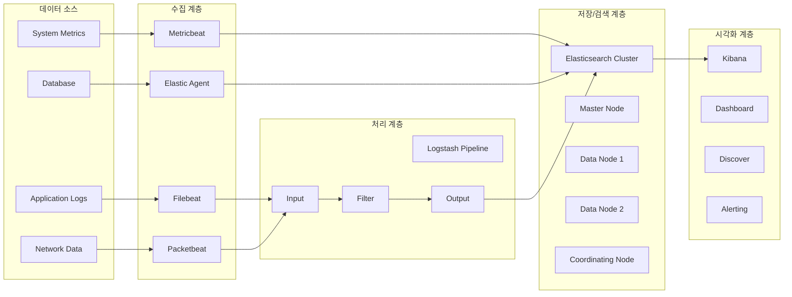
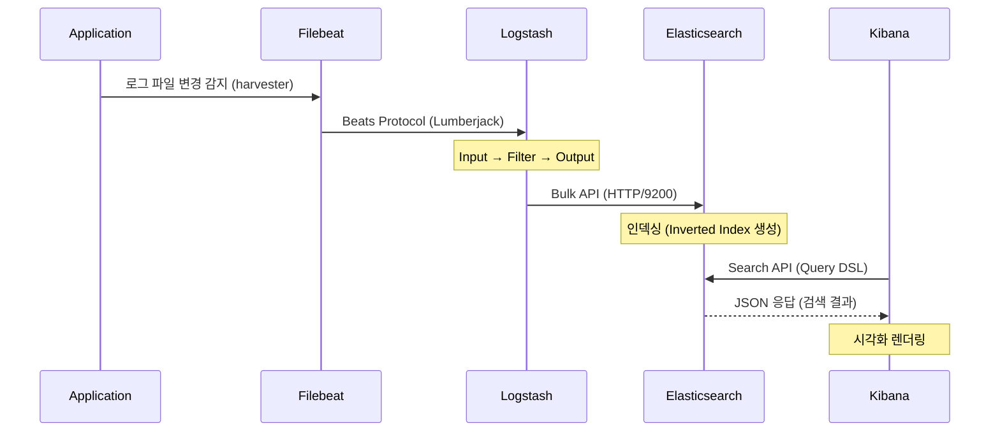
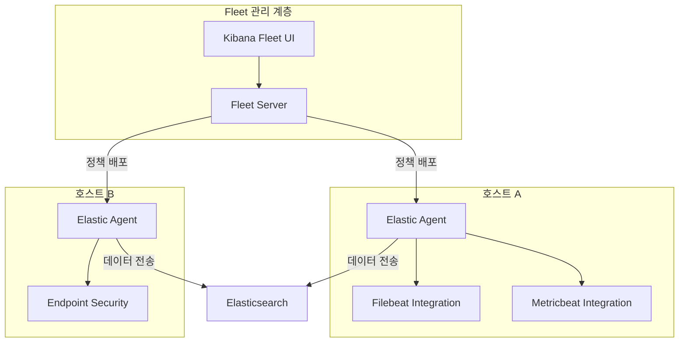

# ELK 스택 개요 및 아키텍처

ELK 스택은 Elasticsearch, Logstash, Kibana 세 가지 오픈소스 프로젝트의 조합으로, 로그 및 데이터의 수집, 저장, 분석, 시각화를 위한 통합 플랫폼이다. 현재는 Beats와 Elastic Agent를 포함하여 Elastic Stack으로 불린다.

## 목차
- [1. 핵심 개념 (What)](#1-핵심-개념-what)
- [2. 왜 알아야 하는가 (Why)](#2-왜-알아야-하는가-why)
- [3. 내부 구현 분석 (How)](#3-내부-구현-분석-how)
- [4. 실전 예제](#4-실전-예제)
- [5. 정리](#5-정리)

---

## 1. 핵심 개념 (What)

### 1.1 Elastic Stack 구성요소

**Elasticsearch** — 분산 검색 및 분석 엔진. Apache Lucene 기반으로 구축되었으며, RESTful API를 통해 JSON 문서의 인덱싱, 검색, 분석을 수행한다. 소스코드에서 `Node` 클래스(`org.elasticsearch.node.Node`)가 Elasticsearch 프로세스의 진입점으로, 클러스터 내 하나의 노드를 나타낸다.

**Logstash** — 서버사이드 데이터 처리 파이프라인. 다양한 소스에서 데이터를 수집(Input), 변환(Filter), 전송(Output)하는 ETL 역할을 수행한다. Ruby와 Java로 작성되어 있으며, 플러그인 아키텍처로 확장성이 높다.

**Kibana** — 데이터 시각화 및 탐색 플랫폼. Elasticsearch에 저장된 데이터를 차트, 대시보드, 맵 등으로 시각화한다. Node.js 기반이며, Elastic Stack의 관리 UI 역할도 겸한다.

**Beats** — 경량 데이터 수집기(shipper). Go로 작성되었으며, 단일 목적의 에이전트로 설계되었다:
- **Filebeat**: 로그 파일 수집
- **Metricbeat**: 시스템/서비스 메트릭 수집
- **Packetbeat**: 네트워크 패킷 분석
- **Heartbeat**: 업타임 모니터링
- **Auditbeat**: 감사 데이터 수집

**Elastic Agent** — Beats를 통합 관리하는 단일 에이전트. Fleet 서버를 통해 중앙에서 정책 기반으로 관리되며, Beats의 기능을 하나의 바이너리로 통합한다.

### 1.2 각 구성요소의 역할과 책임

| 구성요소 | 역할 | 포트(기본) | 언어 |
|---------|------|-----------|------|
| Elasticsearch | 저장/검색/분석 엔진 | 9200 (HTTP), 9300 (Transport) | Java |
| Logstash | 데이터 처리 파이프라인 | 5044 (Beats input) | Java/Ruby |
| Kibana | 시각화/관리 UI | 5601 | Node.js |
| Beats | 경량 데이터 수집기 | - | Go |
| Elastic Agent | 통합 에이전트 | - | Go |

## 2. 왜 알아야 하는가 (Why)

### 2.1 현대 인프라의 관찰 가능성(Observability) 요구

마이크로서비스 아키텍처의 확산으로 인해 분산 시스템에서 발생하는 로그, 메트릭, 트레이스를 통합적으로 수집하고 분석하는 능력이 필수가 되었다. ELK 스택은 이 세 가지 관찰 가능성 축(Three Pillars of Observability)을 모두 지원한다.

### 2.2 실무에서의 활용 시나리오

- **로그 중앙화**: 수백 대의 서버에서 발생하는 로그를 단일 플랫폼에서 검색/분석
- **보안 분석(SIEM)**: Elastic Security를 통한 위협 탐지 및 사고 대응
- **APM(Application Performance Monitoring)**: 애플리케이션 성능 병목 식별
- **비즈니스 분석**: 실시간 데이터 기반 대시보드 구축
- **인프라 모니터링**: 시스템 리소스 사용량 추적 및 알림

### 2.3 대안 대비 장점

| 항목 | ELK Stack | Splunk | Grafana/Loki |
|------|-----------|--------|--------------|
| 비용 | 오픈소스 (Basic 무료) | 상용 (데이터 볼륨 과금) | 오픈소스 |
| 전문 검색 | Lucene 기반 강력한 Full-text | 자체 엔진 | 라벨 기반 (제한적) |
| 확장성 | 수평 확장 용이 | 수평 확장 가능 | 수평 확장 가능 |
| 에코시스템 | Beats, APM, SIEM 통합 | 풍부한 앱 생태계 | Prometheus 연동 강점 |

## 3. 내부 구현 분석 (How)

### 3.1 전체 데이터 흐름 아키텍처



### 3.2 Node 클래스 구조 — Elasticsearch의 진입점

Elasticsearch의 `Node` 클래스(`org.elasticsearch.node.Node`)는 하나의 ES 프로세스를 대표한다. `NodeConstruction`을 통해 초기화되며 다음 핵심 컴포넌트들을 관리한다:

```java
// org.elasticsearch.node.Node (핵심 필드)
public class Node implements Closeable {
    private final Injector injector;
    private final Environment environment;
    private final NodeEnvironment nodeEnvironment;
    private final PluginsService pluginsService;
    private final NodeClient client;
    private final Collection<LifecycleComponent> pluginLifecycleComponents;
    private final NodeService nodeService;

    // 생성자: NodeConstruction으로부터 모든 의존성 주입
    Node(NodeConstruction construction) {
        injector = construction.injector();
        environment = construction.environment();
        nodeEnvironment = construction.nodeEnvironment();
        pluginsService = construction.pluginsService();
        client = construction.client();
        // ...
    }
}
```

### 3.3 데이터 흐름 상세



### 3.4 Beats에서 Elasticsearch까지의 직접 경로

Beats는 Logstash를 경유하지 않고 Elasticsearch에 직접 데이터를 전송할 수도 있다. 이 경우 Elasticsearch의 Ingest Pipeline이 Logstash의 Filter 역할을 대체한다:


### 3.5 Elastic Agent와 Fleet 아키텍처



## 4. 실전 예제

### 4.1 Docker Compose로 ELK 스택 구성

```yaml
# docker-compose.yml
version: '3.8'

services:
  elasticsearch:
    image: docker.elastic.co/elasticsearch/elasticsearch:8.17.0
    container_name: elasticsearch
    environment:
      - discovery.type=single-node
      - xpack.security.enabled=false
      - "ES_JAVA_OPTS=-Xms1g -Xmx1g"
    ports:
      - "9200:9200"
      - "9300:9300"
    volumes:
      - es-data:/usr/share/elasticsearch/data
    networks:
      - elk

  logstash:
    image: docker.elastic.co/logstash/logstash:8.17.0
    container_name: logstash
    volumes:
      - ./logstash/pipeline:/usr/share/logstash/pipeline
    ports:
      - "5044:5044"
      - "9600:9600"
    environment:
      - "LS_JAVA_OPTS=-Xms512m -Xmx512m"
    depends_on:
      - elasticsearch
    networks:
      - elk

  kibana:
    image: docker.elastic.co/kibana/kibana:8.17.0
    container_name: kibana
    ports:
      - "5601:5601"
    environment:
      - ELASTICSEARCH_HOSTS=http://elasticsearch:9200
    depends_on:
      - elasticsearch
    networks:
      - elk

  filebeat:
    image: docker.elastic.co/beats/filebeat:8.17.0
    container_name: filebeat
    user: root
    volumes:
      - ./filebeat/filebeat.yml:/usr/share/filebeat/filebeat.yml:ro
      - /var/log:/var/log:ro
    depends_on:
      - logstash
    networks:
      - elk

volumes:
  es-data:

networks:
  elk:
    driver: bridge
```

### 4.2 Logstash 파이프라인 설정

```ruby
# logstash/pipeline/logstash.conf
input {
  beats {
    port => 5044
  }
}

filter {
  if [fileset][module] == "nginx" {
    grok {
      match => {
        "message" => '%{IPORHOST:client_ip} - %{DATA:user_name} \[%{HTTPDATE:access_time}\] "%{WORD:http_method} %{DATA:url} HTTP/%{NUMBER:http_version}" %{NUMBER:response_code} %{NUMBER:body_sent_bytes}'
      }
    }
    date {
      match => [ "access_time", "dd/MMM/yyyy:HH:mm:ss Z" ]
      target => "@timestamp"
    }
    geoip {
      source => "client_ip"
    }
  }
}

output {
  elasticsearch {
    hosts => ["http://elasticsearch:9200"]
    index => "logs-%{+YYYY.MM.dd}"
  }
}
```

### 4.3 Filebeat 설정

```yaml
# filebeat/filebeat.yml
filebeat.inputs:
  - type: log
    enabled: true
    paths:
      - /var/log/nginx/access.log
    fields:
      fileset:
        module: nginx

output.logstash:
  hosts: ["logstash:5044"]

# 또는 Elasticsearch 직접 전송
# output.elasticsearch:
#   hosts: ["http://elasticsearch:9200"]
#   pipeline: "nginx-pipeline"
```

### 4.4 Elasticsearch 클러스터 상태 확인

```bash
# 클러스터 건강 상태
curl -X GET "localhost:9200/_cluster/health?pretty"

# 노드 정보 확인
curl -X GET "localhost:9200/_cat/nodes?v"

# 인덱스 목록
curl -X GET "localhost:9200/_cat/indices?v"

# 간단한 검색 테스트
curl -X GET "localhost:9200/logs-*/_search?pretty" -H 'Content-Type: application/json' -d'
{
  "query": {
    "match": {
      "message": "error"
    }
  },
  "size": 5
}'
```

## 5. 정리

| 구성요소 | 역할 | 핵심 특징 |
|---------|------|----------|
| Elasticsearch | 분산 검색/분석 엔진 | Lucene 기반, RESTful API, 수평 확장, `Node` 클래스가 진입점 |
| Logstash | 데이터 처리 파이프라인 | Input-Filter-Output 구조, 200+ 플러그인, JRuby 기반 |
| Kibana | 시각화/관리 UI | 대시보드, Discover, Lens, Fleet 관리, Node.js 기반 |
| Beats | 경량 데이터 수집기 | Go 기반 단일 목적 에이전트, 리소스 효율적 |
| Elastic Agent | 통합 에이전트 | Fleet으로 중앙 관리, Beats 기능 통합 |
| Ingest Node | ES 내장 전처리 | Logstash 없이 간단한 변환 처리 가능 |

**아키텍처 선택 가이드**:
- **단순한 로그 수집**: Filebeat → Elasticsearch (Ingest Pipeline)
- **복잡한 변환이 필요한 경우**: Beats → Logstash → Elasticsearch
- **대규모 엔터프라이즈**: Elastic Agent (Fleet) → Elasticsearch
- **시각화/분석**: 모든 경로에서 Kibana 사용

---
*마지막 업데이트: 2026년 03월*
