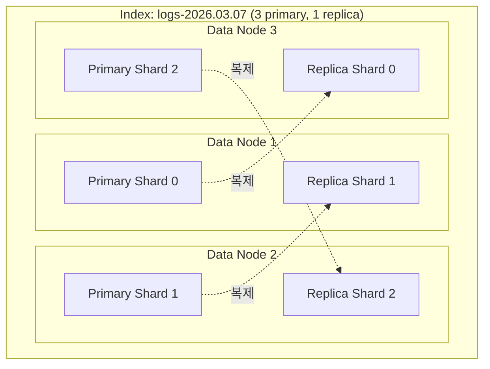
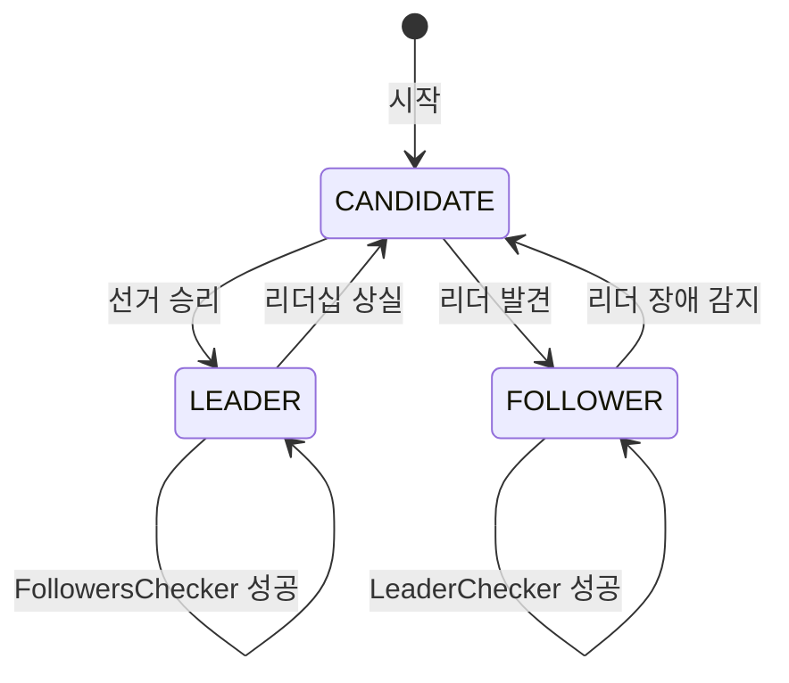
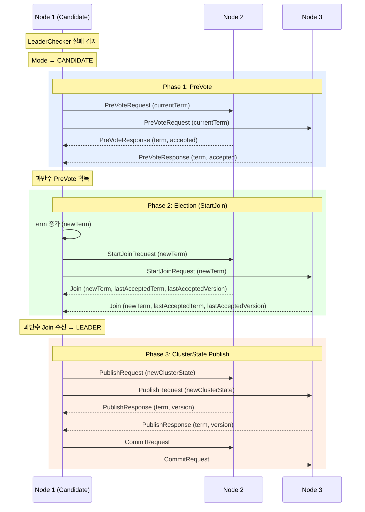
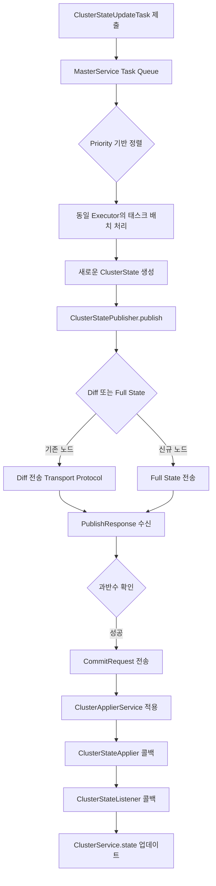
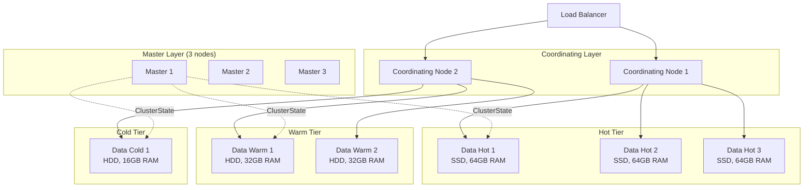

# Elasticsearch 클러스터 아키텍처

Elasticsearch 클러스터는 여러 노드가 협력하여 데이터를 분산 저장하고 검색하는 시스템이다. 각 노드는 역할(Master, Data, Coordinating, Ingest)에 따라 다른 책임을 수행하며, Coordinator 클래스가 클러스터 합의와 마스터 선출을 관리한다.

## 목차
- [1. 핵심 개념 (What)](#1-핵심-개념-what)
- [2. 왜 알아야 하는가 (Why)](#2-왜-알아야-하는가-why)
- [3. 내부 구현 분석 (How)](#3-내부-구현-분석-how)
- [4. 실전 예제](#4-실전-예제)
- [5. 정리](#5-정리)

---

## 1. 핵심 개념 (What)

### 1.1 클러스터와 노드

**클러스터(Cluster)** 는 동일한 `cluster.name`을 공유하는 하나 이상의 노드 그룹이다. 소스코드에서 `Node` 클래스(`org.elasticsearch.node.Node`)의 Javadoc이 이를 명확히 한다:

> *"A node represent a node within a cluster (cluster.name). The client() can be used in order to use a Client to perform actions/operations against the cluster."*

**노드(Node)** 는 클러스터의 단일 인스턴스(JVM 프로세스)이다. 각 노드는 고유한 이름(`node.name`)과 UUID를 갖는다.

### 1.2 노드 역할 (Node Roles)

| 역할 | 설정 값 | 책임 |
|------|---------|------|
| **Master-eligible** | `master` | 클러스터 상태 관리, 인덱스 생성/삭제, 샤드 할당 결정 |
| **Data** | `data` | 데이터 저장, CRUD, 검색, 집계 수행 |
| **Data (hot/warm/cold/frozen)** | `data_hot`, `data_warm`, `data_cold`, `data_frozen` | ILM 티어별 데이터 저장 |
| **Ingest** | `ingest` | Ingest Pipeline 실행 (문서 전처리) |
| **Coordinating** | (전용 설정 없음) | 요청 라우팅, 결과 병합, 모든 노드가 기본 수행 |
| **ML** | `ml` | Machine Learning 작업 수행 |
| **Remote Cluster Client** | `remote_cluster_client` | Cross-cluster search 지원 |
| **Transform** | `transform` | Transform 작업 실행 |

### 1.3 ClusterState — 클러스터의 진실의 원천

`ClusterState`(`org.elasticsearch.cluster.ClusterState`)는 클러스터의 전체 상태를 나타내는 불변(immutable) 객체다. 소스코드 Javadoc에서:

> *"Represents the state of the cluster, held in memory on all nodes in the cluster with updates coordinated by the elected master."*

ClusterState가 포함하는 정보:
- **Metadata**: 인덱스 설정, 매핑, 템플릿 (디스크에 persist)
- **RoutingTable**: 샤드 할당 정보
- **DiscoveryNodes**: 클러스터 멤버 목록
- **ClusterBlocks**: 인덱스/클러스터 레벨 블록
- **CompatibilityVersions**: 노드 간 호환성 버전

### 1.4 샤드와 레플리카



## 2. 왜 알아야 하는가 (Why)

### 2.1 운영 안정성

클러스터 아키텍처를 이해하지 못하면:
- **Split Brain**: 마스터 노드 설정 오류로 데이터 불일치 발생
- **샤드 편향**: 데이터 노드 간 불균형한 샤드 분배로 핫스팟 발생
- **용량 계획 실패**: 노드 역할을 분리하지 않아 마스터가 과부하

### 2.2 성능 최적화

- 노드 역할 분리로 리소스 격리 (Master는 힙 적게, Data는 힙 많이)
- 샤드 수 최적화 (인덱스당 20-40GB 권장)
- Coordinating Only 노드로 검색 부하 분산

### 2.3 장애 대응

마스터 선출 과정, 샤드 재할당 메커니즘, ClusterState 전파 방식을 이해해야 장애 시 빠른 대응이 가능하다.

## 3. 내부 구현 분석 (How)

### 3.1 Coordinator — 클러스터 합의 엔진

`Coordinator` 클래스(`org.elasticsearch.cluster.coordination.Coordinator`)는 클러스터 합의(consensus)를 담당하는 핵심 컴포넌트다. Raft에서 영감을 받은 합의 알고리즘을 구현한다.

```java
// org.elasticsearch.cluster.coordination.Coordinator
public class Coordinator extends AbstractLifecycleComponent
    implements ClusterStatePublisher {

    private final TransportService transportService;
    private final MasterService masterService;
    private final AllocationService allocationService;
    private final JoinHelper joinHelper;
    private final ElectionStrategy electionStrategy;
    private final PeerFinder peerFinder;
    private final PreVoteCollector preVoteCollector;
    private final LeaderChecker leaderChecker;
    private final FollowersChecker followersChecker;
    private final Reconfigurator reconfigurator;
    private final ClusterBootstrapService clusterBootstrapService;

    private Mode mode;  // CANDIDATE, LEADER, FOLLOWER
    private Optional<DiscoveryNode> lastKnownLeader;
    private Optional<Join> lastJoin;
}
```

Coordinator의 세 가지 모드:



### 3.2 마스터 선출 과정

Elasticsearch의 마스터 선출은 PreVote → Election → Publish 세 단계로 진행된다:



### 3.3 ClusterState 업데이트 흐름

소스코드의 `ClusterState` Javadoc에서 업데이트 메커니즘을 상세히 설명한다:

> *"Updates are triggered by submitting tasks to the MasterService on the elected master... Tasks that share the same ClusterStateTaskExecutor instance are processed as a batch. Each batch of tasks yields a new ClusterState which is published to the cluster by ClusterStatePublisher.publish."*



### 3.4 노드 간 통신 — Transport Layer

Elasticsearch 노드 간 통신은 Transport Layer를 통해 이루어진다:

- **HTTP Layer (9200)**: 외부 클라이언트 → Elasticsearch REST API
- **Transport Layer (9300)**: 노드 간 내부 통신 (바이너리 프로토콜)

```java
// Coordinator에서 Transport 사용 예
public static final String COMMIT_STATE_ACTION_NAME =
    "internal:cluster/coordination/commit_state";

// PublicationTransportHandler를 통해 ClusterState diff 전파
private final PublicationTransportHandler publicationHandler;
```

### 3.5 클러스터 안정성 보장 메커니즘

**LeaderChecker**: Follower 노드가 주기적으로 Leader에 핑을 보내 생존 확인. 실패 시 재선거 트리거.

**FollowersChecker**: Leader가 모든 Follower에 주기적으로 핑을 보내 멤버십 확인. 응답 없는 노드는 클러스터에서 제거.

**LagDetector**: Follower의 ClusterState 적용 지연을 감지하여 지연이 심한 노드를 감지.

```java
// Coordinator 내부 핵심 컴포넌트
private final LeaderChecker leaderChecker;        // Follower → Leader 핑
private final FollowersChecker followersChecker;  // Leader → Follower 핑
private final LagDetector lagDetector;            // 지연 노드 감지
private final PeerFinder peerFinder;              // 피어 탐색
```

### 3.6 Voting Configuration과 Quorum

`CoordinationMetadata.VotingConfiguration`은 마스터 선출에 투표할 수 있는 노드 집합을 정의한다:

```java
// ClusterState.java 내 VotingConfiguration 관련
import org.elasticsearch.cluster.coordination.CoordinationMetadata.VotingConfiguration;
import org.elasticsearch.cluster.coordination.CoordinationMetadata.VotingConfigExclusion;
```

Quorum은 `(투표 구성 노드 수 / 2) + 1`이다. 3노드 클러스터에서는 2개의 동의가 필요하다.

## 4. 실전 예제

### 4.1 프로덕션 클러스터 노드 설정

**Master-eligible 노드 (전용):**
```yaml
# elasticsearch.yml - Master Node
cluster.name: production-cluster
node.name: master-1
node.roles: [ master ]

# 마스터 노드는 적은 힙으로 충분
# JVM Heap: -Xms2g -Xmx2g

network.host: 10.0.1.1
discovery.seed_hosts: ["10.0.1.1", "10.0.1.2", "10.0.1.3"]
cluster.initial_master_nodes: ["master-1", "master-2", "master-3"]
```

**Data 노드 (hot tier):**
```yaml
# elasticsearch.yml - Data Hot Node
cluster.name: production-cluster
node.name: data-hot-1
node.roles: [ data_hot, ingest ]

# 데이터 노드는 충분한 힙 필요
# JVM Heap: -Xms16g -Xmx16g (전체 메모리의 50%, 최대 31GB)

network.host: 10.0.2.1
discovery.seed_hosts: ["10.0.1.1", "10.0.1.2", "10.0.1.3"]

path.data: /data/elasticsearch
```

**Coordinating Only 노드:**
```yaml
# elasticsearch.yml - Coordinating Node
cluster.name: production-cluster
node.name: coord-1
node.roles: []  # 빈 배열 = Coordinating Only

network.host: 10.0.3.1
discovery.seed_hosts: ["10.0.1.1", "10.0.1.2", "10.0.1.3"]
```

### 4.2 프로덕션 클러스터 아키텍처



### 4.3 클러스터 운영 명령어

```bash
# 클러스터 건강 상태 확인
curl -X GET "localhost:9200/_cluster/health?pretty"
# green: 모든 샤드 할당 완료
# yellow: 레플리카 미할당 (데이터 손실 위험 없음)
# red: 프라이머리 미할당 (데이터 손실 가능)

# 노드별 역할 확인
curl -X GET "localhost:9200/_cat/nodes?v&h=name,node.role,heap.percent,ram.percent,cpu"

# 샤드 할당 상태 확인
curl -X GET "localhost:9200/_cat/shards?v&s=index"

# 미할당 샤드 원인 분석
curl -X GET "localhost:9200/_cluster/allocation/explain?pretty"

# Voting Configuration 확인
curl -X GET "localhost:9200/_cluster/state/metadata?pretty&filter_path=metadata.cluster_coordination"

# 클러스터 설정 동적 변경
curl -X PUT "localhost:9200/_cluster/settings" -H 'Content-Type: application/json' -d'
{
  "persistent": {
    "cluster.routing.allocation.awareness.attributes": "zone",
    "cluster.routing.allocation.awareness.force.zone.values": "zone-a,zone-b"
  }
}'
```

### 4.4 Shard Allocation Awareness 설정

```yaml
# elasticsearch.yml - Zone Awareness
node.attr.zone: zone-a

cluster.routing.allocation.awareness.attributes: zone
cluster.routing.allocation.awareness.force.zone.values: zone-a,zone-b
```

## 5. 정리

| 개념 | 설명 | 소스코드 참조 |
|------|------|-------------|
| Node | 클러스터의 단일 JVM 프로세스 | `Node.java` — `NodeConstruction`으로 초기화 |
| ClusterState | 클러스터 전체 상태 (불변 객체) | `ClusterState.java` — Metadata, RoutingTable, DiscoveryNodes 포함 |
| Coordinator | 합의 엔진 (Raft-inspired) | `Coordinator.java` — CANDIDATE/LEADER/FOLLOWER 모드 |
| Master 선출 | PreVote → StartJoin → Publish 3단계 | `PreVoteCollector`, `JoinHelper`, `PublicationTransportHandler` |
| ClusterState 전파 | Diff 기반 증분 전송, 과반수 커밋 | `ClusterStatePublisher.publish()` |
| LeaderChecker | Follower→Leader 핑으로 생존 확인 | `LeaderChecker` |
| FollowersChecker | Leader→Follower 핑으로 멤버십 확인 | `FollowersChecker` |
| VotingConfiguration | 마스터 선출 투표 자격 노드 집합 | `CoordinationMetadata.VotingConfiguration` |

**클러스터 설계 권장사항**:
- Master-eligible 노드는 반드시 3개 이상 (홀수)으로 분리 운영
- Data 노드와 Master 노드의 역할을 물리적으로 분리
- Hot/Warm/Cold 티어 아키텍처로 비용 최적화
- Coordinating Only 노드로 검색 트래픽 분산
- Zone/Rack Awareness로 고가용성 확보

---
*마지막 업데이트: 2026년 03월*
