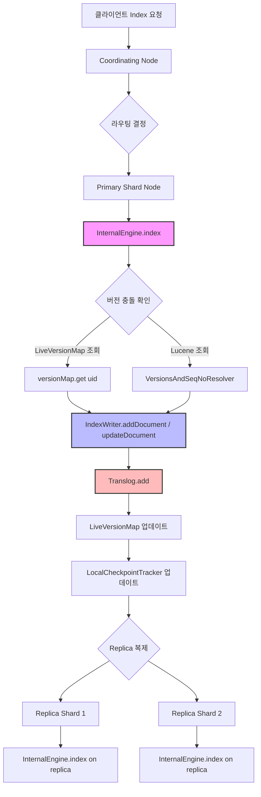
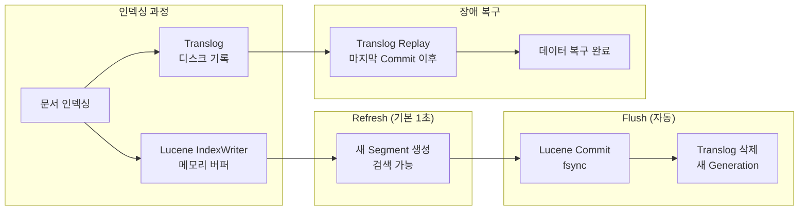
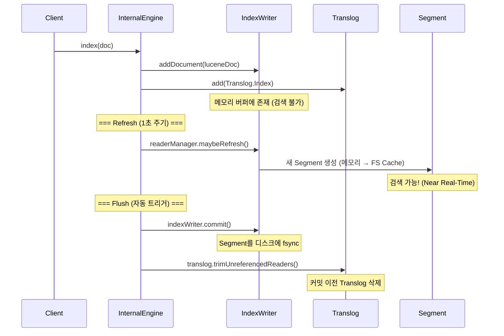
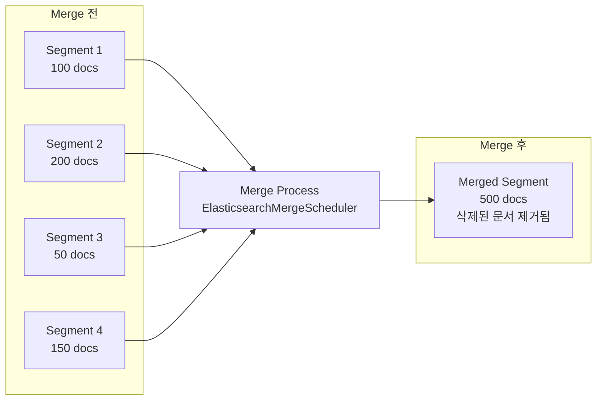
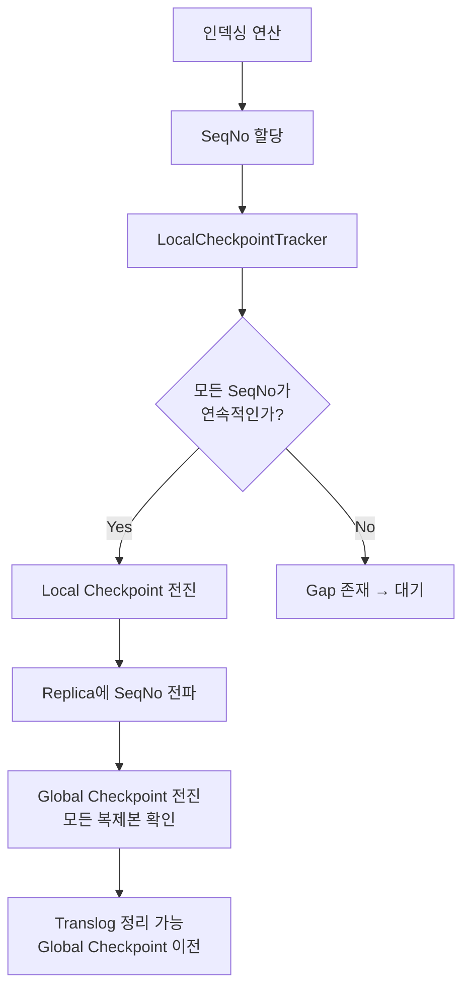

# Elasticsearch 인덱싱 내부 구현

Elasticsearch의 인덱싱 과정은 InternalEngine이 Lucene IndexWriter를 래핑하여 문서를 기록하고, Translog로 내구성을 보장하며, Refresh/Flush 사이클을 통해 검색 가능한 상태로 만드는 과정이다. 이 문서에서는 문서가 인덱싱 요청부터 검색 가능해지기까지의 전체 경로를 소스코드 레벨에서 분석한다.

## 목차
- [1. 핵심 개념 (What)](#1-핵심-개념-what)
- [2. 왜 알아야 하는가 (Why)](#2-왜-알아야-하는가-why)
- [3. 내부 구현 분석 (How)](#3-내부-구현-분석-how)
- [4. 실전 예제](#4-실전-예제)
- [5. 정리](#5-정리)

---

## 1. 핵심 개념 (What)

### 1.1 인덱싱의 정의

Elasticsearch에서 인덱싱이란 JSON 문서를 Lucene의 Inverted Index 구조로 변환하여 저장하는 과정이다. 단일 인덱싱 요청이 처리되는 과정에서 다음 핵심 컴포넌트들이 관여한다:

- **InternalEngine**: Lucene IndexWriter를 래핑하는 엔진 계층
- **Translog**: Write-Ahead Log로 내구성 보장
- **LiveVersionMap**: 실시간 문서 버전 추적 (Real-Time Get 지원)
- **Refresh**: 메모리 버퍼 → 검색 가능한 Segment 생성
- **Flush**: Translog를 디스크에 커밋하고 정리
- **Segment Merge**: 작은 세그먼트를 큰 세그먼트로 병합

### 1.2 Inverted Index 구조

```
문서 1: "the quick brown fox"
문서 2: "the quick blue fox jumped"
문서 3: "brown fox runs quickly"

Inverted Index:
Term      | Doc IDs   | Positions
----------|-----------|----------
blue      | [2]       | [2]
brown     | [1, 3]    | [2, 0]
fox       | [1, 2, 3] | [3, 3, 1]
jumped    | [2]       | [4]
quick     | [1, 2]    | [1, 1]
quickly   | [3]       | [2]
runs      | [3]       | [1]  (존재하지 않음: Analyzer에 의해 변환)
the       | [1, 2]    | [0, 0]
```

### 1.3 Segment의 개념

Lucene Segment는 불변(immutable)한 인덱스 단위이다. 한번 작성되면 변경되지 않으며, 삭제된 문서는 별도의 삭제 비트맵(`.del` 파일)으로 마킹된다. 이러한 불변성이 검색 성능과 동시성의 핵심이다.

## 2. 왜 알아야 하는가 (Why)

### 2.1 성능 튜닝의 기초

- **Refresh Interval 조정**: 기본 1초 → 높은 인덱싱 처리량이 필요하면 30초 또는 `-1`로 설정
- **Translog 설정**: `sync_interval`과 `durability`에 따라 데이터 안정성과 성능 트레이드오프
- **Segment Merge 정책**: `max_merge_at_once`, `segments_per_tier` 등으로 I/O 부하 조절

### 2.2 장애 복구 이해

Translog가 어떻게 데이터 내구성을 보장하는지 이해해야 노드 장애 시 복구 과정을 파악할 수 있다. Elasticsearch는 노드 재시작 시 마지막 Lucene Commit 이후의 Translog를 재생(replay)하여 데이터를 복구한다.

### 2.3 인덱싱 병목 진단

문서 인덱싱이 느릴 때 병목 지점을 파악하려면:
- LiveVersionMap 메모리 사용량 → 버전 충돌 빈도
- Translog 크기 → Flush 주기 적절성
- Merge 스레드 스로틀링 → I/O 병목

## 3. 내부 구현 분석 (How)

### 3.1 InternalEngine — 핵심 엔진 클래스

`InternalEngine`(`org.elasticsearch.index.engine.InternalEngine`)은 Elasticsearch의 핵심 인덱싱 엔진이다:

```java
// org.elasticsearch.index.engine.InternalEngine (핵심 필드)
public class InternalEngine extends Engine {

    private final Translog translog;
    private final ElasticsearchMergeScheduler mergeScheduler;
    private final IndexWriter indexWriter;

    private final ExternalReaderManager externalReaderManager;
    private final ElasticsearchReaderManager internalReaderManager;

    private final ReentrantLock flushLock = new ReentrantLock();
    private final ReentrantLock optimizeLock = new ReentrantLock();

    // uid → version 매핑 (Real-Time Get 지원)
    private final LiveVersionMap versionMap;
    private final LiveVersionMapArchive liveVersionMapArchive;

    private final LocalCheckpointTracker localCheckpointTracker;
    private final AtomicLong maxSeqNoOfUpdatesOrDeletes;

    // 메트릭 카운터
    private final CounterMetric numVersionLookups = new CounterMetric();
    private final CounterMetric numDocDeletes = new CounterMetric();
    private final CounterMetric numDocAppends = new CounterMetric();
    private final CounterMetric numDocUpdates = new CounterMetric();
}
```

### 3.2 인덱싱 요청의 전체 흐름



### 3.3 LiveVersionMap — 실시간 버전 추적

`LiveVersionMap`(`org.elasticsearch.index.engine.LiveVersionMap`)은 문서 ID(`_uid`)를 버전 정보에 매핑하는 인메모리 구조체다. `ReferenceManager.RefreshListener`를 구현하여 Refresh 이벤트에 반응한다:

```java
// org.elasticsearch.index.engine.LiveVersionMap
public final class LiveVersionMap
    implements ReferenceManager.RefreshListener, Accountable {

    // VersionLookup — 실제 uid→version 매핑
    public static final class VersionLookup {
        private final Map<BytesRef, VersionValue> map;
        final AtomicLong ramBytesUsed = new AtomicLong();

        // safe/unsafe 모드 — auto-generated ID 최적화
        private boolean unsafe;

        public VersionValue get(BytesRef key) {
            return map.get(key);
        }

        VersionValue put(BytesRef key, VersionValue value) {
            long ramAccounting = mapEntryBytesUsed(key, value);
            VersionValue previousValue = map.put(key, value);
            // RAM 사용량 추적
            ramAccounting += previousValue == null ? 0
                : -mapEntryBytesUsed(key, previousValue);
            adjustRamUsage(ramAccounting);
            return previousValue;
        }
    }
}
```

**Safe/Unsafe 모드**: auto-generated ID(벌크 인덱싱 시 자동 생성 ID)인 경우 중복이 발생하지 않으므로 VersionMap을 건너뛸 수 있다(unsafe 모드). 이는 메트릭 수집 등 대량의 소형 문서 인덱싱에서 메모리 사용을 크게 줄인다.

### 3.4 Translog — Write-Ahead Log



Translog는 모든 인덱싱 연산을 순차적으로 기록하여 노드 장애 시 데이터 복구를 보장한다:

```java
// InternalEngine 생성자에서 Translog 초기화
private final Translog translog;

// 인덱싱 시 Translog에 기록
// InternalEngine.index() 내부:
// 1. indexWriter.addDocument(doc)
// 2. translog.add(new Translog.Index(...))
```

**Translog 내구성 설정**:
- `index.translog.durability: request` (기본값) — 매 요청마다 fsync
- `index.translog.durability: async` — `sync_interval`마다 fsync (성능 향상, 데이터 손실 위험)

### 3.5 Refresh/Flush 사이클



**Refresh 트리거 조건**:
- `index.refresh_interval` 타이머 (기본 1초)
- Real-Time Get 요청 시 (`REAL_TIME_GET_REFRESH_SOURCE`)
- 수동 `_refresh` API 호출

**Flush 트리거 조건**:
- Translog 크기가 `index.translog.flush_threshold_size` (기본 512MB) 초과
- 수동 `_flush` API 호출
- 대규모 Merge 후 (`shouldPeriodicallyFlushAfterBigMerge`)

```java
// InternalEngine 내부 Flush 관련
private final ReentrantLock flushLock = new ReentrantLock();
private final AtomicBoolean shouldPeriodicallyFlushAfterBigMerge =
    new AtomicBoolean(false);
private final MeanMetric totalFlushTimeExcludingWaitingOnLock = new MeanMetric();
```

### 3.6 Segment Merge

작은 세그먼트들이 누적되면 검색 성능이 저하되므로, 백그라운드에서 세그먼트를 병합한다:



```java
// InternalEngine의 Merge 관련 필드
private final ElasticsearchMergeScheduler mergeScheduler;
private final ReentrantLock optimizeLock = new ReentrantLock();

// 인덱스 스로틀링 — Merge가 뒤처지면 인덱싱 속도 제한
private final AtomicInteger throttleRequestCount = new AtomicInteger();
private final IndexThrottle throttle;
```

**SoftDeletes와 Merge**: Elasticsearch는 Lucene의 Soft Delete를 사용한다. 문서 삭제/업데이트 시 실제로 삭제하지 않고 soft delete 필드를 마킹한다. Merge 과정에서 `SoftDeletesRetentionMergePolicy`가 보존 정책에 따라 실제 삭제를 수행한다.

```java
// InternalEngine 내부
private final NumericDocValuesField softDeletesField = Lucene.newSoftDeletesField();
private final SoftDeletesPolicy softDeletesPolicy;
```

### 3.7 Sequence Number와 Checkpoint



## 4. 실전 예제

### 4.1 인덱싱 성능 최적화 설정

```bash
# 대량 인덱싱 전 — refresh 비활성화
curl -X PUT "localhost:9200/my-index/_settings" -H 'Content-Type: application/json' -d'
{
  "index": {
    "refresh_interval": "-1",
    "number_of_replicas": 0
  }
}'

# Bulk API로 대량 인덱싱
curl -X POST "localhost:9200/my-index/_bulk" -H 'Content-Type: application/x-ndjson' -d'
{"index": {"_id": "1"}}
{"title": "Elasticsearch Internals", "category": "search"}
{"index": {"_id": "2"}}
{"title": "Lucene Segment Merge", "category": "storage"}
'

# 인덱싱 완료 후 — 설정 복원
curl -X PUT "localhost:9200/my-index/_settings" -H 'Content-Type: application/json' -d'
{
  "index": {
    "refresh_interval": "1s",
    "number_of_replicas": 1
  }
}'

# 수동 Refresh 트리거
curl -X POST "localhost:9200/my-index/_refresh"

# Force Merge — 읽기 전용 인덱스에서 수행
curl -X POST "localhost:9200/my-index/_forcemerge?max_num_segments=1"
```

### 4.2 인덱싱 상태 모니터링

```bash
# 인덱스 통계 확인 — Refresh/Flush/Merge 메트릭
curl -X GET "localhost:9200/my-index/_stats?pretty&filter_path=**.indexing,**.refresh,**.flush,**.merges,**.translog"

# 노드 레벨 인덱싱 통계
curl -X GET "localhost:9200/_nodes/stats/indices/indexing,refresh,flush,merge,translog?pretty"

# Segment 정보 확인
curl -X GET "localhost:9200/my-index/_segments?pretty"

# Translog 통계
curl -X GET "localhost:9200/my-index/_stats/translog?pretty"

# 핫 스레드 — 인덱싱 병목 진단
curl -X GET "localhost:9200/_nodes/hot_threads?type=cpu&interval=500ms"
```

### 4.3 Translog 내구성 설정

```bash
# 비동기 Translog — 성능 우선 (약간의 데이터 손실 허용)
curl -X PUT "localhost:9200/my-index/_settings" -H 'Content-Type: application/json' -d'
{
  "index": {
    "translog.durability": "async",
    "translog.sync_interval": "5s",
    "translog.flush_threshold_size": "1gb"
  }
}'

# 동기 Translog — 데이터 안정성 우선 (기본값)
curl -X PUT "localhost:9200/my-index/_settings" -H 'Content-Type: application/json' -d'
{
  "index": {
    "translog.durability": "request"
  }
}'
```

### 4.4 인덱스 매핑과 분석기 설정

```bash
# 인덱스 생성 시 매핑 및 분석기 정의
curl -X PUT "localhost:9200/logs-app" -H 'Content-Type: application/json' -d'
{
  "settings": {
    "number_of_shards": 3,
    "number_of_replicas": 1,
    "refresh_interval": "5s",
    "analysis": {
      "analyzer": {
        "korean_analyzer": {
          "type": "custom",
          "tokenizer": "nori_tokenizer",
          "filter": ["lowercase", "nori_part_of_speech"]
        }
      }
    }
  },
  "mappings": {
    "properties": {
      "timestamp": { "type": "date" },
      "level": { "type": "keyword" },
      "message": {
        "type": "text",
        "analyzer": "korean_analyzer",
        "fields": {
          "keyword": { "type": "keyword" }
        }
      },
      "service": { "type": "keyword" },
      "trace_id": { "type": "keyword" },
      "response_time_ms": { "type": "integer" }
    }
  }
}'
```

## 5. 정리

| 개념 | 설명 | 소스코드 참조 |
|------|------|-------------|
| InternalEngine | Lucene IndexWriter 래퍼, 인덱싱 엔진 핵심 | `InternalEngine.java` — `indexWriter`, `translog` 필드 |
| LiveVersionMap | uid→version 인메모리 맵, Real-Time Get 지원 | `LiveVersionMap.java` — `VersionLookup` 내부 클래스 |
| Translog | Write-Ahead Log, 장애 복구용 | `InternalEngine.translog` — 매 인덱싱마다 기록 |
| Refresh | 메모리 버퍼 → 검색 가능한 Segment (기본 1초) | `ExternalReaderManager.maybeRefresh()` |
| Flush | Lucene Commit + Translog 정리 | `InternalEngine.flushLock`, `indexWriter.commit()` |
| Segment Merge | 작은 세그먼트 병합, 삭제 문서 제거 | `ElasticsearchMergeScheduler`, `SoftDeletesRetentionMergePolicy` |
| Sequence Number | 연산 순서 보장, 복제본 동기화 | `LocalCheckpointTracker` |
| Soft Delete | 실제 삭제 대신 마킹, Merge 시 제거 | `softDeletesField`, `SoftDeletesPolicy` |
| IndexThrottle | Merge 지연 시 인덱싱 속도 제한 | `throttleRequestCount`, `IndexThrottle` |

**인덱싱 성능 핵심 요약**:
- Near Real-Time: 문서는 인덱싱 직후가 아닌, Refresh 후에 검색 가능 (기본 1초)
- Translog는 내구성의 핵심이며, `durability` 설정으로 성능/안정성 트레이드오프 조절
- 대량 인덱싱 시 `refresh_interval: -1`, `number_of_replicas: 0`으로 처리량 극대화
- Force Merge는 읽기 전용 인덱스에서만 수행 (활성 인덱스에서는 I/O 부하 유발)

---
*마지막 업데이트: 2026년 03월*
