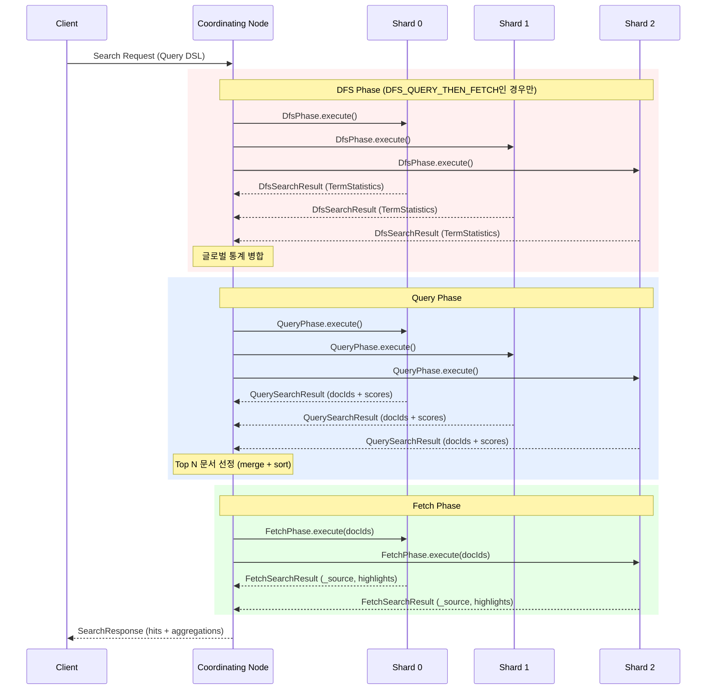
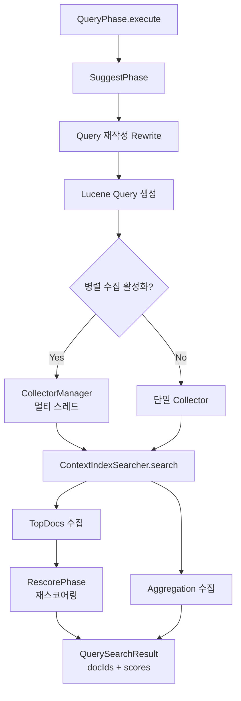
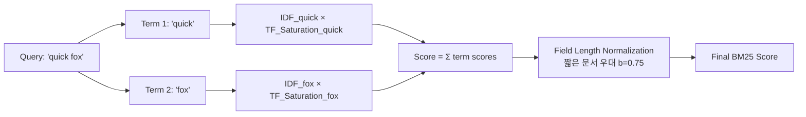
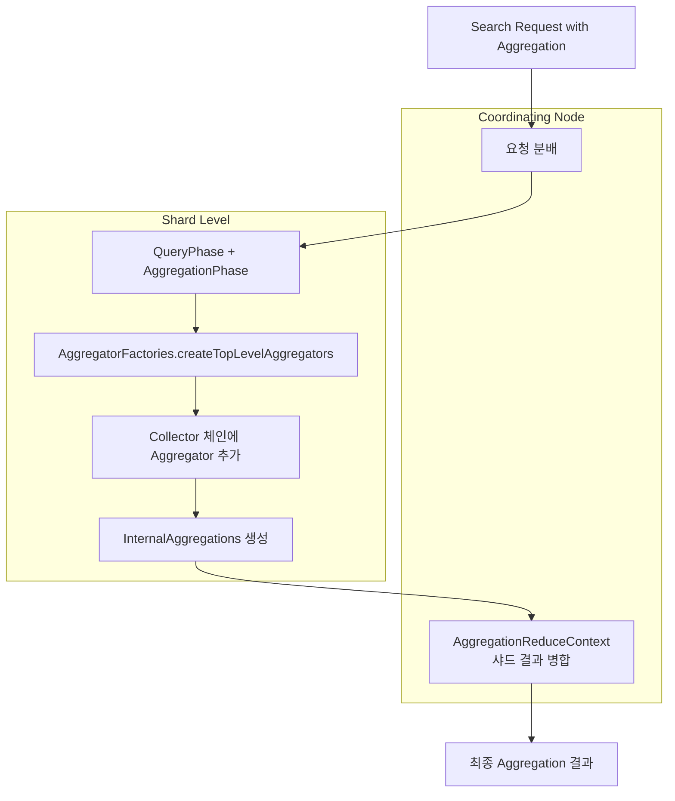
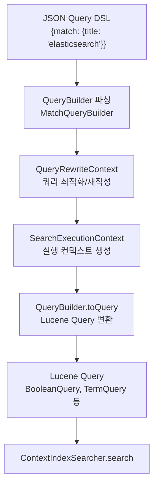

# Elasticsearch 검색 엔진 내부

Elasticsearch의 분산 검색은 Query → Fetch (+ 선택적 DFS) 다단계로 동작하며, SearchService가 전체 검색 생명주기를 관리한다. BM25 스코어링, Aggregation Framework, Query DSL 파싱까지 검색 요청이 처리되는 내부 메커니즘을 소스코드 레벨에서 분석한다.

## 목차
- [1. 핵심 개념 (What)](#1-핵심-개념-what)
- [2. 왜 알아야 하는가 (Why)](#2-왜-알아야-하는가-why)
- [3. 내부 구현 분석 (How)](#3-내부-구현-분석-how)
- [4. 실전 예제](#4-실전-예제)
- [5. 정리](#5-정리)

---

## 1. 핵심 개념 (What)

### 1.1 분산 검색의 기본 구조

Elasticsearch 검색은 분산 환경에서 동작하기 때문에, 단일 검색 요청이 여러 샤드에 분산되어 실행된 후 결과가 병합된다. 이 과정은 크게 세 가지 Phase로 나뉜다:

| Phase | 역할 | 실행 위치 |
|-------|------|----------|
| **DFS Phase** (선택) | 글로벌 term/collection 통계 수집, IDF 정확도 향상 | 각 샤드 |
| **Query Phase** | 매칭 문서 ID와 스코어 수집 | 각 샤드 |
| **Fetch Phase** | 실제 문서 내용(_source) 가져오기 | 상위 N개 문서의 샤드 |

### 1.2 SearchService — 검색의 진입점

`SearchService`(`org.elasticsearch.search.SearchService`)는 검색 요청의 전체 생명주기를 관리하는 핵심 서비스다:

```java
// org.elasticsearch.search.SearchService
public class SearchService extends AbstractLifecycleComponent
    implements IndexEventListener {

    // 검색 컨텍스트 유지 시간 (기본 5분)
    public static final Setting<TimeValue> DEFAULT_KEEPALIVE_SETTING =
        Setting.positiveTimeSetting("search.default_keep_alive",
            timeValueMinutes(5), Property.NodeScope, Property.Dynamic);

    // 비용이 높은 쿼리 허용 여부
    public static final Setting<Boolean> ALLOW_EXPENSIVE_QUERIES =
        Setting.boolSetting("search.allow_expensive_queries", true,
            Property.NodeScope, Property.Dynamic);

    // 병렬 쿼리 실행 설정
    public static final Setting<Boolean> QUERY_PHASE_PARALLEL_COLLECTION_ENABLED =
        Setting.boolSetting("search.query_phase_parallel_collection_enabled",
            true, Property.NodeScope, Property.Dynamic);
}
```

### 1.3 검색 유형 (Search Type)

- **QUERY_THEN_FETCH** (기본값): Query Phase → Fetch Phase. 각 샤드의 로컬 통계를 사용하여 스코어링
- **DFS_QUERY_THEN_FETCH**: DFS Phase → Query Phase → Fetch Phase. 글로벌 통계를 사용하여 더 정확한 스코어링

## 2. 왜 알아야 하는가 (Why)

### 2.1 검색 성능 최적화

검색 내부 동작을 이해하면:
- **Query vs Filter**: 스코어링 불필요한 조건은 `filter` context로 옮겨 캐싱 활용
- **Phase 비용 분석**: Query Phase 느리면 인덱스 설계 문제, Fetch Phase 느리면 `_source` 크기 문제
- **Deep Pagination 회피**: `from + size > 10000`이면 `search_after` 또는 `scroll` 사용

### 2.2 스코어링 이해

BM25 알고리즘의 동작을 이해하면 검색 결과의 관련성(relevance)을 예측하고 최적화할 수 있다. 특히 DFS를 사용해야 하는 상황과 그렇지 않은 상황을 구분할 수 있다.

### 2.3 Aggregation 비용 예측

Aggregation은 메모리와 CPU를 많이 사용한다. Terms Aggregation의 `size`, Cardinality의 `precision_threshold` 등이 리소스 사용에 미치는 영향을 이해해야 한다.

## 3. 내부 구현 분석 (How)

### 3.1 분산 검색 전체 흐름



### 3.2 DFS Phase — 글로벌 통계 수집

`DfsPhase`(`org.elasticsearch.search.dfs.DfsPhase`)는 각 샤드에서 term 통계와 collection 통계를 수집한다. 소스코드 Javadoc:

> *"DFS phase of a search request, used to make scoring 100% accurate by collecting additional info from each shard before the query phase."*

```java
// org.elasticsearch.search.dfs.DfsPhase
public class DfsPhase {
    public static void execute(SearchContext context) {
        collectStatistics(context);    // Term/Collection 통계 수집
        executeKnnVectorQuery(context); // KNN 벡터 검색 (있는 경우)
    }

    private static void collectStatistics(SearchContext context) {
        // 각 쿼리 term에 대해 TermStatistics 수집
        Map<Term, TermStatistics> stats = new HashMap<>();
        Map<String, CollectionStatistics> fieldStatistics = new HashMap<>();
        // Lucene IndexSearcher를 사용하여 로컬 통계 수집
    }
}
```

DFS가 필요한 경우:
- 샤드 수가 많고 문서가 적어 로컬 IDF 편차가 클 때
- 정확한 스코어 랭킹이 중요한 경우 (e.g., 검색 엔진 서비스)

### 3.3 Query Phase — 매칭과 스코어링

`QueryPhase`(`org.elasticsearch.search.query.QueryPhase`)는 각 샤드에서 매칭 문서를 찾고 스코어를 계산한다:

```java
// org.elasticsearch.search.query.QueryPhase
public class QueryPhase {

    // 검색 실행 진입점
    public static void execute(SearchContext searchContext) {
        if (searchContext.queryPhaseRankShardContext() == null) {
            executeQuery(searchContext);  // 일반 검색
        } else {
            executeRank(searchContext);   // 랭크 기반 검색 (RRF 등)
        }
    }

    // 핵심 쿼리 실행 로직 (executeQuery 내부)
    // 1. SuggestPhase 실행 (suggest 요청 시)
    // 2. Lucene Collector 설정 (TopDocs, Aggregation)
    // 3. ContextIndexSearcher.search() 호출
    // 4. RescorePhase 실행 (rescore 요청 시)
    // 5. QuerySearchResult에 결과 저장
}
```

Query Phase의 세부 단계:



### 3.4 Fetch Phase — 문서 검색

`FetchPhase`(`org.elasticsearch.search.fetch.FetchPhase`)는 Query Phase에서 선정된 Top N 문서의 실제 내용을 가져온다:

```java
// org.elasticsearch.search.fetch.FetchPhase
public final class FetchPhase {
    private final FetchSubPhase[] fetchSubPhases;

    public FetchPhase(List<FetchSubPhase> fetchSubPhases) {
        this.fetchSubPhases = fetchSubPhases.toArray(
            new FetchSubPhase[fetchSubPhases.size() + 1]);
        // InnerHitsPhase를 마지막에 추가
        this.fetchSubPhases[fetchSubPhases.size()] = new InnerHitsPhase(this);
    }

    public void execute(SearchContext context, int[] docIdsToLoad,
                        RankDocShardInfo rankDocs) {
        // 1. docIdsToLoad가 비어있으면 빈 결과 반환
        // 2. SourceLoader로 _source 로드
        // 3. 각 FetchSubPhase 실행 (highlight, stored fields 등)
        // 4. SearchHits 구성
    }
}
```

FetchSubPhase 체인:

```
FetchSourcePhase → FetchFieldsPhase → FetchScorePhase →
HighlightPhase → FetchDocValuesPhase → ScriptFieldsPhase →
ExplainPhase → FetchVersionPhase → SeqNoPrimaryTermPhase →
MatchedQueriesPhase → InnerHitsPhase
```

### 3.5 BM25 스코어링

Elasticsearch는 기본 유사도(similarity) 모델로 BM25를 사용한다:

```
score(q, d) = Σ IDF(t) × (tf(t,d) × (k1 + 1)) / (tf(t,d) + k1 × (1 - b + b × dl/avgdl))
```

| 파라미터 | 기본값 | 의미 |
|---------|-------|------|
| `k1` | 1.2 | Term Frequency의 포화도 조절 |
| `b` | 0.75 | 문서 길이 정규화 정도 |
| `tf(t,d)` | - | 문서 d에서 term t의 출현 빈도 |
| `IDF(t)` | - | Inverse Document Frequency |
| `dl` | - | 문서 길이 (term 수) |
| `avgdl` | - | 평균 문서 길이 |



### 3.6 Aggregation Framework

Aggregation은 Query Phase에서 함께 실행되며, `AggregationPhase`가 관리한다:



Aggregation 타입:

| 타입 | 예시 | 특징 |
|------|------|------|
| **Bucket** | terms, date_histogram, range | 문서를 그룹으로 분류 |
| **Metric** | avg, sum, cardinality, percentiles | 수치 계산 |
| **Pipeline** | moving_avg, derivative, bucket_sort | 다른 Agg 결과를 입력으로 사용 |

### 3.7 Query DSL 처리 흐름



Query Context vs Filter Context:

```
Query Context:
- 스코어 계산 수행
- 결과가 얼마나 잘 매칭되는지 판단
- 캐싱되지 않음

Filter Context:
- 스코어 계산 없음 (Yes/No 판단만)
- BitSet으로 캐싱 가능
- 더 빠른 실행
```

## 4. 실전 예제

### 4.1 기본 검색과 Explain

```bash
# Bool 쿼리 — Query + Filter Context 활용
curl -X GET "localhost:9200/logs-*/_search?pretty" -H 'Content-Type: application/json' -d'
{
  "query": {
    "bool": {
      "must": [
        { "match": { "message": "connection timeout" } }
      ],
      "filter": [
        { "term": { "level": "ERROR" } },
        { "range": { "timestamp": { "gte": "2026-03-01", "lte": "2026-03-07" } } }
      ],
      "should": [
        { "match": { "service": "api-gateway" } }
      ],
      "minimum_should_match": 0
    }
  },
  "size": 10,
  "from": 0,
  "_source": ["timestamp", "level", "message", "service"],
  "highlight": {
    "fields": { "message": {} }
  }
}'

# Explain — 스코어 계산 과정 확인
curl -X GET "localhost:9200/logs-*/_search?pretty" -H 'Content-Type: application/json' -d'
{
  "explain": true,
  "query": {
    "match": { "message": "connection timeout" }
  },
  "size": 1
}'
```

### 4.2 Aggregation 예제

```bash
# 다중 Aggregation — Bucket + Metric
curl -X GET "localhost:9200/logs-*/_search?pretty" -H 'Content-Type: application/json' -d'
{
  "size": 0,
  "query": {
    "range": {
      "timestamp": {
        "gte": "2026-03-01",
        "lte": "2026-03-07"
      }
    }
  },
  "aggs": {
    "errors_over_time": {
      "date_histogram": {
        "field": "timestamp",
        "calendar_interval": "1h"
      },
      "aggs": {
        "by_service": {
          "terms": {
            "field": "service",
            "size": 10
          },
          "aggs": {
            "avg_response_time": {
              "avg": { "field": "response_time_ms" }
            },
            "p99_response_time": {
              "percentiles": {
                "field": "response_time_ms",
                "percents": [95, 99]
              }
            }
          }
        },
        "error_rate": {
          "filter": { "term": { "level": "ERROR" } }
        }
      }
    },
    "unique_services": {
      "cardinality": {
        "field": "service",
        "precision_threshold": 1000
      }
    }
  }
}'
```

### 4.3 검색 성능 분석 — Profile API

```bash
# Profile API — 쿼리/페치 단계별 시간 분석
curl -X GET "localhost:9200/logs-*/_search?pretty" -H 'Content-Type: application/json' -d'
{
  "profile": true,
  "query": {
    "bool": {
      "must": [
        { "match": { "message": "error" } }
      ],
      "filter": [
        { "term": { "level": "ERROR" } }
      ]
    }
  },
  "size": 10
}'

# 응답에서 확인할 핵심 정보:
# - query[].time_in_nanos: 각 쿼리 노드의 실행 시간
# - query[].breakdown: build_scorer, next_doc, advance 등 세부 시간
# - collector[].reason: 사용된 Collector 유형
# - fetch[].breakdown: load_source, load_stored_fields 등
```

### 4.4 Deep Pagination 대안 — search_after

```bash
# 첫 번째 페이지
curl -X GET "localhost:9200/logs-*/_search?pretty" -H 'Content-Type: application/json' -d'
{
  "size": 100,
  "query": { "match_all": {} },
  "sort": [
    { "timestamp": "desc" },
    { "_id": "asc" }
  ]
}'

# 다음 페이지 — 이전 응답의 마지막 문서의 sort 값 사용
curl -X GET "localhost:9200/logs-*/_search?pretty" -H 'Content-Type: application/json' -d'
{
  "size": 100,
  "query": { "match_all": {} },
  "sort": [
    { "timestamp": "desc" },
    { "_id": "asc" }
  ],
  "search_after": ["2026-03-07T10:30:00.000Z", "doc-id-xyz"]
}'

# Point in Time (PIT) — 일관된 스냅샷
# PIT 생성
curl -X POST "localhost:9200/logs-*/_pit?keep_alive=5m"

# PIT 기반 search_after
curl -X GET "localhost:9200/_search?pretty" -H 'Content-Type: application/json' -d'
{
  "size": 100,
  "query": { "match_all": {} },
  "pit": {
    "id": "<PIT_ID>",
    "keep_alive": "5m"
  },
  "sort": [
    { "timestamp": "desc" },
    { "_id": "asc" }
  ],
  "search_after": ["2026-03-07T10:30:00.000Z", "doc-id-xyz"]
}'
```

### 4.5 BM25 파라미터 커스터마이징

```bash
# 인덱스 생성 시 BM25 파라미터 조정
curl -X PUT "localhost:9200/search-optimized" -H 'Content-Type: application/json' -d'
{
  "settings": {
    "similarity": {
      "custom_bm25": {
        "type": "BM25",
        "k1": 1.5,
        "b": 0.5
      }
    }
  },
  "mappings": {
    "properties": {
      "title": {
        "type": "text",
        "similarity": "custom_bm25"
      },
      "body": {
        "type": "text"
      }
    }
  }
}'
```

## 5. 정리

| 개념 | 설명 | 소스코드 참조 |
|------|------|-------------|
| SearchService | 검색 생명주기 관리, 설정 관리 | `SearchService.java` — `DEFAULT_KEEPALIVE_SETTING`, `ALLOW_EXPENSIVE_QUERIES` |
| DFS Phase | 글로벌 term 통계 수집, 정확한 스코어링 | `DfsPhase.execute()` — `collectStatistics()`, `executeKnnVectorQuery()` |
| Query Phase | 매칭 문서 ID + 스코어 수집 | `QueryPhase.execute()` — `executeQuery()`, `executeRank()` |
| Fetch Phase | 실제 문서 내용 로드, SubPhase 체인 | `FetchPhase.execute()` — `FetchSubPhase[]` 배열 |
| BM25 | 기본 스코어링 모델 (k1=1.2, b=0.75) | Lucene `BM25Similarity` |
| Aggregation | Bucket/Metric/Pipeline 3종 | `AggregationPhase`, `AggregatorFactories` |
| Query DSL | JSON → QueryBuilder → Lucene Query | `QueryBuilder.toQuery()`, `SearchExecutionContext` |
| Profile API | 검색 단계별 성능 분석 | `Profilers`, `QueryProfiler` |
| search_after | Deep Pagination 대안 | Coordinating Node에서 sort 값 기반 커서 |

**검색 성능 최적화 요약**:
- Filter Context를 적극 활용하여 스코어 계산 비용 절감 및 캐싱 활용
- Deep Pagination 대신 `search_after` + PIT 사용
- `_source` 필터링으로 Fetch Phase 비용 절감
- Profile API로 병목 구간 식별
- DFS는 필요한 경우에만 사용 (샤드 수 많고 문서 적을 때)

---
*마지막 업데이트: 2026년 03월*
