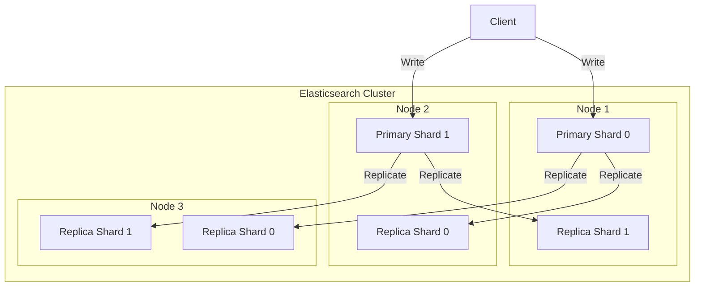
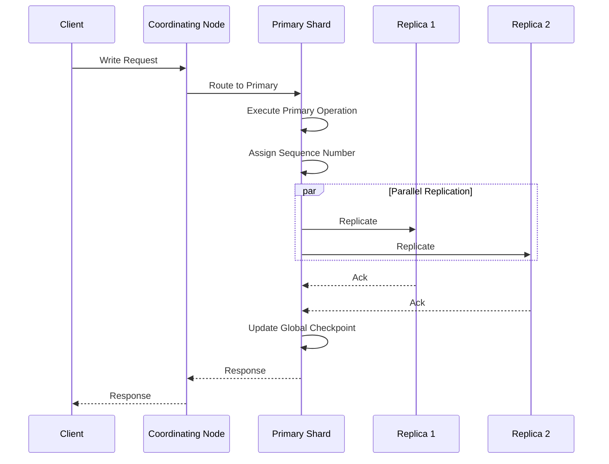

# Elasticsearch 분산 시스템

Elasticsearch는 데이터를 Shard 단위로 분할하고 클러스터 내 여러 노드에 분산 배치하여 수평 확장성과 고가용성을 동시에 달성한다. 이 문서에서는 Sharding 전략, Replication 프로토콜, Shard Allocation 메커니즘을 소스코드 수준에서 분석한다.

## 목차
- [1. 핵심 개념 (What)](#1-핵심-개념-what)
- [2. 왜 알아야 하는가 (Why)](#2-왜-알아야-하는가-why)
- [3. 내부 구현 분석 (How)](#3-내부-구현-분석-how)
- [4. 실전 예제](#4-실전-예제)
- [5. 정리](#5-정리)

---

## 1. 핵심 개념 (What)

### Shard와 인덱스의 관계

Elasticsearch에서 인덱스는 논리적 데이터 컨테이너이고, Shard는 실제 데이터가 저장되는 물리적 단위(Lucene Index)다. 하나의 인덱스는 여러 Primary Shard로 분할되며, 각 Primary Shard는 하나 이상의 Replica Shard를 가질 수 있다.

### ShardRouting 상태 머신

소스코드에서 `ShardRouting` 클래스는 개별 Shard의 라우팅 정보를 불변(immutable) 객체로 캡슐화한다. Shard는 다음 4가지 상태를 가진다:

| 상태 | 설명 | currentNodeId | relocatingNodeId |
|------|------|:---:|:---:|
| `UNASSIGNED` | 노드에 할당되지 않음 | null | null |
| `INITIALIZING` | 노드에 할당 후 초기화 중 | 설정됨 | null 또는 소스 노드 |
| `STARTED` | 정상 운영 중 | 설정됨 | null |
| `RELOCATING` | 다른 노드로 이동 중 | 현재 노드 | 대상 노드 |

### Primary vs Replica Shard

- **Primary Shard**: 쓰기 연산을 먼저 수행하는 주 Shard. 인덱스 생성 시 개수가 결정된다.
- **Replica Shard**: Primary의 복제본. 읽기 부하 분산과 장애 복구에 사용된다.
- Primary 승격 가능 여부는 `Role`에 의해 결정된다: `role.isPromotableToPrimary()`

### Global Checkpoint과 Sequence Number

모든 쓰기 연산에는 고유한 Sequence Number가 할당된다. **Global Checkpoint**은 모든 활성 Shard 복사본이 처리 완료한 최대 Sequence Number를 의미하며, Translog 정리와 Peer Recovery 최적화의 기준점이 된다.

## 2. 왜 알아야 하는가 (Why)

### 운영 관점

- **Shard 수 설계**: Shard 수는 인덱스 생성 후 변경이 불가능하다(Reindex 필요). 과도한 Shard는 클러스터 오버헤드를 발생시키고, 부족한 Shard는 수평 확장을 제한한다.
- **장애 대응**: Replica 구성을 이해해야 노드 장애 시 데이터 유실 범위를 예측할 수 있다.
- **성능 튜닝**: Shard Allocation 정책이 클러스터 밸런싱에 직접 영향을 미친다.

### 디버깅 관점

- Shard가 `UNASSIGNED` 상태에 머무는 이유를 진단하려면 Allocation Decider의 동작을 이해해야 한다.
- Replication 지연(lag)을 해결하려면 Global Checkpoint과 Sequence Number의 관계를 파악해야 한다.

## 3. 내부 구현 분석 (How)

### 전체 아키텍처



### IndexShard 클래스 구조

`IndexShard`는 단일 Shard의 전체 생명주기를 관리하는 핵심 클래스다.

```
소스: /tmp/elasticsearch/server/src/main/java/org/elasticsearch/index/shard/IndexShard.java
```

주요 필드 분석:

```java
// Shard 라우팅 정보 (상태 전이 추적)
protected volatile ShardRouting shardRouting;
protected volatile IndexShardState state;

// Replication 추적
private final ReplicationTracker replicationTracker;
private final GlobalCheckpointSyncer globalCheckpointSyncer;
private final RetentionLeaseSyncer retentionLeaseSyncer;

// 동시성 제어
private final PendingReplicationActions pendingReplicationActions;
private final IndexShardOperationPermits indexShardOperationPermits;
```

`IndexShardState`는 Shard의 내부 상태를 나타내며 다음 값들로 구성된다:
- `CREATED` -> `RECOVERING` -> `POST_RECOVERY` -> `STARTED` -> `CLOSED`

쓰기가 허용되는 상태 집합:

```java
private static final EnumSet<IndexShardState> writeAllowedStates = EnumSet.of(
    IndexShardState.RECOVERING,
    IndexShardState.POST_RECOVERY,
    IndexShardState.STARTED
);
```

### Replication 프로토콜 - TransportReplicationAction

```
소스: /tmp/elasticsearch/server/src/main/java/org/elasticsearch/action/support/replication/TransportReplicationAction.java
```

Replication은 Primary-then-Replica 모델을 따른다:



`TransportReplicationAction`의 핵심 동작 흐름:

1. **Coordinating Node**: 클러스터 상태에서 Primary Shard 위치를 찾아 요청을 라우팅
2. **Primary Execution**: `PrimaryActionExecution`에 따라 오버로드 시 Reject 또는 Force 결정
3. **Replica Execution**: Primary 성공 후 모든 활성 Replica에 병렬 전파
4. **Global Checkpoint Sync**: `SyncGlobalCheckpointAfterOperation.AttemptAfterSuccess` 설정 시 Replica에 체크포인트 동기화

```java
// Retry 설정 (소스 참조)
public static final Setting<TimeValue> REPLICATION_RETRY_TIMEOUT = Setting.timeSetting(
    "indices.replication.retry_timeout",
    TimeValue.timeValueSeconds(60),
    Setting.Property.Dynamic, Setting.Property.NodeScope
);

public static final Setting<TimeValue> REPLICATION_INITIAL_RETRY_BACKOFF_BOUND = Setting.timeSetting(
    "indices.replication.initial_retry_backoff_bound",
    TimeValue.timeValueMillis(50),
    TimeValue.timeValueMillis(10),
    Setting.Property.Dynamic, Setting.Property.NodeScope
);
```

### ShardRouting 상태 전이

```
소스: /tmp/elasticsearch/server/src/main/java/org/elasticsearch/cluster/routing/ShardRouting.java
```

`ShardRouting`은 불변 객체로, 상태 전이 시 새로운 인스턴스가 생성된다. Relocation 발생 시 target Shard가 자동 초기화된다:

```java
private ShardRouting initializeTargetRelocatingShard() {
    if (state == ShardRoutingState.RELOCATING) {
        return new ShardRouting(
            shardId, relocatingNodeId, currentNodeId, primary,
            ShardRoutingState.INITIALIZING,
            PeerRecoverySource.INSTANCE,
            unassignedInfo, RelocationFailureInfo.NO_FAILURES,
            AllocationId.newTargetRelocation(allocationId),
            expectedShardSize, role
        );
    } else {
        return null;
    }
}
```

### Shard Allocation

Shard Allocation은 `BalancedShardsAllocator`가 담당하며, 다양한 `AllocationDecider`를 거쳐 최종 할당을 결정한다. 대표적인 Decider:

| Decider | 역할 |
|---------|------|
| `DiskThresholdDecider` | 디스크 사용량 기반 할당 제한 |
| `SameShardAllocationDecider` | 동일 Shard의 Primary/Replica가 같은 노드에 배치되지 않도록 방지 |
| `AwarenessAllocationDecider` | Rack/Zone awareness 기반 분산 |
| `FilterAllocationDecider` | 사용자 정의 필터 규칙 적용 |
| `RebalanceOnlyWhenActiveAllocationDecider` | 모든 Shard가 활성 상태일 때만 리밸런싱 |

## 4. 실전 예제

### 예제 1: 프로덕션 Shard 설계

```json
PUT /production-logs-2026.03
{
  "settings": {
    "number_of_shards": 5,
    "number_of_replicas": 1,
    "routing.allocation.include._tier_preference": "data_hot",
    "routing.allocation.total_shards_per_node": 2
  }
}
```

설계 기준:
- **Shard 수**: 일일 데이터 50GB 기준, Shard당 10GB 목표 -> 5 Primary Shards
- **Replica**: 1개로 설정하여 노드 1대 장애 시에도 데이터 무손실
- **total_shards_per_node**: 2로 제한하여 특정 노드에 Shard 집중 방지

### 예제 2: Unassigned Shard 진단 및 복구

```bash
# 1. Unassigned Shard 원인 확인
GET /_cluster/allocation/explain
{
  "index": "production-logs-2026.03",
  "shard": 2,
  "primary": true
}

# 2. 디스크 워터마크 확인
GET /_cluster/settings?include_defaults=true&filter_path=*.cluster.routing.allocation.disk*

# 3. 강제 할당 (위험 - 데이터 유실 가능)
POST /_cluster/reroute
{
  "commands": [
    {
      "allocate_stale_primary": {
        "index": "production-logs-2026.03",
        "shard": 2,
        "node": "node-3",
        "accept_data_loss": true
      }
    }
  ]
}
```

## 5. 정리

| 항목 | 설명 |
|------|------|
| Primary Shard | 쓰기 연산의 진입점. 인덱스 생성 시 개수 고정 |
| Replica Shard | Primary의 복제본. 읽기 분산 및 장애 복구 역할 |
| ShardRouting | Shard 라우팅 정보를 불변 객체로 캡슐화. 4가지 상태 전이 |
| IndexShard | 단일 Shard의 전체 생명주기를 관리하는 핵심 클래스 |
| Replication 프로토콜 | Primary-then-Replica 모델. Sequence Number 기반 추적 |
| Global Checkpoint | 모든 활성 복사본이 확인한 최대 Sequence Number |
| TransportReplicationAction | Primary 실행 후 병렬로 Replica에 전파하는 Transport Action |
| Shard Allocation | AllocationDecider 체인을 통해 Shard 배치를 결정 |
| BalancedShardsAllocator | Shard 수와 디스크 사용량 기반으로 노드 간 밸런싱 수행 |

---
*마지막 업데이트: 2026년 03월*
