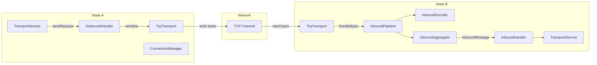
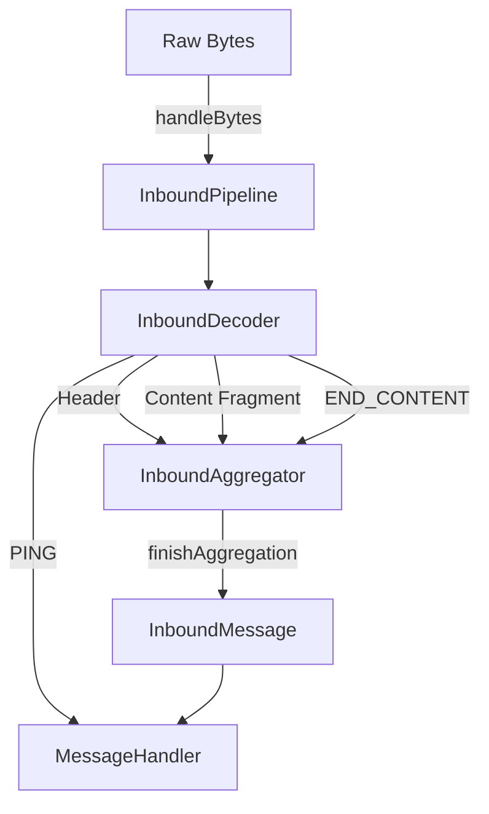

# Elasticsearch Transport 계층

Elasticsearch 노드 간 모든 내부 통신은 Transport 계층을 통해 이루어진다. 이 문서에서는 TransportService 아키텍처, TCP 기반 통신 프로토콜, 메시지 인코딩/디코딩 파이프라인, Connection 관리 및 Remote Cluster 연결 메커니즘을 소스코드 수준에서 분석한다.

## 목차
- [1. 핵심 개념 (What)](#1-핵심-개념-what)
- [2. 왜 알아야 하는가 (Why)](#2-왜-알아야-하는가-why)
- [3. 내부 구현 분석 (How)](#3-내부-구현-분석-how)
- [4. 실전 예제](#4-실전-예제)
- [5. 정리](#5-정리)

---

## 1. 핵심 개념 (What)

### Transport 계층의 역할

Elasticsearch의 Transport 계층은 노드 간 통신을 담당하는 저수준 네트워크 계층이다. REST API(HTTP 계층)가 클라이언트-노드 통신을 처리하는 반면, Transport 계층은 다음을 담당한다:

- **노드 간 클러스터 내부 통신**: Shard 복제, 클러스터 상태 전파, 검색 Scatter/Gather
- **Action 기반 RPC**: 각 요청은 Action 이름(예: `internal:transport/handshake`)으로 라우팅
- **Connection 풀 관리**: 노드별 다중 TCP 연결을 유지하며 요청 유형별 채널 분리
- **Remote Cluster 연결**: Cross-Cluster Search(CCS)를 위한 원격 클러스터 통신

### 핵심 컴포넌트

| 컴포넌트 | 역할 |
|----------|------|
| `TransportService` | Transport 계층의 최상위 서비스. 요청 전송/수신, Handler 등록 |
| `TcpTransport` | TCP 기반 Transport 구현체. 채널/커넥션 관리 |
| `InboundPipeline` | 수신 바이트를 메시지로 디코딩하는 파이프라인 |
| `OutboundHandler` | 요청/응답을 직렬화하여 전송 |
| `ConnectionManager` | 노드별 Connection 풀 관리 |
| `RemoteClusterService` | Remote Cluster 연결 및 관리 |

### 메시지 유형

Transport에서 처리하는 메시지는 크게 3가지로 분류된다:

1. **Request**: Action 이름과 함께 전송되는 요청 메시지
2. **Response**: 요청에 대한 응답 메시지 (requestId로 매핑)
3. **Ping**: 연결 유지를 위한 Keep-Alive 메시지

## 2. 왜 알아야 하는가 (Why)

### 운영 관점

- **네트워크 문제 진단**: 노드 간 통신 장애는 클러스터 불안정의 주 원인이다. Transport 계층의 동작 원리를 알면 타임아웃, 연결 끊김, 느린 응답 등의 근본 원인을 파악할 수 있다.
- **성능 최적화**: Transport 계층 설정(연결 수, 버퍼 크기, 압축 등)이 클러스터 성능에 직접 영향을 미친다.
- **보안 구성**: TLS/SSL 설정, Remote Cluster 인증 등 보안 관련 구성의 기반이 된다.

### 개발 관점

- 커스텀 플러그인이나 Transport Interceptor 개발 시 내부 메시지 흐름을 이해해야 한다.
- Cross-Cluster Search 설계 시 Remote Cluster의 연결 모델을 파악해야 한다.

## 3. 내부 구현 분석 (How)

### 전체 아키텍처



### TransportService - 최상위 서비스

```
소스: /tmp/elasticsearch/server/src/main/java/org/elasticsearch/transport/TransportService.java
```

`TransportService`는 `AbstractLifecycleComponent`를 상속하며, `TransportMessageListener`와 `TransportConnectionListener` 인터페이스를 구현한다.

핵심 필드:

```java
protected final Transport transport;             // 실제 TCP 통신 담당
protected final ConnectionManager connectionManager;  // 노드별 연결 관리
protected final ThreadPool threadPool;            // 비동기 처리용 스레드풀
protected final TaskManager taskManager;          // 요청별 Task 추적
private final TransportInterceptor.AsyncSender asyncSender;  // 인터셉터 체인
private final Transport.ResponseHandlers responseHandlers;   // 응답 핸들러 맵
```

서비스 시작 시 동작:

```java
@Override
protected void doStart() {
    transport.setMessageListener(this);       // 메시지 리스너 등록
    connectionManager.addListener(this);       // 연결 이벤트 리스너 등록
    transport.start();                         // Transport 시작
    localNode = localNodeFactory.apply(transport.boundAddress());  // 로컬 노드 생성

    if (remoteClusterClient) {
        remoteClusterService.initializeRemoteClusters(...);  // Remote Cluster 초기화
    }
}
```

**Handshake 메커니즘**: 새 노드와 연결 시 `internal:transport/handshake` 액션으로 버전, 빌드 해시, 클러스터 이름을 교환한다.

```java
registerRequestHandler(
    HANDSHAKE_ACTION_NAME,
    EsExecutors.DIRECT_EXECUTOR_SERVICE,
    false, false,
    HandshakeRequest::new,
    (request, channel, task) -> channel.sendResponse(
        new HandshakeResponse(localNode.getVersion(), Build.current().hash(),
                              localNode, clusterName)
    )
);
```

**Local Node 최적화**: 동일 노드 내 요청은 네트워크를 거치지 않고 직접 실행된다.

```java
private final Transport.Connection localNodeConnection = new Transport.Connection() {
    @Override
    public void sendRequest(long requestId, String action,
                           TransportRequest request, TransportRequestOptions options) {
        sendLocalRequest(requestId, action, request, options);
    }
    // ...
};
```

### TcpTransport - TCP 통신 구현

```
소스: /tmp/elasticsearch/server/src/main/java/org/elasticsearch/transport/TcpTransport.java
```

`TcpTransport`는 Transport 인터페이스의 TCP 구현체로, Inbound/Outbound 핸들러를 조립한다.

```java
public abstract class TcpTransport extends AbstractLifecycleComponent implements Transport {

    // 메시지 크기 읽기에 필요한 바이트 수
    private static final int BYTES_NEEDED_FOR_MESSAGE_SIZE =
        TcpHeader.MARKER_BYTES_SIZE + TcpHeader.MESSAGE_LENGTH_SIZE;

    // 힙의 30%를 최대 메시지 크기로 제한
    private static final long THIRTY_PER_HEAP_SIZE =
        (long) (JvmInfo.jvmInfo().getMem().getHeapMax().getBytes() * 0.3);

    private final OutboundHandler outboundHandler;   // 요청/응답 직렬화 및 전송
    private final InboundHandler inboundHandler;     // 수신 메시지 역직렬화 및 디스패치
    private final ResponseHandlers responseHandlers; // requestId -> handler 매핑
    private final RequestHandlers requestHandlers;   // action name -> handler 매핑
    private final TransportHandshaker handshaker;    // 연결 시 핸드셰이크
    private final TransportKeepAlive keepAlive;      // TCP Keep-Alive 관리
}
```

생성자에서 핵심 컴포넌트를 조립하는 흐름:

```java
this.outboundHandler = new OutboundHandler(nodeName, version, statsTracker,
    threadPool, recycler, outboundHandlingTimeTracker, rstOnClose);

this.handshaker = new TransportHandshaker(version, threadPool,
    (node, channel, requestId, v) -> outboundHandler.sendRequest(...));

this.keepAlive = new TransportKeepAlive(threadPool, this.outboundHandler::sendBytes);

this.inboundHandler = new InboundHandler(threadPool, outboundHandler,
    namedWriteableRegistry, handshaker, keepAlive,
    requestHandlers, responseHandlers, networkService.getHandlingTimeTracker(),
    ignoreDeserializationErrors);
```

### InboundPipeline - 수신 메시지 처리

```
소스: /tmp/elasticsearch/server/src/main/java/org/elasticsearch/transport/InboundPipeline.java
```

`InboundPipeline`은 TCP 채널에서 수신된 원시 바이트를 메시지로 조립하는 핵심 컴포넌트다.



디코딩 루프의 핵심 로직:

```java
private void doHandleBytes(TcpChannel channel) throws IOException {
    do {
        CheckedConsumer<Object, IOException> decodeConsumer =
            f -> forwardFragment(channel, f);
        int bytesDecoded = decoder.decode(pending.peekFirst(), decodeConsumer);

        // 단일 버퍼로 디코딩 실패 시, 여러 버퍼를 합쳐서 재시도
        if (bytesDecoded == 0 && pending.size() > 1) {
            ReleasableBytesReference[] bytesReferences = new ReleasableBytesReference[pending.size()];
            // ... 합성 참조 생성 후 재시도
            bytesDecoded = decoder.decode(toDecode, decodeConsumer);
        }

        if (bytesDecoded != 0) {
            releasePendingBytes(bytesDecoded);
        } else {
            break;
        }
    } while (pending.isEmpty() == false);
}
```

Fragment 처리 흐름:

```java
private void forwardFragment(TcpChannel channel, Object fragment) throws IOException {
    if (fragment instanceof Header) {
        headerReceived((Header) fragment);        // 헤더 수신 -> Aggregator에 전달
    } else if (fragment instanceof Compression.Scheme) {
        aggregator.updateCompressionScheme(...);   // 압축 방식 업데이트
    } else if (fragment == InboundDecoder.PING) {
        messageHandler.accept(channel, PING_MESSAGE);  // Ping 즉시 처리
    } else if (fragment == InboundDecoder.END_CONTENT) {
        messageHandler.accept(channel, aggregator.finishAggregation());  // 메시지 완성
    } else {
        aggregator.aggregate((ReleasableBytesReference) fragment);  // 내용 누적
    }
}
```

### Connection 관리

`ConnectionManager`는 노드별 TCP 연결 풀을 관리한다. 연결은 용도별로 구분된 프로파일을 사용한다:

| 프로파일 | 용도 |
|----------|------|
| `default` | 일반 클러스터 내부 통신 |
| `.direct` | 로컬 노드 직접 통신 (네트워크 없음) |
| `_remote_cluster` | Remote Cluster 전용 통신 |

Timeout 추적을 위한 LRU 캐시:

```java
// 최근 100개의 타임아웃 정보를 LRU로 유지
final Map<Long, TimeoutInfoHolder> timeoutInfoHandlers =
    Collections.synchronizedMap(new LinkedHashMap<>(100, .75F, true) {
        @Override
        protected boolean removeEldestEntry(Map.Entry<Long, TimeoutInfoHolder> eldest) {
            return size() > 100;
        }
    });
```

### Remote Cluster Service

Remote Cluster는 `TransportService` 시작 시 초기화되며, Cross-Cluster Search와 Cross-Cluster Replication에 사용된다.

```java
if (remoteClusterClient) {
    remoteClusterService.initializeRemoteClusters(
        linkedProjectConfigService.getInitialLinkedProjectConfigs()
    );
}
```

## 4. 실전 예제

### 예제 1: Transport 계층 튜닝

```yaml
# elasticsearch.yml - Transport 설정

# TCP 연결 수 (노드당, 유형별)
transport.connections_per_node.recovery: 2
transport.connections_per_node.bulk: 3
transport.connections_per_node.reg: 6
transport.connections_per_node.state: 1
transport.connections_per_node.ping: 1

# TCP 버퍼 크기
transport.tcp.send_buffer_size: 256kb
transport.tcp.receive_buffer_size: 256kb

# 압축 설정
transport.compress: indexing_data

# 느린 로그 설정 (5초 이상 걸리는 Transport 작업 기록)
transport.slow_operation_logging_threshold: 5s

# Transport 트레이스 로깅
transport.tracer.include: ["internal:coordination/*"]
transport.tracer.exclude: ["internal:coordination/fault_detection/*"]
```

### 예제 2: Remote Cluster 구성 및 Cross-Cluster Search

```yaml
# elasticsearch.yml - Remote Cluster 설정 (Sniff mode)
cluster.remote.cluster_west:
  seeds: ["west-node1:9300", "west-node2:9300"]
  transport.compress: true
  transport.ping_schedule: 30s

# Proxy mode (단일 진입점)
cluster.remote.cluster_east:
  mode: proxy
  proxy_address: "east-proxy:9443"
  server_name: "east-cluster.example.com"
```

```json
// Cross-Cluster Search 실행
GET /local-index,cluster_west:remote-index/_search
{
  "query": {
    "bool": {
      "must": [
        { "match": { "message": "error" } },
        { "range": { "@timestamp": { "gte": "now-1h" } } }
      ]
    }
  }
}
```

## 5. 정리

| 항목 | 설명 |
|------|------|
| TransportService | Transport 계층의 최상위 서비스. Action 기반 RPC, Handler 등록/디스패치 |
| TcpTransport | TCP 기반 Transport 구현. Inbound/Outbound Handler 조립 |
| InboundPipeline | 수신 바이트 -> Header/Content 디코딩 -> InboundMessage 조립 |
| OutboundHandler | TransportRequest/Response를 직렬화하여 TCP 채널에 전송 |
| ConnectionManager | 노드별 TCP 연결 풀 관리. 프로파일별 연결 분리 |
| Handshake | 연결 수립 시 버전/클러스터 정보 교환 |
| Local Node Connection | 동일 노드 요청은 네트워크를 거치지 않고 직접 실행 |
| RemoteClusterService | Cross-Cluster Search/Replication을 위한 원격 클러스터 연결 관리 |
| Transport Interceptor | 요청 전송 전 가로채기 패턴. 보안, 로깅 등에 활용 |

---
*마지막 업데이트: 2026년 03월*
