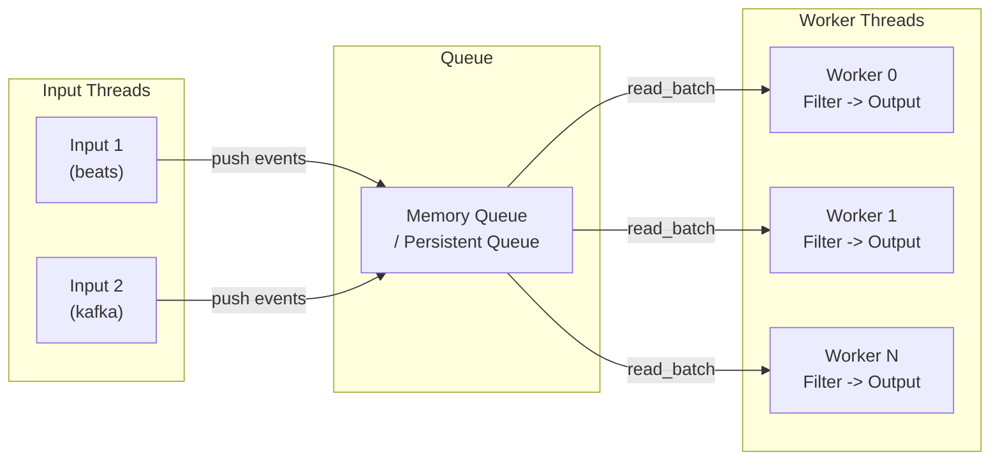
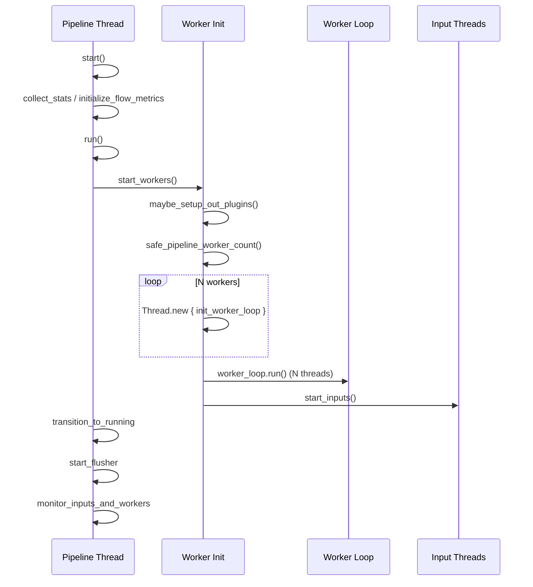
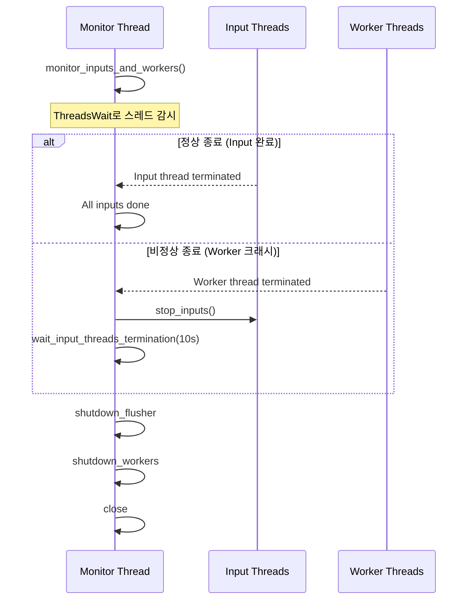

# Logstash 파이프라인 아키텍처

Logstash의 핵심은 데이터를 수집(Input), 변환(Filter), 출력(Output)하는 파이프라인이다. 이 문서에서는 JavaPipeline의 실행 모델, Config에서 Bytecode까지의 컴파일 체인, WorkerLoop 동작 원리, 그리고 Multi-pipeline 아키텍처를 소스코드 수준에서 분석한다.

## 목차
- [1. 핵심 개념 (What)](#1-핵심-개념-what)
- [2. 왜 알아야 하는가 (Why)](#2-왜-알아야-하는가-why)
- [3. 내부 구현 분석 (How)](#3-내부-구현-분석-how)
- [4. 실전 예제](#4-실전-예제)
- [5. 정리](#5-정리)

---

## 1. 핵심 개념 (What)

### JavaPipeline

Logstash 파이프라인의 핵심 구현체는 `JavaPipeline` 클래스다. Ruby의 `AbstractPipeline`을 상속하며 Java와 Ruby 하이브리드 구조로 동작한다. 하나의 파이프라인은 다음 요소로 구성된다:

- **Input 플러그인**: 데이터 소스에서 이벤트를 수집
- **Queue**: Input과 Worker 사이의 버퍼 (Memory 또는 Persistent Queue)
- **Worker Thread**: Filter + Output 로직을 실행하는 스레드 (pipeline.workers 설정)
- **Filter 플러그인**: 이벤트를 변환, 보강, 필터링
- **Output 플러그인**: 처리된 이벤트를 목적지로 전송

### Config 컴파일 체인

Logstash 설정 파일은 다음 단계를 거쳐 실행 가능한 코드로 변환된다:

```
Config Text -> AST -> PipelineIR (Graph) -> Dataset (Compiled Bytecode)
```

### 핵심 설정 파라미터

| 파라미터 | 기본값 | 설명 |
|----------|--------|------|
| `pipeline.workers` | CPU 코어 수 | Filter/Output 실행 Worker 스레드 수 |
| `pipeline.batch.size` | 125 | Worker당 한 번에 처리하는 이벤트 수 |
| `pipeline.batch.delay` | 50ms | 배치가 미달일 때 대기 시간 |
| `pipeline.ordered` | auto | 이벤트 순서 보장 여부 |
| `queue.type` | memory | 큐 유형 (memory / persisted) |

## 2. 왜 알아야 하는가 (Why)

### 성능 최적화

- **Worker 수 조정**: CPU-bound Filter(grok, dissect)와 I/O-bound Output(Elasticsearch)의 비율에 따라 최적 Worker 수가 달라진다.
- **Batch 크기 튜닝**: Batch 크기가 클수록 처리량이 증가하지만 메모리 사용량과 지연 시간이 늘어난다.
- **Thread-safety**: 일부 Filter 플러그인은 thread-safe하지 않아 Worker 수를 자동으로 1로 제한한다.

### 안정성

- 파이프라인 시작/종료 시퀀스를 이해하면 데이터 유실 없이 안전한 배포가 가능하다.
- Worker 크래시 시 자동 파이프라인 종료 메커니즘을 이해하면 장애 대응이 빨라진다.

### 디버깅

- 이벤트가 어디서 병목을 일으키는지(Input, Queue, Filter, Output) 파악할 수 있다.
- 컴파일 체인을 이해하면 설정 오류의 근본 원인을 추적할 수 있다.

## 3. 내부 구현 분석 (How)

### 전체 아키텍처



### JavaPipeline 초기화

```
소스: /tmp/logstash/logstash-core/lib/logstash/java_pipeline.rb
```

```ruby
class JavaPipeline < AbstractPipeline
  def initialize(pipeline_config, namespaced_metric = nil, agent = nil)
    super pipeline_config, namespaced_metric, @logger, agent
    finish_initialization
  end

  def finish_initialization
    open_queue                    # Queue 초기화

    @worker_threads = []
    @worker_observer = org.logstash.execution.WorkerObserver.new(
      process_events_namespace_metric,
      pipeline_events_namespace_metric
    )

    @drain_queue = settings.get_value("queue.drain") ||
                   settings.get("queue.type") == MEMORY

    @events_filtered = java.util.concurrent.atomic.LongAdder.new
    @events_consumed = java.util.concurrent.atomic.LongAdder.new

    @ready = Concurrent::AtomicBoolean.new(false)
    @running = Concurrent::AtomicBoolean.new(false)
    @flushing = java.util.concurrent.atomic.AtomicBoolean.new(false)
    @shutdownRequested = java.util.concurrent.atomic.AtomicBoolean.new(false)
    @crash_detected = Concurrent::AtomicBoolean.new(false)
  end
end
```

### 파이프라인 시작 시퀀스



`start_workers()` 메서드의 핵심 로직:

```ruby
def start_workers
  pipeline_workers = safe_pipeline_worker_count
  batch_size = settings.get("pipeline.batch.size")
  batch_delay = settings.get("pipeline.batch.delay")

  max_inflight = batch_size * pipeline_workers

  # Phase 1: Worker Loop 초기화 (병렬)
  worker_loops = pipeline_workers.times
    .map { Thread.new { init_worker_loop } }
    .map(&:value)

  # Phase 2: Worker Loop 실행 (각각 별도 스레드)
  worker_loops.each_with_index do |worker_loop, t|
    thread = WorkerLoopThread.new(worker_loop) do
      Util.set_thread_name("[#{pipeline_id}]>worker#{t}")
      worker_loop.run
    end
    @worker_threads << thread
  end

  # Phase 3: Input 시작 (마지막)
  start_inputs
ensure
  @ready.make_true
end
```

### Thread-safety 자동 감지

unsafe한 Filter 플러그인이 있으면 자동으로 Worker 수를 1로 제한한다:

```ruby
def safe_pipeline_worker_count
  pipeline_workers = settings.get("pipeline.workers")
  safe_filters, unsafe_filters = filters.partition(&:threadsafe?)

  return pipeline_workers if unsafe_filters.empty?

  if settings.set?("pipeline.workers")
    if pipeline_workers > 1
      @logger.warn("Warning: filters that might not work with multiple workers",
                   :worker_threads => pipeline_workers,
                   :filters => unsafe_filters.collect(&:config_name))
    end
  else
    if default > 1
      return 1  # 자동으로 1로 제한
    end
  end
  pipeline_workers
end
```

### PipelineIR - 중간 표현(Intermediate Representation)

```
소스: /tmp/logstash/logstash-core/src/main/java/org/logstash/config/ir/PipelineIR.java
```

`PipelineIR`은 파이프라인 설정을 Graph 기반 중간 표현으로 변환한다:

```java
public PipelineIR(Graph inputSection, Graph filterSection,
                  Graph outputSection, String originalSource) throws InvalidIRException {
    Graph tempGraph = inputSection.copy();        // Input 섹션 복사

    QueueVertex tempQueue = new QueueVertex();
    tempGraph = tempGraph.chain(tempQueue);        // Input -> Queue 연결

    tempGraph = tempGraph.chain(filterSection);    // Queue -> Filter 연결

    tempGraph = tempGraph.chain(                   // Filter -> Output 분리자
        new SeparatorVertex("filter_to_output")
    );

    this.graph = tempGraph.chain(outputSection);   // Filter -> Output 연결

    this.graph.validate();                         // 그래프 유효성 검증

    // 원본 소스 기반 해시 또는 그래프 구조 기반 해시
    if (this.getOriginalSource() != null) {
        uniqueHash = Util.digest(this.getOriginalSource());
    } else {
        uniqueHash = this.graph.uniqueHash();
    }
}
```

Graph 구조:

```
Input1 --> Queue --> Filter1 --> Filter2 --> [filter_to_output] --> Output1
Input2 ----^                                                   --> Output2
```

### DatasetCompiler - 런타임 코드 생성

```
소스: /tmp/logstash/logstash-core/src/main/java/org/logstash/config/ir/compiler/DatasetCompiler.java
```

`DatasetCompiler`는 PipelineIR의 Graph를 런타임에 Java 바이트코드로 컴파일한다. Filter/Output 플러그인마다 최적화된 `Dataset` 구현을 동적 생성한다:

```java
// Filter Dataset 컴파일
public static ComputeStepSyntaxElement<Dataset> filterDataset(
    final Collection<Dataset> parents,
    final AbstractFilterDelegatorExt plugin)
{
    final ClassFields fields = new ClassFields();
    final ValueSyntaxElement outputBuffer = fields.add("outputBuffer", new ArrayList<>());

    if (parents.isEmpty()) {
        compute = filterBody(outputBuffer, BATCH_ARG, fields, plugin);
    } else {
        // 부모 Dataset에서 입력 버퍼링
        final Collection<ValueSyntaxElement> parentFields = createParentStatementsFields(parents, fields);
        compute = withInputBuffering(
            filterBody(outputBuffer, inputBufferField, fields, plugin),
            parentFields, inputBufferField
        );
    }
    return prepare(withOutputBuffering(compute, clear, outputBuffer, fields));
}
```

조건부 분기(if/else) 처리를 위한 `SplitDataset`:

```java
public static ComputeStepSyntaxElement<SplitDataset> splitDataset(
    final Collection<Dataset> parents,
    final EventCondition condition,
    final AbstractPipelineExt.ConditionalEvaluationListener conditionalErrListener)
{
    // 조건에 따라 ifData / elseData 버퍼로 이벤트 분류
    // ConditionalEvaluationError 발생 시 안전하게 처리
}
```

### 파이프라인 종료 시퀀스



Worker 크래시 감지 시 안전한 종료:

```ruby
def monitor_inputs_and_workers
  twait = ThreadsWait.new(*(@input_threads + @worker_threads))

  loop do
    break if @input_threads.empty?
    terminated_thread = twait.next_wait

    if @input_threads.delete(terminated_thread).nil?
      # Worker 스레드 비정상 종료 감지
      @worker_threads.delete(terminated_thread)
      stop_inputs

      # Memory Queue일 경우 블로킹된 Input 언블록
      if inputs_running? && settings.get("queue.type") == MEMORY
        wait_input_threads_termination(10) do
          dropped_batch = filter_queue_client.read_batch
        end
      end
      break
    end
  end
end
```

## 4. 실전 예제

### 예제 1: 프로덕션 파이프라인 설정

```ruby
# /etc/logstash/pipelines.yml
- pipeline.id: main-pipeline
  pipeline.workers: 4
  pipeline.batch.size: 250
  pipeline.batch.delay: 50
  queue.type: persisted
  queue.max_bytes: 4gb
  path.config: "/etc/logstash/conf.d/main.conf"

- pipeline.id: dead-letter-pipeline
  pipeline.workers: 1
  pipeline.batch.size: 50
  path.config: "/etc/logstash/conf.d/dlq.conf"
```

```ruby
# /etc/logstash/conf.d/main.conf
input {
  beats {
    port => 5044
    client_inactivity_timeout => 300
  }
}

filter {
  if [type] == "syslog" {
    grok {
      match => { "message" => "%{SYSLOGTIMESTAMP:syslog_timestamp} %{SYSLOGHOST:syslog_hostname} %{DATA:syslog_program}(?:\[%{POSINT:syslog_pid}\])?: %{GREEDYDATA:syslog_message}" }
    }
    date {
      match => [ "syslog_timestamp", "MMM  d HH:mm:ss", "MMM dd HH:mm:ss" ]
    }
  }
}

output {
  elasticsearch {
    hosts => ["https://es-node1:9200", "https://es-node2:9200"]
    index => "logs-%{[type]}-%{+YYYY.MM.dd}"
    user => "logstash_writer"
    password => "${ES_PASSWORD}"
    ssl_certificate_authorities => ["/etc/logstash/certs/ca.crt"]
  }
}
```

### 예제 2: Worker 수 최적화 진단

```bash
# 파이프라인 성능 메트릭 확인
curl -s localhost:9600/_node/stats/pipelines | jq '
  .pipelines["main-pipeline"] | {
    workers: .pipeline.workers,
    batch_size: .pipeline.batch_size,
    events_in: .events.in,
    events_out: .events.out,
    events_filtered: .events.filtered,
    queue_backpressure_ms: .events.queue_push_duration_in_millis,
    worker_utilization: .pipeline.worker_utilization
  }'
```

Worker 수 결정 기준:
- `queue_push_duration` 높음 -> Worker가 부족하거나 Output 병목
- `worker_utilization` 낮음 -> Worker 수 과다 (줄여도 됨)
- CPU 사용률 포화 -> grok 등 CPU-bound Filter가 병목

## 5. 정리

| 항목 | 설명 |
|------|------|
| JavaPipeline | Logstash 파이프라인의 핵심 실행 엔진. Ruby/Java 하이브리드 구조 |
| 시작 순서 | Worker Init (병렬) -> Worker Run (각 스레드) -> Input Start (마지막) |
| 종료 순서 | Input Stop -> Queue Drain -> Worker Shutdown -> Close |
| PipelineIR | Config를 Graph 기반 중간 표현으로 변환. Input -> Queue -> Filter -> Output 체인 |
| DatasetCompiler | PipelineIR Graph를 런타임 Java 바이트코드로 컴파일. 플러그인별 최적화 |
| WorkerLoop | Queue에서 배치를 읽어 Filter -> Output 실행. 각 Worker 독립 스레드 |
| Thread-safety | unsafe Filter 감지 시 Worker 수 자동 1로 제한 |
| monitor_inputs_and_workers | ThreadsWait로 모든 Input/Worker 스레드 감시. 크래시 시 안전 종료 |
| Multi-pipeline | pipelines.yml로 독립된 여러 파이프라인 실행. 파이프라인 간 격리 보장 |

---
*마지막 업데이트: 2026년 03월*
