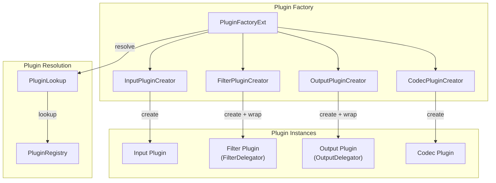
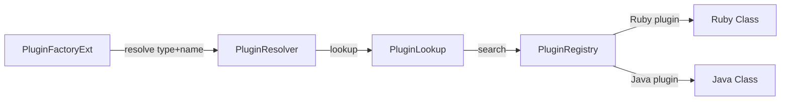

# Logstash 플러그인 시스템

Logstash의 확장성은 플러그인 시스템에 기반한다. Input, Filter, Output, Codec 4가지 유형의 플러그인이 표준화된 인터페이스를 통해 파이프라인에 조립되며, PluginFactory 패턴으로 런타임에 인스턴스화된다. 이 문서에서는 플러그인 기반 클래스 구조, PluginFactory/PluginRegistry 메커니즘, 생명주기, 그리고 커스텀 플러그인 개발 방법을 소스코드 수준에서 분석한다.

## 목차
- [1. 핵심 개념 (What)](#1-핵심-개념-what)
- [2. 왜 알아야 하는가 (Why)](#2-왜-알아야-하는가-why)
- [3. 내부 구현 분석 (How)](#3-내부-구현-분석-how)
- [4. 실전 예제](#4-실전-예제)
- [5. 정리](#5-정리)

---

## 1. 핵심 개념 (What)

### 플러그인 유형

Logstash 플러그인은 4가지 유형으로 분류되며, 각각 데이터 처리 파이프라인의 특정 단계를 담당한다:

| 유형 | 기반 클래스 | 역할 | 예시 |
|------|------------|------|------|
| **Input** | `LogStash::Inputs::Base` | 외부 소스에서 이벤트 수집 | beats, kafka, file, stdin |
| **Filter** | `LogStash::Filters::Base` | 이벤트 변환, 보강, 필터링 | grok, mutate, date, geoip |
| **Output** | `LogStash::Outputs::Base` | 처리된 이벤트를 목적지로 전송 | elasticsearch, stdout, s3 |
| **Codec** | `LogStash::Codecs::Base` | Input/Output의 데이터 인코딩/디코딩 | json, plain, multiline |

### 플러그인 계층 구조

```
LogStash::Plugin (최상위 기반 클래스)
  ├── LogStash::Inputs::Base
  ├── LogStash::Filters::Base
  ├── LogStash::Outputs::Base
  └── LogStash::Codecs::Base
```

모든 플러그인은 `LogStash::Plugin`을 최상위 부모로 공유하며, 이 클래스가 ID 관리, 메트릭, 설정 처리 등 공통 기능을 제공한다.

### 플러그인 생명주기

모든 플러그인은 동일한 생명주기를 따른다:

```
initialize -> register -> run(Input만) -> close
```

- **initialize**: 설정 파라미터 파싱 및 검증
- **register**: 리소스 할당, 연결 수립 (서브클래스에서 반드시 구현)
- **run**: Input 플러그인에서만 사용. 이벤트 수집 루프 실행
- **close**: 리소스 해제, 연결 종료

## 2. 왜 알아야 하는가 (Why)

### 운영 관점

- **플러그인 선택**: 동일 목적의 플러그인이 여러 개 있을 때(예: file vs filebeat) 내부 동작 차이를 이해하면 적절한 선택이 가능하다.
- **Thread-safety 이해**: Output 플러그인의 concurrency 모델(`:legacy`, `:single`, `:shared`)이 파이프라인 Worker 수와 상호작용하는 방식을 알아야 성능을 최적화할 수 있다.
- **문제 진단**: 플러그인 register 실패, 메트릭 이상 등의 문제를 추적하려면 생명주기 흐름을 이해해야 한다.

### 개발 관점

- 조직 고유의 데이터 소스/목적지에 맞는 커스텀 플러그인을 개발할 수 있다.
- 기존 플러그인을 포크하여 기능을 확장하거나 버그를 수정할 수 있다.
- PluginFactory의 동작을 이해하면 테스트 작성이 쉬워진다.

## 3. 내부 구현 분석 (How)

### 전체 아키텍처



### LogStash::Plugin - 최상위 기반 클래스

```
소스: /tmp/logstash/logstash-core/lib/logstash/plugin.rb
```

모든 플러그인의 공통 기능을 정의한다:

```ruby
class LogStash::Plugin
  include LogStash::Config::Mixin               # 설정 파싱
  include LogStash::Plugins::ECSCompatibilitySupport  # ECS 호환성
  include LogStash::Plugins::EventFactorySupport      # 이벤트 생성

  config :enable_metric, :validate => :boolean, :default => true
  config :id, :validate => :string

  def initialize(params = {})
    @params = LogStash::Util.deep_clone(params)
    @params["id"] ||= "#{self.class.config_name}_#{SecureRandom.uuid}"
  end

  def do_close
    @logger.debug("Closing", :plugin => self.class.name)
    begin
      close
    ensure
      LogStash::PluginMetadata.delete_for_plugin(self.id)
    end
  end

  def close
    # 서브클래스에서 오버라이드
  end

  def self.lookup(type, name)
    LogStash::PLUGIN_REGISTRY.lookup_pipeline_plugin(type, name)
  end

  def metric
    @metric_plugin ||= if @enable_metric
                         @metric.nil? ? LogStash::Instrument::NamespacedNullMetric.new : @metric
                       else
                         LogStash::Instrument::NamespacedNullMetric.new(@metric, :null)
                       end
  end
end
```

핵심 포인트:
- **ID 자동 생성**: 사용자가 `id`를 지정하지 않으면 `config_name_UUID` 형태로 자동 생성
- **메트릭 비활성화**: `enable_metric: false`로 개별 플러그인의 메트릭 수집 비활성화 가능
- **PluginMetadata**: 플러그인별 키-값 메타데이터 저장소 (예: Elasticsearch Output의 cluster_uuid)

### Input 기반 클래스

```
소스: /tmp/logstash/logstash-core/lib/logstash/inputs/base.rb
```

```ruby
class LogStash::Inputs::Base < LogStash::Plugin
  config :type, :validate => :string          # 이벤트 type 필드 설정
  config :codec, :validate => :codec, :default => "plain"  # 코덱 설정
  config :tags, :validate => :array           # 태그 추가
  config :add_field, :validate => :hash, :default => {}    # 필드 추가

  def initialize(params = {})
    super
    @threadable = false
    @stop_called = Concurrent::AtomicBoolean.new(false)
  end

  def register
    raise "#{self.class}#register must be overidden"
  end

  def stop
    # 서브클래스에서 오버라이드 (예: TCP 소켓 닫기)
  end

  def do_stop
    @stop_called.make_true
    stop
  end
end
```

Input 플러그인은 `run(queue)` 메서드를 구현하여 이벤트를 큐에 push한다. `stop` 메서드로 `run` 루프를 중단시킨다.

### Filter 기반 클래스

```
소스: /tmp/logstash/logstash-core/lib/logstash/filters/base.rb
```

```ruby
class LogStash::Filters::Base < LogStash::Plugin
  config :add_tag, :validate => :array, :default => []
  config :remove_tag, :validate => :array, :default => []
  config :add_field, :validate => :hash, :default => {}
  config :remove_field, :validate => :array, :default => []

  def register
    raise "#{self.class}#register must be overidden"
  end

  # 이벤트를 변환하는 핵심 메서드
  def filter(event)
    raise "#{self.class}#filter must be overidden"
  end

  # 성공 시 태그/필드 추가/제거 처리
  def filter_matched(event)
    LogStash::Util::Decorators.add_fields(@add_field, event, "filters/#{self.class.name}")
    LogStash::Util::Decorators.add_tags(@add_tag, event, "filters/#{self.class.name}")
    LogStash::Util::Decorators.remove_fields(@remove_field, event)
    LogStash::Util::Decorators.remove_tags(@remove_tag, event)
  end
end
```

Filter 플러그인은 `filter(event)` 메서드에서 이벤트를 변환하고, 성공 시 `filter_matched(event)`를 호출하여 공통 데코레이터 로직을 실행한다.

### Output 기반 클래스

```
소스: /tmp/logstash/logstash-core/lib/logstash/outputs/base.rb
```

```ruby
class LogStash::Outputs::Base < LogStash::Plugin
  config :codec, :validate => :codec, :default => "plain"
  config :workers, :type => :number, :default => 1

  # Concurrency 모델 설정
  def self.concurrency(type = nil)
    if type
      @concurrency = type
    else
      @concurrency || :legacy
    end
  end

  def initialize(params = {})
    super
    @single_worker_mutex = Mutex.new
    @receives_encoded = self.methods.include?(:multi_receive_encoded)
  end

  def register
    raise "#{self.class}#register must be overidden"
  end

  def receive(event)
    raise "#{self.class}#receive must be overidden"
  end

  def multi_receive(events)
    events.each { |event| receive(event) }
  end
end
```

Output의 Concurrency 모델:

| 모델 | 동작 | 사용 사례 |
|------|------|----------|
| `:legacy` | 기본값. Worker당 별도 인스턴스 | 이전 버전 호환 |
| `:single` | 단일 인스턴스, Mutex로 직렬화 | Thread-unsafe Output |
| `:shared` | 단일 인스턴스, 동시 접근 허용 | Thread-safe Output (elasticsearch 등) |

### PluginFactoryExt - 플러그인 팩토리

```
소스: /tmp/logstash/logstash-core/src/main/java/org/logstash/plugins/factory/PluginFactoryExt.java
```

`PluginFactoryExt`는 PipelineIR의 플러그인 정의를 실제 플러그인 인스턴스로 변환하는 팩토리 클래스다:

```java
@JRubyClass(name = "PluginFactory")
public final class PluginFactoryExt extends RubyBasicObject
    implements RubyIntegration.PluginFactory {

    // 플러그인 ID 중복 검사용
    private final transient Collection<String> pluginsById = ConcurrentHashMap.newKeySet();

    private transient PipelineIR lir;
    private transient PluginResolver pluginResolver;

    // 유형별 플러그인 생성자 레지스트리
    private final transient Map<PluginLookup.PluginType, AbstractPluginCreator<? extends Plugin>>
        pluginCreatorsRegistry = new HashMap<>(4);
```

초기화 시 유형별 Creator를 등록한다:

```java
PluginFactoryExt init(final PipelineIR lir, ...) {
    this.pluginCreatorsRegistry.put(PluginLookup.PluginType.INPUT,  new InputPluginCreator(this));
    this.pluginCreatorsRegistry.put(PluginLookup.PluginType.CODEC,  new CodecPluginCreator());
    this.pluginCreatorsRegistry.put(PluginLookup.PluginType.FILTER, new FilterPluginCreator());
    this.pluginCreatorsRegistry.put(PluginLookup.PluginType.OUTPUT, new OutputPluginCreator(this));
    this.configVariables = ConfigVariableExpander.withoutSecret(envVars);
    return this;
}
```

플러그인 빌드 인터페이스:

```java
// Input 빌드
public IRubyObject buildInput(RubyString name, IRubyObject args, SourceWithMetadata source) {
    return plugin(context, PluginLookup.PluginType.INPUT, name.asJavaString(), (RubyHash) args, source);
}

// Filter 빌드 - FilterDelegator로 래핑
public AbstractFilterDelegatorExt buildFilter(RubyString name, IRubyObject args, SourceWithMetadata source) {
    return (AbstractFilterDelegatorExt) plugin(context, PluginLookup.PluginType.FILTER, ...);
}

// Output 빌드 - OutputDelegator로 래핑
public AbstractOutputDelegatorExt buildOutput(RubyString name, IRubyObject args, SourceWithMetadata source) {
    return (AbstractOutputDelegatorExt) plugin(context, PluginLookup.PluginType.OUTPUT, ...);
}
```

Filter 플러그인은 `FilterDelegator`로 래핑되어 메트릭 수집, 스레드 안전성 관리가 추가된다:

```java
public static IRubyObject filterDelegator(final ThreadContext context,
                                          final IRubyObject recv, final IRubyObject... args) {
    final RubyClass filterDelegatorClass = (RubyClass) args[0];
    final RubyClass klass = (RubyClass) args[1];
    final RubyHash arguments = (RubyHash) args[2];
    final AbstractMetricExt typeScopedMetric = (AbstractMetricExt) args[3];
    final ExecutionContextExt executionContext = (ExecutionContextExt) args[4];

    // 플러그인 인스턴스 생성 (ExecutionContext 주입)
    final IRubyObject filterInstance = ContextualizerExt.initializePlugin(
        context, executionContext, klass, arguments);

    // 메트릭 네임스페이스 설정
    final RubyString id = (RubyString) arguments.op_aref(context, ID_KEY);
    filterInstance.callMethod(context, "metric=",
        typeScopedMetric.namespace(context, id.intern()));

    return filterDelegatorClass.newInstance(context, filterInstance, id, Block.NULL_BLOCK);
}
```

### PluginResolver와 PluginRegistry

플러그인 해석 체인:



`PluginResolver`는 함수형 인터페이스로 플러그인 타입과 이름을 클래스로 해석한다:

```java
@FunctionalInterface
public interface PluginResolver {
    PluginLookup.PluginClass resolve(PluginLookup.PluginType type, String name);
}
```

`PluginRegistry`는 설치된 모든 플러그인의 싱글턴 레지스트리로, Ruby Gem과 Java SPI 두 가지 경로로 플러그인을 발견한다.

## 4. 실전 예제

### 예제 1: Java 기반 커스텀 Filter 플러그인

```java
// src/main/java/org/logstash/plugins/filters/EnrichCompanyFilter.java
@LogstashPlugin(name = "enrich_company")
public class EnrichCompanyFilter implements Filter {

    public static final PluginConfigSpec<String> SOURCE_FIELD =
        PluginConfigSpec.stringSetting("source_field", "company_id");

    public static final PluginConfigSpec<String> TARGET_FIELD =
        PluginConfigSpec.stringSetting("target_field", "company_info");

    private String sourceField;
    private String targetField;
    private final String id;
    private CompanyLookupService lookupService;

    public EnrichCompanyFilter(String id, Configuration config, Context context) {
        this.id = id;
        this.sourceField = config.get(SOURCE_FIELD);
        this.targetField = config.get(TARGET_FIELD);
        this.lookupService = new CompanyLookupService();
    }

    @Override
    public Collection<Event> filter(Collection<Event> events, FilterMatchListener matchListener) {
        for (Event event : events) {
            String companyId = (String) event.getField(sourceField);
            if (companyId != null) {
                Map<String, Object> companyInfo = lookupService.lookup(companyId);
                if (companyInfo != null) {
                    event.setField(targetField, companyInfo);
                    matchListener.filterMatched(event);
                }
            }
        }
        return events;
    }

    @Override
    public Collection<PluginConfigSpec<?>> configSchema() {
        return Arrays.asList(SOURCE_FIELD, TARGET_FIELD);
    }

    @Override
    public String getId() {
        return this.id;
    }
}
```

### 예제 2: 플러그인 메트릭 모니터링

```bash
# 파이프라인별 플러그인 메트릭 조회
curl -s localhost:9600/_node/stats/pipelines?pretty | jq '
  .pipelines["main-pipeline"].plugins | {
    inputs: [.inputs[] | {
      id: .id, name: .name,
      events_out: .events.out,
      queue_push_duration_ms: .events.queue_push_duration_in_millis
    }],
    filters: [.filters[] | {
      id: .id, name: .name,
      events_in: .events.in,
      events_out: .events.out,
      duration_ms: .events.duration_in_millis,
      matches: .matches,
      failures: .failures
    }],
    outputs: [.outputs[] | {
      id: .id, name: .name,
      events_in: .events.in,
      events_out: .events.out,
      duration_ms: .events.duration_in_millis
    }]
  }'
```

플러그인 성능 진단 기준:

| 메트릭 | 의미 | 대응 방안 |
|--------|------|----------|
| Filter의 `duration_in_millis` 높음 | CPU-bound 처리 병목 | grok 패턴 최적화 또는 dissect로 대체 |
| Output의 `duration_in_millis` 높음 | I/O 병목 (네트워크/디스크) | batch size 증가 또는 Output 분리 |
| Input의 `queue_push_duration` 높음 | Queue 포화 (Worker 처리 속도 < 입력 속도) | Worker 수 증가 또는 Queue 크기 확대 |
| Filter의 `failures` 증가 | 파싱 오류 또는 예외 | 로그 확인 후 패턴 또는 입력 데이터 수정 |

## 5. 정리

| 항목 | 설명 |
|------|------|
| LogStash::Plugin | 모든 플러그인의 최상위 기반 클래스. ID, 메트릭, 설정 처리 공통 기능 제공 |
| Input Plugin | `run(queue)` 메서드로 이벤트 수집. `stop`으로 루프 중단 |
| Filter Plugin | `filter(event)` 메서드로 이벤트 변환. `filter_matched`로 데코레이터 처리 |
| Output Plugin | `receive(event)` / `multi_receive(events)`로 이벤트 전송. Concurrency 모델 지원 |
| Codec Plugin | Input/Output에 종속. 데이터 직렬화/역직렬화 담당 |
| PluginFactoryExt | PipelineIR 정의를 플러그인 인스턴스로 변환. 유형별 Creator 패턴 |
| PluginResolver | 플러그인 타입+이름을 클래스로 해석하는 함수형 인터페이스 |
| PluginRegistry | 설치된 모든 플러그인의 싱글턴 레지스트리. Ruby Gem + Java SPI 탐색 |
| FilterDelegator | Filter 플러그인을 래핑하여 메트릭 수집, 스레드 안전성 관리 추가 |
| 생명주기 | initialize -> register -> run(Input) -> close. do_close 시 메타데이터 정리 |

---
*마지막 업데이트: 2026년 03월*
