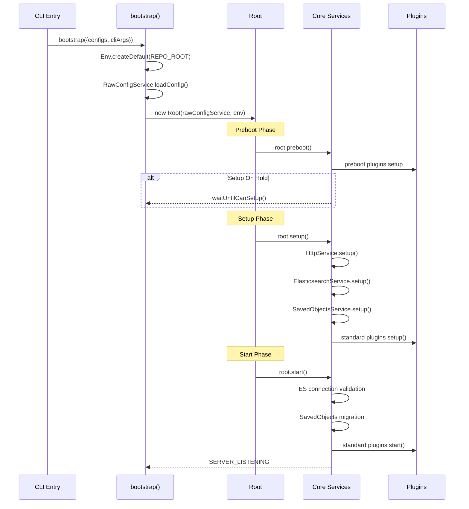

# Kibana 플랫폼 아키텍처

Kibana는 Node.js 기반의 플러그인 플랫폼으로, Core Services가 Lifecycle 단계별로 초기화되며 Elasticsearch 클라이언트 통합, SavedObjects 프레임워크, HTTP 서버 등의 핵심 서비스를 플러그인에게 제공한다.

## 목차
- [1. 핵심 개념 (What)](#1-핵심-개념-what)
- [2. 왜 알아야 하는가 (Why)](#2-왜-알아야-하는가-why)
- [3. 내부 구현 분석 (How)](#3-내부-구현-분석-how)
- [4. 실전 예제](#4-실전-예제)
- [5. 정리](#5-정리)

---

## 1. 핵심 개념 (What)

### Core Services 구조

Kibana의 Core는 플러그인이 의존하는 기반 서비스들의 집합이다. 주요 Core Service는 다음과 같다.

| Core Service | 역할 |
|-------------|------|
| **HttpService** | Hapi 기반 HTTP 서버, 라우팅 및 인증 |
| **ElasticsearchService** | ES 클라이언트 생성 및 관리 |
| **SavedObjectsService** | Kibana 오브젝트(dashboard, visualization 등) CRUD |
| **PluginsService** | 플러그인 Discovery, Lifecycle 관리 |
| **ConfigService** | YAML 설정 파일 로드 및 검증 |
| **LoggingService** | 구조화된 로깅 |
| **SecurityService** | 인증/인가 통합 |
| **AnalyticsService** | 텔레메트리 수집 |

### Lifecycle 단계

Kibana는 세 단계의 Lifecycle을 통해 순차적으로 초기화된다.

1. **Preboot**: 최소한의 서비스만 시작, Interactive Setup 지원
2. **Setup**: 모든 Core Service 구성, 플러그인 setup 호출
3. **Start**: ES 연결 확인 후 전체 서비스 시작, 플러그인 start 호출

### SavedObjects 프레임워크

Kibana의 상태(dashboard, visualization, index-pattern 등)를 Elasticsearch의 `.kibana` 인덱스에 저장하고 관리하는 프레임워크다. 타입 등록, CRUD API, 마이그레이션, 멀티 네임스페이스 지원을 제공한다.

### Elasticsearch 클라이언트 통합

`ElasticsearchService`가 `ClusterClient`를 생성하여 내부 사용자(`asInternalUser`)와 요청별 사용자(`asScoped`) 두 가지 방식의 ES 접근을 제공한다.

## 2. 왜 알아야 하는가 (Why)

### 플러그인 개발의 기초

모든 Kibana 플러그인은 Core Services에 의존한다. Lifecycle 단계를 이해하지 못하면 setup에서 사용할 수 없는 서비스를 start에서 호출하거나, 의존성 주입 순서를 잘못 설정하는 오류가 발생한다.

### 운영 문제 진단

Kibana 기동 실패, SavedObjects 마이그레이션 오류, ES 연결 문제 등 대부분의 운영 이슈가 Core Services 레벨에서 발생한다. 내부 아키텍처를 이해하면 로그 분석과 문제 해결이 수월해진다.

### 성능 최적화

SavedObjects의 bulk 연산, ES 클라이언트의 연결 풀 관리, HTTP 서버의 payload 제한 등을 적절히 설정하려면 내부 동작 방식을 알아야 한다.

## 3. 내부 구현 분석 (How)

### 부트스트랩 프로세스



부트스트랩의 핵심 코드 (`bootstrap.ts:29-131`):

```typescript
// bootstrap.ts - 핵심 Lifecycle 흐름
export async function bootstrap({ configs, cliArgs, applyConfigOverrides }) {
  const env = Env.createDefault(REPO_ROOT, { configs, cliArgs, repoPackages });
  const rawConfigService = new RawConfigService(env.configs, applyConfigOverrides);
  rawConfigService.loadConfig();

  const root = new Root(rawConfigService, env, onRootShutdown);

  // Phase 1: Preboot
  const prebootContract = await root.preboot();
  if (prebootContract?.preboot.isSetupOnHold()) {
    await preboot.waitUntilCanSetup();
  }

  // Phase 2: Setup
  await root.setup();

  // Phase 3: Start
  await root.start();

  process.send(['SERVER_LISTENING']);
}
```

### ElasticsearchService 내부 구조

```
 ElasticsearchService Lifecycle
 ┌─────────────────────────────────────────────────┐
 │                                                 │
 │  preboot()                                      │
 │    └─ createClient() for preboot plugins        │
 │                                                 │
 │  setup(deps)                                    │
 │    ├─ AgentManager 생성 (HTTP/HTTPS Agent 풀)   │
 │    ├─ ClusterClient('data') 생성                │
 │    │    ├─ asInternalUser (내부 사용)            │
 │    │    └─ asScoped(req) (요청별 사용자)         │
 │    ├─ pollEsNodesVersion() 시작                 │
 │    │    └─ 노드 버전 호환성 모니터링             │
 │    ├─ getClusterInfo$() 시작                    │
 │    └─ calculateStatus$() → 서비스 상태 공개     │
 │                                                 │
 │  start()                                        │
 │    ├─ isValidConnection() 대기                  │
 │    ├─ isInlineScriptingEnabled() 확인           │
 │    └─ getElasticsearchCapabilities()            │
 │                                                 │
 │  stop()                                         │
 │    └─ client.close()                            │
 └─────────────────────────────────────────────────┘
```

`ElasticsearchService` (`elasticsearch_service.ts:60-273`)의 핵심:

```typescript
// elasticsearch_service.ts:105-168 - setup 단계
public async setup(deps: SetupDeps) {
  const config = await firstValueFrom(this.config$);

  // HTTP Agent 관리자 생성
  const agentManager = this.getAgentManager(config);

  // 메인 ClusterClient 생성
  this.client = this.createClusterClient('data', config);

  // ES 노드 버전 호환성 폴링
  const esNodesCompatibility$ = pollEsNodesVersion({
    kibanaVersion: this.kibanaVersion,
    healthCheckInterval: config.healthCheckDelay.asMilliseconds(),
    internalClient: this.client.asInternalUser,
  }).pipe(takeUntil(this.stop$));

  return {
    esNodesCompatibility$,
    status$: calculateStatus$(esNodesCompatibility$),
    setUnauthorizedErrorHandler: (handler) => { ... },
  };
}
```

`ClusterClient`는 두 가지 접근 모드를 제공한다:
- `asInternalUser`: Kibana 내부 서비스용 (kibana_system 권한)
- `asScoped(request)`: 요청한 사용자의 인증 정보로 ES에 접근

### SavedObjects 프레임워크

```
 SavedObjects Architecture
 ┌──────────────────────────────────────────────┐
 │  SavedObjects API                            │
 │  ┌────────────────────────────────────┐      │
 │  │ SavedObjectsRepository             │      │
 │  │  ├─ create() / bulkCreate()        │      │
 │  │  ├─ get() / bulkGet()              │      │
 │  │  ├─ find() / search()              │      │
 │  │  ├─ update() / bulkUpdate()        │      │
 │  │  ├─ delete() / bulkDelete()        │      │
 │  │  ├─ resolve() / bulkResolve()      │      │
 │  │  └─ openPointInTimeForType()       │      │
 │  └────────────┬───────────────────────┘      │
 │               │                              │
 │  ┌────────────▼───────────────────────┐      │
 │  │ Extensions                          │      │
 │  │  ├─ SecurityExtension (RBAC)        │      │
 │  │  ├─ SpacesExtension (멀티테넌시)    │      │
 │  │  └─ EncryptionExtension (암호화)    │      │
 │  └────────────┬───────────────────────┘      │
 │               │                              │
 │  ┌────────────▼───────────────────────┐      │
 │  │ Elasticsearch .kibana Index         │      │
 │  │  ├─ .kibana_8.x.x_001              │      │
 │  │  ├─ .kibana_analytics              │      │
 │  │  └─ .kibana_security_solution      │      │
 │  └────────────────────────────────────┘      │
 └──────────────────────────────────────────────┘
```

SavedObjects Repository는 Elasticsearch를 백엔드 저장소로 사용하며, 각 오브젝트에 `type`, `id`, `attributes`, `references`, `namespaces` 필드를 관리한다. 주요 API 파일은 `api-server-internal/src/lib/apis/` 하위에 개별 연산별로 분리되어 있다.

### HTTP 서버

Kibana의 HTTP 서버는 Hapi.js 프레임워크 기반이며, `InternalHttpServiceSetup`을 통해 플러그인에 라우트 등록 API를 제공한다. 요청 처리 흐름:

```
  HTTP Request
       │
       ▼
  Hapi Server (port 5601)
       │
       ├─ Auth Handler (인증/인가)
       │
       ├─ Route Handler
       │     ├─ Core Routes (/api/status, /api/saved_objects/*)
       │     └─ Plugin Routes (/api/*, /internal/*)
       │
       └─ Response (JSON/Stream)
```

## 4. 실전 예제

### Kibana 서버 설정

```yaml
# kibana.yml - Core 서비스 관련 주요 설정
server.host: "0.0.0.0"
server.port: 5601
server.basePath: "/kibana"
server.rewriteBasePath: true
server.maxPayload: 1048576  # 1MB

# Elasticsearch 연결
elasticsearch.hosts: ["https://es-node1:9200", "https://es-node2:9200"]
elasticsearch.username: "kibana_system"
elasticsearch.password: "${ES_KIBANA_PASSWORD}"
elasticsearch.ssl.certificateAuthorities: ["/etc/kibana/certs/ca.crt"]
elasticsearch.requestTimeout: 30000
elasticsearch.pingTimeout: 30000

# SavedObjects 마이그레이션
migrations.batchSize: 1000
migrations.maxBatchSizeBytes: 104857600  # 100MB

# 로깅
logging.root.level: info
logging.appenders.default:
  type: console
  layout:
    type: json
```

### 플러그인에서 Core Services 사용

```typescript
// 플러그인에서 Core Services 활용 예시
import { CoreSetup, CoreStart, Plugin } from '@kbn/core/server';

export class MyPlugin implements Plugin {
  setup(core: CoreSetup) {
    // HTTP 라우트 등록 (Setup 단계)
    const router = core.http.createRouter();
    router.get(
      { path: '/api/my_plugin/data', validate: false },
      async (context, request, response) => {
        // 요청 사용자 권한으로 ES 쿼리
        const esClient = (await context.core).elasticsearch.client;
        const result = await esClient.asCurrentUser.search({
          index: 'my-index',
          body: { query: { match_all: {} } },
        });
        return response.ok({ body: result });
      }
    );

    // SavedObjects 타입 등록 (Setup 단계에서만 가능)
    core.savedObjects.registerType({
      name: 'my-custom-object',
      hidden: false,
      namespaceType: 'single',
      mappings: {
        properties: {
          title: { type: 'text' },
          config: { type: 'object', dynamic: false },
        },
      },
    });
  }

  start(core: CoreStart) {
    // SavedObjects 클라이언트 사용 (Start 단계)
    const soClient = core.savedObjects.createInternalRepository();
    // ES 클라이언트 사용 (Start 단계)
    const esClient = core.elasticsearch.client.asInternalUser;
  }
}
```

## 5. 정리

| 항목 | 설명 |
|------|------|
| Lifecycle | preboot → setup → start 3단계, 각 단계별 사용 가능한 API가 다름 |
| ElasticsearchService | ClusterClient 기반, `asInternalUser`/`asScoped` 이중 접근 모드 |
| SavedObjects | `.kibana` 인덱스 기반 CRUD, Security/Spaces/Encryption Extension 지원 |
| HTTP Server | Hapi.js 기반, 플러그인별 Router 생성 및 라우트 등록 |
| ConfigService | YAML 설정 로드 → Observable 기반 동적 갱신, SIGHUP 시 reload |
| Bootstrap | `Env.createDefault()` → `RawConfigService` → `Root.preboot/setup/start` |
| 핵심 소스 | `bootstrap.ts`, `elasticsearch_service.ts`, `saved-objects/api-server-internal/` |

---
*마지막 업데이트: 2026년 03월*
