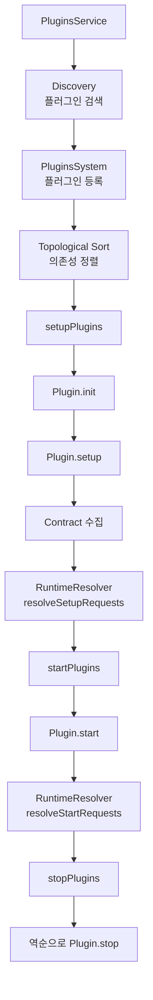

# Kibana 플러그인 시스템

Kibana의 플러그인 시스템은 Core Platform 위에서 동작하며, Plugin Lifecycle(setup/start/stop)과 Contract 패턴을 통해 플러그인 간 느슨한 결합을 실현한다. 위상 정렬(topological sort)로 의존성 순서를 보장하고, 런타임 Contract Resolver로 동적 의존성도 지원한다.

## 목차
- [1. 핵심 개념 (What)](#1-핵심-개념-what)
- [2. 왜 알아야 하는가 (Why)](#2-왜-알아야-하는가-why)
- [3. 내부 구현 분석 (How)](#3-내부-구현-분석-how)
- [4. 실전 예제](#4-실전-예제)
- [5. 정리](#5-정리)

---

## 1. 핵심 개념 (What)

### Plugin Lifecycle

모든 Kibana 플러그인은 세 가지 Lifecycle 메서드를 구현한다.

| 메서드 | 시점 | 역할 |
|--------|------|------|
| `setup(core, plugins)` | 서버 초기화 | 라우트 등록, SavedObject 타입 등록, 타 플러그인 Contract 소비 |
| `start(core, plugins)` | ES 연결 완료 후 | 서비스 시작, ES 클라이언트 사용, SavedObjects CRUD |
| `stop()` | 서버 종료 시 | 리소스 정리, 타이머 해제 |

Preboot 플러그인은 `setup`과 `stop`만 가지며, `start`가 없다.

### Contract 패턴

각 플러그인은 `setup`과 `start`에서 Contract 객체를 반환한다. 이 Contract는 다른 플러그인이 의존성으로 소비할 수 있는 Public API이다.

```typescript
// Plugin 인터페이스 (types.ts:291-302)
export interface Plugin<TSetup, TStart, TPluginsSetup, TPluginsStart> {
  setup(core: CoreSetup<TPluginsStart, TStart>, plugins: TPluginsSetup): TSetup;
  start(core: CoreStart, plugins: TPluginsStart): TStart;
  stop?(): MaybePromise<void>;
}
```

### Plugin Manifest

모든 플러그인은 `kibana.jsonc` 매니페스트 파일을 가지며, 여기서 id, 의존성, 타입 등을 선언한다.

주요 매니페스트 필드:
- `id`: 플러그인 식별자 (camelCase)
- `type`: `standard` 또는 `preboot`
- `requiredPlugins`: 필수 의존 플러그인 목록
- `optionalPlugins`: 선택적 의존 플러그인 목록
- `runtimePluginDependencies`: 런타임에 동적으로 해결되는 의존성
- `server`: 서버사이드 코드 포함 여부
- `ui`: 클라이언트사이드 코드 포함 여부

### 주요 내장 플러그인

| 플러그인 | 역할 |
|----------|------|
| **data** | 검색, 쿼리, 필터, 인덱스 패턴 서비스 |
| **discover** | 문서 탐색 UI |
| **dashboard** | 대시보드 생성/관리 |
| **visualizations** | 차트/시각화 프레임워크 |
| **lens** | 드래그앤드롭 시각화 도구 |
| **maps** | 지도 기반 시각화 |
| **alerting** | 알림 규칙 및 액션 |
| **security** | RBAC, 인증/인가 |

## 2. 왜 알아야 하는가 (Why)

### 확장 가능한 아키텍처 이해

Kibana의 모든 기능(Discover, Dashboard, Lens 등)이 플러그인으로 구현되어 있다. 플러그인 시스템을 이해하면 Kibana의 전체 아키텍처를 파악할 수 있고, 커스텀 기능을 안전하게 추가할 수 있다.

### 의존성 문제 해결

플러그인 간 순환 의존성, 누락된 필수 플러그인, 비동기 setup 타임아웃 등의 문제가 발생할 때 PluginsSystem의 위상 정렬 로직과 Contract 해결 과정을 이해하면 디버깅이 가능하다.

### 올바른 Lifecycle 활용

setup에서 사용해야 할 API를 start에서 호출하거나, start에서만 사용 가능한 서비스를 setup에서 접근하면 오류가 발생한다. 각 단계의 정확한 역할을 알아야 안정적인 플러그인을 만들 수 있다.

## 3. 내부 구현 분석 (How)

### PluginsSystem 전체 흐름



### PluginWrapper - 플러그인 래퍼

`PluginWrapper` (`plugin.ts:50-262`)는 각 플러그인 모듈을 감싸는 경량 래퍼로, Lifecycle 메서드 호출과 DI Container 통합을 담당한다.

```typescript
// plugin.ts:107-118 - 초기화
public async init() {
  this.definition = await this.getPluginDefinition();
  // 서버 디렉토리에서 동적 import
  this.instance = await this.createPluginInstance();
  // plugin 또는 module 중 하나는 반드시 export해야 함
}

// plugin.ts:127-149 - setup 호출
public setup(setupContext, plugins) {
  // Preboot 플러그인이면 preboot context 전달
  if (this.isPrebootPluginInstance(this.instance)) {
    return this.instance.setup(setupContext as CorePreboot, plugins);
  }
  // DI 모듈이 있으면 Container에 로드
  if (this.definition.module) {
    this.container = setupContext.injection.getContainer();
    this.container.loadSync(this.definition.module);
  }
  // plugin.setup() 또는 Container의 Setup 토큰 반환
  return [
    this.instance?.setup(setupContext, plugins),
    this.container?.get(Setup),
  ].find(Boolean)!;
}
```

### PluginsSystem - 위상 정렬과 Lifecycle 관리

`PluginsSystem` (`plugins_system.ts:32-311`)이 플러그인 등록, 정렬, Lifecycle 실행을 관리한다.

```typescript
// plugins_system.ts:91-169 - Setup 실행
public async setupPlugins(deps) {
  const contracts = new Map();

  // 런타임 의존성 맵 구축
  const runtimeDependencies = buildPluginRuntimeDependencyMap(this.plugins);
  this.runtimeResolver.setDependencyMap(runtimeDependencies);

  // 위상 정렬된 순서로 plugin setup 실행
  const sortedPlugins = [...this.getTopologicallySortedPluginNames()]
    .filter(([_, plugin]) => plugin.includesServerPlugin);

  for (const [pluginName, plugin] of sortedPlugins) {
    // 의존 플러그인의 Contract 수집
    const pluginDepContracts = collectDependencyContracts(plugin, contracts);

    // Context 생성 (preboot vs standard)
    const pluginSetupContext = createPluginSetupContext({ deps, plugin });

    // 초기화 및 setup 실행
    await plugin.init();
    const contract = plugin.setup(pluginSetupContext, pluginDepContracts);

    // 비동기 setup은 10초 타임아웃 적용
    if (isPromise(contract)) {
      const result = await withTimeout({ promise: contract, timeoutMs: 10000 });
      if (result.timedout) {
        throw new Error(`Setup of "${pluginName}" didn't complete in 10sec.`);
      }
    }

    contracts.set(pluginName, contract);
  }

  // 모든 setup Contract를 RuntimeResolver에 전달
  this.runtimeResolver.resolveSetupRequests(contracts);
  return contracts;
}
```

### Kahn's Algorithm 기반 위상 정렬

```typescript
// plugins_system.ts:321-388 - 위상 정렬 (Kahn's Algorithm)
const getTopologicallySortedPluginNames = (plugins) => {
  // 의존성 그래프 복제
  const graph = new Map(
    [...plugins.entries()].map(([name, plugin]) => [
      name,
      new Set([...plugin.requiredPlugins,
               ...plugin.optionalPlugins.filter(d => plugins.has(d))]),
    ])
  );

  // 의존성이 없는 노드부터 시작
  const ready = [...graph.keys()]
    .filter(name => graph.get(name)!.size === 0);

  const sorted = new Set();
  while (ready.length > 0) {
    const current = ready.pop()!;
    graph.delete(current);
    sorted.add(current);

    // 정렬된 노드를 다른 노드의 의존성에서 제거
    for (const [name, deps] of graph) {
      if (deps.delete(current) && deps.size === 0) {
        ready.push(name);
      }
    }
  }

  // 그래프에 남은 노드가 있으면 순환 의존성
  if (graph.size > 0) {
    const cycles = findCircularDependencies(graph);
    throw new Error(`Circular dependencies detected: ${cycles}`);
  }

  return sorted;
};
```

### Stop - 역순 종료

```typescript
// plugins_system.ts:233-272 - 역순 종료
public async stopPlugins() {
  // 역의존성 맵 구축
  const reverseDependencyMap = buildReverseDependencyMap(this.plugins);

  // setup 역순으로 stop 실행
  for (let i = this.satupPlugins.length - 1; i > -1; i--) {
    const pluginName = this.satupPlugins[i];
    // 의존하는 플러그인이 모두 stop된 후 실행
    const dependantPromises = reverseDependencyMap.get(pluginName)!
      .map(dep => pluginStopPromiseMap.get(dep)!);

    await Promise.all(dependantPromises);
    // 15초 타임아웃 적용
    await withTimeout({ promise: plugin.stop(), timeoutMs: 15000 });
  }
}
```

### 플러그인 아키텍처 전체도

```
 Kibana Plugin Architecture
 ┌──────────────────────────────────────────────────────┐
 │  Kibana Core Platform                                │
 │  ┌─────────────────────────────────────────────┐     │
 │  │ PluginsService                              │     │
 │  │  ├─ Discovery (파일시스템 스캔)             │     │
 │  │  ├─ PluginsSystem (preboot)                 │     │
 │  │  │    └─ Preboot Plugins                    │     │
 │  │  └─ PluginsSystem (standard)                │     │
 │  │       ├─ Topological Sort                   │     │
 │  │       ├─ RuntimePluginContractResolver      │     │
 │  │       └─ Plugin Lifecycle 관리              │     │
 │  └─────────────────────────────────────────────┘     │
 │                                                      │
 │  ┌─────────────────────────────────────────────┐     │
 │  │ Plugin Instance (PluginWrapper)             │     │
 │  │  ├─ manifest (kibana.jsonc)                 │     │
 │  │  ├─ server/ (서버사이드 코드)               │     │
 │  │  │    ├─ plugin.ts (Plugin 구현)            │     │
 │  │  │    └─ index.ts (config + initializer)    │     │
 │  │  ├─ public/ (클라이언트사이드 코드)         │     │
 │  │  └─ DI Container (optional)                 │     │
 │  └─────────────────────────────────────────────┘     │
 │                                                      │
 │  Core Services                                       │
 │  ┌──────┐ ┌──────┐ ┌────────┐ ┌──────────────┐     │
 │  │ HTTP │ │  ES  │ │ Saved  │ │  Security    │     │
 │  │      │ │Client│ │Objects │ │              │     │
 │  └──────┘ └──────┘ └────────┘ └──────────────┘     │
 └──────────────────────────────────────────────────────┘
```

## 4. 실전 예제

### 기본 플러그인 구조

```
my_plugin/
  ├── kibana.jsonc          # 매니페스트
  ├── server/
  │   ├── index.ts          # config + plugin export
  │   ├── plugin.ts         # Plugin 클래스 구현
  │   └── routes/
  │       └── index.ts      # API 라우트 정의
  └── public/
      ├── index.ts          # 클라이언트 plugin export
      └── plugin.ts         # 클라이언트 Plugin 클래스
```

```json
// kibana.jsonc - 매니페스트 예시
{
  "id": "myPlugin",
  "version": "1.0.0",
  "kibanaVersion": "kibana",
  "type": "standard",
  "server": true,
  "ui": true,
  "requiredPlugins": ["data"],
  "optionalPlugins": ["security"],
  "owner": {
    "name": "My Team",
    "githubTeam": "my-team"
  }
}
```

### 플러그인 구현 - Contract 패턴 활용

```typescript
// server/plugin.ts
import { CoreSetup, CoreStart, Plugin, Logger } from '@kbn/core/server';
import { DataPluginSetup } from '@kbn/data-plugin/server';

// Setup Contract: 다른 플러그인에게 제공하는 API
interface MyPluginSetup {
  registerCustomProcessor: (name: string, handler: Function) => void;
}

// Start Contract
interface MyPluginStart {
  getProcessors: () => Map<string, Function>;
}

// 의존 플러그인의 Contract 타입
interface PluginsSetup {
  data: DataPluginSetup;
  security?: SecurityPluginSetup;  // optional
}

export class MyPlugin implements Plugin<MyPluginSetup, MyPluginStart, PluginsSetup> {
  private readonly processors = new Map<string, Function>();
  private readonly logger: Logger;

  constructor(context: PluginInitializerContext) {
    this.logger = context.logger.get();
  }

  setup(core: CoreSetup, plugins: PluginsSetup): MyPluginSetup {
    this.logger.info('Setting up MyPlugin');

    // data 플러그인의 검색 기능 활용
    plugins.data.search.registerSearchStrategy('myStrategy', {
      search: async (request, options, deps) => { /* ... */ },
    });

    // HTTP 라우트 등록
    const router = core.http.createRouter();
    router.post(
      { path: '/api/my_plugin/process', validate: { body: schema.any() } },
      async (context, request, response) => {
        return response.ok({ body: { processed: true } });
      }
    );

    // Setup Contract 반환 - 다른 플러그인이 사용 가능
    return {
      registerCustomProcessor: (name, handler) => {
        this.processors.set(name, handler);
      },
    };
  }

  start(core: CoreStart): MyPluginStart {
    this.logger.info(`Starting MyPlugin with ${this.processors.size} processors`);

    return {
      getProcessors: () => this.processors,
    };
  }

  stop() {
    this.processors.clear();
  }
}
```

## 5. 정리

| 항목 | 설명 |
|------|------|
| Plugin Lifecycle | `init()` → `setup()` → `start()` → `stop()`, 각 단계별 Core API 제공 |
| Contract 패턴 | setup/start 반환값이 다른 플러그인의 의존성으로 주입됨 |
| 위상 정렬 | Kahn's Algorithm으로 의존성 순서 보장, 순환 의존성 감지 |
| PluginWrapper | 플러그인 모듈 로드, DI Container 통합, Lifecycle 메서드 호출 |
| PluginsSystem | preboot/standard 두 시스템, 비동기 setup 10초/stop 15초 타임아웃 |
| RuntimeResolver | `runtimePluginDependencies`를 위한 동적 Contract 해결 |
| 핵심 소스 | `plugins_system.ts`, `plugin.ts`, `types.ts` |

---
*마지막 업데이트: 2026년 03월*
