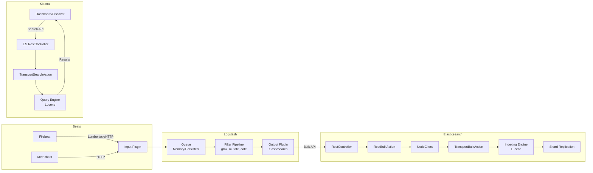

# ELK 데이터 흐름 End-to-End

ELK Stack에서 데이터는 Beats(수집) → Logstash(변환) → Elasticsearch(저장/검색) → Kibana(시각화)의 파이프라인을 거친다. 이 문서에서는 각 컴포넌트 내부의 데이터 처리 경로와 REST API 계층의 동작 원리를 분석한다.

## 목차
- [1. 핵심 개념 (What)](#1-핵심-개념-what)
- [2. 왜 알아야 하는가 (Why)](#2-왜-알아야-하는가-why)
- [3. 내부 구현 분석 (How)](#3-내부-구현-분석-how)
- [4. 실전 예제](#4-실전-예제)
- [5. 정리](#5-정리)

---

## 1. 핵심 개념 (What)

### 전체 데이터 흐름 개요

```
 ┌─────────┐    ┌──────────┐    ┌───────────────┐    ┌────────┐
 │  Beats  │───▶│ Logstash │───▶│ Elasticsearch │◀──▶│ Kibana │
 │(Filebeat│    │          │    │               │    │        │
 │Metricbt)│    │ Input    │    │ REST API      │    │ Saved  │
 │         │    │ Filter   │    │ Indexing      │    │ Objects│
 │         │    │ Output   │    │ Search        │    │ Viz    │
 └─────────┘    └──────────┘    └───────────────┘    └────────┘
     수집            변환         저장 / 검색          시각화
```

### 각 단계의 핵심 역할

| 단계 | 컴포넌트 | 핵심 역할 |
|------|----------|-----------|
| 수집 | Beats (Filebeat, Metricbeat 등) | 경량 에이전트, 로그/메트릭 수집 후 전송 |
| 변환 | Logstash Pipeline | Input → Queue → Filter → Output, 데이터 파싱/변환/보강 |
| 저장 | Elasticsearch | REST API 수신 → 인덱싱 → 검색, 분산 저장 |
| 시각화 | Kibana | ES 쿼리 → 시각화/대시보드, SavedObjects 관리 |

### Elasticsearch REST API 계층

모든 외부 요청은 Elasticsearch의 REST API 계층을 통해 처리된다.

```
 REST Request Flow
 ┌──────────────────────────────────────────────────────┐
 │  HTTP Request                                        │
 │       │                                              │
 │       ▼                                              │
 │  RestController (PathTrie 기반 라우팅)                │
 │       │                                              │
 │       ▼                                              │
 │  RestHandler (e.g. RestIndexAction, RestSearchAction) │
 │       │                                              │
 │       ▼                                              │
 │  NodeClient.execute(ActionType, Request)              │
 │       │                                              │
 │       ▼                                              │
 │  TransportAction (e.g. TransportIndexAction)          │
 │       │                                              │
 │       ▼                                              │
 │  Internal Processing (인덱싱/검색/집계)               │
 └──────────────────────────────────────────────────────┘
```

## 2. 왜 알아야 하는가 (Why)

### 데이터 파이프라인 전체 이해

ELK Stack을 운영할 때 "데이터가 어디서 누락되었는가"를 판단하려면 각 컴포넌트의 데이터 처리 경로를 알아야 한다. Beats에서 보냈는데 ES에 없다면, Logstash의 필터에서 drop되었는지, 큐에서 유실되었는지, ES 인덱싱에서 실패했는지 구분할 수 있어야 한다.

### 성능 병목 진단

전체 파이프라인에서 어느 구간이 병목인지 파악하려면 각 단계의 내부 동작을 이해해야 한다. Logstash의 큐가 가득 찼는지, ES의 bulk indexing이 느린지, Kibana의 쿼리가 비효율적인지 구분할 수 있다.

### API 계층 이해를 통한 문제 해결

ES의 REST API가 내부적으로 어떻게 Transport Action으로 변환되는지 이해하면, 오류 메시지와 스택 트레이스를 정확하게 해석할 수 있다.

## 3. 내부 구현 분석 (How)

### 전체 데이터 흐름 아키텍처



### Phase 1: Beats 수집

Filebeat는 로그 파일을 모니터링하며 변경된 내용을 수집한다.

```
 Filebeat Internal Flow
 ┌──────────────────────────────────────────┐
 │  Harvester (파일별 1개)                  │
 │    └─ 파일 읽기 → Event 생성            │
 │         │                                │
 │         ▼                                │
 │  Spooler (내부 큐)                       │
 │    └─ batch 단위 묶음                    │
 │         │                                │
 │         ▼                                │
 │  Output (Logstash/ES)                    │
 │    └─ ACK 수신 시 Registry 업데이트      │
 │                                          │
 │  Registry: 파일별 읽은 offset 기록       │
 │  → 재시작 시 이어서 읽기 가능            │
 └──────────────────────────────────────────┘
```

### Phase 2: Logstash 변환

Logstash 파이프라인은 Input → Queue → Filter/Output의 3단계로 동작한다.

```
 Logstash Pipeline Data Flow
 ┌──────────────────────────────────────────────────┐
 │                                                  │
 │  Input Thread(s)                                 │
 │    beats { port => 5044 }                        │
 │    │                                             │
 │    ▼                                             │
 │  Queue (Memory or Persistent)                    │
 │    │  write(event) → seqNum 할당                │
 │    │  readBatch(limit, timeout)                  │
 │    ▼                                             │
 │  Pipeline Worker Thread(s)                       │
 │    ┌─────────────────────────────────────┐       │
 │    │ Filter Stage                        │       │
 │    │  grok → date → mutate → geoip      │       │
 │    │                                     │       │
 │    │ Output Stage                        │       │
 │    │  elasticsearch { bulk }             │       │
 │    │       │                             │       │
 │    │       ▼                             │       │
 │    │  Batch ACK → Queue.ack(seqNum)      │       │
 │    └─────────────────────────────────────┘       │
 │                                                  │
 │  실패 시 → Dead Letter Queue                     │
 └──────────────────────────────────────────────────┘
```

### Phase 3: Elasticsearch 인덱싱

#### RestController - 요청 라우팅

`RestController` (`RestController.java:81`)는 PathTrie 기반으로 HTTP 요청을 적절한 RestHandler에 라우팅한다.

```java
// RestController.java:110 - PathTrie 기반 핸들러 등록
private final PathTrie<MethodHandlers> handlers = new PathTrie<>(RestUtils.REST_DECODER);

// RestController.java:306-318 - 요청 디스패치
public void dispatchRequest(RestRequest request, RestChannel channel,
                            ThreadContext threadContext) {
    threadContext.addResponseHeader(
        ELASTIC_PRODUCT_HTTP_HEADER, ELASTIC_PRODUCT_HTTP_HEADER_VALUE);
    try {
        tryAllHandlers(request, channel, threadContext);
    } catch (Exception e) {
        sendFailure(channel, e);
    }
}

// RestController.java:237-242 - 핸들러 등록
protected void registerHandler(RestRequest.Method method, String path,
                               RestApiVersion version, RestHandler handler) {
    if (handler instanceof BaseRestHandler) {
        usageService.addRestHandler((BaseRestHandler) handler);
    }
    registerHandlerNoWrap(method, path, version, handler);
}
```

#### ActionModule - Action 등록

`ActionModule` (`ActionModule.java`)은 모든 Transport Action과 REST Handler를 등록하는 중앙 모듈이다. 주요 Action 매핑:

```
 ActionModule 핵심 매핑
 ┌────────────────────────────────────────────────────┐
 │  REST Handler          →  Transport Action         │
 │                                                    │
 │  RestIndexAction       →  TransportIndexAction     │
 │  RestBulkAction        →  TransportBulkAction      │
 │  RestSearchAction      →  TransportSearchAction    │
 │  RestGetAction         →  TransportGetAction       │
 │  RestDeleteAction      →  TransportDeleteAction    │
 │  RestUpdateAction      →  TransportUpdateAction    │
 │  RestClusterHealthAct  →  TransportClusterHealth   │
 │  RestGetMappingAction  →  TransportGetMappings     │
 │  ...                                               │
 └────────────────────────────────────────────────────┘
```

#### Bulk Indexing 내부 흐름

Logstash의 elasticsearch output은 Bulk API를 사용한다. 내부 처리 흐름:

```
 Bulk Indexing Flow
 ┌──────────────────────────────────────────────────────┐
 │  POST /_bulk                                         │
 │       │                                              │
 │       ▼                                              │
 │  RestBulkAction.handleRequest()                      │
 │       │ BulkRequest 파싱                             │
 │       ▼                                              │
 │  NodeClient.execute(BulkAction, BulkRequest)         │
 │       │                                              │
 │       ▼                                              │
 │  TransportBulkAction                                 │
 │       │ 1. 인덱스 존재 확인 (AutoCreate)             │
 │       │ 2. 라우팅 → 샤드별 요청 분배                │
 │       ▼                                              │
 │  TransportShardBulkAction                            │
 │       │ 3. Primary Shard에서 Lucene 인덱싱          │
 │       │ 4. Translog 기록                             │
 │       │ 5. Replica Shard에 복제                     │
 │       ▼                                              │
 │  BulkResponse (각 아이템별 성공/실패)                │
 └──────────────────────────────────────────────────────┘
```

### Phase 4: Kibana 시각화

```
 Kibana Data Retrieval Flow
 ┌──────────────────────────────────────────────────────┐
 │  User: Dashboard 조회                                │
 │       │                                              │
 │       ▼                                              │
 │  Dashboard Plugin                                    │
 │       │ SavedObject에서 대시보드 정의 로드            │
 │       │ (.kibana 인덱스)                             │
 │       ▼                                              │
 │  각 Panel(Visualization/Lens)                        │
 │       │                                              │
 │       ▼                                              │
 │  Data Plugin - Search Service                        │
 │       │ ES Query DSL 생성                            │
 │       │ 시간 범위, 필터 적용                         │
 │       ▼                                              │
 │  Elasticsearch Client (asScoped)                     │
 │       │ POST /my-index/_search                       │
 │       │   { query, aggs, size }                      │
 │       ▼                                              │
 │  ES RestController → TransportSearchAction           │
 │       │                                              │
 │       ▼                                              │
 │  Search Results → Aggregation 결과                   │
 │       │                                              │
 │       ▼                                              │
 │  Visualization Renderer (차트 렌더링)                │
 └──────────────────────────────────────────────────────┘
```

Kibana는 사용자의 인증 정보를 그대로 ES에 전달하여(`asScoped`) 사용자별 권한에 따른 데이터 접근을 보장한다.

### 검색 흐름 상세

```
 ES Search Internal Flow
 ┌──────────────────────────────────────────────────────┐
 │                                                      │
 │  Coordinating Node                                   │
 │    │                                                 │
 │    ├─ Query Phase (scatter)                          │
 │    │   ├──▶ Shard 1: Lucene query → top N docIds    │
 │    │   ├──▶ Shard 2: Lucene query → top N docIds    │
 │    │   └──▶ Shard 3: Lucene query → top N docIds    │
 │    │                                                 │
 │    ├─ Merge: 전체 top N docIds 선별                  │
 │    │                                                 │
 │    ├─ Fetch Phase (gather)                           │
 │    │   ├──▶ Shard 1: docId → _source 반환           │
 │    │   └──▶ Shard 3: docId → _source 반환           │
 │    │                                                 │
 │    └─ Final Response 조합                            │
 │                                                      │
 └──────────────────────────────────────────────────────┘
```

## 4. 실전 예제

### End-to-End 파이프라인 구성

```yaml
# filebeat.yml - 로그 수집
filebeat.inputs:
  - type: log
    paths:
      - /var/log/nginx/access.log
    fields:
      service: nginx
      env: production

output.logstash:
  hosts: ["logstash:5044"]
  bulk_max_size: 2048
  loadbalance: true
```

```ruby
# logstash.conf - 변환 파이프라인
input {
  beats {
    port => 5044
  }
}

filter {
  # Nginx 액세스 로그 파싱
  grok {
    match => {
      "message" => '%{IPORHOST:client_ip} - %{DATA:user} \[%{HTTPDATE:timestamp}\] "%{WORD:method} %{URIPATHPARAM:request} HTTP/%{NUMBER:http_version}" %{NUMBER:status:int} %{NUMBER:bytes:int} "%{DATA:referrer}" "%{DATA:user_agent}"'
    }
  }

  date {
    match => ["timestamp", "dd/MMM/yyyy:HH:mm:ss Z"]
    target => "@timestamp"
    remove_field => ["timestamp"]
  }

  geoip {
    source => "client_ip"
    target => "geo"
  }

  # 응답 시간 범주화
  if [status] >= 500 {
    mutate { add_tag => ["error"] }
  }
}

output {
  elasticsearch {
    hosts => ["https://es-node1:9200", "https://es-node2:9200"]
    index => "nginx-logs-%{+YYYY.MM.dd}"
    user => "logstash_writer"
    password => "${LS_ES_PASSWORD}"
    ssl_certificate_authorities => ["/etc/logstash/certs/ca.crt"]
  }
}
```

### Kibana에서 데이터 활용

```
# Kibana에서의 데이터 활용 흐름

1. Index Pattern 생성
   Management → Index Patterns → "nginx-logs-*"

2. Discover에서 데이터 탐색
   - 시간 필터 적용
   - KQL: status >= 500 AND geo.country_name: "Korea"

3. Visualization 생성
   - Lens: status 코드별 요청 수 (Bar Chart)
   - Maps: geo.location 기반 트래픽 지도

4. Dashboard 조합
   - 여러 Visualization을 하나의 대시보드에 배치
   - 필터 연동 (Cross-filtering)
```

### 모니터링: 파이프라인 상태 확인

```bash
# Logstash 파이프라인 상태 확인
curl -s localhost:9600/_node/stats/pipelines | jq '.pipelines.main'
# queue.type, events.in/out/filtered, queue.events_count 확인

# Elasticsearch Bulk 인덱싱 성능 확인
curl -s localhost:9200/_nodes/stats/indices/indexing | jq '
  .nodes | to_entries[] |
  {node: .value.name,
   indexing_total: .value.indices.indexing.index_total,
   indexing_time_ms: .value.indices.indexing.index_time_in_millis}'

# Kibana 서버 상태 확인
curl -s localhost:5601/api/status | jq '.status.overall'
```

## 5. 정리

| 단계 | 컴포넌트 | 핵심 처리 | 데이터 형태 |
|------|----------|-----------|-------------|
| 수집 | Beats | 파일 모니터링, Registry 기반 at-least-once | Raw log line → JSON Event |
| 버퍼링 | Logstash Queue | Memory/Persistent Queue, SeqNum 기반 ACK | Serialized Event (byte[]) |
| 변환 | Logstash Filter | grok, date, mutate, geoip 등 파이프라인 처리 | JSON Event (필드 추가/변환) |
| 전송 | Logstash Output | Bulk API 호출, 재시도/DLQ | HTTP Bulk Request Body |
| 라우팅 | ES RestController | PathTrie 기반 URL → RestHandler 매핑 | RestRequest → ActionRequest |
| 실행 | ES TransportAction | Primary 인덱싱 → Replica 복제 | Lucene Document + Translog |
| 검색 | ES Search | Query Phase(scatter) → Fetch Phase(gather) | Query DSL → SearchResponse |
| 시각화 | Kibana | SavedObjects 로드 → ES Query → Chart 렌더링 | Aggregation → Visualization |

---
*마지막 업데이트: 2026년 03월*
