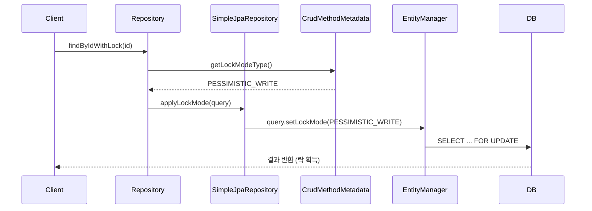
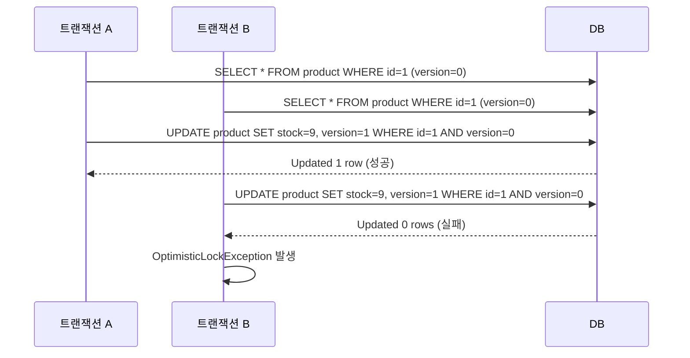
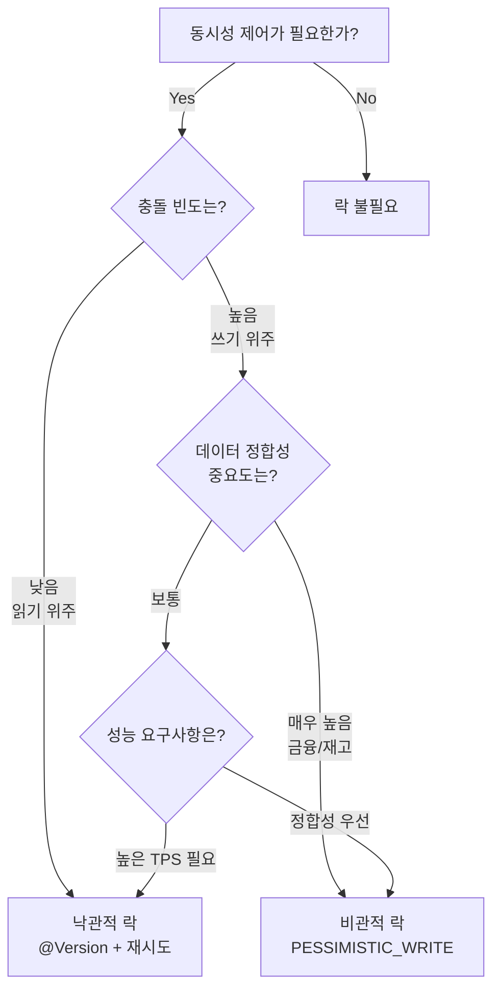

# JPA 락 전략 완전 정복: 낙관적 락과 비관적 락

JPA에서 제공하는 LockModeType 전체를 분석하고, @Version 기반 낙관적 락과 SELECT ... FOR UPDATE 비관적 락의 내부 동작을 이해한다. 실전에서 재고 차감 같은 동시성 문제를 해결하는 패턴을 다룬다.

## 목차

1. [핵심 개념 (What)](#1-핵심-개념-what)
2. [왜 알아야 하는가 (Why)](#2-왜-알아야-하는가-why)
3. [내부 구현 분석 (How)](#3-내부-구현-분석-how)
4. [실전 예제](#4-실전-예제)
5. [정리](#5-정리)

---

## 1. 핵심 개념 (What)

### LockModeType 전체 종류

JPA 표준(`jakarta.persistence.LockModeType`)은 다음 7가지 락 모드를 정의한다:

| LockModeType | 분류 | 설명 |
|---|---|---|
| `NONE` | - | 락 없음 (기본값) |
| `OPTIMISTIC` | 낙관적 | 트랜잭션 커밋 시 version 검증 |
| `OPTIMISTIC_FORCE_INCREMENT` | 낙관적 | 읽기만 해도 version 증가 |
| `PESSIMISTIC_READ` | 비관적 | 공유 락 (SELECT ... FOR SHARE) |
| `PESSIMISTIC_WRITE` | 비관적 | 배타 락 (SELECT ... FOR UPDATE) |
| `PESSIMISTIC_FORCE_INCREMENT` | 비관적 | 배타 락 + version 증가 |
| `READ` | (deprecated) | OPTIMISTIC과 동일 |
| `WRITE` | (deprecated) | OPTIMISTIC_FORCE_INCREMENT과 동일 |

### 낙관적 락 (Optimistic Lock)

"충돌은 거의 없을 것이다"라는 전제 하에 동작한다. DB 레벨의 락을 사용하지 않고, 엔티티의 `@Version` 필드를 통해 커밋 시점에 충돌을 감지한다.

```java
@Entity
public class Product {
    @Id
    @GeneratedValue(strategy = GenerationType.IDENTITY)
    private Long id;

    @Version
    private Long version;  // int, Integer, long, Long, short, Short, Timestamp 가능

    private String name;
    private int stockQuantity;
}
```

### 비관적 락 (Pessimistic Lock)

"충돌이 빈번할 것이다"라는 전제 하에 동작한다. DB의 행 수준 락을 직접 사용하여 다른 트랜잭션의 접근을 차단한다.

```sql
-- PESSIMISTIC_READ  -> SELECT ... FOR SHARE
-- PESSIMISTIC_WRITE -> SELECT ... FOR UPDATE
```

### Spring Data JPA의 @Lock 어노테이션

Spring Data JPA는 `@Lock` 어노테이션을 통해 리포지토리 메서드에 락 모드를 선언적으로 적용한다.

```java
// Lock.java (o.s.d.jpa.repository)
@Target({ ElementType.METHOD, ElementType.ANNOTATION_TYPE })
@Retention(RetentionPolicy.RUNTIME)
@Documented
public @interface Lock {
    LockModeType value();
}
```

---

## 2. 왜 알아야 하는가 (Why)

### 동시성 문제의 현실

웹 애플리케이션에서 동일 데이터에 대한 동시 수정은 피할 수 없다:

- **이커머스**: 한정 수량 상품의 동시 주문 (재고 차감)
- **예약 시스템**: 동일 좌석/시간대에 대한 동시 예약
- **금융**: 동일 계좌의 동시 출금
- **포인트/쿠폰**: 동시 사용 시 이중 차감

### 락 전략 선택의 중요성

잘못된 락 전략은 두 가지 극단적 문제를 야기한다:

1. **락 없음**: 데이터 정합성 파괴 (Lost Update, Dirty Read)
2. **과도한 락**: 성능 저하, 데드락 발생, TPS 급감

```
트랜잭션 A: stock=10 읽기 → stock=9로 업데이트 → 커밋
트랜잭션 B: stock=10 읽기 → stock=9로 업데이트 → 커밋
결과: 2개 판매했지만 재고는 9 (Lost Update 발생)
```

---

## 3. 내부 구현 분석 (How)

### @Lock이 적용되는 흐름



### SimpleJpaRepository에서의 락 적용

`SimpleJpaRepository`는 `CrudMethodMetadata`를 통해 `@Lock` 어노테이션에 지정된 `LockModeType`을 쿼리에 적용한다:

```java
// SimpleJpaRepository.java (약 1009행)
LockModeType type = metadata.getLockModeType();
TypedQuery<S> toReturn = type == null ? query : query.setLockMode(type);
```

모든 쿼리 메서드에 동일한 패턴이 반복된다. `metadata.getLockModeType()`이 null이 아니면 `query.setLockMode(type)`을 호출하여 JPA Provider(Hibernate)에게 락 모드를 전달한다.

### 낙관적 락의 내부 동작



Hibernate는 `@Version` 필드가 있는 엔티티를 UPDATE할 때 자동으로 WHERE 절에 version 조건을 추가한다:

```sql
UPDATE product
SET stock = ?, version = ? + 1
WHERE id = ? AND version = ?
```

영향받은 행이 0이면 `OptimisticLockException`을 던진다.

### 비관적 락의 SQL 생성

비관적 락은 DB 벤더에 따라 다른 SQL을 생성한다:

```sql
-- MySQL/MariaDB
-- PESSIMISTIC_READ:  SELECT ... FOR SHARE
-- PESSIMISTIC_WRITE: SELECT ... FOR UPDATE

-- PostgreSQL
-- PESSIMISTIC_READ:  SELECT ... FOR SHARE
-- PESSIMISTIC_WRITE: SELECT ... FOR UPDATE

-- Oracle
-- PESSIMISTIC_READ:  SELECT ... FOR UPDATE  (공유 락 미지원, 배타 락으로 대체)
-- PESSIMISTIC_WRITE: SELECT ... FOR UPDATE

-- H2 (테스트용)
-- PESSIMISTIC_READ:  SELECT ... FOR UPDATE  (공유 락 미지원)
-- PESSIMISTIC_WRITE: SELECT ... FOR UPDATE
```

### 락 타임아웃 설정

비관적 락은 무한 대기를 방지하기 위해 타임아웃을 설정할 수 있다:

```java
@Lock(LockModeType.PESSIMISTIC_WRITE)
@QueryHints(@QueryHint(name = "jakarta.persistence.lock.timeout", value = "3000"))  // 3초
Optional<Product> findWithLockById(Long id);
```

---

## 4. 실전 예제

### 예제 1: 재고 차감 - 낙관적 락 + 재시도 패턴

```java
@Entity
public class Product {
    @Id
    @GeneratedValue(strategy = GenerationType.IDENTITY)
    private Long id;

    @Version
    private Long version;

    private String name;
    private int stockQuantity;

    public void decreaseStock(int quantity) {
        if (this.stockQuantity < quantity) {
            throw new IllegalStateException("재고가 부족합니다. 현재 재고: " + stockQuantity);
        }
        this.stockQuantity -= quantity;
    }
}
```

```java
public interface ProductRepository extends JpaRepository<Product, Long> {

    @Lock(LockModeType.OPTIMISTIC)
    @Query("SELECT p FROM Product p WHERE p.id = :id")
    Optional<Product> findByIdWithOptimisticLock(@Param("id") Long id);
}
```

```java
@Service
@RequiredArgsConstructor
public class OrderService {

    private final ProductRepository productRepository;

    @Retryable(
        retryFor = OptimisticLockingFailureException.class,
        maxAttempts = 3,
        backoff = @Backoff(delay = 100, multiplier = 2)
    )
    @Transactional
    public void orderWithOptimisticLock(Long productId, int quantity) {
        Product product = productRepository.findByIdWithOptimisticLock(productId)
            .orElseThrow(() -> new EntityNotFoundException("상품을 찾을 수 없습니다."));

        product.decreaseStock(quantity);
        // 트랜잭션 커밋 시 version 체크 → 충돌 시 OptimisticLockException → 재시도
    }

    @Recover
    public void recoverOrderFailure(OptimisticLockingFailureException e, Long productId, int quantity) {
        throw new BusinessException("주문 처리에 실패했습니다. 잠시 후 다시 시도해주세요.");
    }
}
```

**Spring Retry 의존성 필요:**
```gradle
implementation 'org.springframework.retry:spring-retry'
implementation 'org.springframework:spring-aspects'
```

### 예제 2: 재고 차감 - 비관적 락

```java
public interface ProductRepository extends JpaRepository<Product, Long> {

    @Lock(LockModeType.PESSIMISTIC_WRITE)
    @QueryHints(@QueryHint(name = "jakarta.persistence.lock.timeout", value = "3000"))
    @Query("SELECT p FROM Product p WHERE p.id = :id")
    Optional<Product> findByIdWithPessimisticLock(@Param("id") Long id);
}
```

```java
@Service
@RequiredArgsConstructor
public class OrderService {

    private final ProductRepository productRepository;

    @Transactional
    public void orderWithPessimisticLock(Long productId, int quantity) {
        // SELECT ... FOR UPDATE 로 행 락 획득
        Product product = productRepository.findByIdWithPessimisticLock(productId)
            .orElseThrow(() -> new EntityNotFoundException("상품을 찾을 수 없습니다."));

        product.decreaseStock(quantity);
        // 트랜잭션 커밋 시 락 해제
    }
}
```

### 예제 3: 데드락 방지 - 일관된 락 순서

여러 엔티티에 비관적 락을 걸 때는 항상 동일한 순서로 락을 획득해야 데드락을 방지할 수 있다:

```java
@Transactional
public void transfer(Long fromAccountId, Long toAccountId, BigDecimal amount) {
    // 항상 ID가 작은 것부터 락 획득 → 데드락 방지
    Long firstId = Math.min(fromAccountId, toAccountId);
    Long secondId = Math.max(fromAccountId, toAccountId);

    Account first = accountRepository.findByIdWithPessimisticLock(firstId)
        .orElseThrow();
    Account second = accountRepository.findByIdWithPessimisticLock(secondId)
        .orElseThrow();

    Account from = fromAccountId.equals(firstId) ? first : second;
    Account to = fromAccountId.equals(firstId) ? second : first;

    from.withdraw(amount);
    to.deposit(amount);
}
```

### 낙관적 락 vs 비관적 락 선택 기준



---

## 5. 정리

| 항목 | 낙관적 락 | 비관적 락 |
|---|---|---|
| 핵심 메커니즘 | `@Version` + WHERE version=? | `SELECT ... FOR UPDATE` |
| DB 락 사용 | 사용하지 않음 | 행 수준 락 사용 |
| 충돌 감지 시점 | 커밋 시점 | 조회 시점 |
| 충돌 처리 | `OptimisticLockException` 재시도 | 대기 후 순차 처리 |
| 적합한 상황 | 읽기 위주, 충돌 적음 | 쓰기 위주, 충돌 빈번 |
| 성능 영향 | 재시도 비용 | 대기 시간, 데드락 위험 |
| Spring Data JPA | `@Lock(LockModeType.OPTIMISTIC)` | `@Lock(LockModeType.PESSIMISTIC_WRITE)` |
| 추가 설정 | Spring Retry | `@QueryHints`로 타임아웃 |
| 주의사항 | `@Version` 필드 필수 | 락 순서 일관성, 타임아웃 설정 |

### 핵심 포인트

1. **@Lock 어노테이션**은 `CrudMethodMetadata`를 통해 `SimpleJpaRepository`에서 쿼리에 `setLockMode()`로 적용된다
2. **낙관적 락**은 `@Version` 필드를 이용해 UPDATE 시 WHERE 조건에 version을 포함하여 충돌을 감지한다
3. **비관적 락**은 DB의 FOR UPDATE/FOR SHARE 구문을 통해 행 수준 락을 획득한다
4. **실전에서는** 재시도 패턴(Spring Retry), 타임아웃 설정, 일관된 락 순서 확보가 필수적이다

---
*참고: Spring Data JPA 3.x / Hibernate 6.x 기준*
