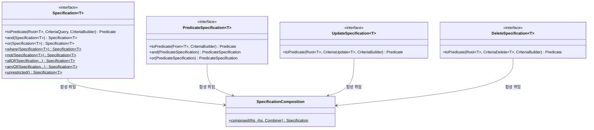
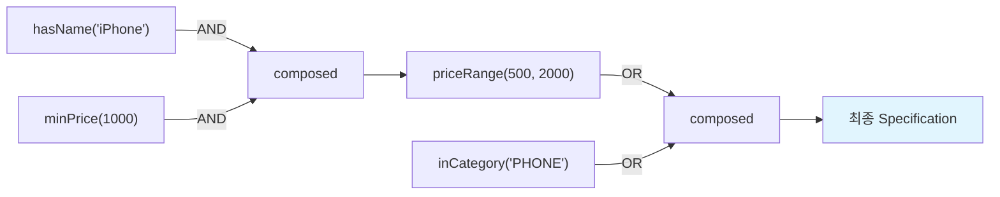

# Specification과 Criteria API: 타입 안전한 동적 쿼리

Spring Data JPA의 Specification 패턴을 활용하여 타입 안전한 동적 쿼리를 구성하는 방법을 분석한다. Specification, PredicateSpecification, UpdateSpecification, DeleteSpecification의 내부 구조와 합성 메커니즘을 이해하고, 실전 동적 검색 필터를 구현한다.

## 목차

1. [핵심 개념 (What)](#1-핵심-개념-what)
2. [왜 알아야 하는가 (Why)](#2-왜-알아야-하는가-why)
3. [내부 구현 분석 (How)](#3-내부-구현-분석-how)
4. [실전 예제](#4-실전-예제)
5. [정리](#5-정리)

---

## 1. 핵심 개념 (What)

### Specification 패턴이란

DDD(Domain Driven Design)의 Specification 패턴을 JPA Criteria API 위에 구현한 것이다. 복잡한 검색 조건을 재사용 가능한 작은 단위(Specification)로 분해하고, AND/OR로 합성할 수 있다.

### Specification 인터페이스 계층

Spring Data JPA 3.x/4.x에서 제공하는 Specification 관련 인터페이스는 4가지이다:



| 인터페이스 | since | 용도 | toPredicate 파라미터 |
|---|---|---|---|
| `Specification<T>` | 1.x | SELECT 쿼리 조건 | `Root<T>`, `CriteriaQuery<?>`, `CriteriaBuilder` |
| `PredicateSpecification<T>` | 4.0 | 재사용 가능한 순수 조건 | `From<?, T>`, `CriteriaBuilder` |
| `UpdateSpecification<T>` | 4.0 | UPDATE 쿼리 조건 | `Root<T>`, `CriteriaUpdate<T>`, `CriteriaBuilder` |
| `DeleteSpecification<T>` | 4.0 | DELETE 쿼리 조건 | `Root<T>`, `CriteriaDelete<T>`, `CriteriaBuilder` |

### PredicateSpecification의 특징

4.0에서 추가된 `PredicateSpecification`은 `CriteriaQuery`에 의존하지 않아 SELECT, UPDATE, DELETE 어디서든 재사용할 수 있다:

```java
// Specification<T> - CriteriaQuery에 종속
Predicate toPredicate(Root<T> root, CriteriaQuery<?> query, CriteriaBuilder cb);

// PredicateSpecification<T> - CriteriaQuery 없이 독립적
Predicate toPredicate(From<?, T> from, CriteriaBuilder cb);
```

---

## 2. 왜 알아야 하는가 (Why)

### 동적 검색의 현실

실무에서 검색 화면은 다음과 같은 요구사항이 일반적이다:

- 10개 이상의 검색 조건이 존재
- 사용자가 입력한 조건만 적용 (null/빈 값은 무시)
- 조건 간 AND/OR 조합이 필요
- 날짜 범위, LIKE, IN 등 다양한 연산자

### 기존 방식의 문제점

```java
// 방법 1: JPQL 문자열 조립 → SQL Injection 위험, 가독성 저하
StringBuilder jpql = new StringBuilder("SELECT p FROM Product p WHERE 1=1");
if (name != null) jpql.append(" AND p.name LIKE :name");
if (minPrice != null) jpql.append(" AND p.price >= :minPrice");
// ... 10개 이상의 조건이 이어지면 관리 불가

// 방법 2: @Query 메서드 조합 → 메서드 폭발
findByNameAndCategory(...)
findByNameAndCategoryAndPriceGreaterThan(...)
findByNameAndCategoryAndPriceBetweenAndStatusIn(...)
// 조건 N개면 2^N개 메서드 필요
```

### Specification의 장점

- **타입 안전**: Criteria API 기반으로 컴파일 타임 검증
- **조합 가능**: 작은 Specification을 AND/OR로 합성
- **재사용**: 동일 조건을 여러 쿼리에서 재사용
- **null 안전**: null Predicate는 자동으로 무시됨

---

## 3. 내부 구현 분석 (How)

### SpecificationComposition의 합성 로직

모든 Specification 합성은 `SpecificationComposition.composed()` 메서드를 통해 이루어진다:

```java
// SpecificationComposition.java (o.s.d.jpa.domain)
class SpecificationComposition {

    interface Combiner extends Serializable {
        Predicate combine(CriteriaBuilder builder, Predicate lhs, Predicate rhs);
    }

    static <T> Specification<T> composed(Specification<T> lhs, Specification<T> rhs,
            Combiner combiner) {

        return (root, query, builder) -> {
            Predicate thisPredicate = toPredicate(lhs, root, query, builder);
            Predicate otherPredicate = toPredicate(rhs, root, query, builder);

            if (thisPredicate == null) {
                return otherPredicate;   // lhs가 null이면 rhs만 반환
            }
            return otherPredicate == null
                ? thisPredicate          // rhs가 null이면 lhs만 반환
                : combiner.combine(builder, thisPredicate, otherPredicate);  // 둘 다 있으면 합성
        };
    }
}
```

핵심 포인트:
- `Combiner`는 `CriteriaBuilder::and` 또는 `CriteriaBuilder::or`가 전달됨
- **null 안전 처리**: 한쪽이 null이면 다른 쪽만 반환하여, `unrestricted()` 같은 빈 Specification이 합성에 영향을 주지 않음

### 합성 흐름 시각화



### Specification.and()의 동작

```java
// Specification.java
default Specification<T> and(Specification<T> other) {
    Assert.notNull(other, "Other specification must not be null");
    return SpecificationComposition.composed(this, other, CriteriaBuilder::and);
}
```

`and()`와 `or()`는 `SpecificationComposition.composed()`에 적절한 `Combiner`를 전달할 뿐이다. 각 Specification 타입(Update, Delete, Predicate)에 대해 동일한 패턴이 `SpecificationComposition`에 오버로드되어 있다.

### allOf / anyOf 일괄 합성

```java
// Specification.java
static <T> Specification<T> allOf(Iterable<Specification<T>> specifications) {
    return StreamSupport.stream(specifications.spliterator(), false)
            .reduce(Specification.unrestricted(), Specification::and);
}
```

`unrestricted()`를 초기값으로 사용하고 `reduce()`로 모든 Specification을 AND 합성한다. `unrestricted()`는 `(root, query, builder) -> null`을 반환하므로, null 안전 합성 덕분에 첫 번째 유효한 Specification부터 적용된다.

### JpaSpecificationExecutor 인터페이스

Specification을 사용하려면 리포지토리가 `JpaSpecificationExecutor`를 확장해야 한다:

```java
public interface ProductRepository extends
        JpaRepository<Product, Long>,
        JpaSpecificationExecutor<Product> {
    // Specification 기반 메서드들이 자동 제공
    // findAll(Specification<T> spec)
    // findAll(Specification<T> spec, Pageable pageable)
    // findOne(Specification<T> spec)
    // count(Specification<T> spec)
    // exists(Specification<T> spec)
    // delete(DeleteSpecification<T> spec)
    // update(UpdateSpecification<T> spec)
    // findBy(Specification<T> spec, Function<FluentQuery, R> queryFunction)
}
```

---

## 4. 실전 예제

### 예제 1: 10개+ 조건 동적 검색 필터

```java
@Getter
@Setter
public class ProductSearchCondition {
    private String name;
    private String category;
    private BigDecimal minPrice;
    private BigDecimal maxPrice;
    private ProductStatus status;
    private List<String> brands;
    private LocalDateTime createdAfter;
    private LocalDateTime createdBefore;
    private Boolean inStock;
    private Integer minRating;
    private String seller;
}
```

```java
public class ProductSpecifications {

    public static Specification<Product> hasName(String name) {
        return (root, query, cb) ->
            name == null ? null : cb.like(root.get("name"), "%" + name + "%");
    }

    public static Specification<Product> hasCategory(String category) {
        return (root, query, cb) ->
            category == null ? null : cb.equal(root.get("category"), category);
    }

    public static Specification<Product> priceBetween(BigDecimal min, BigDecimal max) {
        return (root, query, cb) -> {
            if (min != null && max != null) {
                return cb.between(root.get("price"), min, max);
            } else if (min != null) {
                return cb.greaterThanOrEqualTo(root.get("price"), min);
            } else if (max != null) {
                return cb.lessThanOrEqualTo(root.get("price"), max);
            }
            return null;
        };
    }

    public static Specification<Product> hasStatus(ProductStatus status) {
        return (root, query, cb) ->
            status == null ? null : cb.equal(root.get("status"), status);
    }

    public static Specification<Product> brandsIn(List<String> brands) {
        return (root, query, cb) ->
            (brands == null || brands.isEmpty()) ? null : root.get("brand").in(brands);
    }

    public static Specification<Product> createdBetween(LocalDateTime after, LocalDateTime before) {
        return (root, query, cb) -> {
            if (after != null && before != null) {
                return cb.between(root.get("createdAt"), after, before);
            } else if (after != null) {
                return cb.greaterThanOrEqualTo(root.get("createdAt"), after);
            } else if (before != null) {
                return cb.lessThanOrEqualTo(root.get("createdAt"), before);
            }
            return null;
        };
    }

    public static Specification<Product> inStock(Boolean inStock) {
        return (root, query, cb) ->
            inStock == null ? null :
            inStock ? cb.greaterThan(root.get("stockQuantity"), 0)
                    : cb.equal(root.get("stockQuantity"), 0);
    }

    public static Specification<Product> minRating(Integer minRating) {
        return (root, query, cb) ->
            minRating == null ? null :
            cb.greaterThanOrEqualTo(root.get("averageRating"), minRating);
    }

    public static Specification<Product> hasSeller(String seller) {
        return (root, query, cb) ->
            seller == null ? null :
            cb.like(root.get("seller").get("name"), "%" + seller + "%");
    }

    // 조건을 합성하는 팩토리 메서드
    public static Specification<Product> fromCondition(ProductSearchCondition cond) {
        return Specification.allOf(
            hasName(cond.getName()),
            hasCategory(cond.getCategory()),
            priceBetween(cond.getMinPrice(), cond.getMaxPrice()),
            hasStatus(cond.getStatus()),
            brandsIn(cond.getBrands()),
            createdBetween(cond.getCreatedAfter(), cond.getCreatedBefore()),
            inStock(cond.getInStock()),
            minRating(cond.getMinRating()),
            hasSeller(cond.getSeller())
        );
    }
}
```

```java
@Service
@RequiredArgsConstructor
public class ProductSearchService {

    private final ProductRepository productRepository;

    public Page<Product> search(ProductSearchCondition condition, Pageable pageable) {
        Specification<Product> spec = ProductSpecifications.fromCondition(condition);
        return productRepository.findAll(spec, pageable);
    }
}
```

### 예제 2: PredicateSpecification으로 조건 재사용

```java
public class UserPredicates {

    // PredicateSpecification은 SELECT/UPDATE/DELETE 모두에서 재사용 가능
    public static PredicateSpecification<User> isActive() {
        return (from, cb) -> cb.equal(from.get("status"), UserStatus.ACTIVE);
    }

    public static PredicateSpecification<User> hasRole(String role) {
        return (from, cb) -> cb.equal(from.get("role"), role);
    }

    public static PredicateSpecification<User> lastLoginBefore(LocalDateTime date) {
        return (from, cb) -> cb.lessThan(from.get("lastLoginAt"), date);
    }
}
```

```java
// SELECT에서 사용
Specification<User> activeAdmins = Specification.where(UserPredicates.isActive())
    .and(UserPredicates.hasRole("ADMIN"));
List<User> admins = userRepository.findAll(activeAdmins);

// UPDATE에서 동일 조건 재사용
UpdateSpecification<User> deactivateOldUsers = UpdateSpecification
    .<User>update((root, update, cb) -> update.set("status", UserStatus.INACTIVE))
    .where(UserPredicates.lastLoginBefore(LocalDateTime.now().minusMonths(6)));
userRepository.update(deactivateOldUsers);

// DELETE에서 동일 조건 재사용
DeleteSpecification<User> deleteInactiveUsers =
    DeleteSpecification.where(UserPredicates.lastLoginBefore(LocalDateTime.now().minusYears(2)));
userRepository.delete(deleteInactiveUsers);
```

### 예제 3: Fluent API (findBy)

```java
// findBy를 사용한 Fluent 쿼리
List<ProductDto> results = productRepository.findBy(
    ProductSpecifications.fromCondition(condition),
    query -> query
        .sortBy(Sort.by("price").ascending())
        .project("name", "price", "category")
        .as(ProductDto.class)
        .all()
);

// 첫 번째 결과만 가져오기
Optional<ProductDto> first = productRepository.findBy(
    ProductSpecifications.hasCategory("PHONE"),
    query -> query
        .sortBy(Sort.by("price").descending())
        .as(ProductDto.class)
        .first()
);

// 존재 여부 확인
boolean exists = productRepository.findBy(
    ProductSpecifications.hasName("iPhone"),
    query -> query.exists()
);
```

---

## 5. 정리

| 항목 | 설명 |
|---|---|
| `Specification<T>` | SELECT 쿼리용 조건. `toPredicate(Root, CriteriaQuery, CriteriaBuilder)` |
| `PredicateSpecification<T>` (4.0+) | 범용 조건. `toPredicate(From, CriteriaBuilder)`. SELECT/UPDATE/DELETE 재사용 |
| `UpdateSpecification<T>` (4.0+) | UPDATE용. `update()` + `where()` 분리 가능 |
| `DeleteSpecification<T>` (4.0+) | DELETE용. `PredicateSpecification` 호환 |
| `SpecificationComposition` | 모든 합성 로직의 핵심. null 안전 처리 포함 |
| `unrestricted()` | 조건 없음을 나타내는 Specification. null 반환하여 합성에서 무시됨 |
| `allOf()` / `anyOf()` | 여러 Specification을 일괄 AND/OR 합성 |
| `JpaSpecificationExecutor` | 리포지토리에서 Specification 지원을 위해 확장해야 하는 인터페이스 |
| `findBy()` Fluent API | Specification과 함께 정렬, 프로젝션, DTO 변환을 체이닝 |

### 핵심 포인트

1. **null을 반환하는 Specification**은 합성에서 자동으로 무시되므로, 동적 조건 구현이 자연스럽다
2. **PredicateSpecification(4.0+)**은 CriteriaQuery에 의존하지 않아 SELECT/UPDATE/DELETE에서 모두 재사용 가능하다
3. **SpecificationComposition**이 모든 합성의 핵심이며, `Combiner` 인터페이스로 AND/OR 연산을 추상화한다
4. **findBy() Fluent API**를 통해 Specification에 정렬, 프로젝션, DTO 변환까지 선언적으로 체이닝할 수 있다

---
*참고: Spring Data JPA 3.x / Hibernate 6.x 기준*
