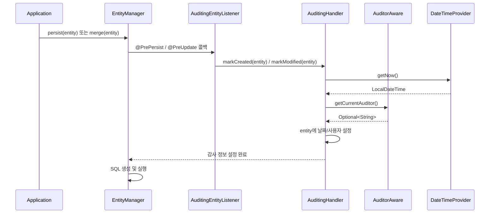

# JPA Auditing 내부 동작: 엔티티 생성/수정 이력 자동화

AuditingEntityListener의 @PrePersist/@PreUpdate 콜백 메커니즘과 AuditingHandler의 내부 동작을 분석한다. AuditorAware를 통한 SecurityContext 연동과 멀티테넌트 환경에서의 커스텀 Auditor 구현까지 다룬다.

## 목차

1. [핵심 개념 (What)](#1-핵심-개념-what)
2. [왜 알아야 하는가 (Why)](#2-왜-알아야-하는가-why)
3. [내부 구현 분석 (How)](#3-내부-구현-분석-how)
4. [실전 예제](#4-실전-예제)
5. [정리](#5-정리)

---

## 1. 핵심 개념 (What)

### JPA Auditing이란

엔티티의 생성자, 수정자, 생성일, 수정일을 자동으로 기록하는 메커니즘이다. JPA의 엔티티 라이프사이클 콜백(`@PrePersist`, `@PreUpdate`)을 활용하여, 엔티티가 저장되거나 수정될 때 감사(audit) 정보를 자동으로 채운다.

### 4가지 Auditing 어노테이션

```java
@Entity
public class Article {
    @Id
    @GeneratedValue(strategy = GenerationType.IDENTITY)
    private Long id;

    @CreatedBy             // 생성자
    private String createdBy;

    @LastModifiedBy        // 수정자
    private String modifiedBy;

    @CreatedDate           // 생성일
    private LocalDateTime createdAt;

    @LastModifiedDate      // 수정일
    private LocalDateTime modifiedAt;
}
```

### 핵심 구성 요소

| 구성 요소 | 역할 |
|---|---|
| `@EnableJpaAuditing` | JPA Auditing 활성화 설정 |
| `AuditingEntityListener` | JPA 콜백을 수신하는 엔티티 리스너 |
| `AuditingHandler` | 실제 감사 정보를 엔티티에 설정하는 핸들러 |
| `AuditorAware<T>` | 현재 사용자(감사자)를 제공하는 인터페이스 |
| `DateTimeProvider` | 현재 시각을 제공하는 인터페이스 |

---

## 2. 왜 알아야 하는가 (Why)

### 모든 엔티티에 공통으로 필요

거의 모든 비즈니스 엔티티에는 "누가, 언제 만들었고, 누가, 언제 수정했는가"라는 감사 정보가 필요하다. 이를 수동으로 관리하면:

```java
// 매번 수동으로 설정해야 함 → 누락 위험
article.setCreatedBy(getCurrentUser());
article.setCreatedAt(LocalDateTime.now());
article.setModifiedBy(getCurrentUser());
article.setModifiedAt(LocalDateTime.now());
articleRepository.save(article);
```

### 수동 관리의 문제점

1. **누락**: 개발자가 설정 코드를 빠뜨리면 null이 들어감
2. **불일치**: 여러 곳에서 각각 `now()`를 호출하면 미세한 시간 차이 발생
3. **중복**: 모든 Service 클래스에 동일한 보일러플레이트 코드 반복
4. **테스트 어려움**: 시간 의존 로직의 테스트가 복잡해짐

### Auditing 자동화의 이점

- JPA 콜백 레벨에서 자동 실행 → 누락 불가능
- `AuditorAware`로 사용자 정보 일원 관리
- `DateTimeProvider`로 시간 제어 가능 (테스트 용이)
- `@MappedSuperclass`로 공통 필드를 추상화

---

## 3. 내부 구현 분석 (How)

### 전체 아키텍처



### AuditingEntityListener 소스 분석

```java
// AuditingEntityListener.java
// (o.s.d.jpa.domain.support)
@Configurable
public class AuditingEntityListener {

    private @Nullable ObjectFactory<AuditingHandler> handler;

    public void setAuditingHandler(ObjectFactory<AuditingHandler> auditingHandler) {
        Assert.notNull(auditingHandler, "AuditingHandler must not be null");
        this.handler = auditingHandler;
    }

    @PrePersist
    public void touchForCreate(Object target) {
        Assert.notNull(target, "Entity must not be null");

        if (handler != null) {
            AuditingHandler object = handler.getObject();
            if (object != null) {
                object.markCreated(target);
            }
        }
    }

    @PreUpdate
    public void touchForUpdate(Object target) {
        Assert.notNull(target, "Entity must not be null");

        if (handler != null) {
            AuditingHandler object = handler.getObject();
            if (object != null) {
                object.markModified(target);
            }
        }
    }
}
```

핵심 포인트:
- `@PrePersist` 콜백에서 `markCreated()` 호출 → 생성일/생성자 설정
- `@PreUpdate` 콜백에서 `markModified()` 호출 → 수정일/수정자 설정
- `ObjectFactory<AuditingHandler>`를 통해 지연 초기화 (Lazy)
- `@Configurable`로 Spring 컨텍스트 외부에서도 DI 가능

### AuditingHandler의 역할

`AuditingHandler`(Spring Data Commons에 위치)는 다음을 수행한다:

1. 엔티티가 `@CreatedBy`, `@LastModifiedBy`, `@CreatedDate`, `@LastModifiedDate` 어노테이션이 있는 필드를 가지고 있는지 확인
2. `AuditorAware.getCurrentAuditor()`를 호출하여 현재 사용자를 가져옴
3. `DateTimeProvider.getNow()`를 호출하여 현재 시각을 가져옴
4. 리플렉션을 통해 해당 필드에 값을 설정

`markCreated()`는 생성일/생성자 + 수정일/수정자를 모두 설정하고(modifyOnCreate=true일 때), `markModified()`는 수정일/수정자만 설정한다.

### @EnableJpaAuditing 설정 분석

```java
// EnableJpaAuditing.java
// (o.s.d.jpa.repository.config)
@Documented
@Target(ElementType.TYPE)
@Retention(RetentionPolicy.RUNTIME)
@Import(JpaAuditingRegistrar.class)
public @interface EnableJpaAuditing {

    String auditorAwareRef() default "";      // AuditorAware 빈 이름
    boolean setDates() default true;           // 날짜 자동 설정 여부
    boolean modifyOnCreate() default true;     // 생성 시 수정일도 설정할지
    String dateTimeProviderRef() default "";   // DateTimeProvider 빈 이름
}
```

`@Import(JpaAuditingRegistrar.class)`를 통해 `AuditingEntityListener`와 `AuditingHandler`를 자동으로 빈으로 등록한다.

### 엔티티에 리스너 등록 방식

```java
// 방법 1: 엔티티 클래스에 직접 지정
@Entity
@EntityListeners(AuditingEntityListener.class)
public class Article { ... }

// 방법 2: @MappedSuperclass에 지정 (권장)
@MappedSuperclass
@EntityListeners(AuditingEntityListener.class)
public abstract class BaseEntity {
    @CreatedDate
    private LocalDateTime createdAt;

    @LastModifiedDate
    private LocalDateTime modifiedAt;

    @CreatedBy
    private String createdBy;

    @LastModifiedBy
    private String modifiedBy;
}

// 방법 3: orm.xml에서 글로벌 적용
// META-INF/orm.xml
// <persistence-unit-defaults>
//   <entity-listeners>
//     <entity-listener class="...AuditingEntityListener" />
//   </entity-listeners>
// </persistence-unit-defaults>
```

---

## 4. 실전 예제

### 예제 1: Spring Security 연동 AuditorAware

```java
@Configuration
@EnableJpaAuditing
public class JpaAuditingConfig {

    @Bean
    public AuditorAware<String> auditorAware() {
        return new SecurityAuditorAware();
    }
}
```

```java
public class SecurityAuditorAware implements AuditorAware<String> {

    @Override
    public Optional<String> getCurrentAuditor() {
        return Optional.ofNullable(SecurityContextHolder.getContext())
            .map(SecurityContext::getAuthentication)
            .filter(Authentication::isAuthenticated)
            .filter(auth -> !(auth instanceof AnonymousAuthenticationToken))
            .map(Authentication::getName);
    }
}
```

```java
@MappedSuperclass
@EntityListeners(AuditingEntityListener.class)
@Getter
public abstract class BaseEntity {

    @CreatedDate
    @Column(updatable = false)
    private LocalDateTime createdAt;

    @LastModifiedDate
    private LocalDateTime modifiedAt;

    @CreatedBy
    @Column(updatable = false)
    private String createdBy;

    @LastModifiedBy
    private String modifiedBy;
}
```

```java
@Entity
public class Article extends BaseEntity {
    @Id
    @GeneratedValue(strategy = GenerationType.IDENTITY)
    private Long id;

    private String title;
    private String content;
}
```

### 예제 2: 멀티테넌트 시스템의 커스텀 Auditor

```java
@Getter
@Embeddable
public class AuditInfo {
    private String userId;
    private String tenantId;

    protected AuditInfo() {}

    public AuditInfo(String userId, String tenantId) {
        this.userId = userId;
        this.tenantId = tenantId;
    }
}
```

```java
public class MultiTenantAuditorAware implements AuditorAware<AuditInfo> {

    private final TenantContextHolder tenantContextHolder;

    public MultiTenantAuditorAware(TenantContextHolder tenantContextHolder) {
        this.tenantContextHolder = tenantContextHolder;
    }

    @Override
    public Optional<AuditInfo> getCurrentAuditor() {
        Authentication auth = SecurityContextHolder.getContext().getAuthentication();
        if (auth == null || !auth.isAuthenticated()
                || auth instanceof AnonymousAuthenticationToken) {
            return Optional.empty();
        }

        String userId = auth.getName();
        String tenantId = tenantContextHolder.getCurrentTenantId();

        return Optional.of(new AuditInfo(userId, tenantId));
    }
}
```

```java
@MappedSuperclass
@EntityListeners(AuditingEntityListener.class)
@Getter
public abstract class MultiTenantBaseEntity {

    @CreatedDate
    @Column(updatable = false)
    private LocalDateTime createdAt;

    @LastModifiedDate
    private LocalDateTime modifiedAt;

    @CreatedBy
    @Embedded
    @AttributeOverrides({
        @AttributeOverride(name = "userId", column = @Column(name = "created_user_id", updatable = false)),
        @AttributeOverride(name = "tenantId", column = @Column(name = "created_tenant_id", updatable = false))
    })
    private AuditInfo createdBy;

    @LastModifiedBy
    @Embedded
    @AttributeOverrides({
        @AttributeOverride(name = "userId", column = @Column(name = "modified_user_id")),
        @AttributeOverride(name = "tenantId", column = @Column(name = "modified_tenant_id"))
    })
    private AuditInfo modifiedBy;
}
```

```java
@Configuration
@EnableJpaAuditing
public class AuditingConfig {

    @Bean
    public AuditorAware<AuditInfo> auditorAware(TenantContextHolder tenantContextHolder) {
        return new MultiTenantAuditorAware(tenantContextHolder);
    }

    // 테스트를 위한 고정 시간 제공자
    @Bean
    @Profile("test")
    public DateTimeProvider fixedDateTimeProvider() {
        return () -> Optional.of(LocalDateTime.of(2025, 1, 1, 0, 0));
    }
}
```

### 예제 3: 배치 작업에서의 Auditor 설정

시스템 배치 작업처럼 SecurityContext가 없는 환경에서는 별도로 Auditor를 설정해야 한다:

```java
public class BatchAuditorAware implements AuditorAware<String> {

    private static final ThreadLocal<String> BATCH_USER = new ThreadLocal<>();

    public static void setBatchUser(String user) {
        BATCH_USER.set(user);
    }

    public static void clear() {
        BATCH_USER.remove();
    }

    @Override
    public Optional<String> getCurrentAuditor() {
        // 배치 사용자가 설정되어 있으면 우선 사용
        String batchUser = BATCH_USER.get();
        if (batchUser != null) {
            return Optional.of(batchUser);
        }

        // Security Context에서 가져오기
        return Optional.ofNullable(SecurityContextHolder.getContext())
            .map(SecurityContext::getAuthentication)
            .filter(Authentication::isAuthenticated)
            .map(Authentication::getName);
    }
}
```

```java
@Component
@RequiredArgsConstructor
public class DataMigrationBatch {

    private final ArticleRepository articleRepository;

    @Transactional
    public void migrate() {
        try {
            BatchAuditorAware.setBatchUser("SYSTEM_BATCH");
            // 이 블록 내에서 생성/수정되는 모든 엔티티의 createdBy/modifiedBy는 "SYSTEM_BATCH"
            articleRepository.saveAll(migratedArticles);
        } finally {
            BatchAuditorAware.clear();
        }
    }
}
```

---

## 5. 정리

| 항목 | 설명 |
|---|---|
| `AuditingEntityListener` | `@PrePersist`/`@PreUpdate` JPA 콜백으로 감사 정보 자동 설정 |
| `AuditingHandler` | 실제 필드 값 설정 로직. `markCreated()` / `markModified()` |
| `AuditorAware<T>` | 현재 사용자를 `Optional<T>`로 반환하는 전략 인터페이스 |
| `DateTimeProvider` | 현재 시각 제공. 테스트 시 고정 시간 주입 가능 |
| `@EnableJpaAuditing` | `JpaAuditingRegistrar`를 Import하여 빈 자동 등록 |
| `@EntityListeners` | 엔티티 또는 `@MappedSuperclass`에 리스너 등록 |
| `modifyOnCreate` | true(기본값): 생성 시 수정일/수정자도 함께 설정 |
| `@CreatedDate` / `@LastModifiedDate` | 날짜 자동 기록 필드 |
| `@CreatedBy` / `@LastModifiedBy` | 사용자 자동 기록 필드. `AuditorAware`의 반환 타입과 일치해야 함 |

### 핵심 포인트

1. **AuditingEntityListener**는 JPA의 `@PrePersist`/`@PreUpdate` 콜백을 사용하여, `AuditingHandler`에게 감사 정보 설정을 위임한다
2. **AuditorAware**는 전략 인터페이스로, `String`뿐 아니라 `Long`, `Embeddable` 등 어떤 타입이든 감사자로 사용할 수 있다
3. **멀티테넌트 환경**에서는 `AuditorAware`가 테넌트 정보까지 포함한 복합 타입을 반환하도록 설계한다
4. **배치/시스템 작업**에서는 SecurityContext 대신 ThreadLocal을 활용한 커스텀 Auditor로 감사자를 명시적으로 설정한다

---
*참고: Spring Data JPA 3.x / Hibernate 6.x 기준*
