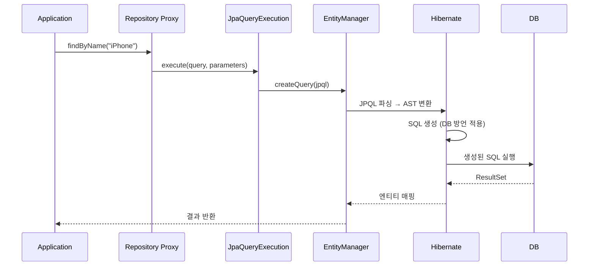
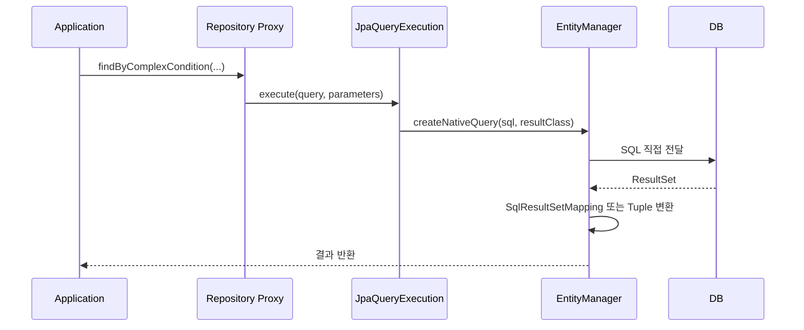
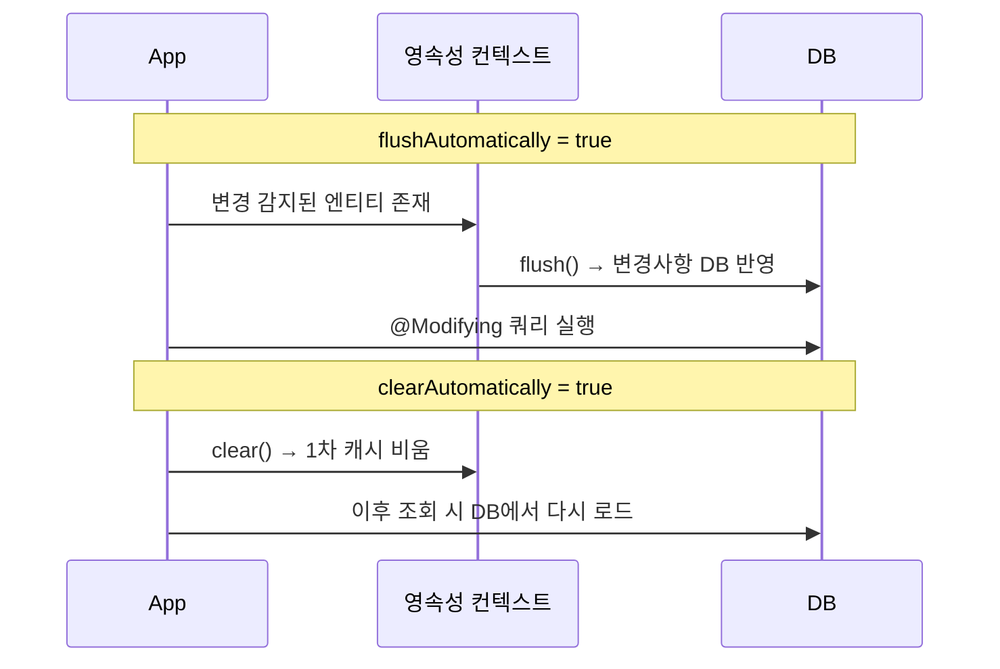

# @Query 어노테이션 심층 분석: JPQL, Native Query, SpEL, QueryRewriter

@Query 어노테이션의 내부 실행 경로를 분석한다. JPQL과 Native Query의 차이, @Modifying의 영속성 컨텍스트 영향, SpEL을 통한 동적 엔티티명 바인딩, QueryRewriter를 통한 쿼리 인터셉션까지 다룬다.

## 목차

1. [핵심 개념 (What)](#1-핵심-개념-what)
2. [왜 알아야 하는가 (Why)](#2-왜-알아야-하는가-why)
3. [내부 구현 분석 (How)](#3-내부-구현-분석-how)
4. [실전 예제](#4-실전-예제)
5. [정리](#5-정리)

---

## 1. 핵심 개념 (What)

### @Query 어노테이션 구조

```java
// Query.java (o.s.d.jpa.repository)
@Retention(RetentionPolicy.RUNTIME)
@Target({ ElementType.METHOD, ElementType.ANNOTATION_TYPE })
@QueryAnnotation
@Documented
public @interface Query {

    String value() default "";                    // JPQL 또는 Native SQL
    String countQuery() default "";               // 페이지네이션 count 쿼리
    String countProjection() default "";          // count 프로젝션
    boolean nativeQuery() default false;          // Native Query 여부
    String name() default "";                     // NamedQuery 이름
    String countName() default "";                // count NamedQuery 이름
    Class<? extends QueryRewriter> queryRewriter()
        default QueryRewriter.IdentityQueryRewriter.class;  // 쿼리 리라이터
}
```

### JPQL vs Native Query

| 구분 | JPQL | Native Query |
|---|---|---|
| 대상 | 엔티티/속성 | 테이블/컬럼 |
| SQL 방언 | JPA Provider가 변환 | DB에 직접 전달 |
| 이식성 | DB 독립적 | DB 종속적 |
| 기능 제한 | JPA 표준 함수만 | DB 고유 함수 사용 가능 |
| 지정 방법 | `@Query("SELECT e FROM Entity e")` | `@Query(value = "SELECT * FROM table", nativeQuery = true)` |

### @Modifying 어노테이션 구조

```java
// Modifying.java (o.s.d.jpa.repository)
@Retention(RetentionPolicy.RUNTIME)
@Target({ ElementType.METHOD, ElementType.ANNOTATION_TYPE })
@Documented
public @interface Modifying {

    boolean flushAutomatically() default false;  // 쿼리 실행 전 flush
    boolean clearAutomatically() default false;  // 쿼리 실행 후 clear
}
```

INSERT, UPDATE, DELETE, DDL 문에는 반드시 `@Modifying`을 붙여야 한다.

---

## 2. 왜 알아야 하는가 (Why)

### JPQL과 Native Query의 실행 경로 차이

JPQL은 JPA Provider(Hibernate)가 파싱하고 SQL로 변환하므로, 엔티티 매핑 정보를 기반으로 최적화가 가능하다. 반면 Native Query는 DB에 직접 전달되므로, DB 고유 기능을 활용할 수 있지만 엔티티 매핑과의 불일치 위험이 있다.

### @Modifying의 영속성 컨텍스트 문제

`@Modifying` 쿼리는 영속성 컨텍스트를 우회하여 DB에 직접 실행된다. 이로 인해 영속성 컨텍스트와 DB 상태가 불일치할 수 있다:

```java
// 위험한 코드
@Transactional
public void updateAndRead(Long id) {
    Product product = productRepository.findById(id).get();  // 1차 캐시에 저장
    System.out.println(product.getPrice());  // 1000

    productRepository.updatePrice(id, 2000);  // DB 직접 UPDATE → 1차 캐시는 그대로

    Product same = productRepository.findById(id).get();  // 1차 캐시에서 반환!
    System.out.println(same.getPrice());  // 여전히 1000 (stale data)
}
```

### SpEL과 QueryRewriter의 활용

- **SpEL**: 상속 구조에서 `#{#entityName}`을 사용하면 공통 쿼리 메서드를 재사용할 수 있다
- **QueryRewriter**: 쿼리 실행 직전에 인터셉트하여 멀티테넌트 필터, 쿼리 힌트 추가 등을 적용할 수 있다

---

## 3. 내부 구현 분석 (How)

### JPQL 실행 경로



### Native Query 실행 경로



JPQL은 Hibernate의 파서를 거쳐 SQL로 변환되지만, Native Query는 `EntityManager.createNativeQuery()`를 통해 DB에 직접 전달된다. 결과 매핑 방식도 다르다.

### @Modifying의 flushAutomatically / clearAutomatically



| 옵션 | 기본값 | 동작 | 목적 |
|---|---|---|---|
| `flushAutomatically` | `false` | 쿼리 실행 전 `flush()` 호출 | 이전 변경사항이 DB에 반영된 상태에서 쿼리 실행 보장 |
| `clearAutomatically` | `false` | 쿼리 실행 후 `clear()` 호출 | 이후 조회 시 stale data 방지 |

**권장 설정:**
```java
@Modifying(flushAutomatically = true, clearAutomatically = true)
@Query("UPDATE Product p SET p.price = :price WHERE p.id = :id")
int updatePrice(@Param("id") Long id, @Param("price") BigDecimal price);
```

### SpEL 지원: #{#entityName}

`TemplatedQuery` 클래스가 SpEL 표현식을 처리한다:

```java
// TemplatedQuery.java (o.s.d.jpa.repository.query)
private static final String ENTITY_NAME = "entityName";
private static final String ENTITY_NAME_VARIABLE = "#" + ENTITY_NAME;
private static final String ENTITY_NAME_VARIABLE_EXPRESSION = "#{" + ENTITY_NAME_VARIABLE;

// SpEL 평가 시
SimpleEvaluationContext evalContext = SimpleEvaluationContext
    .forReadOnlyDataBinding().build();
evalContext.setVariable(ENTITY_NAME, metadata.getEntityName());
```

`#{#entityName}`은 `JpaEntityMetadata.getEntityName()`의 반환값으로 치환된다. 이 값은 `@Entity(name = "...")`에 지정된 이름이거나, 지정하지 않았으면 클래스 단순 이름이다.

### QueryRewriter 인터페이스

```java
// QueryRewriter.java (o.s.d.jpa.repository)
@FunctionalInterface
public interface QueryRewriter {

    String rewrite(String query, Sort sort);

    default String rewrite(String query, Pageable pageRequest) {
        return rewrite(query, pageRequest.getSort());
    }

    enum IdentityQueryRewriter implements QueryRewriter {
        INSTANCE;

        @Override
        public String rewrite(String query, Sort sort) {
            return query;  // 변경 없이 그대로 반환
        }
    }
}
```

`QueryRewriter`는 Spring Data JPA가 쿼리를 완전히 조립한 후, `EntityManager`에 전달하기 직전에 호출된다. 기본값은 `IdentityQueryRewriter`로 쿼리를 변경하지 않는다.

주의사항:
- 바인드 파라미터를 새로 추가할 수 없음 (기존 파라미터만 사용)
- 쿼리 변환 결과에 대한 유효성 검사 없음 (잘못된 SQL이면 런타임 에러)

---

## 4. 실전 예제

### 예제 1: JPQL vs Native Query 사용

```java
public interface ProductRepository extends JpaRepository<Product, Long> {

    // JPQL - 엔티티 속성명 사용, DB 독립적
    @Query("SELECT p FROM Product p WHERE p.category = :category AND p.price >= :minPrice")
    List<Product> findByCategoryAndMinPrice(
        @Param("category") String category,
        @Param("minPrice") BigDecimal minPrice
    );

    // Native Query - DB 고유 함수 사용 가능
    @Query(
        value = "SELECT * FROM product WHERE MATCH(name, description) AGAINST(:keyword IN BOOLEAN MODE)",
        nativeQuery = true
    )
    List<Product> fullTextSearch(@Param("keyword") String keyword);

    // Native Query + 페이지네이션 → countQuery 필수
    @Query(
        value = "SELECT * FROM product WHERE category = :category",
        countQuery = "SELECT COUNT(*) FROM product WHERE category = :category",
        nativeQuery = true
    )
    Page<Product> findByCategoryNative(@Param("category") String category, Pageable pageable);
}
```

### 예제 2: @Modifying 올바른 사용

```java
public interface ProductRepository extends JpaRepository<Product, Long> {

    // 벌크 UPDATE - clearAutomatically로 stale data 방지
    @Modifying(flushAutomatically = true, clearAutomatically = true)
    @Query("UPDATE Product p SET p.price = p.price * :rate WHERE p.category = :category")
    int bulkUpdatePrice(@Param("category") String category, @Param("rate") BigDecimal rate);

    // 벌크 DELETE
    @Modifying
    @Query("DELETE FROM Product p WHERE p.status = :status AND p.modifiedAt < :before")
    int deleteOldProducts(@Param("status") ProductStatus status, @Param("before") LocalDateTime before);

    // INSERT (Native Query)
    @Modifying
    @Query(
        value = "INSERT INTO product_log (product_id, action, created_at) VALUES (:productId, :action, NOW())",
        nativeQuery = true
    )
    void insertLog(@Param("productId") Long productId, @Param("action") String action);
}
```

```java
@Service
@RequiredArgsConstructor
public class ProductService {

    private final ProductRepository productRepository;

    @Transactional
    public void applyDiscount(String category, BigDecimal discountRate) {
        // 1. 벌크 업데이트 실행 (clearAutomatically=true이므로 1차 캐시 자동 초기화)
        int updatedCount = productRepository.bulkUpdatePrice(category, discountRate);
        log.info("{}개 상품 가격 업데이트 완료", updatedCount);

        // 2. 이후 조회는 DB에서 최신 데이터를 가져옴
        List<Product> products = productRepository.findAll();  // 안전
    }
}
```

### 예제 3: SpEL #{#entityName} 활용

상속 구조에서 공통 쿼리를 한 번만 정의하고 재사용:

```java
public interface BaseRepository<T, ID> extends JpaRepository<T, ID> {

    // #{#entityName}은 실제 엔티티 이름으로 치환됨
    @Query("SELECT e FROM #{#entityName} e WHERE e.status = 'ACTIVE'")
    List<T> findAllActive();

    @Query("SELECT COUNT(e) FROM #{#entityName} e WHERE e.createdAt >= :since")
    long countCreatedSince(@Param("since") LocalDateTime since);

    @Modifying
    @Query("UPDATE #{#entityName} e SET e.status = 'DELETED' WHERE e.id = :id")
    int softDelete(@Param("id") ID id);
}
```

```java
// ProductRepository에서 사용하면 "SELECT e FROM Product e WHERE e.status = 'ACTIVE'"
public interface ProductRepository extends BaseRepository<Product, Long> {
    // findAllActive()가 자동으로 Product 엔티티에 대해 동작
}

// OrderRepository에서 사용하면 "SELECT e FROM Order e WHERE e.status = 'ACTIVE'"
public interface OrderRepository extends BaseRepository<Order, Long> {
    // findAllActive()가 자동으로 Order 엔티티에 대해 동작
}
```

### 예제 4: QueryRewriter로 쿼리 인터셉션

```java
@Component
public class TenantQueryRewriter implements QueryRewriter {

    private final TenantContextHolder tenantContextHolder;

    public TenantQueryRewriter(TenantContextHolder tenantContextHolder) {
        this.tenantContextHolder = tenantContextHolder;
    }

    @Override
    public String rewrite(String query, Sort sort) {
        String tenantId = tenantContextHolder.getCurrentTenantId();

        // 이미 WHERE가 있는 경우 AND 추가, 없으면 WHERE 추가
        // 주의: 간단한 문자열 치환이므로 복잡한 쿼리에서는 한계가 있음
        if (query.toLowerCase().contains("where")) {
            return query + " AND tenant_id = '" + tenantId + "'";
        } else {
            return query + " WHERE tenant_id = '" + tenantId + "'";
        }
    }
}
```

```java
public interface ProductRepository extends JpaRepository<Product, Long> {

    @Query(
        value = "SELECT * FROM product ORDER BY created_at DESC",
        nativeQuery = true,
        queryRewriter = TenantQueryRewriter.class
    )
    List<Product> findAllWithTenantFilter();
    // 실제 실행되는 쿼리:
    // SELECT * FROM product ORDER BY created_at DESC WHERE tenant_id = 'TENANT_A'
}
```

**로깅용 QueryRewriter 예제:**

```java
@Component
@Slf4j
public class LoggingQueryRewriter implements QueryRewriter {

    @Override
    public String rewrite(String query, Sort sort) {
        log.debug("Executing query: {}", query);
        log.debug("Applied sort: {}", sort);
        return query;  // 쿼리 변경 없이 로깅만 수행
    }
}
```

```java
public interface OrderRepository extends JpaRepository<Order, Long> {

    @Query(
        value = "SELECT o FROM Order o WHERE o.status = :status",
        queryRewriter = LoggingQueryRewriter.class
    )
    List<Order> findByStatus(@Param("status") OrderStatus status);
}
```

---

## 5. 정리

| 항목 | 설명 |
|---|---|
| `@Query(value)` | JPQL 쿼리 문자열 (기본값) |
| `@Query(nativeQuery = true)` | Native SQL 사용. DB 방언에 직접 의존 |
| `@Query(countQuery)` | 페이지네이션 시 사용할 count 쿼리. Native Query에서 필수 |
| `@Modifying` | INSERT/UPDATE/DELETE/DDL 쿼리에 필수 |
| `flushAutomatically` | 쿼리 실행 전 `flush()`. 이전 변경 사항의 DB 반영 보장 |
| `clearAutomatically` | 쿼리 실행 후 `clear()`. stale data 방지 |
| `#{#entityName}` | SpEL로 엔티티 이름 동적 바인딩. 상속 구조에서 쿼리 재사용 |
| `QueryRewriter` | 쿼리 조립 완료 후, EntityManager 전달 전에 인터셉트 |
| `IdentityQueryRewriter` | 기본 QueryRewriter. 쿼리를 변경하지 않음 |
| `@NativeQuery` | `@Query(nativeQuery = true)`의 편의 어노테이션 |

### 핵심 포인트

1. **JPQL**은 Hibernate 파서를 거쳐 SQL로 변환되고, **Native Query**는 `EntityManager.createNativeQuery()`로 DB에 직접 전달된다
2. **@Modifying 쿼리**는 영속성 컨텍스트를 우회하므로, `clearAutomatically = true`를 설정하여 stale data를 방지해야 한다
3. **#{#entityName} SpEL**은 `TemplatedQuery`에서 `JpaEntityMetadata.getEntityName()`으로 치환되며, 상속 기반 공통 리포지토리에서 강력하다
4. **QueryRewriter**는 쿼리 조립 완료 후 인터셉트하는 마지막 관문으로, 멀티테넌시 필터나 로깅에 활용할 수 있다

---
*참고: Spring Data JPA 3.x / Hibernate 6.x 기준*
