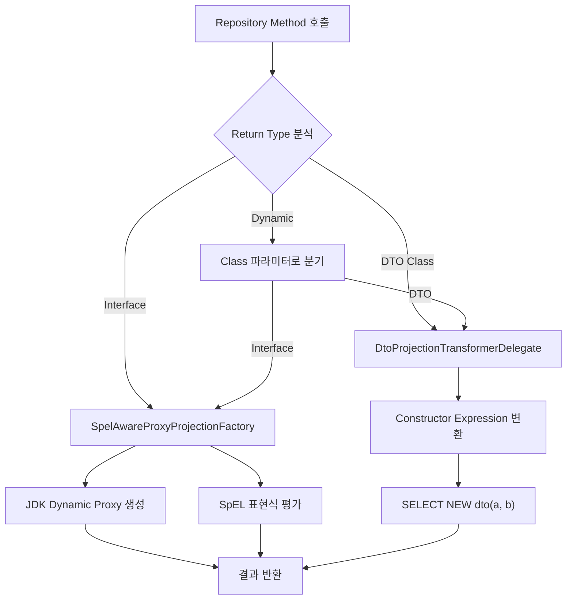
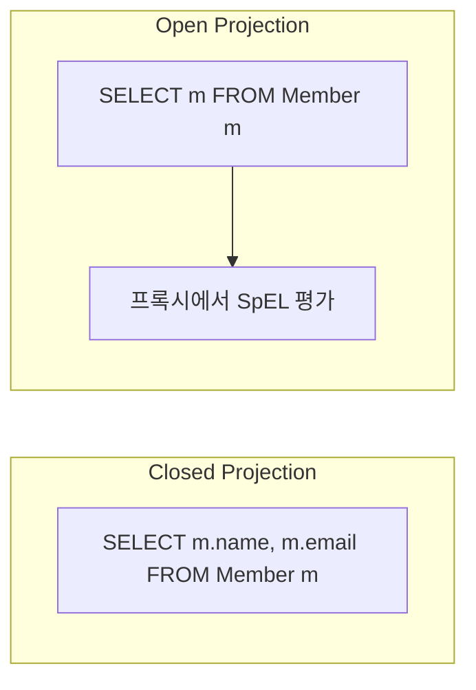

# Projections & DTO Mapping 완전 분석

Spring Data JPA에서 엔티티 전체가 아닌 필요한 필드만 조회하는 Projection 메커니즘의 3가지 방식(Interface, Class, Dynamic)과 내부 프록시 생성 원리를 소스코드 수준에서 분석한다.

## 목차

1. [핵심 개념 (What)](#1-핵심-개념-what)
2. [왜 알아야 하는가 (Why)](#2-왜-알아야-하는가-why)
3. [내부 구현 분석 (How)](#3-내부-구현-분석-how)
4. [실전 예제](#4-실전-예제)
5. [정리](#5-정리)

---

## 1. 핵심 개념 (What)

### Projection이란?

Projection은 엔티티의 일부 속성만 선택적으로 조회하는 기법이다. SQL의 `SELECT a, b FROM table` 처럼 필요한 컬럼만 가져와서 네트워크 대역폭과 메모리를 절약한다.

Spring Data JPA는 3가지 Projection 방식을 제공한다:

### 1) Interface Projection (Closed / Open)

**Closed Projection** - getter 메서드가 엔티티 속성과 1:1 대응:

```java
public interface MemberSummary {
    String getName();
    String getEmail();
}
```

**Open Projection** - SpEL 표현식으로 계산된 값 반환:

```java
public interface MemberInfo {
    @Value("#{target.name + ' (' + target.email + ')'}")
    String getFullInfo();
}
```

### 2) Class (DTO) Projection

생성자 파라미터로 매핑하는 방식:

```java
public record MemberDto(String name, String email) {}
```

### 3) Dynamic Projection

제네릭 타입 파라미터로 런타임에 Projection 타입을 결정:

```java
<T> List<T> findByName(String name, Class<T> type);
```

---

## 2. 왜 알아야 하는가 (Why)

### 성능 관점

엔티티 전체를 로딩하면 불필요한 컬럼까지 SELECT하고, 영속성 컨텍스트에 관리 대상으로 등록된다. 대량 조회 API에서 DTO Projection을 쓰면 **SELECT 컬럼 수 감소 + 영속성 컨텍스트 미등록**으로 메모리와 CPU를 크게 절약한다.

### 아키텍처 관점

- **계층 분리**: 엔티티가 API 응답에 직접 노출되면 내부 스키마 변경이 곧 API 변경이 된다
- **보안**: 민감 필드(비밀번호, 주민번호)가 불필요하게 노출되는 것을 방지
- **유연성**: 같은 엔티티에 대해 용도별 다른 뷰를 제공

### 실무 판단 기준

| 상황 | 추천 방식 |
|------|----------|
| 읽기 전용 API 응답 | DTO (record) Projection |
| 연관 엔티티 포함 조회 | Interface Projection (Nested) |
| 하나의 쿼리 메서드로 다양한 형태 반환 | Dynamic Projection |
| SpEL 계산 필요 | Open Interface Projection |

---

## 3. 내부 구현 분석 (How)

### 전체 아키텍처



### Interface Projection: 프록시 생성 원리

Spring Data JPA는 `CollectionAwareProjectionFactory`를 사용하며, 이 클래스는 `SpelAwareProxyProjectionFactory`를 상속한다.

```
CollectionAwareProjectionFactory
  └── SpelAwareProxyProjectionFactory (spring-data-commons)
       └── ProxyProjectionFactory
            └── ProjectionFactory
```

**소스코드**: `CollectionAwareProjectionFactory.java`

```java
// org.springframework.data.jpa.projection.CollectionAwareProjectionFactory

public class CollectionAwareProjectionFactory extends SpelAwareProxyProjectionFactory {

    @Override
    protected ProjectionInformation createProjectionInformation(Class<?> projectionType) {
        return new CollectionAwareProjectionInformation(projectionType);
    }

    private static class CollectionAwareProjectionInformation
            extends SpelAwareProjectionInformation {

        @Override
        protected boolean isInputProperty(PropertyDescriptor descriptor) {
            if (!super.isInputProperty(descriptor)) {
                return false;
            }
            // Collection이나 Map 타입 프로퍼티는 input property에서 제외
            // → Open Projection으로 취급
            return !(Collection.class.isAssignableFrom(descriptor.getPropertyType())
                    || Map.class.isAssignableFrom(descriptor.getPropertyType()));
        }
    }
}
```

핵심 로직:
1. `isInputProperty()`가 `true`인 속성만 SELECT 대상 (Closed Projection)
2. Collection/Map 타입은 `false` 반환 → Open Projection으로 취급되어 엔티티 전체 로딩

### Closed vs Open Projection의 쿼리 차이



- **Closed**: `isInputProperty()`가 `true`인 속성들만 SELECT절에 포함
- **Open**: SpEL이 포함되어 있으면 어떤 필드가 필요한지 컴파일 타임에 알 수 없으므로 엔티티 전체를 조회

### DTO Projection: Constructor Expression 자동 변환

Spring Data JPA 3.5부터 `DtoProjectionTransformerDelegate`가 쿼리를 자동으로 Constructor Expression으로 변환한다.

**소스코드**: `DtoProjectionTransformerDelegate.java`

```java
// org.springframework.data.jpa.repository.query.DtoProjectionTransformerDelegate

class DtoProjectionTransformerDelegate {

    private final ReturnedType returnedType;
    private final Lazy<Boolean> applyRewriting;

    public DtoProjectionTransformerDelegate(ReturnedType returnedType) {
        this.returnedType = returnedType;
        // DTO Projection이고 커스텀 생성자가 필요한 경우에만 리라이팅 적용
        this.applyRewriting = Lazy.of(() -> returnedType.isDtoProjection()
                && returnedType.needsCustomConstruction());
    }

    public QueryTokenStream getRewrittenSelectionList() {
        if (canRewrite()) {
            // SELECT p FROM Person p
            //   → SELECT NEW com.example.PersonDto(p.name, p.email) FROM Person p
            QueryRenderer.QueryRendererBuilder builder = QueryRenderer.builder();
            builder.append(QueryTokens.TOKEN_NEW);
            builder.append(QueryTokens.token(returnedType.getReturnedType().getName()));
            builder.append(QueryTokens.TOKEN_OPEN_PAREN);
            // ... 프로퍼티 리스트 추가
            builder.append(TOKEN_CLOSE_PAREN);
            return builder.build();
        }
        return QueryTokenStream.empty();
    }
}
```

변환 조건:
- `isDtoProjection()`: 반환 타입이 인터페이스가 아닌 클래스
- `needsCustomConstruction()`: 엔티티 자체가 아닌 별도 DTO 클래스

### Dynamic Projection 구현

Dynamic Projection은 메서드의 `Class<T>` 파라미터를 분석하여 런타임에 Projection 타입을 결정한다:

```java
// 내부적으로 ReturnedType을 동적으로 결정
// Class<T> 파라미터의 실제 타입에 따라
// Interface → 프록시 생성 경로
// DTO Class → Constructor Expression 경로
```

---

## 4. 실전 예제

### 예제 1: Closed Interface Projection

```java
// 엔티티
@Entity
public class Order {
    @Id @GeneratedValue
    private Long id;
    private String orderNumber;
    private BigDecimal totalAmount;
    private LocalDateTime orderDate;

    @ManyToOne(fetch = FetchType.LAZY)
    private Member member;

    @OneToMany(mappedBy = "order")
    private List<OrderItem> items;
}

// Projection 인터페이스
public interface OrderSummary {
    String getOrderNumber();
    BigDecimal getTotalAmount();
    LocalDateTime getOrderDate();

    // Nested Projection - 연관 엔티티의 일부만 조회
    MemberInfo getMember();

    interface MemberInfo {
        String getName();
        String getEmail();
    }
}

// Repository
public interface OrderRepository extends JpaRepository<Order, Long> {
    List<OrderSummary> findByMemberId(Long memberId);
}
```

생성되는 SQL:

```sql
SELECT o.order_number, o.total_amount, o.order_date,
       m.name, m.email
FROM orders o
LEFT JOIN member m ON o.member_id = m.id
WHERE o.member_id = ?
```

### 예제 2: DTO Projection (record)

```java
// DTO
public record OrderStatDto(
    String orderNumber,
    BigDecimal totalAmount,
    long itemCount
) {}

// Repository - JPQL에서 생성자 표현식 사용
public interface OrderRepository extends JpaRepository<Order, Long> {

    @Query("""
        SELECT new com.example.dto.OrderStatDto(
            o.orderNumber, o.totalAmount, SIZE(o.items)
        )
        FROM Order o
        WHERE o.member.id = :memberId
        """)
    List<OrderStatDto> findOrderStats(@Param("memberId") Long memberId);

    // 또는 메서드 이름 기반 - 자동 Constructor Expression 변환
    List<OrderStatDto> findByMemberId(Long memberId);
}
```

### 예제 3: Dynamic Projection

```java
public interface MemberRepository extends JpaRepository<Member, Long> {

    <T> List<T> findByDepartment(String department, Class<T> type);

    <T> Optional<T> findById(Long id, Class<T> type);
}

// 사용
// 목록 조회 - 간단한 요약만
List<MemberSummary> summaries = memberRepository
    .findByDepartment("engineering", MemberSummary.class);

// 상세 조회 - 전체 정보
List<MemberDetailDto> details = memberRepository
    .findByDepartment("engineering", MemberDetailDto.class);

// 엔티티 직접 조회도 가능
List<Member> entities = memberRepository
    .findByDepartment("engineering", Member.class);
```

### 예제 4: Open Projection with SpEL

```java
public interface MemberWithFullName {
    String getFirstName();
    String getLastName();

    @Value("#{target.firstName + ' ' + target.lastName}")
    String getFullName();

    @Value("#{@memberService.calculateGrade(target.id)}")
    String getGrade();  // Bean 참조로 복잡한 계산 위임
}
```

---

## 5. 정리

### Projection 방식 비교

| 구분 | Closed Interface | Open Interface | DTO (Class/Record) | Dynamic |
|------|-----------------|----------------|--------------------|---------|
| SELECT 최적화 | O (필요 컬럼만) | X (전체 조회) | O (필요 컬럼만) | 타입에 따라 다름 |
| 영속성 컨텍스트 | 미등록 | 등록 (엔티티 조회) | 미등록 | 타입에 따라 다름 |
| SpEL 지원 | X | O | X | X |
| 중첩(Nested) | O | O | X | O |
| 불변성 보장 | O (인터페이스) | O | O (record 사용 시) | 타입에 따라 다름 |
| 성능 순위 | 2위 | 3위 (가장 느림) | 1위 (가장 빠름) | - |

### 핵심 클래스 참조

| 클래스 | 역할 |
|--------|------|
| `CollectionAwareProjectionFactory` | Collection/Map 포함 시 Open Projection으로 판단 |
| `SpelAwareProxyProjectionFactory` | SpEL 기반 프록시 생성 (spring-data-commons) |
| `DtoProjectionTransformerDelegate` | DTO 반환 시 Constructor Expression으로 쿼리 변환 |
| `ReturnedType` | 반환 타입 분석 및 Projection 여부 판단 |

### 실무 가이드라인

1. **기본은 DTO Projection (record)** - 가장 빠르고, 불변이며, 영속성 컨텍스트 오염 없음
2. **Nested 연관관계 필요하면 Interface Projection** - LEFT JOIN으로 자동 처리
3. **Open Projection은 최후의 수단** - 엔티티 전체 조회 비용 발생
4. **Dynamic Projection으로 유연성 확보** - 하나의 메서드로 다양한 뷰 제공

---
*참고: Spring Data JPA 3.x / Hibernate 6.x 기준*
