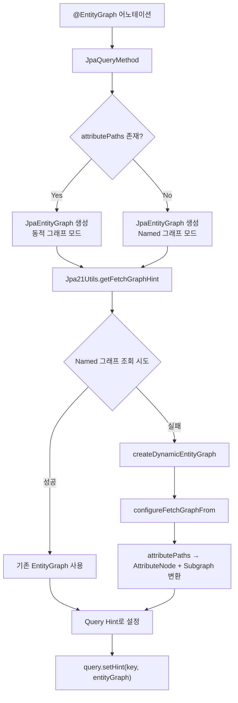
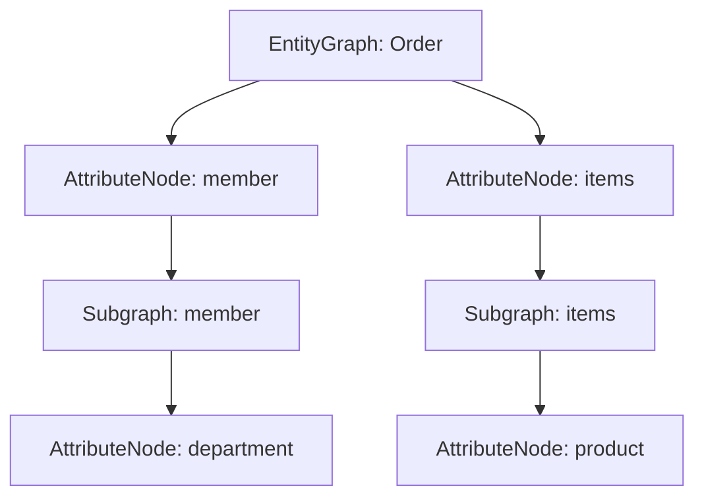

# EntityGraph & Fetch 최적화 전략

JPA 2.1 EntityGraph를 활용한 페치 전략 제어와 N+1 문제 해결 방법을 Spring Data JPA의 내부 구현 관점에서 분석한다.

## 목차

1. [핵심 개념 (What)](#1-핵심-개념-what)
2. [왜 알아야 하는가 (Why)](#2-왜-알아야-하는가-why)
3. [내부 구현 분석 (How)](#3-내부-구현-분석-how)
4. [실전 예제](#4-실전-예제)
5. [정리](#5-정리)

---

## 1. 핵심 개념 (What)

### EntityGraph란?

EntityGraph는 JPA 2.1에서 도입된 기능으로, 쿼리 시점에 어떤 연관 엔티티를 함께 로딩할지 **선언적으로** 제어하는 메커니즘이다. 엔티티에 선언된 `FetchType.LAZY`/`EAGER` 설정을 쿼리 단위로 오버라이드할 수 있다.

### EntityGraphType.FETCH vs LOAD

Spring Data JPA의 `@EntityGraph` 어노테이션은 두 가지 타입을 지원한다:

```java
// org.springframework.data.jpa.repository.EntityGraph.EntityGraphType

public enum EntityGraphType {
    LOAD("jakarta.persistence.loadgraph"),
    FETCH("jakarta.persistence.fetchgraph");
}
```

| 구분 | FETCH | LOAD |
|------|-------|------|
| 그래프에 명시된 속성 | `FetchType.EAGER` | `FetchType.EAGER` |
| 그래프에 명시 안 된 속성 | **`FetchType.LAZY`** | **엔티티 매핑 기본값 유지** |
| JPA 힌트 키 | `jakarta.persistence.fetchgraph` | `jakarta.persistence.loadgraph` |
| 기본값 여부 | O (Spring Data JPA 기본) | X |

핵심 차이: **FETCH**는 그래프에 없는 속성을 모두 LAZY로 강제하고, **LOAD**는 엔티티의 기존 매핑을 존중한다.

### @EntityGraph 사용 방법

```java
public interface OrderRepository extends JpaRepository<Order, Long> {

    // 1) Named EntityGraph 참조
    @EntityGraph(value = "Order.withMember", type = EntityGraphType.LOAD)
    List<Order> findByStatus(OrderStatus status);

    // 2) attributePaths로 동적 그래프 정의 (named graph 무시)
    @EntityGraph(attributePaths = {"member", "items"})
    List<Order> findByMemberId(Long memberId);

    // 3) 중첩 경로 지원
    @EntityGraph(attributePaths = {"member.department", "items.product"})
    Optional<Order> findWithDetailsById(Long id);
}
```

---

## 2. 왜 알아야 하는가 (Why)

### N+1 문제의 본질

```
1번의 주문 목록 쿼리 → N번의 회원 조회 쿼리 발생
SELECT * FROM orders WHERE status = 'CONFIRMED'    -- 1번
SELECT * FROM member WHERE id = 1                   -- N번 반복
SELECT * FROM member WHERE id = 2
...
```

### fetch join의 한계

`fetch join`은 N+1을 해결하지만 **Pagination과 함께 사용 불가**라는 치명적 한계가 있다:

```java
// 경고 발생: HHH90003004: firstResult/maxResults specified with collection fetch
@Query("SELECT o FROM Order o JOIN FETCH o.items")
Page<Order> findAllWithItems(Pageable pageable);
```

Hibernate는 fetch join + pagination 시 **모든 데이터를 메모리에 로딩한 뒤 애플리케이션 레벨에서 페이징**한다. 데이터가 많으면 OutOfMemoryError 위험이 있다.

### EntityGraph의 장점

- **Pagination과 함께 사용 가능** (컬렉션이 아닌 단일 연관관계의 경우)
- **쿼리 메서드에 선언적으로 적용** (JPQL 변경 불필요)
- **동적 그래프 정의** (`attributePaths`로 코드 레벨에서 제어)

---

## 3. 내부 구현 분석 (How)

### 전체 아키텍처



### JpaEntityGraph: 설정 래핑

`@EntityGraph` 어노테이션의 정보를 담는 값 객체다.

**소스코드**: `JpaEntityGraph.java`

```java
// org.springframework.data.jpa.repository.query.JpaEntityGraph

public class JpaEntityGraph {

    private final String name;
    private final EntityGraphType type;
    private final List<String> attributePaths;

    public JpaEntityGraph(EntityGraph entityGraph, String nameFallback) {
        // value가 비어있으면 nameFallback (예: "Order.findByStatus") 사용
        this(StringUtils.hasText(entityGraph.value())
                ? entityGraph.value() : nameFallback,
            entityGraph.type(),
            entityGraph.attributePaths());
    }
}
```

- `attributePaths`가 비어있으면 → `name`으로 Named EntityGraph 조회
- `attributePaths`가 있으면 → 동적 그래프 생성 (name은 무시)

### Jpa21Utils: EntityGraph 생성 및 적용

**소스코드**: `Jpa21Utils.java`

```java
// org.springframework.data.jpa.repository.query.Jpa21Utils

public class Jpa21Utils {

    public static QueryHints getFetchGraphHint(EntityManager em,
            JpaEntityGraph entityGraph, Class<?> entityType) {

        MutableQueryHints result = new MutableQueryHints();
        EntityGraph<?> graph = tryGetFetchGraph(em, entityGraph, entityType);

        // EntityGraphType의 key를 힌트 이름으로 사용
        // FETCH → "jakarta.persistence.fetchgraph"
        // LOAD  → "jakarta.persistence.loadgraph"
        result.add(entityGraph.getType().getKey(), graph);
        return result;
    }

    private static EntityGraph<?> tryGetFetchGraph(EntityManager em,
            JpaEntityGraph jpaEntityGraph, Class<?> entityType) {

        if (StringUtils.hasText(jpaEntityGraph.getName())) {
            try {
                // 먼저 Named EntityGraph로 조회 시도
                return em.getEntityGraph(jpaEntityGraph.getName());
            } catch (Exception ignore) {}
        }
        // 실패하면 동적 그래프 생성
        return createDynamicEntityGraph(em, jpaEntityGraph, entityType);
    }
}
```

### 동적 그래프 생성: attributePaths 파싱

`attributePaths`의 점(`.`) 표기법을 `AttributeNode`와 `Subgraph`로 변환하는 과정:

```java
// Jpa21Utils.configureFetchGraphFrom()

static void configureFetchGraphFrom(JpaEntityGraph jpaEntityGraph,
        EntityGraph<?> entityGraph) {

    List<String> attributePaths = new ArrayList<>(jpaEntityGraph.getAttributePaths());
    Collections.sort(attributePaths);  // 정렬하여 중간 Subgraph 순서 보장

    for (String path : attributePaths) {
        String[] pathComponents = StringUtils.delimitedListToStringArray(path, ".");
        createGraph(pathComponents, 0, entityGraph, null);
    }
}
```

예시 - `attributePaths = {"member.department", "items.product"}`:



### EntityGraphFactory: 또 다른 그래프 생성기

`EntityGraphFactory`는 `FetchableFluentQueryBySpecification` 등에서 사용하는 별도의 그래프 생성 유틸이다.

**소스코드**: `EntityGraphFactory.java`

```java
// org.springframework.data.jpa.repository.support.EntityGraphFactory

abstract class EntityGraphFactory {

    public static final String HINT = "jakarta.persistence.fetchgraph";

    public static <T> EntityGraph<T> create(EntityManager entityManager,
            Class<T> domainType, Set<String> properties) {

        EntityGraph<T> entityGraph = entityManager.createEntityGraph(domainType);
        Map<String, Subgraph<Object>> existingSubgraphs = new HashMap<>();

        for (String property : properties) {
            Subgraph<Object> current = null;
            String currentFullPath = "";

            for (PropertyPath path : PropertyPath.from(property, domainType)) {
                currentFullPath += path.getSegment() + ".";

                if (path.hasNext()) {
                    // 중간 경로 → Subgraph 생성 (중복 방지)
                    if (current == null) {
                        current = existingSubgraphs.computeIfAbsent(currentFullPath,
                            k -> entityGraph.addSubgraph(path.getSegment()));
                    } else {
                        final Subgraph<Object> finalCurrent = current;
                        current = existingSubgraphs.computeIfAbsent(currentFullPath,
                            k -> finalCurrent.addSubgraph(path.getSegment()));
                    }
                    continue;
                }
                // 마지막 경로 → AttributeNode 추가
                if (current == null) {
                    entityGraph.addAttributeNodes(path.getSegment());
                } else {
                    current.addAttributeNodes(path.getSegment());
                }
            }
        }
        return entityGraph;
    }
}
```

`Jpa21Utils`와의 차이점: `EntityGraphFactory`는 `PropertyPath`를 사용하여 타입 안전하게 경로를 파싱하고, `existingSubgraphs` 맵으로 중복 Subgraph 생성을 방지한다.

---

## 4. 실전 예제

### 예제 1: N+1 해결 - @EntityGraph

```java
@Entity
public class Order {
    @Id @GeneratedValue
    private Long id;

    @ManyToOne(fetch = FetchType.LAZY)
    private Member member;

    @OneToMany(mappedBy = "order", fetch = FetchType.LAZY)
    private List<OrderItem> items = new ArrayList<>();
}

public interface OrderRepository extends JpaRepository<Order, Long> {

    // N+1 발생
    List<Order> findByStatus(OrderStatus status);

    // EntityGraph로 해결 - member만 즉시 로딩
    @EntityGraph(attributePaths = {"member"})
    List<Order> findWithMemberByStatus(OrderStatus status);

    // member + items 동시 로딩
    @EntityGraph(attributePaths = {"member", "items"})
    List<Order> findWithMemberAndItemsByStatus(OrderStatus status);
}
```

### 예제 2: EntityGraph + Pagination (ToOne 관계)

```java
public interface OrderRepository extends JpaRepository<Order, Long> {

    // 정상 작동 - @ManyToOne 관계는 Pagination과 호환
    @EntityGraph(attributePaths = {"member"})
    Page<Order> findByStatus(OrderStatus status, Pageable pageable);
}
```

생성되는 SQL:

```sql
SELECT o.*, m.*
FROM orders o
LEFT OUTER JOIN member m ON o.member_id = m.id
WHERE o.status = ?
ORDER BY o.order_date DESC
LIMIT ? OFFSET ?
```

### 예제 3: Named EntityGraph

```java
@Entity
@NamedEntityGraph(
    name = "Order.detail",
    attributeNodes = {
        @NamedAttributeNode("member"),
        @NamedAttributeNode(value = "items", subgraph = "items-product")
    },
    subgraphs = @NamedSubgraph(
        name = "items-product",
        attributeNodes = @NamedAttributeNode("product")
    )
)
public class Order {
    // ...
}

public interface OrderRepository extends JpaRepository<Order, Long> {

    @EntityGraph(value = "Order.detail", type = EntityGraphType.LOAD)
    Optional<Order> findDetailById(Long id);
}
```

### 예제 4: N+1 해결 전략 비교

```java
public interface OrderRepository extends JpaRepository<Order, Long> {

    // 전략 1: FETCH JOIN - Pagination 불가 (컬렉션)
    @Query("SELECT o FROM Order o JOIN FETCH o.items WHERE o.status = :status")
    List<Order> findWithItemsFetchJoin(@Param("status") OrderStatus status);

    // 전략 2: @EntityGraph - Pagination 가능 (단, 컬렉션 시 메모리 주의)
    @EntityGraph(attributePaths = {"items"})
    Page<Order> findWithItemsByStatus(OrderStatus status, Pageable pageable);

    // 전략 3: ToOne만 EntityGraph, ToMany는 @BatchSize
    @EntityGraph(attributePaths = {"member"})
    Page<Order> findByStatus(OrderStatus status, Pageable pageable);
    // items는 @BatchSize(size = 100) 설정으로 해결
}

// 전략 3에서 엔티티 설정
@Entity
public class Order {
    @ManyToOne(fetch = FetchType.LAZY)
    private Member member;

    @BatchSize(size = 100)  // IN 절로 100개씩 묶어서 조회
    @OneToMany(mappedBy = "order", fetch = FetchType.LAZY)
    private List<OrderItem> items = new ArrayList<>();
}
```

---

## 5. 정리

### N+1 해결 전략 비교

| 전략 | Pagination | 컬렉션 | 다중 컬렉션 | 쿼리 수 |
|------|-----------|--------|------------|---------|
| FETCH JOIN | X (컬렉션 시) | O | X (MultipleBagFetchException) | 1 |
| @EntityGraph | O (ToOne) / 메모리주의 (ToMany) | O | X (동일 문제) | 1 |
| @BatchSize | O | O | O | 1 + ceil(N/batchSize) |
| Subselect | O | O | O | 1 + 컬렉션 수 |

### 실무 추천 조합

```
ToOne 연관관계 → @EntityGraph (attributePaths)
ToMany 연관관계 + Pagination → @BatchSize(size = 100)
단일 ToMany + Pagination 불필요 → FETCH JOIN
```

### 핵심 클래스 참조

| 클래스 | 역할 |
|--------|------|
| `EntityGraph` (어노테이션) | 리포지토리 메서드에 EntityGraph 설정 선언 |
| `JpaEntityGraph` | EntityGraph 어노테이션 정보를 래핑하는 값 객체 |
| `Jpa21Utils` | EntityGraph 생성, Named Graph 조회, 동적 그래프 빌드 |
| `EntityGraphFactory` | PropertyPath 기반 타입 안전한 EntityGraph 생성 |
| `EntityGraphType` | FETCH/LOAD 타입 정의 및 JPA 힌트 키 매핑 |

---
*참고: Spring Data JPA 3.x / Hibernate 6.x 기준*
