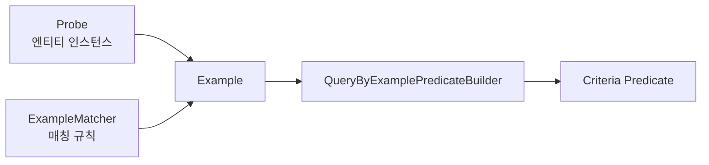
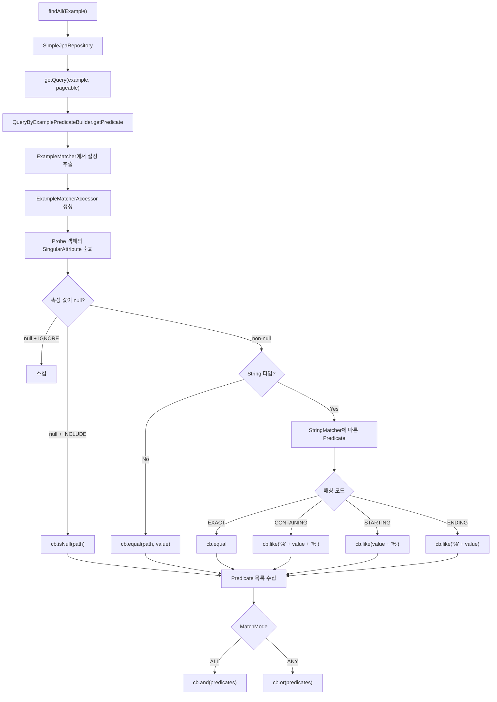
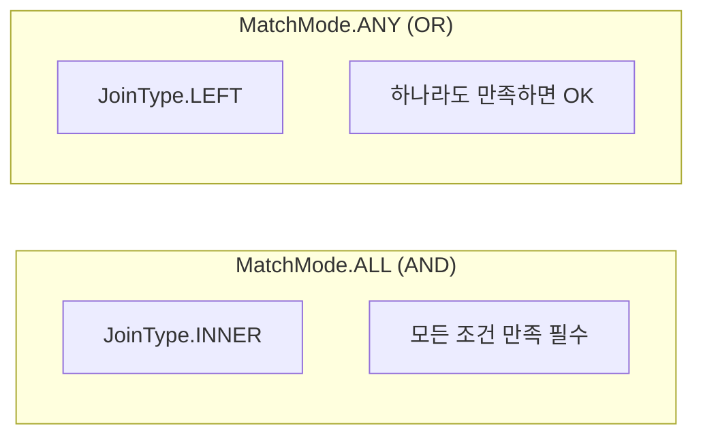

# Query by Example (QBE) 완전 분석

동적 쿼리를 프로브(Probe) 객체 기반으로 생성하는 Query by Example 메커니즘의 동작 원리와 Criteria API 변환 과정을 소스코드 수준에서 분석한다.

## 목차

1. [핵심 개념 (What)](#1-핵심-개념-what)
2. [왜 알아야 하는가 (Why)](#2-왜-알아야-하는가-why)
3. [내부 구현 분석 (How)](#3-내부-구현-분석-how)
4. [실전 예제](#4-실전-예제)
5. [정리](#5-정리)

---

## 1. 핵심 개념 (What)

### Query by Example이란?

Query by Example(QBE)는 도메인 엔티티 인스턴스를 **프로브(Probe)**로 사용하여 동적 쿼리를 생성하는 기법이다. 엔티티의 non-null 필드가 자동으로 WHERE 조건이 된다.

```java
Member probe = new Member();
probe.setDepartment("engineering");
probe.setStatus(MemberStatus.ACTIVE);

Example<Member> example = Example.of(probe);
List<Member> results = memberRepository.findAll(example);
// → WHERE department = 'engineering' AND status = 'ACTIVE'
```

### 구성 요소



- **Probe**: 검색 조건 값을 담은 엔티티 인스턴스
- **ExampleMatcher**: null 처리, 문자열 매칭 전략 등 매칭 규칙 정의
- **Example**: Probe + ExampleMatcher의 조합

### ExampleMatcher 설정 옵션

| 설정 | 설명 | 기본값 |
|------|------|--------|
| `NullHandler` | null 필드 처리 (IGNORE / INCLUDE) | IGNORE |
| `StringMatcher` | 문자열 비교 방식 | EXACT (DEFAULT) |
| `MatchMode` | ALL(AND) / ANY(OR) | ALL |
| `ignoreCase` | 대소문자 무시 여부 | false |
| `ignoredPaths` | 무시할 프로퍼티 경로 | 없음 |
| `PropertyValueTransformer` | 값 변환 함수 | 없음 |

### StringMatcher 모드

| 모드 | SQL 변환 | 예시 |
|------|----------|------|
| DEFAULT / EXACT | `= ?` | `name = 'John'` |
| CONTAINING | `LIKE %?%` | `name LIKE '%John%'` |
| STARTING | `LIKE ?%` | `name LIKE 'John%'` |
| ENDING | `LIKE %?` | `name LIKE '%John'` |
| REGEX | 지원 안 됨 | (JPA Criteria에서 미지원) |

---

## 2. 왜 알아야 하는가 (Why)

### 동적 쿼리의 필요성

검색 화면에서 사용자가 선택적으로 입력하는 필터 조건을 처리할 때, 조건 조합에 따라 별도의 쿼리 메서드를 만들면 조합 폭발이 일어난다:

```
이름만 검색, 부서만 검색, 이름+부서, 이름+상태, 부서+상태, 이름+부서+상태...
→ 2^N 개의 쿼리 메서드 필요
```

### QBE vs 다른 동적 쿼리 방식

| 방식 | 장점 | 단점 |
|------|------|------|
| **QBE** | 코드 간결, 학습 쉬움 | 범위 쿼리 불가, OR 제한 |
| **Specification** | 완전한 유연성, 재사용 | 코드 복잡, Criteria API 지식 필요 |
| **QueryDSL** | 타입 안전, 가독성 | 빌드 설정 필요, 라이브러리 의존 |
| **@Query + SpEL** | 직관적 | 정적, 조합 폭발 |

### QBE가 적합한 경우

- 단순한 등호(`=`) 기반 검색 필터
- 프로토타입/빠른 개발
- 도메인 모델 기반의 직관적 API

---

## 3. 내부 구현 분석 (How)

### 전체 처리 흐름



### QueryByExamplePredicateBuilder 핵심 로직

**소스코드**: `QueryByExamplePredicateBuilder.java`

```java
// org.springframework.data.jpa.convert.QueryByExamplePredicateBuilder

public class QueryByExamplePredicateBuilder {

    private static final Set<PersistentAttributeType> ASSOCIATION_TYPES =
        EnumSet.of(MANY_TO_MANY, MANY_TO_ONE, ONE_TO_MANY, ONE_TO_ONE);

    public static <T> @Nullable Predicate getPredicate(Root<T> root,
            CriteriaBuilder cb, Example<T> example, EscapeCharacter escapeCharacter) {

        ExampleMatcher matcher = example.getMatcher();

        List<Predicate> predicates = getPredicates("", cb, root,
            root.getModel(), example.getProbe(), example.getProbeType(),
            matcher.getMatchMode(),
            new ExampleMatcherAccessor(matcher),
            new PathNode("root", null, example.getProbe()),
            escapeCharacter);

        if (predicates.isEmpty()) return null;
        if (predicates.size() == 1) return predicates.iterator().next();

        Predicate[] array = predicates.toArray(new Predicate[0]);
        // ALL → AND, ANY → OR
        return matcher.isAllMatching() ? cb.and(array) : cb.or(array);
    }
}
```

### SingularAttribute 순회 및 Predicate 생성

```java
// QueryByExamplePredicateBuilder.getPredicates() 핵심 발췌

static List<Predicate> getPredicates(String path, CriteriaBuilder cb,
        Path<?> from, ManagedType<?> type, Object value, Class<?> probeType,
        MatchMode matchMode, ExampleMatcherAccessor exampleAccessor,
        PathNode currentNode, EscapeCharacter escapeCharacter) {

    List<Predicate> predicates = new ArrayList<>();
    DirectFieldAccessFallbackBeanWrapper beanWrapper =
        new DirectFieldAccessFallbackBeanWrapper(value);

    for (SingularAttribute attribute : type.getSingularAttributes()) {

        String currentPath = !StringUtils.hasText(path)
            ? attribute.getName()
            : path + "." + attribute.getName();

        // 1) ignoredPaths에 포함되면 스킵
        if (exampleAccessor.isIgnoredPath(currentPath)) continue;

        // 2) PropertyValueTransformer 적용
        Optional<Object> optionalValue = transformer
            .apply(Optional.ofNullable(
                beanWrapper.getPropertyValue(attribute.getName())));

        // 3) null 처리
        if (optionalValue.isEmpty()) {
            if (exampleAccessor.getNullHandler()
                    .equals(ExampleMatcher.NullHandler.INCLUDE)) {
                predicates.add(cb.isNull(from.get(attribute)));
            }
            continue;
        }

        // 4) Embedded / Association 처리 → 재귀 호출
        if (attribute.getPersistentAttributeType() == EMBEDDED) {
            predicates.addAll(getPredicates(currentPath, cb,
                from.get(attribute.getName()), ...));
            continue;
        }
        if (isAssociation(attribute)) {
            // 순환 참조 감지
            PathNode node = currentNode.add(attribute.getName(), attributeValue);
            if (node.spansCycle()) {
                throw new InvalidDataAccessApiUsageException(...);
            }
            // JOIN 타입 결정: ALL→INNER, ANY→LEFT
            JoinType joinType = matchMode.equals(MatchMode.ALL)
                ? JoinType.INNER : JoinType.LEFT;
            predicates.addAll(getPredicates(currentPath, cb,
                ((From<?,?>) from).join(attribute.getName(), joinType), ...));
            continue;
        }

        // 5) String 타입 → StringMatcher 적용
        if (attribute.getJavaType().equals(String.class)) {
            Expression<String> expression = from.get(attribute);
            if (exampleAccessor.isIgnoreCaseForPath(currentPath)) {
                expression = cb.lower(expression);
                attributeValue = attributeValue.toString().toLowerCase();
            }
            switch (exampleAccessor.getStringMatcherForPath(currentPath)) {
                case EXACT -> predicates.add(cb.equal(expression, attributeValue));
                case CONTAINING -> predicates.add(cb.like(expression,
                    "%" + escapeCharacter.escape(attributeValue.toString()) + "%",
                    escapeCharacter.getEscapeCharacter()));
                case STARTING -> predicates.add(cb.like(expression,
                    escapeCharacter.escape(attributeValue.toString()) + "%",
                    escapeCharacter.getEscapeCharacter()));
                case ENDING -> predicates.add(cb.like(expression,
                    "%" + escapeCharacter.escape(attributeValue.toString()),
                    escapeCharacter.getEscapeCharacter()));
            }
        } else {
            // 6) 그 외 타입 → equal
            predicates.add(cb.equal(from.get(attribute), attributeValue));
        }
    }
    return predicates;
}
```

### 순환 참조 감지: PathNode

연관 관계 탐색 시 순환 참조(A→B→A)를 감지하는 링크드 리스트 구조:

```java
// QueryByExamplePredicateBuilder.PathNode

private static class PathNode {
    String name;
    @Nullable PathNode parent;
    @Nullable Object value;

    boolean spansCycle() {
        if (value == null) return false;
        String identityHex = ObjectUtils.getIdentityHexString(value);
        PathNode current = parent;
        while (current != null) {
            if (current.value != null &&
                ObjectUtils.getIdentityHexString(current.value)
                    .equals(identityHex)) {
                return true;  // 같은 객체 인스턴스 → 순환!
            }
            current = current.parent;
        }
        return false;
    }
}
```

`identityHashCode`를 비교하여 같은 객체 인스턴스가 재등장하면 순환으로 판단한다.

### MatchMode에 따른 JOIN 전략



- **ALL**: INNER JOIN → 연관 엔티티가 없으면 결과에서 제외
- **ANY**: LEFT JOIN → 연관 엔티티가 없어도 다른 조건으로 매칭 가능

---

## 4. 실전 예제

### 예제 1: 기본 검색 필터

```java
@Service
@RequiredArgsConstructor
public class MemberSearchService {

    private final MemberRepository memberRepository;

    public Page<Member> search(MemberSearchRequest request, Pageable pageable) {

        Member probe = new Member();
        probe.setDepartment(request.getDepartment());  // null이면 무시됨
        probe.setStatus(request.getStatus());           // null이면 무시됨
        probe.setRole(request.getRole());               // null이면 무시됨

        ExampleMatcher matcher = ExampleMatcher.matching()
            .withIgnorePaths("id", "createdAt", "password");  // 제외 필드

        Example<Member> example = Example.of(probe, matcher);
        return memberRepository.findAll(example, pageable);
    }
}
```

### 예제 2: 문자열 검색 - CONTAINING + ignoreCase

```java
public Page<Member> searchByName(String keyword, Pageable pageable) {

    Member probe = new Member();
    probe.setName(keyword);

    ExampleMatcher matcher = ExampleMatcher.matching()
        .withIgnorePaths("id", "createdAt", "password")
        .withMatcher("name", ExampleMatcher.GenericPropertyMatchers
            .contains()           // LIKE %keyword%
            .ignoreCase())        // 대소문자 무시
        .withIgnoreNullValues();  // null 값 무시 (기본값)

    return memberRepository.findAll(Example.of(probe, matcher), pageable);
}
```

생성되는 SQL:

```sql
SELECT * FROM member
WHERE LOWER(name) LIKE LOWER('%keyword%')
ORDER BY ... LIMIT ? OFFSET ?
```

### 예제 3: 연관 엔티티 조건 포함

```java
public List<Order> searchOrders(OrderSearchRequest request) {

    Order probe = new Order();
    probe.setStatus(request.getStatus());

    // 연관 엔티티의 필드로도 검색 가능
    if (request.getMemberName() != null) {
        Member memberProbe = new Member();
        memberProbe.setName(request.getMemberName());
        probe.setMember(memberProbe);
    }

    ExampleMatcher matcher = ExampleMatcher.matching()
        .withIgnorePaths("id", "orderDate", "totalAmount")
        .withMatcher("member.name",
            ExampleMatcher.GenericPropertyMatchers.contains());

    return orderRepository.findAll(Example.of(probe, matcher));
}
```

### 예제 4: PropertyValueTransformer 활용

```java
ExampleMatcher matcher = ExampleMatcher.matching()
    .withTransformer("email", optionalValue ->
        optionalValue.map(v -> ((String) v).toLowerCase().trim()))
    .withTransformer("phone", optionalValue ->
        optionalValue.map(v -> ((String) v).replaceAll("-", "")));
```

---

## 5. 정리

### QBE의 한계

| 한계 | 설명 | 대안 |
|------|------|------|
| 범위 쿼리 불가 | `>`, `<`, `BETWEEN` 사용 불가 | Specification |
| OR 그룹핑 불가 | 필드 간 개별 OR 불가 (전체 ANY만 가능) | Specification |
| 컬렉션 속성 무시 | `@OneToMany` 등 컬렉션은 탐색 안 됨 | Specification |
| REGEX 미지원 | StringMatcher.REGEX는 JPA에서 미구현 | Native Query |
| 중첩 프로퍼티 그룹핑 | 같은 연관 엔티티의 서로 다른 조건 조합 제한 | Specification |

### 핵심 클래스 참조

| 클래스 | 역할 |
|--------|------|
| `Example` | Probe + ExampleMatcher 조합 (spring-data-commons) |
| `ExampleMatcher` | null 처리, StringMatcher, MatchMode 설정 |
| `QueryByExamplePredicateBuilder` | Example을 JPA Criteria Predicate로 변환 |
| `ExampleMatcherAccessor` | ExampleMatcher 설정에 대한 편의 접근 제공 |
| `PathNode` | 연관 관계 순환 참조 감지 |

### 결정 가이드

```
단순 등호 검색 + 빠른 개발 → QBE
범위/복합 조건 + 재사용 → Specification
복잡한 동적 쿼리 + 타입 안전 → QueryDSL
```

---
*참고: Spring Data JPA 3.x / Hibernate 6.x 기준*
