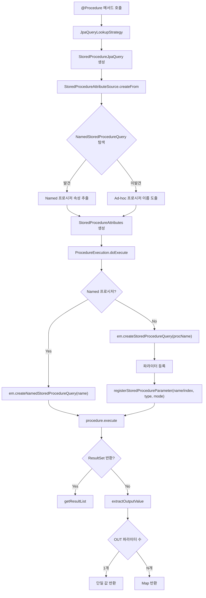

# Stored Procedure 호출 완전 분석

Spring Data JPA에서 데이터베이스 Stored Procedure를 호출하는 `@Procedure` 어노테이션의 동작 원리와 `StoredProcedureJpaQuery`의 실행 과정을 소스코드 수준에서 분석한다.

## 목차

1. [핵심 개념 (What)](#1-핵심-개념-what)
2. [왜 알아야 하는가 (Why)](#2-왜-알아야-하는가-why)
3. [내부 구현 분석 (How)](#3-내부-구현-분석-how)
4. [실전 예제](#4-실전-예제)
5. [정리](#5-정리)

---

## 1. 핵심 개념 (What)

### Stored Procedure란?

Stored Procedure는 데이터베이스에 저장된 재사용 가능한 SQL 프로그램이다. 복잡한 비즈니스 로직을 DB 레벨에서 실행하여 네트워크 왕복을 줄이고, 데이터 무결성을 보장한다.

### Spring Data JPA의 @Procedure

`@Procedure` 어노테이션은 리포지토리 메서드를 Stored Procedure 호출로 매핑한다.

**소스코드**: `Procedure.java`

```java
// org.springframework.data.jpa.repository.query.Procedure

@Target({ ElementType.METHOD, ElementType.ANNOTATION_TYPE })
@Retention(RetentionPolicy.RUNTIME)
public @interface Procedure {

    String value() default "";              // DB 프로시저 이름 (shorthand)
    String procedureName() default "";      // DB 프로시저 이름
    String name() default "";              // EntityManager에 등록된 Named 프로시저 이름
    String outputParameterName() default ""; // OUT 파라미터 이름
    boolean refCursor() default false;       // REF_CURSOR 사용 여부 (Oracle 등)
}
```

### 두 가지 호출 방식

| 방식 | 설명 | @Procedure 설정 |
|------|------|-----------------|
| **Ad-hoc** | DB 프로시저 이름으로 직접 호출 | `value` 또는 `procedureName` 설정 |
| **Named** | `@NamedStoredProcedureQuery`로 미리 정의된 프로시저 참조 | `name` 설정 |

---

## 2. 왜 알아야 하는가 (Why)

### 레거시 시스템 통합

기존 시스템에 이미 수많은 Stored Procedure가 구축되어 있는 경우, 새 애플리케이션에서 이를 재사용해야 한다. JPA의 `@Procedure`를 통해 기존 프로시저를 Spring Data Repository 패턴으로 깔끔하게 통합할 수 있다.

### Stored Procedure가 적합한 경우

- **대량 데이터 처리**: 수백만 건의 배치 UPDATE/DELETE
- **복잡한 트랜잭션 로직**: 여러 테이블에 걸친 원자적 연산
- **보안 격리**: 테이블 직접 접근 대신 프로시저만 허용
- **DB 레벨 최적화**: 실행 계획 캐싱, 네트워크 왕복 감소

### 주의 사항

- **이식성 저하**: DB 벤더에 종속적
- **테스트 어려움**: 단위 테스트에서 DB 의존성
- **디버깅 복잡**: 애플리케이션과 DB 양쪽에서 추적 필요

---

## 3. 내부 구현 분석 (How)

### 전체 실행 흐름



### StoredProcedureAttributeSource: 프로시저 속성 추출

`StoredProcedureAttributeSource`는 `@Procedure` 어노테이션과 `@NamedStoredProcedureQuery`에서 프로시저 실행에 필요한 속성을 추출하는 팩토리 클래스다.

**소스코드**: `StoredProcedureAttributeSource.java`

```java
// org.springframework.data.jpa.repository.query.StoredProcedureAttributeSource

enum StoredProcedureAttributeSource {
    INSTANCE;

    public StoredProcedureAttributes createFrom(Method method,
            JpaEntityMetadata<?> entityMetadata) {

        Procedure procedure = AnnotatedElementUtils
            .findMergedAnnotation(method, Procedure.class);

        // 1) Named Stored Procedure 탐색
        NamedStoredProcedureQuery namedStoredProc =
            tryFindAnnotatedNamedStoredProcedureQuery(
                method, entityMetadata, procedure);

        if (namedStoredProc != null) {
            // Named 프로시저 발견 → 해당 설정으로 속성 생성
            return newProcedureAttributesFrom(method, namedStoredProc, procedure);
        }

        // 2) Ad-hoc: 프로시저 이름 도출
        String procedureName = deriveProcedureNameFrom(method, procedure);
        return new StoredProcedureAttributes(procedureName,
            createOutputProcedureParameterFrom(method, procedure));
    }
}
```

#### 프로시저 이름 결정 우선순위

```java
private String deriveProcedureNameFrom(Method method, Procedure procedure) {
    // 1순위: @Procedure(value = "proc_name")
    if (StringUtils.hasText(procedure.value())) {
        return procedure.value();
    }
    // 2순위: @Procedure(procedureName = "proc_name")
    String procedureName = procedure.procedureName();
    // 3순위: 메서드 이름 그대로 사용
    return StringUtils.hasText(procedureName) ? procedureName : method.getName();
}
```

#### Named 프로시저 탐색 로직

```java
private @Nullable NamedStoredProcedureQuery tryFindAnnotatedNamedStoredProcedureQuery(
        Method method, JpaEntityMetadata<?> entityMetadata, Procedure procedure) {

    Class<?> entityType = entityMetadata.getJavaType();

    // 엔티티 클래스에서 @NamedStoredProcedureQuery / @NamedStoredProcedureQueries 수집
    List<NamedStoredProcedureQuery> queries =
        collectNamedStoredProcedureQueriesFrom(entityType);

    // namedProcedureName 결정:
    // @Procedure(name = "xxx") 이 있으면 "xxx"
    // 없으면 "EntityName.methodName" (예: "Member.calculateBonus")
    String namedProcedureName =
        derivedNamedProcedureNameFrom(method, entityMetadata, procedure);

    // 이름이 일치하는 Named 프로시저 반환
    for (NamedStoredProcedureQuery query : queries) {
        if (query.name().equals(namedProcedureName)) {
            return query;
        }
    }
    return null;
}
```

### StoredProcedureAttributes: 프로시저 설정 값 객체

**소스코드**: `StoredProcedureAttributes.java`

```java
// org.springframework.data.jpa.repository.query.StoredProcedureAttributes

class StoredProcedureAttributes {

    static final String SYNTHETIC_OUTPUT_PARAMETER_NAME = "out";

    private final boolean namedStoredProcedure;
    private final String procedureName;
    private final List<ProcedureParameter> outputProcedureParameters;

    // Ad-hoc 프로시저 (이름 미지정 시 합성 이름 "out", "out1", "out2"... 자동 생성)
    StoredProcedureAttributes(String procedureName, ProcedureParameter parameter) {
        this(procedureName, Collections.singletonList(parameter), false);
    }

    public boolean hasReturnValue() {
        if (getOutputProcedureParameters().isEmpty()) return false;
        for (ProcedureParameter parameter : getOutputProcedureParameters()) {
            if (!ClassUtils.isVoidType(parameter.getType())) {
                return true;
            }
        }
        return false;
    }
}
```

### ProcedureParameter: 파라미터 모델

**소스코드**: `ProcedureParameter.java`

```java
// org.springframework.data.jpa.repository.query.ProcedureParameter

class ProcedureParameter {
    @Nullable private final String name;     // 파라미터 이름
    private final int position;               // 1-based 위치
    private final ParameterMode mode;         // IN, OUT, INOUT, REF_CURSOR
    private final Class<?> type;              // 파라미터 타입
}
```

### StoredProcedureJpaQuery: 실행 핵심

**소스코드**: `StoredProcedureJpaQuery.java`

```java
// org.springframework.data.jpa.repository.query.StoredProcedureJpaQuery

class StoredProcedureJpaQuery extends AbstractJpaQuery {

    private final StoredProcedureAttributes procedureAttributes;
    private final boolean useNamedParameters;

    StoredProcedureJpaQuery(JpaQueryMethod method, EntityManager em) {
        super(method, em);
        this.procedureAttributes = method.getProcedureAttributes();
        // 하나라도 @Param이 있으면 named parameters 사용
        this.useNamedParameters = useNamedParameters(method);
    }

    // StoredProcedureQuery 생성 분기
    private StoredProcedureQuery createStoredProcedure() {
        return procedureAttributes.isNamedStoredProcedure()
            ? newNamedStoredProcedureQuery()    // Named
            : newAdhocStoredProcedureQuery();   // Ad-hoc
    }

    // Named: EntityManager에 등록된 이름으로 생성
    private StoredProcedureQuery newNamedStoredProcedureQuery() {
        return getEntityManager()
            .createNamedStoredProcedureQuery(
                procedureAttributes.getProcedureName());
    }

    // Ad-hoc: 직접 파라미터 등록
    private StoredProcedureQuery newAdhocStoredProcedureQuery() {
        JpaParameters params = getQueryMethod().getParameters();
        StoredProcedureQuery procedureQuery = createAdhocStoredProcedureQuery();

        // IN 파라미터 등록
        for (JpaParameter param : params) {
            if (!param.isBindable()) continue;

            if (useNamedParameters) {
                procedureQuery.registerStoredProcedureParameter(
                    param.getName().orElseThrow(...),
                    param.getType(), ParameterMode.IN);
            } else {
                procedureQuery.registerStoredProcedureParameter(
                    param.getIndex() + 1,
                    param.getType(), ParameterMode.IN);
            }
        }

        // OUT 파라미터 등록
        if (procedureAttributes.hasReturnValue()) {
            ProcedureParameter procedureOutput =
                procedureAttributes.getOutputProcedureParameters().get(0);

            if (useNamedParameters) {
                procedureQuery.registerStoredProcedureParameter(
                    procedureOutput.getName(),
                    procedureOutput.getType(),
                    procedureOutput.getMode());
            } else {
                int outputParameterIndex = params.getNumberOfParameters() + 1;
                procedureQuery.registerStoredProcedureParameter(
                    outputParameterIndex,
                    procedureOutput.getType(),
                    procedureOutput.getMode());
            }
        }
        return procedureQuery;
    }
}
```

### 출력 값 추출

```java
// StoredProcedureJpaQuery.extractOutputValue()

@Nullable
Object extractOutputValue(StoredProcedureQuery storedProcedureQuery) {
    if (!procedureAttributes.hasReturnValue()) return null;

    List<ProcedureParameter> outputParameters =
        procedureAttributes.getOutputProcedureParameters();

    // OUT 파라미터가 1개면 단일 값 반환
    if (outputParameters.size() == 1) {
        return extractOutputParameterValue(
            outputParameters.get(0), storedProcedureQuery);
    }

    // 여러 개면 Map<String, Object>로 반환
    Map<String, Object> outputValues = new HashMap<>(outputParameters.size());
    for (ProcedureParameter outputParameter : outputParameters) {
        String param = StringUtils.hasText(outputParameter.getName())
            ? outputParameter.getName()
            : Integer.toString(outputParameter.getPosition());
        outputValues.put(param,
            extractOutputParameterValue(outputParameter, storedProcedureQuery));
    }
    return outputValues;
}
```

### ProcedureExecution: 최종 실행

```java
// JpaQueryExecution.ProcedureExecution

static class ProcedureExecution extends JpaQueryExecution {

    @Override
    protected @Nullable Object doExecute(AbstractJpaQuery jpaQuery,
            JpaParametersParameterAccessor accessor) {

        StoredProcedureJpaQuery query = (StoredProcedureJpaQuery) jpaQuery;
        StoredProcedureQuery procedure = query.createQuery(accessor);

        boolean returnsResultSet = procedure.execute();

        if (returnsResultSet) {
            // ResultSet이 있으면 → getResultList()
            return procedure.getResultList();
        }

        // ResultSet이 없으면 → OUT 파라미터에서 값 추출
        return query.extractOutputValue(procedure);
    }
}
```

---

## 4. 실전 예제

### 예제 1: Ad-hoc 프로시저 (단일 OUT 파라미터)

```sql
-- MySQL
DELIMITER //
CREATE PROCEDURE calculate_order_total(
    IN p_order_id BIGINT,
    OUT p_total DECIMAL(19,2)
)
BEGIN
    SELECT SUM(oi.price * oi.quantity) INTO p_total
    FROM order_item oi
    WHERE oi.order_id = p_order_id;
END //
DELIMITER ;
```

```java
public interface OrderRepository extends JpaRepository<Order, Long> {

    @Procedure(procedureName = "calculate_order_total",
               outputParameterName = "p_total")
    BigDecimal calculateOrderTotal(@Param("p_order_id") Long orderId);
}

// 사용
BigDecimal total = orderRepository.calculateOrderTotal(1L);
```

### 예제 2: Named Stored Procedure + @NamedStoredProcedureQuery

```java
@Entity
@NamedStoredProcedureQuery(
    name = "Member.updateMemberGrade",
    procedureName = "update_member_grade",
    parameters = {
        @StoredProcedureParameter(
            name = "p_member_id", mode = ParameterMode.IN, type = Long.class),
        @StoredProcedureParameter(
            name = "p_new_grade", mode = ParameterMode.OUT, type = String.class)
    }
)
public class Member {
    @Id @GeneratedValue
    private Long id;
    private String name;
    private String grade;
}

public interface MemberRepository extends JpaRepository<Member, Long> {

    // @Procedure(name)으로 Named 프로시저 참조
    // name 미지정 시 "Member.updateMemberGrade" 자동 매핑
    @Procedure
    String updateMemberGrade(@Param("p_member_id") Long memberId);
}
```

### 예제 3: ResultSet 반환 (컬렉션)

```sql
-- PostgreSQL
CREATE OR REPLACE FUNCTION find_members_by_department(p_dept VARCHAR)
RETURNS SETOF member AS $$
BEGIN
    RETURN QUERY SELECT * FROM member WHERE department = p_dept;
END;
$$ LANGUAGE plpgsql;
```

```java
public interface MemberRepository extends JpaRepository<Member, Long> {

    @Procedure(procedureName = "find_members_by_department")
    List<Member> findMembersByDepartment(@Param("p_dept") String department);
}
```

### 예제 4: REF_CURSOR (Oracle)

```sql
-- Oracle
CREATE OR REPLACE PROCEDURE get_orders_by_status(
    p_status IN VARCHAR2,
    p_cursor OUT SYS_REFCURSOR
) AS
BEGIN
    OPEN p_cursor FOR
        SELECT * FROM orders WHERE status = p_status;
END;
```

```java
public interface OrderRepository extends JpaRepository<Order, Long> {

    @Procedure(procedureName = "get_orders_by_status",
               outputParameterName = "p_cursor",
               refCursor = true)
    List<Order> getOrdersByStatus(@Param("p_status") String status);
}
```

### 예제 5: 복수 OUT 파라미터

```sql
CREATE PROCEDURE get_member_stats(
    IN p_member_id BIGINT,
    OUT p_order_count INT,
    OUT p_total_amount DECIMAL(19,2)
)
BEGIN
    SELECT COUNT(*), COALESCE(SUM(total_amount), 0)
    INTO p_order_count, p_total_amount
    FROM orders
    WHERE member_id = p_member_id;
END;
```

```java
@Entity
@NamedStoredProcedureQuery(
    name = "Member.getMemberStats",
    procedureName = "get_member_stats",
    parameters = {
        @StoredProcedureParameter(
            name = "p_member_id", mode = ParameterMode.IN, type = Long.class),
        @StoredProcedureParameter(
            name = "p_order_count", mode = ParameterMode.OUT, type = Integer.class),
        @StoredProcedureParameter(
            name = "p_total_amount", mode = ParameterMode.OUT, type = BigDecimal.class)
    }
)
public class Member { /* ... */ }

public interface MemberRepository extends JpaRepository<Member, Long> {

    @Procedure(name = "Member.getMemberStats")
    Map<String, Object> getMemberStats(@Param("p_member_id") Long memberId);
}

// 사용
Map<String, Object> stats = memberRepository.getMemberStats(1L);
Integer orderCount = (Integer) stats.get("p_order_count");
BigDecimal totalAmount = (BigDecimal) stats.get("p_total_amount");
```

---

## 5. 정리

### @Procedure 속성 정리

| 속성 | 설명 | 기본값 |
|------|------|--------|
| `value` | DB 프로시저 이름 (shorthand) | `""` |
| `procedureName` | DB 프로시저 이름 | `""` |
| `name` | Named 프로시저 이름 | `""` |
| `outputParameterName` | OUT 파라미터 이름 | `""` |
| `refCursor` | REF_CURSOR 사용 여부 | `false` |

### 이름 결정 우선순위

```
프로시저 이름: value > procedureName > 메서드 이름
Named 이름:   name > "EntityName.methodName"
```

### 핵심 클래스 참조

| 클래스 | 역할 |
|--------|------|
| `Procedure` | `@Procedure` 어노테이션 정의 |
| `StoredProcedureAttributeSource` | 어노테이션에서 프로시저 속성 추출하는 팩토리 |
| `StoredProcedureAttributes` | 프로시저 이름, 파라미터 등 설정 값 객체 |
| `ProcedureParameter` | name, position, mode, type을 담는 파라미터 모델 |
| `StoredProcedureJpaQuery` | Named/Ad-hoc StoredProcedureQuery 생성 및 실행 |
| `ProcedureExecution` | 실행 후 ResultSet/OUT 파라미터에서 결과 추출 |

### 반환 타입 매핑

| 시나리오 | Java 반환 타입 | 내부 동작 |
|----------|---------------|-----------|
| ResultSet 반환 | `List<Entity>` | `procedure.getResultList()` |
| 단일 OUT 파라미터 | `Type` | `getOutputParameterValue()` |
| 복수 OUT 파라미터 | `Map<String, Object>` | 각 OUT에서 추출 후 Map 구성 |
| 반환 없음 | `void` | `hasReturnValue() == false` |

---
*참고: Spring Data JPA 3.x / Hibernate 6.x 기준*
