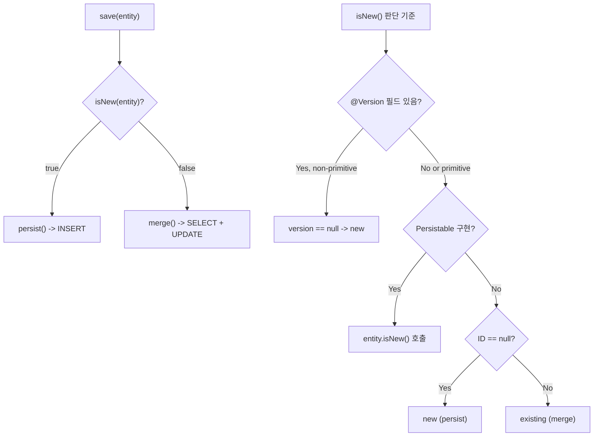
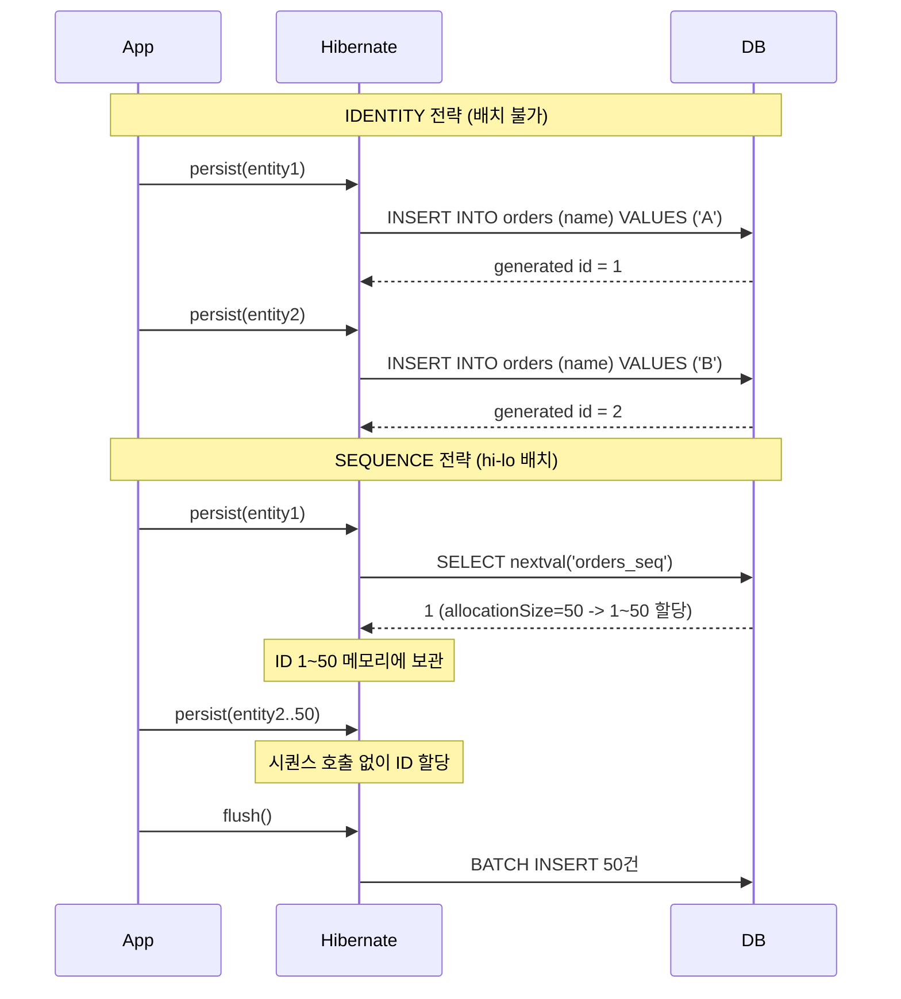

# Spring Data JPA ID 생성 전략과 복합키

JPA ID 생성 전략(IDENTITY, SEQUENCE, TABLE, UUID)이 배치 INSERT와 `isNew()` / `save()` 동작에 미치는 영향, 그리고 복합키(`@IdClass` vs `@EmbeddedId`) 구현 시 주의사항을 분석한다.

## 목차

1. [핵심 개념 (What)](#1-핵심-개념-what)
2. [왜 알아야 하는가 (Why)](#2-왜-알아야-하는가-why)
3. [내부 구현 분석 (How)](#3-내부-구현-분석-how)
4. [실전 예제](#4-실전-예제)
5. [정리](#5-정리)

---

## 1. 핵심 개념 (What)

### ID 생성 전략

| 전략 | 어노테이션 | ID 할당 시점 | 배치 INSERT | DB 의존성 |
|------|-----------|------------|------------|----------|
| **IDENTITY** | `@GeneratedValue(strategy = IDENTITY)` | INSERT 후 | 불가 | MySQL AUTO_INCREMENT |
| **SEQUENCE** | `@GeneratedValue(strategy = SEQUENCE)` | INSERT 전 | 가능 (hi-lo) | PostgreSQL, Oracle |
| **TABLE** | `@GeneratedValue(strategy = TABLE)` | INSERT 전 | 가능 | 범용 (성능 낮음) |
| **UUID** | `@UuidGenerator` | INSERT 전 | 가능 | 없음 |

### 복합키 방식

| 방식 | 어노테이션 | ID 클래스 위치 | 접근 방법 |
|------|-----------|--------------|----------|
| **@IdClass** | 엔티티에 `@IdClass(PK.class)` | 별도 클래스 | 엔티티 필드로 직접 접근 |
| **@EmbeddedId** | 엔티티에 `@EmbeddedId` 필드 | `@Embeddable` 클래스 | `entity.getId().getField()` |

## 2. 왜 알아야 하는가 (Why)

### IDENTITY 전략의 배치 INSERT 불가 문제

IDENTITY 전략은 `INSERT` 실행 후에야 DB가 ID를 반환한다. Hibernate는 영속성 컨텍스트에 엔티티를 등록하려면 ID가 필요하기 때문에, `persist()` 호출 즉시 개별 INSERT를 실행한다. 이는 **JDBC 배치 INSERT를 완전히 무력화**한다.

```
// IDENTITY: 1000건 저장 = 1000번 INSERT 실행
// SEQUENCE: 1000건 저장 = ~20번 시퀀스 조회 + 1번 배치 INSERT
```

### isNew() 판단이 save() 동작을 결정

`SimpleJpaRepository.save()` 메서드에서 `entityInformation.isNew(entity)` 반환값이:
- `true` -> `entityManager.persist()` (INSERT)
- `false` -> `entityManager.merge()` (SELECT + INSERT or UPDATE)

ID 할당 전략에 따라 `isNew()` 판단 기준이 달라지며, 이를 잘못 설정하면 **의도치 않은 SELECT + UPDATE** 가 발생한다.

### 복합키의 equals/hashCode 미구현 위험

복합키 클래스에 `equals()`와 `hashCode()`를 올바르게 구현하지 않으면:
- `EntityManager.find()`가 캐시에서 엔티티를 찾지 못함
- `Set<Entity>`에 중복 데이터 저장
- 영속성 컨텍스트의 1차 캐시 동작 오류

## 3. 내부 구현 분석 (How)

### 3.1 save()와 isNew()의 관계

```java
// SimpleJpaRepository.java:658-669
@Transactional
public <S extends T> S save(S entity) {
    Assert.notNull(entity, ENTITY_MUST_NOT_BE_NULL);

    if (entityInformation.isNew(entity)) {
        entityManager.persist(entity);  // INSERT
        return entity;
    } else {
        return entityManager.merge(entity);  // SELECT + UPDATE
    }
}
```



### 3.2 JpaMetamodelEntityInformation.isNew()

`isNew()` 판단 로직의 우선순위:

```java
// JpaMetamodelEntityInformation.java:249-259
@Override
public boolean isNew(T entity) {
    // 1순위: @Version 필드가 있고 non-primitive이면 -> null 체크
    if (versionAttribute.isEmpty()
            || versionAttribute.map(Attribute::getJavaType)
                .map(Class::isPrimitive).orElse(false)) {
        return super.isNew(entity);  // 2순위: ID null 체크
    }

    BeanWrapper wrapper = new DirectFieldAccessFallbackBeanWrapper(entity);
    return versionAttribute
        .map(it -> wrapper.getPropertyValue(it.getName()) == null)
        .orElse(true);
}
```

**JpaPersistableEntityInformation**은 `Persistable` 인터페이스를 구현한 엔티티에 사용된다:

```java
// JpaPersistableEntityInformation.java:62-65
@Override
public boolean isNew(T entity) {
    return entity.isNew();  // 엔티티 자체의 isNew() 위임
}
```

### 3.3 IdMetadata: ID 타입 분석

`JpaMetamodelEntityInformation` 내부의 `IdMetadata`가 ID 구조를 분석한다.

```java
// JpaMetamodelEntityInformation.java:302-371
private static class IdMetadata<T> implements Iterable<SingularAttribute<? super T, ?>> {

    private final IdentifiableType<T> type;
    private final Set<SingularAttribute<? super T, ?>> idClassAttributes;
    private final Set<SingularAttribute<? super T, ?>> attributes;

    IdMetadata(IdentifiableType<T> source, PersistenceProvider persistenceProvider) {
        this.type = source;
        this.idClassAttributes = persistenceProvider.getIdClassAttributes(source);
        // 단일 ID면 1개, 복합 ID면 @IdClass의 모든 속성
        this.attributes = source.hasSingleIdAttribute()
                ? Collections.singleton(source.getId(source.getIdType().getJavaType()))
                : source.getIdClassAttributes();
    }

    boolean hasSimpleId() {
        return idClassAttributes.isEmpty() && attributes.size() == 1;
    }

    Class<?> getType() {
        // @IdClass 어노테이션으로 ID 타입 조회 시도
        Class<?> idClassType = lookupIdClass(type);
        if (idClassType != null) return idClassType;
        // 없으면 metamodel의 idType 사용
        Type<?> idType = type.getIdType();
        return idType == null ? null : idType.getJavaType();
    }
}
```

### 3.4 getId(): 복합키 처리

```java
// JpaMetamodelEntityInformation.java:170-210
@Override
public @Nullable ID getId(T entity) {
    PersistenceProvider persistenceProvider = PersistenceProvider.fromMetamodel(metamodel);

    // 프록시인 경우 프록시 메커니즘으로 ID 접근
    if (persistenceProvider.shouldUseAccessorFor(entity)) {
        return (ID) persistenceProvider.getIdentifierFrom(entity);
    }

    // 단순 ID: PersistenceUnitUtil에 위임
    if (idMetadata.hasSimpleId()) {
        if (entity instanceof Tuple t) {
            return (ID) t.get(idMetadata.getSimpleIdAttribute().getName());
        }
        if (getJavaType().isInstance(entity)) {
            return (ID) persistenceUnitUtil.getIdentifier(entity);
        }
    }

    // 복합 ID: 개별 필드를 순회하며 부분 채워짐 확인
    BeanWrapper entityWrapper = new DirectFieldAccessFallbackBeanWrapper(entity);
    boolean partialIdValueFound = false;

    for (SingularAttribute<? super T, ?> attribute : idMetadata) {
        Object propertyValue = entityWrapper.getPropertyValue(attribute.getName());
        if (propertyValue != null) {
            partialIdValueFound = true;
        }
    }

    return partialIdValueFound
        ? (ID) persistenceUnitUtil.getIdentifier(entity) : null;
}
```

### 3.5 IDENTITY vs SEQUENCE 배치 동작 차이



## 4. 실전 예제

### 4.1 SEQUENCE 전략 + hi-lo 최적화

```java
@Entity
@Table(name = "orders")
public class Order {

    @Id
    @GeneratedValue(strategy = GenerationType.SEQUENCE,
            generator = "order_seq_gen")
    @SequenceGenerator(
        name = "order_seq_gen",
        sequenceName = "orders_seq",
        allocationSize = 50  // hi-lo: 50개씩 선점
    )
    private Long id;

    private String orderNumber;
    private BigDecimal totalAmount;
}
```

`allocationSize = 50` 설정 시:
- 시퀀스를 1번 호출하면 50개의 ID를 메모리에 확보
- 50건까지 시퀀스 호출 없이 ID 할당 가능
- `flush()` 시 JDBC 배치 INSERT 활용 가능

```yaml
# application.yml 배치 설정
spring:
  jpa:
    properties:
      hibernate:
        jdbc:
          batch_size: 50
        order_inserts: true
        order_updates: true
```

### 4.2 UUID 전략

```java
@Entity
public class Event {

    @Id
    @UuidGenerator(style = UuidGenerator.Style.TIME)
    private UUID id;

    private String eventType;
    private Instant occurredAt;
}
```

UUID는 INSERT 전에 할당되므로 배치 INSERT가 가능하고, 분산 시스템에서 ID 충돌 없이 사용할 수 있다.

### 4.3 Persistable로 isNew() 직접 제어

수동으로 ID를 할당하는 경우, `isNew()` 판단을 직접 구현해야 한다.

```java
@Entity
public class Product implements Persistable<String> {

    @Id
    private String sku;  // 비즈니스 키를 ID로 사용

    private String name;
    private BigDecimal price;

    @Transient
    private boolean isNew = true;

    @Override
    public String getId() {
        return sku;
    }

    @Override
    public boolean isNew() {
        return isNew;
    }

    @PostPersist
    @PostLoad
    void markNotNew() {
        this.isNew = false;
    }
}

// save() 호출 시:
// isNew=true -> persist() -> INSERT (의도대로)
// isNew=false -> merge() -> SELECT + UPDATE (의도대로)
//
// Persistable 미구현 시:
// sku="ABC" (not null) -> isNew()=false -> merge()
//   -> SELECT (없음) -> INSERT (불필요한 SELECT 발생!)
```

### 4.4 복합키: @IdClass vs @EmbeddedId

```java
// === @IdClass 방식 ===

// 복합키 클래스 (반드시 equals/hashCode 구현)
public class OrderItemId implements Serializable {
    private Long orderId;
    private Long productId;

    // 기본 생성자 필수
    public OrderItemId() {}

    public OrderItemId(Long orderId, Long productId) {
        this.orderId = orderId;
        this.productId = productId;
    }

    @Override
    public boolean equals(Object o) {
        if (this == o) return true;
        if (!(o instanceof OrderItemId that)) return false;
        return Objects.equals(orderId, that.orderId)
            && Objects.equals(productId, that.productId);
    }

    @Override
    public int hashCode() {
        return Objects.hash(orderId, productId);
    }
}

@Entity
@IdClass(OrderItemId.class)
public class OrderItem {

    @Id
    private Long orderId;

    @Id
    private Long productId;

    private int quantity;
    private BigDecimal unitPrice;
}

// 조회
OrderItemId id = new OrderItemId(1L, 100L);
OrderItem item = orderItemRepository.findById(id).orElseThrow();

// JPQL에서 직접 필드 접근 가능
// SELECT oi FROM OrderItem oi WHERE oi.orderId = :orderId
```

```java
// === @EmbeddedId 방식 ===

@Embeddable
public class EnrollmentId implements Serializable {
    private Long studentId;
    private Long courseId;

    // 기본 생성자, equals, hashCode 동일하게 필요

    @Override
    public boolean equals(Object o) {
        if (this == o) return true;
        if (!(o instanceof EnrollmentId that)) return false;
        return Objects.equals(studentId, that.studentId)
            && Objects.equals(courseId, that.courseId);
    }

    @Override
    public int hashCode() {
        return Objects.hash(studentId, courseId);
    }
}

@Entity
public class Enrollment {

    @EmbeddedId
    private EnrollmentId id;

    @ManyToOne
    @MapsId("studentId")
    private Student student;

    @ManyToOne
    @MapsId("courseId")
    private Course course;

    private LocalDate enrolledAt;
}

// JPQL에서 id.필드로 접근
// SELECT e FROM Enrollment e WHERE e.id.studentId = :studentId
```

## 5. 정리

| ID 전략 | ID 할당 시점 | 배치 INSERT | isNew() 판단 | 적합한 상황 |
|---------|------------|------------|-------------|-----------|
| IDENTITY | INSERT 후 | 불가 | id == null | MySQL 소규모 서비스 |
| SEQUENCE | INSERT 전 | 가능 (hi-lo) | id == null | PostgreSQL/Oracle 대용량 |
| TABLE | INSERT 전 | 가능 | id == null | DB 독립적 (비권장) |
| UUID | INSERT 전 | 가능 | id == null | 분산 시스템 |
| 수동 할당 | 직접 | 가능 | Persistable 필요 | 비즈니스 키 ID |

| 복합키 방식 | JPQL 접근 | 장점 | 단점 |
|------------|----------|------|------|
| @IdClass | `entity.field` 직접 | JPQL 간결, 필드 직접 접근 | 키 클래스 필드명 동기화 필요 |
| @EmbeddedId | `entity.id.field` | 의미 있는 ID 객체, @MapsId 활용 | JPQL에서 `id.` 접두사 필요 |

| isNew() 판단 우선순위 | 조건 | 기준 |
|---------------------|------|------|
| 1순위 | `Persistable` 구현 | `entity.isNew()` 결과 |
| 2순위 | `@Version` (non-primitive) | version == null이면 new |
| 3순위 | 기본 | id == null이면 new |

---
*참고: Spring Data JPA 3.x / Hibernate 6.x 기준*
