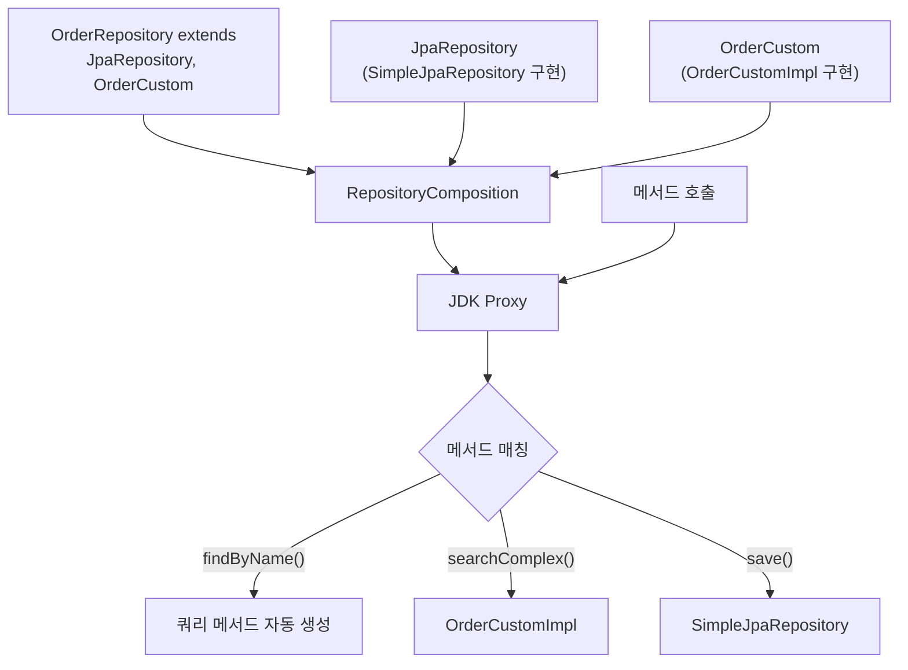

# Spring Data JPA 커스텀 리포지토리 구현

Fragment 패턴(CustomRepo + CustomRepoImpl), repositoryBaseClass 교체, RepositoryComposition의 프래그먼트 병합 우선순위를 분석하고, QueryDSL과 JDBC 프래그먼트 혼합 전략을 실전 예제로 설명한다.

## 목차

1. [핵심 개념 (What)](#1-핵심-개념-what)
2. [왜 알아야 하는가 (Why)](#2-왜-알아야-하는가-why)
3. [내부 구현 분석 (How)](#3-내부-구현-분석-how)
4. [실전 예제](#4-실전-예제)
5. [정리](#5-정리)

---

## 1. 핵심 개념 (What)

Spring Data JPA의 리포지토리 커스터마이징은 세 가지 수준으로 나뉜다.

| 수준 | 방식 | 영향 범위 | 사용 시점 |
|------|------|---------|----------|
| **Fragment 추가** | `CustomRepo` + `CustomRepoImpl` | 특정 리포지토리 | 개별 리포지토리에 커스텀 메서드 추가 |
| **Base 클래스 교체** | `repositoryBaseClass` 설정 | 전체 리포지토리 | 모든 리포지토리의 기본 동작 변경 |
| **Fragment 기여** | `JpaRepositoryFragmentsContributor` | 전체 리포지토리 | 프레임워크 수준 확장 |

**RepositoryComposition**은 여러 프래그먼트를 합성하여 하나의 리포지토리 프록시를 구성하는 메커니즘이다. 메서드 호출 시 프래그먼트 등록 순서에 따라 매칭되는 첫 번째 구현이 호출된다.

## 2. 왜 알아야 하는가 (Why)

### 표준 리포지토리 메서드의 한계

Spring Data JPA의 쿼리 메서드, `@Query`, Specification만으로는 해결하기 어려운 경우가 많다:

- **복잡한 동적 쿼리**: QueryDSL이나 JOOQ 활용 필요
- **배치 처리**: JDBC Template으로 대용량 INSERT 최적화
- **Soft Delete**: 모든 조회에 `WHERE deleted = false` 자동 적용
- **멀티테넌트**: 모든 쿼리에 `tenant_id` 조건 자동 추가

### 잘못된 커스터마이징의 위험

Fragment 이름 규칙(`Impl` 접미사)을 어기면 Spring이 구현체를 찾지 못한다. 또한 프래그먼트 우선순위를 모르면 커스텀 메서드가 기본 구현에 의해 가려질 수 있다.

## 3. 내부 구현 분석 (How)

### 3.1 Fragment 패턴 동작 원리

Spring Data JPA는 리포지토리 인터페이스를 분석하여 **프래그먼트**로 분해하고 이를 합성한다.



### 3.2 Fragment 이름 규칙과 탐색

Spring Data는 커스텀 인터페이스의 구현체를 다음 규칙으로 찾는다:

1. 커스텀 인터페이스 이름 + `Impl` 접미사 (기본값)
2. 패키지 위치: 커스텀 인터페이스와 같은 패키지 또는 하위 패키지

```
com.example.repository/
  OrderRepository.java          <- 메인 리포지토리
  OrderCustom.java              <- 커스텀 인터페이스
  OrderCustomImpl.java          <- 구현체 (Impl 접미사)
```

`Impl` 접미사는 글로벌 설정으로 변경할 수 있다:

```java
@EnableJpaRepositories(repositoryImplementationPostfix = "Helper")
// OrderCustomHelper.java 로 찾음
```

### 3.3 JpaRepositoryFactory: 프래그먼트 조립

`JpaRepositoryFactory.getRepositoryFragments()` 메서드가 프래그먼트를 조립한다.

```java
// JpaRepositoryFactory.java:279-308
@Override
protected RepositoryFragments getRepositoryFragments(RepositoryMetadata metadata) {
    return getRepositoryFragments(metadata, entityManager,
            entityPathResolver, this.crudMethodMetadata);
}

protected RepositoryFragments getRepositoryFragments(RepositoryMetadata metadata,
        EntityManager entityManager, EntityPathResolver resolver,
        CrudMethodMetadata crudMethodMetadata) {

    // JpaRepositoryFragmentsContributor가 프래그먼트 기여
    RepositoryFragments fragments = this.fragmentsContributor.contribute(
        metadata,
        getEntityInformation(metadata.getDomainType()),
        entityManager, resolver);

    // JpaRepositoryConfigurationAware 인터페이스 구현체에 설정 주입
    for (RepositoryFragment<?> fragment : fragments) {
        fragment.getImplementation()
            .filter(JpaRepositoryConfigurationAware.class::isInstance)
            .ifPresent(it -> invokeAwareMethods(
                (JpaRepositoryConfigurationAware) it));
    }

    return fragments;
}
```

### 3.4 JpaRepositoryFragmentsContributor

`JpaRepositoryFragmentsContributor`는 Spring Data JPA 4.0에서 도입된 인터페이스로, 프래그먼트 기여를 커스터마이징할 수 있다.

```java
// JpaRepositoryFragmentsContributor.java:39-84
public interface JpaRepositoryFragmentsContributor
        extends RepositoryFragmentsContributor {

    // 기본값: QueryDSL 프래그먼트 기여
    JpaRepositoryFragmentsContributor DEFAULT = QuerydslContributor.INSTANCE;

    // 체이닝으로 여러 기여자 합성
    default JpaRepositoryFragmentsContributor andThen(
            JpaRepositoryFragmentsContributor after) {
        return new JpaRepositoryFragmentsContributor() {
            @Override
            public RepositoryFragments contribute(...) {
                return this.contribute(...).append(after.contribute(...));
            }
        };
    }

    RepositoryFragments contribute(RepositoryMetadata metadata,
            JpaEntityInformation<?, ?> entityInformation,
            EntityManager entityManager,
            EntityPathResolver resolver);
}
```

### 3.5 QuerydslContributor: 기본 프래그먼트 기여자

```java
// QuerydslContributor.java:38-78
enum QuerydslContributor implements JpaRepositoryFragmentsContributor {
    INSTANCE;

    @Override
    public RepositoryFragments contribute(RepositoryMetadata metadata,
            JpaEntityInformation<?, ?> entityInformation,
            EntityManager entityManager, EntityPathResolver resolver) {

        // 리포지토리가 QuerydslPredicateExecutor를 구현하면
        if (isQuerydslRepository(metadata)) {
            QuerydslJpaPredicateExecutor<?> executor =
                new QuerydslJpaPredicateExecutor<>(
                    entityInformation, entityManager, resolver, null);

            return RepositoryFragments.of(
                RepositoryFragment.implemented(
                    QuerydslJpaPredicateExecutor.class, executor));
        }

        return RepositoryFragments.empty();
    }
}
```

### 3.6 프래그먼트 우선순위

RepositoryComposition에서 메서드를 탐색하는 순서:


커스텀 프래그먼트가 `SimpleJpaRepository`의 메서드와 동일한 시그니처를 가지면, **커스텀 구현이 우선**한다.

### 3.7 repositoryBaseClass 교체

`@EnableJpaRepositories(repositoryBaseClass = ...)` 설정으로 `SimpleJpaRepository`를 완전히 교체할 수 있다.

```java
// JpaRepositoryFactory.java:238-240
@Override
protected Class<?> getRepositoryBaseClass(RepositoryMetadata metadata) {
    return SimpleJpaRepository.class;  // 이 값이 교체됨
}
```

`JpaRepositoryFactoryBean`에서 `repositoryBaseClass`를 설정하면 모든 리포지토리의 기본 구현이 바뀐다.

## 4. 실전 예제

### 4.1 기본 Fragment 패턴

```java
// 1. 커스텀 인터페이스 정의
public interface OrderCustom {
    List<OrderDto> searchOrders(OrderSearchCondition condition);
    void bulkUpdateStatus(List<Long> orderIds, OrderStatus status);
}

// 2. 구현체 (반드시 Impl 접미사)
@RequiredArgsConstructor
public class OrderCustomImpl implements OrderCustom {

    private final EntityManager entityManager;

    @Override
    public List<OrderDto> searchOrders(OrderSearchCondition condition) {
        CriteriaBuilder cb = entityManager.getCriteriaBuilder();
        CriteriaQuery<OrderDto> query = cb.createQuery(OrderDto.class);
        Root<Order> root = query.from(Order.class);

        List<Predicate> predicates = new ArrayList<>();

        if (condition.getStatus() != null) {
            predicates.add(cb.equal(root.get("status"), condition.getStatus()));
        }
        if (condition.getMinAmount() != null) {
            predicates.add(cb.ge(root.get("totalAmount"), condition.getMinAmount()));
        }
        if (condition.getFromDate() != null) {
            predicates.add(cb.greaterThanOrEqualTo(
                root.get("createdAt"), condition.getFromDate()));
        }

        query.where(predicates.toArray(new Predicate[0]));
        query.orderBy(cb.desc(root.get("createdAt")));

        return entityManager.createQuery(query).getResultList();
    }

    @Override
    @Transactional
    public void bulkUpdateStatus(List<Long> orderIds, OrderStatus status) {
        entityManager.createQuery(
            "UPDATE Order o SET o.status = :status WHERE o.id IN :ids")
            .setParameter("status", status)
            .setParameter("ids", orderIds)
            .executeUpdate();
    }
}

// 3. 메인 리포지토리에서 커스텀 인터페이스 상속
public interface OrderRepository
        extends JpaRepository<Order, Long>, OrderCustom {

    // 쿼리 메서드도 함께 사용 가능
    List<Order> findByStatusAndCreatedAtAfter(
        OrderStatus status, LocalDateTime after);
}
```

### 4.2 Soft Delete Base Class 교체

```java
// 모든 리포지토리에 Soft Delete 적용하는 Base Class
public class SoftDeleteJpaRepository<T, ID>
        extends SimpleJpaRepository<T, ID> {

    private final EntityManager entityManager;
    private final JpaEntityInformation<T, ?> entityInformation;

    public SoftDeleteJpaRepository(
            JpaEntityInformation<T, ?> entityInformation,
            EntityManager entityManager) {
        super(entityInformation, entityManager);
        this.entityManager = entityManager;
        this.entityInformation = entityInformation;
    }

    @Override
    @Transactional
    public void delete(T entity) {
        // 물리 삭제 대신 deleted 플래그 설정
        if (entity instanceof SoftDeletable deletable) {
            deletable.markDeleted();
            entityManager.merge(entity);
        } else {
            super.delete(entity);
        }
    }

    @Override
    @Transactional
    public void deleteById(ID id) {
        findById(id).ifPresent(this::delete);
    }

    @Override
    public List<T> findAll() {
        // SoftDeletable 엔티티는 자동으로 필터링
        if (SoftDeletable.class.isAssignableFrom(getDomainClass())) {
            return entityManager.createQuery(
                "SELECT e FROM " + entityInformation.getEntityName()
                    + " e WHERE e.deleted = false",
                getDomainClass())
                .getResultList();
        }
        return super.findAll();
    }
}

// SoftDeletable 인터페이스
public interface SoftDeletable {
    void markDeleted();
    boolean isDeleted();
}

// 설정
@Configuration
@EnableJpaRepositories(
    repositoryBaseClass = SoftDeleteJpaRepository.class
)
public class JpaConfig {
}

// 엔티티
@Entity
public class Article implements SoftDeletable {
    @Id @GeneratedValue(strategy = GenerationType.IDENTITY)
    private Long id;

    private String title;
    private boolean deleted = false;

    @Override
    public void markDeleted() {
        this.deleted = true;
    }

    @Override
    public boolean isDeleted() {
        return deleted;
    }
}

// 사용: 일반 JpaRepository처럼 사용하면 자동으로 Soft Delete 적용
public interface ArticleRepository extends JpaRepository<Article, Long> {
    // delete() 호출 시 deleted=true 설정
    // findAll() 호출 시 deleted=false 자동 필터링
}
```

### 4.3 QueryDSL + JDBC Fragment 혼합

```java
// QueryDSL 프래그먼트
public interface ProductQueryDslFragment {
    List<ProductDto> searchProducts(ProductSearchCondition condition);
}

@RequiredArgsConstructor
public class ProductQueryDslFragmentImpl implements ProductQueryDslFragment {

    private final JPAQueryFactory queryFactory;

    @Override
    public List<ProductDto> searchProducts(ProductSearchCondition condition) {
        QProduct product = QProduct.product;
        QCategory category = QCategory.category;

        return queryFactory
            .select(new QProductDto(
                product.id,
                product.name,
                product.price,
                category.name))
            .from(product)
            .join(product.category, category)
            .where(
                nameContains(condition.getName()),
                priceRange(condition.getMinPrice(), condition.getMaxPrice()),
                categoryEq(condition.getCategoryId()))
            .orderBy(product.createdAt.desc())
            .fetch();
    }

    private BooleanExpression nameContains(String name) {
        return name != null ? QProduct.product.name.contains(name) : null;
    }

    private BooleanExpression priceRange(BigDecimal min, BigDecimal max) {
        if (min != null && max != null) {
            return QProduct.product.price.between(min, max);
        }
        if (min != null) return QProduct.product.price.goe(min);
        if (max != null) return QProduct.product.price.loe(max);
        return null;
    }

    private BooleanExpression categoryEq(Long categoryId) {
        return categoryId != null
            ? QProduct.product.category.id.eq(categoryId) : null;
    }
}

// JDBC 프래그먼트 (대용량 INSERT 최적화)
public interface ProductJdbcFragment {
    void bulkInsert(List<Product> products);
}

@RequiredArgsConstructor
public class ProductJdbcFragmentImpl implements ProductJdbcFragment {

    private final JdbcTemplate jdbcTemplate;

    @Override
    @Transactional
    public void bulkInsert(List<Product> products) {
        jdbcTemplate.batchUpdate(
            "INSERT INTO products (name, price, category_id, created_at) " +
            "VALUES (?, ?, ?, ?)",
            new BatchPreparedStatementSetter() {
                @Override
                public void setValues(PreparedStatement ps, int i)
                        throws SQLException {
                    Product p = products.get(i);
                    ps.setString(1, p.getName());
                    ps.setBigDecimal(2, p.getPrice());
                    ps.setLong(3, p.getCategoryId());
                    ps.setTimestamp(4, Timestamp.valueOf(p.getCreatedAt()));
                }

                @Override
                public int getBatchSize() {
                    return products.size();
                }
            });
    }
}

// 메인 리포지토리: 3가지 프래그먼트 합성
public interface ProductRepository extends
        JpaRepository<Product, Long>,          // 기본 CRUD
        ProductQueryDslFragment,                // QueryDSL 동적 쿼리
        ProductJdbcFragment {                   // JDBC 배치

    // 쿼리 메서드도 함께 사용
    List<Product> findByCategoryId(Long categoryId);
}
```

### 4.4 커스텀 JpaRepositoryFragmentsContributor

```java
// 모든 리포지토리에 자동으로 감사 프래그먼트 추가
public class AuditFragmentsContributor
        implements JpaRepositoryFragmentsContributor {

    @Override
    public RepositoryFragments contribute(RepositoryMetadata metadata,
            JpaEntityInformation<?, ?> entityInformation,
            EntityManager entityManager, EntityPathResolver resolver) {

        if (Auditable.class.isAssignableFrom(metadata.getDomainType())) {
            AuditQueryFragment<?> fragment =
                new AuditQueryFragment<>(entityInformation, entityManager);
            return RepositoryFragments.of(
                RepositoryFragment.implemented(fragment));
        }

        return RepositoryFragments.empty();
    }

    @Override
    public RepositoryFragments describe(RepositoryMetadata metadata) {
        return RepositoryFragments.empty();
    }
}

// 설정
@Configuration
@EnableJpaRepositories
public class JpaConfig {

    @Bean
    public JpaRepositoryFragmentsContributor jpaRepositoryFragmentsContributor() {
        return JpaRepositoryFragmentsContributor.DEFAULT
            .andThen(new AuditFragmentsContributor());
    }
}
```

## 5. 정리

| 커스터마이징 방식 | 영향 범위 | 핵심 규칙 | 사용 시점 |
|-----------------|---------|----------|----------|
| Fragment 패턴 | 개별 리포지토리 | `Impl` 접미사 필수 | 특정 리포지토리에 커스텀 로직 추가 |
| repositoryBaseClass | 전체 리포지토리 | `SimpleJpaRepository` 상속 | Soft Delete, 멀티테넌트 등 공통 동작 변경 |
| FragmentsContributor | 전체 리포지토리 | `andThen()` 체이닝 | 프레임워크 수준 확장 |

| 프래그먼트 우선순위 | 설명 |
|-------------------|------|
| 1순위 | 개발자 커스텀 프래그먼트 (UserCustomImpl) |
| 2순위 | 기여된 프래그먼트 (QuerydslContributor) |
| 3순위 | Base Repository (SimpleJpaRepository) |
| 4순위 | 쿼리 메서드 자동 생성 |

| 핵심 클래스 | 역할 |
|-----------|------|
| `JpaRepositoryFactory` | 리포지토리 프록시 생성, 프래그먼트 조립 |
| `JpaRepositoryFragmentsContributor` | 프래그먼트 기여 전략 (4.0+) |
| `QuerydslContributor` | QueryDSL 프래그먼트 자동 기여 |
| `SimpleJpaRepository` | 기본 CRUD 구현 |
| `RepositoryComposition` | 프래그먼트 합성 및 메서드 라우팅 |

---
*참고: Spring Data JPA 3.x / Hibernate 6.x 기준*
