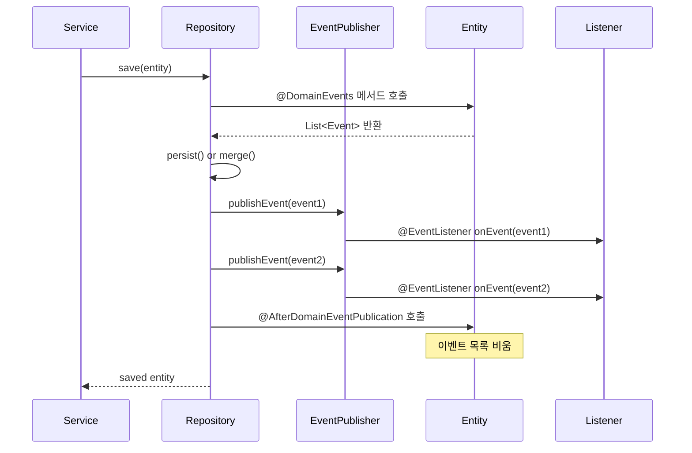
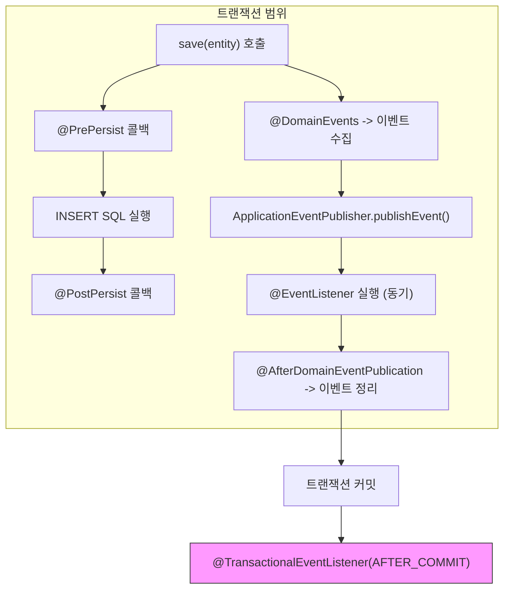

# Spring Data JPA 이벤트 시스템과 도메인 이벤트

JPA 콜백(@PrePersist, @PostPersist 등)과 Spring Data의 @DomainEvents/@AfterDomainEventPublication 기반 도메인 이벤트 퍼블리싱, AbstractAggregateRoot 헬퍼의 내부 동작 원리를 분석한다.

## 목차

1. [핵심 개념 (What)](#1-핵심-개념-what)
2. [왜 알아야 하는가 (Why)](#2-왜-알아야-하는가-why)
3. [내부 구현 분석 (How)](#3-내부-구현-분석-how)
4. [실전 예제](#4-실전-예제)
5. [정리](#5-정리)

---

## 1. 핵심 개념 (What)

Spring Data JPA에서 이벤트를 다루는 방식은 두 가지 레이어로 나뉜다.

### JPA 콜백 (Entity Lifecycle Callbacks)

JPA 표준 스펙으로, 엔티티 생명주기에 반응하는 메서드를 정의한다.

| 콜백 | 시점 | 트랜잭션 |
|------|------|---------|
| `@PrePersist` | persist() 직전 | 같은 트랜잭션 |
| `@PostPersist` | persist() 직후 (DB 반영 후) | 같은 트랜잭션 |
| `@PreUpdate` | UPDATE SQL 직전 | 같은 트랜잭션 |
| `@PostUpdate` | UPDATE SQL 직후 | 같은 트랜잭션 |
| `@PreRemove` | remove() 직전 | 같은 트랜잭션 |
| `@PostRemove` | remove() 직후 | 같은 트랜잭션 |
| `@PostLoad` | 엔티티 로드 직후 | N/A |

### Spring 도메인 이벤트 (Domain Events)

Spring Data의 확장 기능으로, `save()` 호출 시 엔티티가 등록한 도메인 이벤트를 `ApplicationEventPublisher`로 발행한다.

| 어노테이션/클래스 | 역할 |
|-----------------|------|
| `@DomainEvents` | 발행할 이벤트 컬렉션 반환 메서드 표시 |
| `@AfterDomainEventPublication` | 이벤트 발행 후 정리 메서드 표시 |
| `AbstractAggregateRoot` | 위 메커니즘의 편의 헬퍼 |

## 2. 왜 알아야 하는가 (Why)

### JPA 콜백의 한계

JPA 콜백은 영속성 레이어에 묶여 있어 다음의 제약이 있다:
- 콜백 내에서 `EntityManager` 호출 불가 (다른 엔티티 조회/수정 불가)
- 콜백 예외 시 트랜잭션 전체 롤백
- 비동기 처리 불가 (같은 스레드에서 동기 실행)

### 도메인 이벤트가 필요한 이유

```
주문 생성 -> 재고 차감 -> 결제 요청 -> 알림 발송 -> 통계 업데이트
```

이 모든 로직을 `OrderService.createOrder()`에 넣으면 **God Service** 안티패턴이 된다. 도메인 이벤트를 사용하면 각 관심사를 독립된 리스너로 분리하여 **느슨한 결합**을 달성할 수 있다.

### AuditingEntityListener: JPA 콜백의 대표적 활용

Spring Data JPA의 감사(Auditing) 기능은 JPA 콜백(`@PrePersist`, `@PreUpdate`)으로 구현되어 있다. 이 패턴을 이해하면 유사한 횡단 관심사를 효과적으로 구현할 수 있다.

## 3. 내부 구현 분석 (How)

### 3.1 AuditingEntityListener: JPA 콜백 활용 사례

Spring Data JPA의 감사 기능은 `AuditingEntityListener`로 구현되어 있다.

```java
// AuditingEntityListener.java:62-117
@Configurable
public class AuditingEntityListener {

    private @Nullable ObjectFactory<AuditingHandler> handler;

    public void setAuditingHandler(
            ObjectFactory<AuditingHandler> auditingHandler) {
        this.handler = auditingHandler;
    }

    @PrePersist
    public void touchForCreate(Object target) {
        Assert.notNull(target, "Entity must not be null");

        if (handler != null) {
            AuditingHandler object = handler.getObject();
            if (object != null) {
                object.markCreated(target);  // createdBy, createdDate 설정
            }
        }
    }

    @PreUpdate
    public void touchForUpdate(Object target) {
        Assert.notNull(target, "Entity must not be null");

        if (handler != null) {
            AuditingHandler object = handler.getObject();
            if (object != null) {
                object.markModified(target);  // lastModifiedBy, lastModifiedDate 설정
            }
        }
    }
}
```

`@PrePersist`로 생성 시점, `@PreUpdate`로 수정 시점에 감사 정보를 자동 설정한다.

### 3.2 AbstractAuditable: 감사 필드 기본 구현

```java
// AbstractAuditable.java:40-96
@MappedSuperclass
public abstract class AbstractAuditable<U, PK extends Serializable>
        extends AbstractPersistable<PK>
        implements Auditable<U, PK, LocalDateTime> {

    @ManyToOne
    private U createdBy;
    private Instant createdDate;

    @ManyToOne
    private U lastModifiedBy;
    private Instant lastModifiedDate;

    @Override
    public Optional<U> getCreatedBy() {
        return Optional.ofNullable(createdBy);
    }

    @Override
    public Optional<LocalDateTime> getCreatedDate() {
        return null == createdDate ? Optional.empty()
            : Optional.of(LocalDateTime.ofInstant(
                createdDate, ZoneId.systemDefault()));
    }

    // setter 메서드들...
}
```

### 3.3 @DomainEvents / @AfterDomainEventPublication 처리 흐름

`SimpleJpaRepository.save()` 호출 시 Spring Data 인프라가 이벤트 발행을 처리한다.



핵심은 `EventPublishingRepositoryProxyPostProcessor`가 `save()` 메서드를 가로채서 이벤트를 발행한다는 것이다. 이 로직은 Spring Data Commons에 정의되어 있으며, `@DomainEvents` 어노테이션이 붙은 메서드를 리플렉션으로 호출한다.

### 3.4 AbstractAggregateRoot (Spring Data Commons)

`AbstractAggregateRoot`는 도메인 이벤트 등록/발행을 위한 편의 클래스이다.

```java
// Spring Data Commons의 AbstractAggregateRoot
public class AbstractAggregateRoot<A extends AbstractAggregateRoot<A>> {

    private final transient List<Object> domainEvents = new ArrayList<>();

    // 이벤트 등록
    protected <T> T registerEvent(T event) {
        Assert.notNull(event, "Domain event must not be null");
        this.domainEvents.add(event);
        return event;
    }

    // save() 시 호출되어 등록된 이벤트 반환
    @DomainEvents
    Collection<Object> domainEvents() {
        return Collections.unmodifiableList(domainEvents);
    }

    // 이벤트 발행 후 정리
    @AfterDomainEventPublication
    void clearDomainEvents() {
        this.domainEvents.clear();
    }
}
```

### 3.5 JPA 콜백 vs 도메인 이벤트 실행 시점 비교



| 시점 | JPA 콜백 | 도메인 이벤트 |
|------|---------|-------------|
| SQL 실행 전 | `@PrePersist`, `@PreUpdate` | - |
| SQL 실행 후 | `@PostPersist`, `@PostUpdate` | - |
| save() 완료 후 | - | `@EventListener` (동기) |
| 트랜잭션 커밋 후 | - | `@TransactionalEventListener(AFTER_COMMIT)` |

## 4. 실전 예제

### 4.1 JPA 콜백: 엔티티 자체 감사

```java
@Entity
@Table(name = "orders")
public class Order {

    @Id
    @GeneratedValue(strategy = GenerationType.IDENTITY)
    private Long id;

    private String orderNumber;
    private OrderStatus status;
    private BigDecimal totalAmount;

    private LocalDateTime createdAt;
    private LocalDateTime updatedAt;

    @PrePersist
    void onPrePersist() {
        this.createdAt = LocalDateTime.now();
        this.updatedAt = this.createdAt;
        if (this.orderNumber == null) {
            this.orderNumber = "ORD-" + UUID.randomUUID().toString()
                .substring(0, 8).toUpperCase();
        }
    }

    @PreUpdate
    void onPreUpdate() {
        this.updatedAt = LocalDateTime.now();
    }

    @PostPersist
    void onPostPersist() {
        // 로깅 등 경량 작업만 (EntityManager 호출 불가)
        log.info("Order created: id={}, orderNumber={}",
            id, orderNumber);
    }

    @PostLoad
    void onPostLoad() {
        // 엔티티 로드 후 계산 필드 초기화
        // 예: 임시 필드 설정
    }
}
```

### 4.2 EntityListener 클래스 분리

```java
// 엔티티에 콜백 메서드를 넣지 않고 별도 리스너 클래스로 분리
public class OrderLifecycleListener {

    @PrePersist
    public void onPrePersist(Order order) {
        order.setCreatedAt(LocalDateTime.now());
    }

    @PreUpdate
    public void onPreUpdate(Order order) {
        order.setUpdatedAt(LocalDateTime.now());
    }

    @PreRemove
    public void onPreRemove(Order order) {
        if (order.getStatus() == OrderStatus.COMPLETED) {
            throw new IllegalStateException(
                "완료된 주문은 삭제할 수 없습니다: " + order.getId());
        }
    }
}

@Entity
@EntityListeners(OrderLifecycleListener.class)
public class Order {
    // 엔티티 필드만 정의, 콜백 로직은 리스너에 위임
}
```

### 4.3 도메인 이벤트: AbstractAggregateRoot 활용

```java
// 도메인 이벤트 정의
public record OrderCreatedEvent(
    Long orderId,
    String orderNumber,
    Long customerId,
    BigDecimal totalAmount,
    Instant occurredAt
) {
    public OrderCreatedEvent(Order order) {
        this(order.getId(), order.getOrderNumber(),
             order.getCustomerId(), order.getTotalAmount(),
             Instant.now());
    }
}

public record OrderStatusChangedEvent(
    Long orderId,
    OrderStatus previousStatus,
    OrderStatus newStatus,
    Instant occurredAt
) {}

// 집계 루트 엔티티
@Entity
@Table(name = "orders")
public class Order extends AbstractAggregateRoot<Order> {

    @Id
    @GeneratedValue(strategy = GenerationType.IDENTITY)
    private Long id;

    private String orderNumber;
    private Long customerId;

    @Enumerated(EnumType.STRING)
    private OrderStatus status;

    private BigDecimal totalAmount;

    // 비즈니스 메서드에서 이벤트 등록
    public static Order create(Long customerId, BigDecimal totalAmount) {
        Order order = new Order();
        order.customerId = customerId;
        order.totalAmount = totalAmount;
        order.status = OrderStatus.CREATED;
        order.orderNumber = generateOrderNumber();

        // 이벤트 등록 (save() 시 발행됨)
        order.registerEvent(new OrderCreatedEvent(order));
        return order;
    }

    public void changeStatus(OrderStatus newStatus) {
        OrderStatus previous = this.status;
        this.status = newStatus;

        registerEvent(new OrderStatusChangedEvent(
            this.id, previous, newStatus, Instant.now()));
    }

    // Getter 생략...
}
```

```java
// 이벤트 리스너들 (각 관심사별 분리)

// 1. 재고 관리
@Component
@RequiredArgsConstructor
public class InventoryEventListener {

    private final InventoryService inventoryService;

    @EventListener
    public void onOrderCreated(OrderCreatedEvent event) {
        // 동기 실행: 재고 차감 실패 시 주문도 롤백
        inventoryService.decreaseStock(event.orderId());
    }
}

// 2. 알림 발송 (트랜잭션 커밋 후)
@Component
@RequiredArgsConstructor
public class NotificationEventListener {

    private final NotificationService notificationService;

    @TransactionalEventListener(phase = TransactionPhase.AFTER_COMMIT)
    public void onOrderCreated(OrderCreatedEvent event) {
        // 비동기: 트랜잭션 커밋 후 실행, 실패해도 주문에 영향 없음
        notificationService.sendOrderConfirmation(
            event.customerId(), event.orderNumber());
    }

    @TransactionalEventListener(phase = TransactionPhase.AFTER_COMMIT)
    public void onStatusChanged(OrderStatusChangedEvent event) {
        notificationService.sendStatusUpdate(
            event.orderId(), event.newStatus());
    }
}

// 3. 감사 로그 (도메인 이벤트 기반)
@Component
@RequiredArgsConstructor
public class AuditLogEventListener {

    private final AuditLogRepository auditLogRepository;

    @TransactionalEventListener(phase = TransactionPhase.BEFORE_COMMIT)
    public void onOrderCreated(OrderCreatedEvent event) {
        auditLogRepository.save(AuditLog.of(
            "ORDER", event.orderId().toString(),
            "CREATED", "주문 생성: " + event.orderNumber()));
    }

    @TransactionalEventListener(phase = TransactionPhase.BEFORE_COMMIT)
    public void onStatusChanged(OrderStatusChangedEvent event) {
        auditLogRepository.save(AuditLog.of(
            "ORDER", event.orderId().toString(),
            "STATUS_CHANGED",
            event.previousStatus() + " -> " + event.newStatus()));
    }
}
```

### 4.4 캐시 무효화 이벤트

```java
// 상품 가격 변경 시 캐시 무효화
public record ProductPriceChangedEvent(
    Long productId,
    BigDecimal oldPrice,
    BigDecimal newPrice
) {}

@Entity
public class Product extends AbstractAggregateRoot<Product> {

    @Id @GeneratedValue(strategy = GenerationType.IDENTITY)
    private Long id;
    private String name;
    private BigDecimal price;

    public void changePrice(BigDecimal newPrice) {
        BigDecimal oldPrice = this.price;
        this.price = newPrice;

        registerEvent(new ProductPriceChangedEvent(
            this.id, oldPrice, newPrice));
    }
}

@Component
@RequiredArgsConstructor
public class CacheInvalidationListener {

    private final CacheManager cacheManager;

    @TransactionalEventListener(phase = TransactionPhase.AFTER_COMMIT)
    public void onPriceChanged(ProductPriceChangedEvent event) {
        Cache productCache = cacheManager.getCache("products");
        if (productCache != null) {
            productCache.evict(event.productId());
        }

        Cache catalogCache = cacheManager.getCache("catalog");
        if (catalogCache != null) {
            catalogCache.clear();  // 카탈로그 전체 무효화
        }
    }
}
```

### 4.5 서비스 레이어에서의 사용

```java
@Service
@RequiredArgsConstructor
@Transactional
public class OrderService {

    private final OrderRepository orderRepository;

    public Order createOrder(CreateOrderRequest request) {
        // 1. 집계 루트 생성 (내부에서 이벤트 등록)
        Order order = Order.create(
            request.getCustomerId(),
            request.getTotalAmount());

        // 2. save() 호출 시 이벤트 자동 발행
        //    -> OrderCreatedEvent 발행
        //    -> InventoryEventListener.onOrderCreated() 동기 실행
        //    -> 트랜잭션 커밋 후 NotificationEventListener 실행
        return orderRepository.save(order);
    }

    public void cancelOrder(Long orderId) {
        Order order = orderRepository.findById(orderId)
            .orElseThrow(() -> new OrderNotFoundException(orderId));

        // 상태 변경 (내부에서 이벤트 등록)
        order.changeStatus(OrderStatus.CANCELLED);

        // save() 호출 시 OrderStatusChangedEvent 발행
        orderRepository.save(order);
    }
}
```

## 5. 정리

| 구분 | JPA 콜백 | 도메인 이벤트 |
|------|---------|-------------|
| 표준 | JPA 스펙 | Spring Data 확장 |
| 실행 위치 | 영속성 컨텍스트 내부 | ApplicationEventPublisher |
| EntityManager 접근 | 불가 | 가능 (리스너에서) |
| 비동기 처리 | 불가 | `@Async` + `@TransactionalEventListener` |
| 트랜잭션 분리 | 불가 (같은 트랜잭션) | `AFTER_COMMIT`으로 분리 가능 |
| 적합한 용도 | 타임스탬프, 유효성 검사 | 비즈니스 이벤트, 시스템 연동 |

| JPA 콜백 | 실행 시점 | 주요 용도 |
|----------|---------|----------|
| `@PrePersist` | INSERT 전 | 생성 타임스탬프, 기본값 설정 |
| `@PostPersist` | INSERT 후 | 경량 로깅 |
| `@PreUpdate` | UPDATE 전 | 수정 타임스탬프 갱신 |
| `@PostUpdate` | UPDATE 후 | 경량 로깅 |
| `@PreRemove` | DELETE 전 | 삭제 가능 여부 검증 |
| `@PostRemove` | DELETE 후 | 정리 작업 |
| `@PostLoad` | SELECT 후 | 임시 필드 초기화 |

| 핵심 클래스/어노테이션 | 역할 |
|---------------------|------|
| `AuditingEntityListener` | `@PrePersist`/`@PreUpdate`로 감사 정보 자동 설정 |
| `AbstractAuditable` | 감사 필드(createdBy, createdDate 등) 기본 구현 |
| `AbstractAggregateRoot` | `registerEvent()` + `@DomainEvents` 편의 클래스 |
| `@TransactionalEventListener` | 트랜잭션 단계별 이벤트 리스너 |
| `TransactionPhase.AFTER_COMMIT` | 커밋 후 비동기 처리에 적합 |

---
*참고: Spring Data JPA 3.x / Hibernate 6.x 기준*
