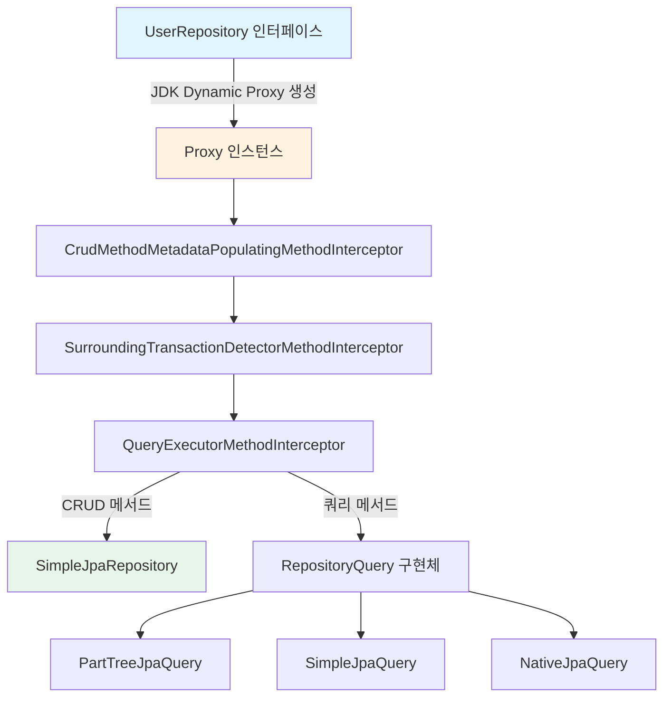
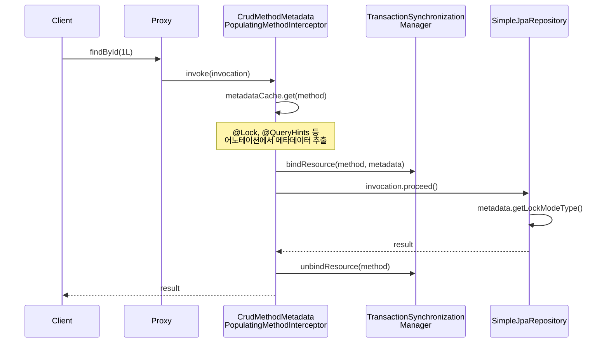
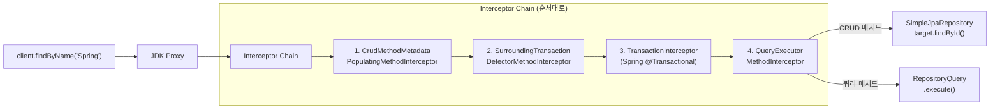

# Repository Proxy 아키텍처: 인터페이스만으로 동작하는 원리

Spring Data JPA에서 개발자가 인터페이스만 선언하면 런타임에 JDK Dynamic Proxy를 통해 구현체가 자동 생성된다. 이 문서에서는 `SimpleJpaRepository`가 실제 구현을 담당하고, Proxy와 `QueryExecutorMethodInterceptor` 체인이 쿼리 메서드 호출을 가로채는 전체 메커니즘을 분석한다.

## 목차

1. [핵심 개념 (What)](#1-핵심-개념-what)
2. [왜 알아야 하는가 (Why)](#2-왜-알아야-하는가-why)
3. [내부 구현 분석 (How)](#3-내부-구현-분석-how)
4. [실전 예제](#4-실전-예제)
5. [정리](#5-정리)

---

## 1. 핵심 개념 (What)

### Repository Proxy란?

Spring Data JPA에서 `JpaRepository<T, ID>` 인터페이스를 상속한 인터페이스를 선언하면, Spring은 애플리케이션 시작 시 **JDK Dynamic Proxy**를 생성하여 해당 인터페이스의 구현체를 만든다. 개발자가 직접 구현 클래스를 작성하지 않아도 CRUD 메서드와 쿼리 메서드가 동작하는 이유가 바로 이 Proxy 메커니즘이다.

### 핵심 구성요소

| 구성요소 | 역할 |
|---------|------|
| `JpaRepositoryFactory` | Repository Proxy 인스턴스를 생성하는 팩토리 |
| `SimpleJpaRepository` | CRUD 메서드의 실제 구현체 (target) |
| `RepositoryFactorySupport` | Proxy 생성, Interceptor 체인 조립을 담당하는 상위 클래스 |
| `QueryExecutorMethodInterceptor` | 쿼리 메서드 호출을 가로채 RepositoryQuery로 위임 |
| `CrudMethodMetadataPostProcessor` | `@Lock`, `@QueryHints`, `@EntityGraph` 등의 메타데이터를 수집하는 PostProcessor |

## 2. 왜 알아야 하는가 (Why)

### 실무에서 만나는 상황

1. **커스텀 Repository 구현 시**: `@Repository` 구현체를 직접 만들 때, Proxy가 어떻게 커스텀 구현과 기본 구현을 합성하는지 알아야 올바르게 설계할 수 있다.
2. **디버깅**: `findByName`을 호출했는데 예상과 다른 쿼리가 실행될 때, 호출 체인을 추적하려면 Proxy 구조를 이해해야 한다.
3. **성능 이슈 진단**: `@Lock`, `@QueryHints` 등이 적용되지 않는 문제는 `CrudMethodMetadataPostProcessor`의 동작 원리를 알면 해결할 수 있다.
4. **AOP 적용 순서**: 트랜잭션, 감사(Auditing) 등 AOP 어드바이스가 Repository 메서드에 적용되는 순서를 이해해야 예상치 못한 동작을 방지할 수 있다.

## 3. 내부 구현 분석 (How)

### 3.1 전체 아키텍처 다이어그램



### 3.2 JpaRepositoryFactory: Proxy 생성의 시작점

`JpaRepositoryFactory`는 `RepositoryFactorySupport`를 상속하며, Repository Proxy 생성의 핵심 팩토리다.

```java
// JpaRepositoryFactory.java (핵심 구조)
public class JpaRepositoryFactory extends RepositoryFactorySupport {

    private final EntityManager entityManager;
    private final CrudMethodMetadataPostProcessor crudMethodMetadataPostProcessor;

    public JpaRepositoryFactory(EntityManager entityManager) {
        this.entityManager = entityManager;
        this.crudMethodMetadataPostProcessor = new CrudMethodMetadataPostProcessor();

        // Proxy 후처리기 등록
        addRepositoryProxyPostProcessor(crudMethodMetadataPostProcessor);
        addRepositoryProxyPostProcessor((factory, repositoryInformation) -> {
            if (isTransactionNeeded(repositoryInformation.getRepositoryInterface())) {
                factory.addAdvice(SurroundingTransactionDetectorMethodInterceptor.INSTANCE);
            }
        });
    }
}
```

**주요 동작:**

1. `EntityManager`를 주입받아 저장
2. `CrudMethodMetadataPostProcessor`를 생성하고 Proxy 후처리기로 등록
3. `Stream` 반환 타입이나 `@Procedure` 어노테이션이 있으면 `SurroundingTransactionDetectorMethodInterceptor`를 추가

### 3.3 Target Repository 결정: SimpleJpaRepository

```java
// JpaRepositoryFactory.java
@Override
protected Class<?> getRepositoryBaseClass(RepositoryMetadata metadata) {
    return SimpleJpaRepository.class;  // 기본 구현 클래스
}

@Override
protected final JpaRepositoryImplementation<?, ?> getTargetRepository(
        RepositoryInformation information) {
    JpaRepositoryImplementation<?, ?> repository =
        getTargetRepository(information, entityManager);
    invokeAwareMethods(repository);
    return repository;
}
```

`getRepositoryBaseClass()`가 `SimpleJpaRepository.class`를 반환하므로, 모든 Repository의 CRUD 메서드는 `SimpleJpaRepository`에 위임된다.

### 3.4 SimpleJpaRepository: 실제 CRUD 구현

`SimpleJpaRepository`는 `JpaRepositoryImplementation<T, ID>`를 구현하며, `EntityManager`를 사용하여 실제 JPA 작업을 수행한다.

```java
// SimpleJpaRepository.java (핵심 구조)
@Repository
@Transactional(readOnly = true)
public class SimpleJpaRepository<T, ID> implements JpaRepositoryImplementation<T, ID> {

    private final JpaEntityInformation<T, ?> entityInformation;
    private final EntityManager entityManager;

    @Override
    @Transactional
    public <S extends T> S save(S entity) {
        if (entityInformation.isNew(entity)) {
            entityManager.persist(entity);
            return entity;
        } else {
            return entityManager.merge(entity);
        }
    }

    @Override
    public Optional<T> findById(ID id) {
        Class<T> domainType = getDomainClass();
        if (metadata == null) {
            return Optional.ofNullable(entityManager.find(domainType, id));
        }
        // @Lock, @QueryHints 메타데이터 적용
        LockModeType type = metadata.getLockModeType();
        Map<String, Object> hints = getHints();
        return Optional.ofNullable(
            type == null
                ? entityManager.find(domainType, id, hints)
                : entityManager.find(domainType, id, type, hints));
    }
}
```

**핵심 포인트:**
- 클래스 레벨에 `@Transactional(readOnly = true)` 적용
- `save()`는 `@Transactional`로 오버라이드하여 쓰기 트랜잭션 사용
- `isNew()` 판단에 따라 `persist()` vs `merge()` 분기

### 3.5 CrudMethodMetadataPostProcessor: 메타데이터 인터셉터

이 PostProcessor는 `@Lock`, `@QueryHints`, `@EntityGraph` 등의 어노테이션 정보를 수집하여 실행 시점에 적용한다.



`CrudMethodMetadataPopulatingMethodInterceptor`의 핵심 로직:

```java
// CrudMethodMetadataPostProcessor.java
static class CrudMethodMetadataPopulatingMethodInterceptor implements MethodInterceptor {

    private final ConcurrentMap<Method, CrudMethodMetadata> metadataCache
        = new ConcurrentHashMap<>();

    @Override
    public Object invoke(MethodInvocation invocation) throws Throwable {
        Method method = invocation.getMethod();

        // 쿼리 메서드가 아닌 경우에만 처리 (CRUD 구현 메서드)
        if (!implementations.contains(method)) {
            return invocation.proceed();
        }

        // 메타데이터를 캐시에서 조회하거나 새로 생성
        CrudMethodMetadata methodMetadata = metadataCache.get(method);
        if (methodMetadata == null) {
            methodMetadata = new DefaultCrudMethodMetadata(method);
            metadataCache.putIfAbsent(method, methodMetadata);
        }

        // ThreadLocal(TransactionSynchronizationManager)에 바인딩
        TransactionSynchronizationManager.bindResource(method, methodMetadata);
        try {
            return invocation.proceed();
        } finally {
            TransactionSynchronizationManager.unbindResource(method);
        }
    }
}
```

`DefaultCrudMethodMetadata`는 메서드에서 다음 어노테이션을 추출한다:
- `@Lock` -> `LockModeType`
- `@QueryHints` -> 쿼리 힌트 목록
- `@EntityGraph` -> 엔티티 그래프 정보
- `@Meta` -> 쿼리 코멘트

### 3.6 QueryLookupStrategy: 쿼리 메서드 결정

`JpaRepositoryFactory`는 `getQueryLookupStrategy()`를 오버라이드하여 `JpaQueryLookupStrategy`를 반환한다:

```java
// JpaRepositoryFactory.java
@Override
protected Optional<QueryLookupStrategy> getQueryLookupStrategy(
        @Nullable Key key, ValueExpressionDelegate valueExpressionDelegate) {

    JpaQueryConfiguration queryConfiguration = new JpaQueryConfiguration(
        queryRewriterProvider, queryEnhancerSelector,
        new CachingValueExpressionDelegate(valueExpressionDelegate),
        escapeCharacter);

    return Optional.of(
        JpaQueryLookupStrategy.create(entityManager, queryMethodFactory,
            key, queryConfiguration));
}
```

### 3.7 Proxy 호출 체인 전체 흐름



**호출 순서:**

1. **CrudMethodMetadataPopulatingMethodInterceptor**: `@Lock`, `@QueryHints` 메타데이터를 ThreadLocal에 바인딩
2. **SurroundingTransactionDetectorMethodInterceptor**: 현재 트랜잭션 존재 여부를 감지
3. **TransactionInterceptor**: `@Transactional` 처리 (Spring AOP)
4. **QueryExecutorMethodInterceptor**: 메서드가 쿼리 메서드인지 판단하여 `RepositoryQuery`로 라우팅

## 4. 실전 예제

### 4.1 기본 Repository 정의와 Proxy 동작 확인

```java
// 인터페이스 선언 - 구현체 없음
public interface UserRepository extends JpaRepository<User, Long> {
    List<User> findByNameContaining(String name);

    @Lock(LockModeType.PESSIMISTIC_WRITE)
    @QueryHints(@QueryHint(name = "jakarta.persistence.lock.timeout", value = "3000"))
    Optional<User> findWithLockById(Long id);
}

// 실제 사용
@Service
@RequiredArgsConstructor
public class UserService {

    private final UserRepository userRepository;  // Proxy 인스턴스 주입

    @Transactional
    public User updateUser(Long id, String newName) {
        // findWithLockById -> Proxy -> MetadataInterceptor
        //   -> @Lock(PESSIMISTIC_WRITE) 적용 -> SimpleJpaRepository.findById()
        User user = userRepository.findWithLockById(id)
            .orElseThrow(() -> new EntityNotFoundException("User not found: " + id));
        user.setName(newName);
        return user;
    }
}
```

### 4.2 Proxy 타입 확인과 디버깅

```java
@SpringBootTest
class RepositoryProxyTest {

    @Autowired
    private UserRepository userRepository;

    @Test
    void verifyProxy() {
        // Proxy 인스턴스 확인
        System.out.println(userRepository.getClass().getName());
        // 출력: jdk.proxy3.$Proxy123

        assertTrue(Proxy.isProxyClass(userRepository.getClass()));

        // 실제 target 클래스 확인
        if (userRepository instanceof Advised advised) {
            Object target = advised.getTargetSource().getTarget();
            assertTrue(target instanceof SimpleJpaRepository);
        }
    }
}
```

### 4.3 커스텀 Repository 구현과 Proxy Fragment 합성

```java
// Fragment 인터페이스
public interface UserRepositoryCustom {
    List<User> searchByFullText(String keyword);
}

// Fragment 구현
@RequiredArgsConstructor
public class UserRepositoryCustomImpl implements UserRepositoryCustom {

    private final EntityManager entityManager;

    @Override
    public List<User> searchByFullText(String keyword) {
        return entityManager.createQuery(
            "SELECT u FROM User u WHERE u.name LIKE :keyword", User.class)
            .setParameter("keyword", "%" + keyword + "%")
            .getResultList();
    }
}

// Proxy는 두 개의 Fragment를 합성
// 1) SimpleJpaRepository (CRUD)
// 2) UserRepositoryCustomImpl (커스텀)
public interface UserRepository
        extends JpaRepository<User, Long>, UserRepositoryCustom {
    List<User> findByEmail(String email);
}
```

Proxy는 메서드 호출 시 해당 메서드가 어느 Fragment에 속하는지 판단하여 올바른 구현체로 라우팅한다.

## 5. 정리

| 항목 | 설명 |
|-----|------|
| Proxy 생성 | `JpaRepositoryFactory` -> `RepositoryFactorySupport.getRepository()` -> JDK Dynamic Proxy |
| Target 구현체 | `SimpleJpaRepository` (CRUD/Specification/QBE 메서드의 실제 구현) |
| Interceptor 체인 | MetadataInterceptor -> TransactionDetector -> TransactionInterceptor -> QueryExecutorMethodInterceptor |
| 메타데이터 처리 | `CrudMethodMetadataPostProcessor`가 `@Lock`, `@QueryHints`, `@EntityGraph`를 캐싱하여 ThreadLocal에 바인딩 |
| 쿼리 메서드 라우팅 | `QueryExecutorMethodInterceptor`가 쿼리 메서드를 `RepositoryQuery` 구현체로 위임 |
| Fragment 합성 | `RepositoryComposition`이 여러 Fragment(커스텀 구현 포함)를 합성하여 Proxy에 연결 |
| Base Class 변경 | `@EnableJpaRepositories(repositoryBaseClass = ...)` 또는 `getRepositoryBaseClass()` 오버라이드 |

---
*참고: Spring Data JPA 3.x / Hibernate 6.x 기준*
