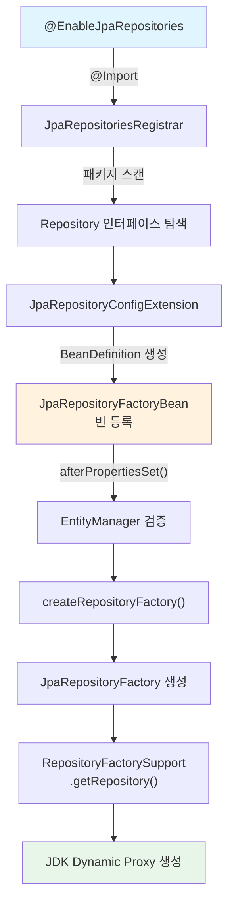
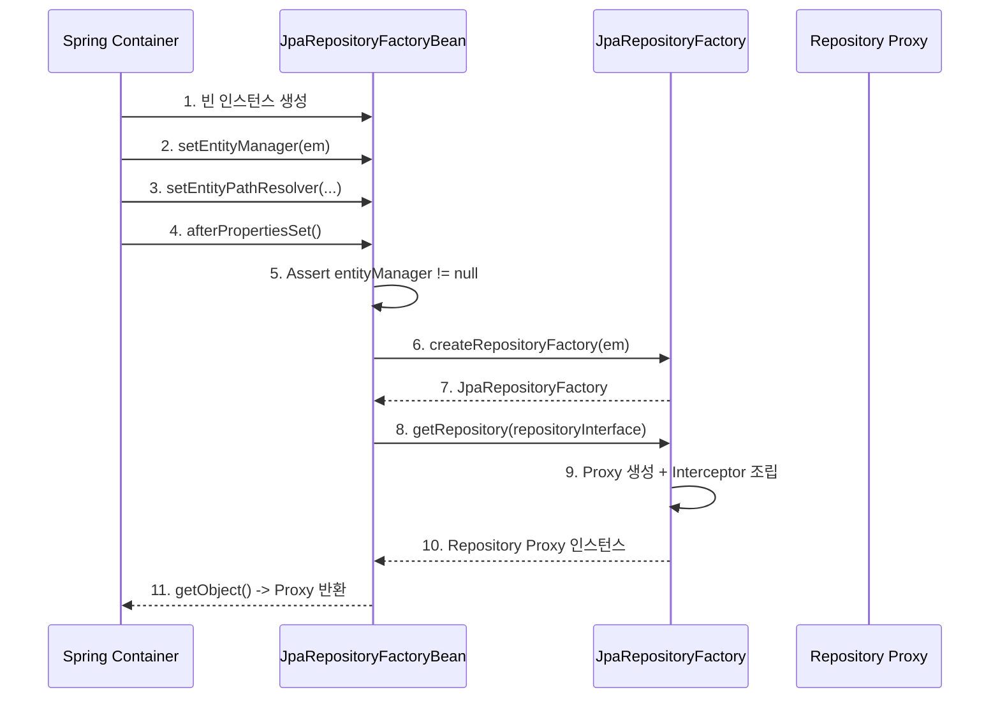
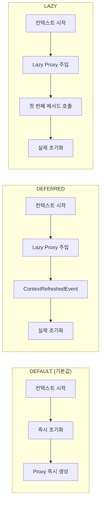

# Repository Factory 초기화: @EnableJpaRepositories에서 빈 등록까지

`@EnableJpaRepositories` 어노테이션 하나로 Repository 인터페이스들이 Spring 빈으로 등록되는 전체 과정을 분석한다. 패키지 스캔, `JpaRepositoryFactoryBean` 생성, Bootstrap Mode에 따른 초기화 시점 차이까지 내부 메커니즘을 살펴본다.

## 목차

1. [핵심 개념 (What)](#1-핵심-개념-what)
2. [왜 알아야 하는가 (Why)](#2-왜-알아야-하는가-why)
3. [내부 구현 분석 (How)](#3-내부-구현-분석-how)
4. [실전 예제](#4-실전-예제)
5. [정리](#5-정리)

---

## 1. 핵심 개념 (What)

### Repository 자동 등록이란?

Spring Data JPA는 `@EnableJpaRepositories`를 통해 지정된 패키지를 스캔하고, `Repository` 인터페이스를 상속한 모든 인터페이스를 찾아 Spring 빈으로 자동 등록한다. 이 과정에서 핵심적인 역할을 하는 것이 `JpaRepositoryFactoryBean`이다.

### 핵심 구성요소

| 구성요소 | 역할 |
|---------|------|
| `@EnableJpaRepositories` | Repository 스캔을 활성화하는 어노테이션 |
| `JpaRepositoriesRegistrar` | `@Import`로 등록되어 Repository BeanDefinition을 생성 |
| `JpaRepositoryConfigExtension` | JPA 전용 설정 확장 (EntityManager 참조, 트랜잭션 매니저 등) |
| `JpaRepositoryFactoryBean` | 각 Repository 인터페이스에 대한 `FactoryBean` |
| `JpaRepositoryFactory` | 실제 Repository Proxy를 생성하는 팩토리 |
| `BootstrapMode` | Repository 초기화 시점 (DEFAULT/DEFERRED/LAZY) |

## 2. 왜 알아야 하는가 (Why)

### 실무 동기

1. **애플리케이션 시작 시간 최적화**: Repository 초기화가 시작 시간의 상당 부분을 차지할 수 있다. `BootstrapMode.DEFERRED`나 `LAZY`를 적용하면 시작 시간을 줄일 수 있다.
2. **다중 데이터소스 설정**: `entityManagerFactoryRef`, `transactionManagerRef`를 올바르게 설정하려면 Factory 초기화 흐름을 이해해야 한다.
3. **빈 등록 실패 디버깅**: "No qualifying bean of type EntityManager" 같은 오류는 초기화 순서를 이해하면 해결할 수 있다.
4. **커스텀 FactoryBean 확장**: 특수한 Repository 동작(멀티테넌시, 동적 데이터소스)을 위해 `JpaRepositoryFactoryBean`을 확장할 때 내부 흐름을 알아야 한다.

## 3. 내부 구현 분석 (How)

### 3.1 전체 초기화 흐름



### 3.2 @EnableJpaRepositories 어노테이션 분석

```java
// EnableJpaRepositories.java
@Target(ElementType.TYPE)
@Retention(RetentionPolicy.RUNTIME)
@Import(JpaRepositoriesRegistrar.class)  // 핵심: Registrar를 Import
public @interface EnableJpaRepositories {

    String[] basePackages() default {};

    Key queryLookupStrategy() default Key.CREATE_IF_NOT_FOUND;

    Class<?> repositoryFactoryBeanClass()
        default JpaRepositoryFactoryBean.class;

    String entityManagerFactoryRef() default "entityManagerFactory";
    String transactionManagerRef() default "transactionManager";

    BootstrapMode bootstrapMode() default BootstrapMode.DEFAULT;

    char escapeCharacter() default '\\';

    boolean enableDefaultTransactions() default true;
}
```

`@Import(JpaRepositoriesRegistrar.class)`가 핵심이다. Spring의 `@Import` 메커니즘에 의해 `JpaRepositoriesRegistrar`가 `BeanDefinitionRegistryPostProcessor`로 동작하여 Repository 빈을 등록한다.

### 3.3 JpaRepositoryConfigExtension: JPA 전용 설정

`JpaRepositoryConfigExtension`은 `RepositoryConfigurationExtensionSupport`를 확장하여 JPA 고유의 빈 등록과 설정을 담당한다.

```java
// JpaRepositoryConfigExtension.java (핵심 부분)
public class JpaRepositoryConfigExtension
        extends RepositoryConfigurationExtensionSupport {

    @Override
    public String getRepositoryFactoryBeanClassName() {
        return JpaRepositoryFactoryBean.class.getName();
    }

    @Override
    protected Collection<Class<? extends Annotation>> getIdentifyingAnnotations() {
        return Arrays.asList(Entity.class, MappedSuperclass.class);
    }

    @Override
    protected Collection<Class<?>> getIdentifyingTypes() {
        return Collections.singleton(JpaRepository.class);
    }

    @Override
    public void postProcess(BeanDefinitionBuilder builder,
            RepositoryConfigurationSource source) {
        // 트랜잭션 매니저 참조 설정
        Optional<String> transactionManagerRef =
            source.getAttribute("transactionManagerRef");
        builder.addPropertyValue("transactionManager",
            transactionManagerRef.orElse("transactionManager"));

        // EntityManager 참조 설정
        builder.addPropertyValue("entityManager",
            new RuntimeBeanReference(entityManagerRefs.get(source)));

        // Escape Character 설정
        builder.addPropertyValue("escapeCharacter",
            getEscapeCharacter(source).orElse('\\'));
    }

    @Override
    public void registerBeansForRoot(BeanDefinitionRegistry registry,
            RepositoryConfigurationSource config) {
        super.registerBeansForRoot(registry, config);

        // SharedEntityManager 등록
        registerSharedEntityMangerIfNotAlreadyRegistered(registry, config);

        // JPA Mapping Context 등록
        registerLazyIfNotAlreadyRegistered(
            () -> new RootBeanDefinition(
                JpaMetamodelMappingContextFactoryBean.class),
            registry, JPA_MAPPING_CONTEXT_BEAN_NAME, source);

        // PersistenceAnnotationBeanPostProcessor 등록
        registerLazyIfNotAlreadyRegistered(
            () -> new RootBeanDefinition(
                PersistenceAnnotationBeanPostProcessor.class),
            registry,
            AnnotationConfigUtils.PERSISTENCE_ANNOTATION_PROCESSOR_BEAN_NAME,
            source);

        // DefaultJpaContext 등록
        registerLazyIfNotAlreadyRegistered(() -> {
            RootBeanDefinition contextDefinition =
                new RootBeanDefinition(DefaultJpaContext.class);
            contextDefinition.setAutowireMode(AUTOWIRE_CONSTRUCTOR);
            return contextDefinition;
        }, registry, JPA_CONTEXT_BEAN_NAME, source);
    }
}
```

`registerBeansForRoot()`에서 등록하는 핵심 인프라 빈:

| 빈 | 역할 |
|---|------|
| `SharedEntityManager` | EntityManagerFactory에서 공유 EntityManager 프록시 생성 |
| `JpaMetamodelMappingContextFactoryBean` | JPA 메타모델 기반 매핑 컨텍스트 |
| `PersistenceAnnotationBeanPostProcessor` | `@PersistenceContext`, `@PersistenceUnit` 주입 |
| `DefaultJpaContext` | 다중 EntityManager 환경에서 올바른 EM 선택 |

### 3.4 JpaRepositoryFactoryBean: FactoryBean 구조

각 Repository 인터페이스마다 하나의 `JpaRepositoryFactoryBean` 인스턴스가 생성된다.

```java
// JpaRepositoryFactoryBean.java
public class JpaRepositoryFactoryBean<T extends Repository<S, ID>, S, ID>
        extends TransactionalRepositoryFactoryBeanSupport<T, S, ID> {

    private @Nullable EntityManager entityManager;

    @PersistenceContext
    public void setEntityManager(EntityManager entityManager) {
        this.entityManager = entityManager;
    }

    @Override
    protected RepositoryFactorySupport createRepositoryFactory(
            EntityManager entityManager) {

        JpaRepositoryFactory factory = new JpaRepositoryFactory(entityManager);
        factory.setEntityPathResolver(entityPathResolver);
        factory.setEscapeCharacter(escapeCharacter);
        factory.setFragmentsContributor(getRepositoryFragmentsContributor());

        if (queryMethodFactory != null) {
            factory.setQueryMethodFactory(queryMethodFactory);
        }

        return factory;
    }

    @Override
    public void afterPropertiesSet() {
        Assert.state(entityManager != null,
            "EntityManager must not be null");
        super.afterPropertiesSet();  // -> Proxy 생성 트리거
    }
}
```

**초기화 순서:**



### 3.5 Bootstrap Mode: 초기화 시점 제어

`@EnableJpaRepositories`의 `bootstrapMode` 속성으로 Repository 초기화 시점을 제어할 수 있다.



| Mode | 초기화 시점 | 장점 | 주의사항 |
|------|-----------|------|---------|
| `DEFAULT` | 애플리케이션 컨텍스트 시작 시 | 시작 시 문제를 즉시 발견 | 시작 시간 증가 |
| `DEFERRED` | `ContextRefreshedEvent` 발생 시 | 시작 시간 단축, 컨텍스트 완료 전 초기화 보장 | 순환 의존성 가능 |
| `LAZY` | 첫 번째 Repository 메서드 호출 시 | 시작 시간 최소화 | 런타임에 초기화 에러 발생 가능 |

### 3.6 다중 EntityManager 구성 시 Factory 분리

여러 데이터소스를 사용할 때 `@EnableJpaRepositories`를 분리하여 각각 다른 EntityManager를 가리킨다:

```java
@Configuration
@EnableJpaRepositories(
    basePackages = "com.example.primary",
    entityManagerFactoryRef = "primaryEntityManagerFactory",
    transactionManagerRef = "primaryTransactionManager"
)
public class PrimaryJpaConfig { }

@Configuration
@EnableJpaRepositories(
    basePackages = "com.example.secondary",
    entityManagerFactoryRef = "secondaryEntityManagerFactory",
    transactionManagerRef = "secondaryTransactionManager"
)
public class SecondaryJpaConfig { }
```

내부적으로 `JpaRepositoryConfigExtension.postProcess()`에서 `entityManagerFactoryRef` 속성을 읽어 SharedEntityManager를 생성하고, 해당 EntityManager 참조를 `JpaRepositoryFactoryBean`에 주입한다.

## 4. 실전 예제

### 4.1 Bootstrap Mode 적용으로 시작 시간 단축

```java
@SpringBootApplication
@EnableJpaRepositories(
    bootstrapMode = BootstrapMode.DEFERRED  // 또는 LAZY
)
public class Application {
    public static void main(String[] args) {
        SpringApplication.run(Application.class, args);
    }
}
```

Spring Boot에서는 `spring.data.jpa.repositories.bootstrap-mode=deferred` 프로퍼티로도 설정 가능하다.

### 4.2 커스텀 RepositoryFactoryBean

```java
public class AuditableRepositoryFactoryBean<T extends Repository<S, ID>, S, ID>
        extends JpaRepositoryFactoryBean<T, S, ID> {

    public AuditableRepositoryFactoryBean(Class<? extends T> repositoryInterface) {
        super(repositoryInterface);
    }

    @Override
    protected RepositoryFactorySupport createRepositoryFactory(
            EntityManager entityManager) {
        JpaRepositoryFactory factory =
            (JpaRepositoryFactory) super.createRepositoryFactory(entityManager);
        // 커스텀 PostProcessor 추가
        factory.addRepositoryProxyPostProcessor(
            new AuditingRepositoryProxyPostProcessor());
        return factory;
    }
}

// 적용
@EnableJpaRepositories(
    repositoryFactoryBeanClass = AuditableRepositoryFactoryBean.class
)
public class JpaConfig { }
```

### 4.3 초기화 문제 디버깅

Repository 초기화 실패 시 확인할 포인트:

```java
@SpringBootTest
class RepositoryInitializationTest {

    @Autowired
    private ApplicationContext context;

    @Test
    void verifyRepositoryBeans() {
        // 등록된 모든 Repository 빈 확인
        String[] beanNames = context.getBeanNamesForType(Repository.class);
        Arrays.stream(beanNames).forEach(name -> {
            Object bean = context.getBean(name);
            System.out.printf("Bean: %s -> Type: %s%n",
                name, bean.getClass().getName());
        });

        // JpaRepositoryFactoryBean 확인
        String[] factoryBeans = context.getBeanNamesForType(
            JpaRepositoryFactoryBean.class);
        System.out.println("FactoryBeans: " + Arrays.toString(factoryBeans));
    }
}
```

## 5. 정리

| 항목 | 설명 |
|-----|------|
| 진입점 | `@EnableJpaRepositories` -> `@Import(JpaRepositoriesRegistrar.class)` |
| 스캔 대상 | `Repository` 인터페이스 상속 + 도메인 클래스에 `@Entity`/`@MappedSuperclass` |
| BeanDefinition | 각 Repository 인터페이스마다 `JpaRepositoryFactoryBean` BeanDefinition 생성 |
| 인프라 빈 | SharedEntityManager, MappingContext, PersistenceAnnotationProcessor, JpaContext |
| FactoryBean 초기화 | `afterPropertiesSet()` -> `createRepositoryFactory()` -> `getRepository()` |
| Proxy 생성 | `JpaRepositoryFactory` -> `RepositoryFactorySupport.getRepository()` |
| Bootstrap Mode | DEFAULT(즉시) / DEFERRED(컨텍스트 완료 시) / LAZY(첫 호출 시) |
| 다중 데이터소스 | `entityManagerFactoryRef`, `transactionManagerRef`로 분리 |

---
*참고: Spring Data JPA 3.x / Hibernate 6.x 기준*
