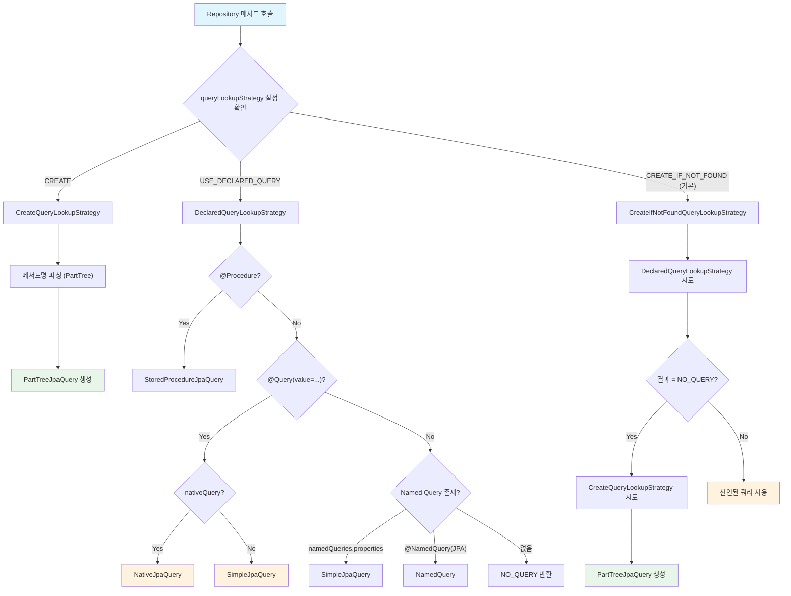
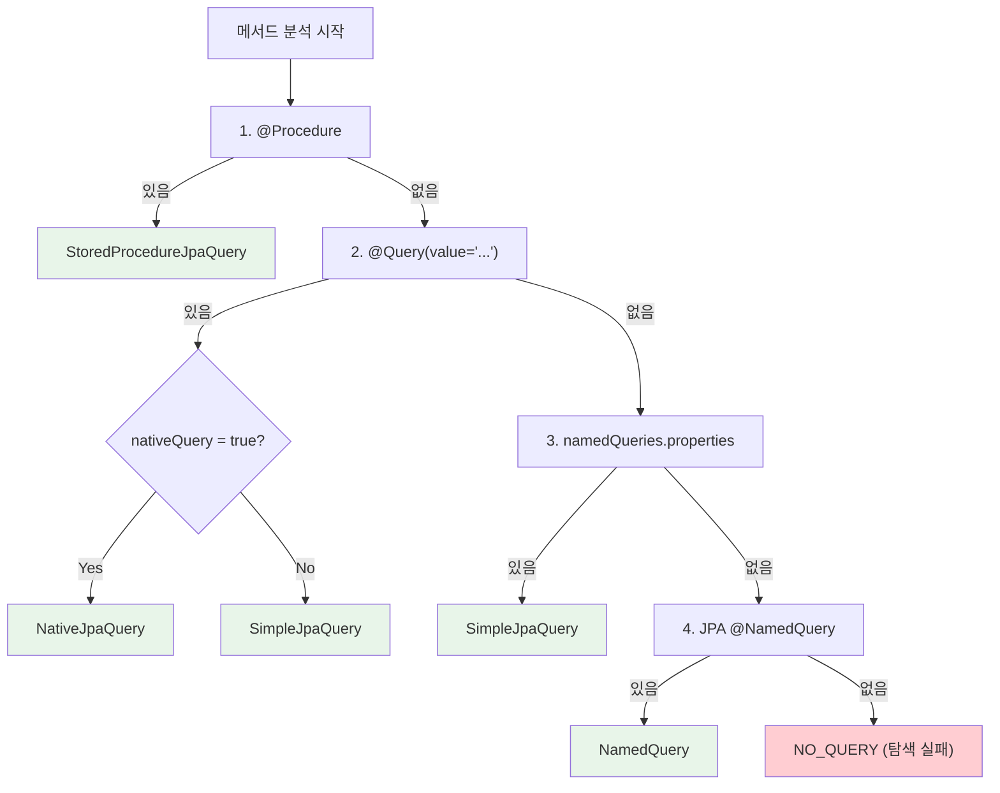

# Query Lookup Strategy: 쿼리 메서드 결정 전략

Spring Data JPA는 Repository 메서드 호출 시 실행할 쿼리를 결정하기 위해 세 가지 전략(CREATE, USE_DECLARED_QUERY, CREATE_IF_NOT_FOUND)을 제공한다. 이 문서에서는 메서드명 파싱, `@Query` 어노테이션, Named Query 중 어떤 방식으로 쿼리가 결정되는지 `JpaQueryLookupStrategy` 소스코드를 기반으로 분석한다.

## 목차

1. [핵심 개념 (What)](#1-핵심-개념-what)
2. [왜 알아야 하는가 (Why)](#2-왜-알아야-하는가-why)
3. [내부 구현 분석 (How)](#3-내부-구현-분석-how)
4. [실전 예제](#4-실전-예제)
5. [정리](#5-정리)

---

## 1. 핵심 개념 (What)

### Query Lookup Strategy란?

Repository 인터페이스에 선언된 메서드를 호출하면, Spring Data JPA는 해당 메서드에 대응하는 쿼리를 찾아야 한다. 이때 **어떤 방식으로 쿼리를 결정하느냐**를 정의하는 것이 Query Lookup Strategy다.

### 3가지 전략

| 전략 | Key 값 | 동작 |
|------|--------|------|
| **CREATE** | `Key.CREATE` | 메서드 이름을 파싱하여 쿼리를 자동 생성 |
| **USE_DECLARED_QUERY** | `Key.USE_DECLARED_QUERY` | `@Query`, Named Query 등 명시적 선언만 사용 |
| **CREATE_IF_NOT_FOUND** | `Key.CREATE_IF_NOT_FOUND` | 선언된 쿼리를 먼저 찾고, 없으면 메서드명으로 생성 (기본값) |

### 쿼리 생성자 vs 쿼리 선택자

세 가지 전략은 결국 두 가지 역할로 나뉜다:

| 역할 | 전략 | 하는 일 |
|------|------|---------|
| **쿼리 생성자 (Query Creator)** | `CREATE` | 메서드 이름을 파싱해서 쿼리를 **만든다** |
| **쿼리 선택자 (Query Selector)** | `USE_DECLARED_QUERY` | 이미 선언된 쿼리를 **찾아서 고른다** |

- **쿼리 생성자**는 `findByNameAndAgeGreaterThan` 같은 메서드명의 키워드(`findBy`, `And`, `GreaterThan`)를 분석하여 JPQL을 자동으로 만들어낸다. `@Query`가 붙어 있어도 무시하고 오직 메서드명만 본다.
- **쿼리 선택자**는 `@Query`, `@NamedQuery`, properties 파일 등에서 미리 선언된 쿼리를 탐색한다. 메서드명은 쿼리 생성에 관여하지 않으므로 자유롭게 네이밍할 수 있다. 선언된 쿼리를 찾지 못하면 예외가 발생한다.

기본 전략 `CREATE_IF_NOT_FOUND`는 이 두 역할을 조합한 것이다:

```
Repository 메서드 호출
        │
        ▼
  ┌─────────────────────────┐
  │ 선언된 쿼리가 있는가?    │
  │ (@Query, @NamedQuery 등) │
  └────────────┬────────────┘
          ┌────┴────┐
          │         │
        있다       없다
          │         │
          ▼         ▼
    쿼리 선택자    쿼리 생성자
    (선언된 쿼리   (메서드명 파싱
     그대로 실행)   → JPQL 자동 생성)
```

따라서 하나의 Repository 안에서 두 방식을 자연스럽게 섞어 쓸 수 있다:

```java
public interface UserRepository extends JpaRepository<User, Long> {

    // 쿼리 생성자: @Query 없음 → 메서드명 파싱으로 JPQL 자동 생성
    User findByEmail(String email);

    // 쿼리 선택자: @Query 있음 → 선언된 쿼리를 그대로 사용
    @Query("SELECT u FROM User u JOIN u.orders o "
         + "GROUP BY u HAVING COUNT(o) > :min")
    List<User> findActiveCustomers(@Param("min") long minOrders);
}
```

**실무 기준**: 조건 2~3개 이하의 단순 조회는 쿼리 생성자(메서드 네이밍)를, JOIN/서브쿼리/GROUP BY 등 복잡한 쿼리는 쿼리 선택자(`@Query`)를 사용한다. 메서드명이 `findByNameAndStatusAndDepartmentAndAgeBetween`처럼 길어지기 시작하면 `@Query`로 전환할 타이밍이다.

### 쿼리 소스 종류

| 소스 | 예시 |
|------|------|
| 메서드명 파싱 (PartTree) | `findByNameAndAgeGreaterThan(String, int)` |
| `@Query` 어노테이션 | `@Query("SELECT u FROM User u WHERE u.email = :email")` |
| JPA Named Query | `@NamedQuery(name = "User.findByEmail", query = "...")` |
| Properties 파일 Named Query | `META-INF/jpa-named-queries.properties` |
| Stored Procedure | `@Procedure("sp_get_user")` |

## 2. 왜 알아야 하는가 (Why)

1. **쿼리 충돌 해결**: `@Query`와 Named Query가 동시에 존재할 때 어떤 것이 우선하는지 알아야 한다.
2. **성능 최적화**: 복잡한 쿼리는 `@Query`로 직접 작성하고, 단순 조회는 메서드명 파싱을 사용하는 등 전략적 선택이 필요하다.
3. **디버깅**: "No property 'xyz' found for type 'Entity'" 에러가 CREATE 전략에서 메서드명 파싱 실패 시 발생함을 알면 빠르게 원인을 파악할 수 있다.
4. **Native Query vs JPQL**: `@Query`에서 `nativeQuery = true` 여부에 따라 `NativeJpaQuery` vs `SimpleJpaQuery`가 생성되는 분기를 이해해야 한다.

## 3. 내부 구현 분석 (How)

### 3.1 JpaQueryLookupStrategy: 전략 팩토리

`JpaQueryLookupStrategy`는 유틸리티 클래스로, `create()` 정적 메서드를 통해 적절한 전략 인스턴스를 반환한다.

```java
// JpaQueryLookupStrategy.java
public final class JpaQueryLookupStrategy {

    private static final RepositoryQuery NO_QUERY = new NoQuery();

    public static QueryLookupStrategy create(
            EntityManager em,
            JpaQueryMethodFactory queryMethodFactory,
            @Nullable Key key,
            JpaQueryConfiguration configuration) {

        return switch (key != null ? key : Key.CREATE_IF_NOT_FOUND) {
            case CREATE ->
                new CreateQueryLookupStrategy(em, queryMethodFactory, configuration);
            case USE_DECLARED_QUERY ->
                new DeclaredQueryLookupStrategy(em, queryMethodFactory, configuration);
            case CREATE_IF_NOT_FOUND ->
                new CreateIfNotFoundQueryLookupStrategy(em, queryMethodFactory,
                    new CreateQueryLookupStrategy(em, queryMethodFactory, configuration),
                    new DeclaredQueryLookupStrategy(em, queryMethodFactory, configuration),
                    configuration);
            default -> throw new IllegalArgumentException(
                "Unsupported query lookup strategy " + key);
        };
    }
}
```

**핵심 포인트**: `key`가 `null`이면 기본값 `CREATE_IF_NOT_FOUND`가 사용된다. 이것이 `@EnableJpaRepositories`의 기본 동작이다.

### 3.2 전략 결정 플로우차트



### 3.3 CreateQueryLookupStrategy: 메서드명 파싱

가장 단순한 전략으로, 항상 메서드명을 파싱하여 `PartTreeJpaQuery`를 생성한다.

```java
// JpaQueryLookupStrategy.java (내부 클래스)
private static class CreateQueryLookupStrategy
        extends AbstractQueryLookupStrategy {

    @Override
    protected RepositoryQuery resolveQuery(
            JpaQueryMethod method,
            JpaQueryConfiguration configuration,
            EntityManager em,
            NamedQueries namedQueries) {
        return new PartTreeJpaQuery(method, em,
            configuration.getEscapeCharacter());
    }
}
```

메서드명 `findByNameAndAgeGreaterThan`이 `PartTree`에 의해 파싱되어 JPQL로 변환된다.

### 3.4 DeclaredQueryLookupStrategy: 선언된 쿼리 탐색

이 전략은 여러 소스에서 순차적으로 쿼리를 찾는다:

```java
// JpaQueryLookupStrategy.java (내부 클래스)
static class DeclaredQueryLookupStrategy
        extends AbstractQueryLookupStrategy {

    @Override
    protected RepositoryQuery resolveQuery(
            JpaQueryMethod method,
            JpaQueryConfiguration configuration,
            EntityManager em,
            NamedQueries namedQueries) {

        // 1단계: @Procedure 확인
        if (method.isProcedureQuery()) {
            return createProcedureQuery(method, em);
        }

        // 2단계: @Query(value = "...") 확인
        if (method.hasAnnotatedQuery()) {
            if (method.hasAnnotatedQueryName()) {
                LOG.warn("Both query and query name annotated; "
                    + "Using the declared query");
            }
            return createStringQuery(method, em,
                method.getRequiredDeclaredQuery(),
                getCountQuery(method, namedQueries, em),
                configuration);
        }

        // 3단계: Named Query (properties 파일)
        String name = method.getNamedQueryName();
        if (namedQueries.hasQuery(name)) {
            return createStringQuery(method, em,
                method.getDeclaredQuery(namedQueries.getQuery(name)),
                getCountQuery(method, namedQueries, em),
                configuration);
        }

        // 4단계: JPA Named Query (@NamedQuery)
        RepositoryQuery query = NamedQuery.lookupFrom(
            method, em, configuration);
        return query != null ? query : NO_QUERY;
    }
}
```

**탐색 우선순위:**



### 3.5 CreateIfNotFoundQueryLookupStrategy: 기본 전략

기본 전략은 두 전략을 조합한다:

```java
// JpaQueryLookupStrategy.java (내부 클래스)
private static class CreateIfNotFoundQueryLookupStrategy
        extends AbstractQueryLookupStrategy {

    private final DeclaredQueryLookupStrategy lookupStrategy;
    private final CreateQueryLookupStrategy createStrategy;

    @Override
    protected RepositoryQuery resolveQuery(
            JpaQueryMethod method,
            JpaQueryConfiguration configuration,
            EntityManager em,
            NamedQueries namedQueries) {

        // 1) 선언된 쿼리를 먼저 찾는다
        RepositoryQuery lookupQuery = lookupStrategy.resolveQuery(
            method, configuration, em, namedQueries);

        // 2) 찾지 못하면 메서드명으로 쿼리 생성
        if (lookupQuery != NO_QUERY) {
            return lookupQuery;
        }

        return createStrategy.resolveQuery(
            method, configuration, em, namedQueries);
    }
}
```

### 3.6 JpaQueryMethod: 메서드 메타데이터

`JpaQueryMethod`는 Repository 메서드의 다양한 메타데이터를 제공한다:

```java
// JpaQueryMethod.java (핵심 메서드)
public class JpaQueryMethod extends QueryMethod {

    // @Query 어노테이션에 query string이 있는지
    boolean hasAnnotatedQuery() {
        return StringUtils.hasText(getAnnotationValue("value", String.class));
    }

    // @Query(name = "...") 지정 여부
    boolean hasAnnotatedQueryName() {
        return StringUtils.hasText(getAnnotationValue("name", String.class));
    }

    // Named Query 이름 결정: @Query(name=...) 또는 "Entity.methodName"
    @Override
    public String getNamedQueryName() {
        String annotatedName = getAnnotationValue("name", String.class);
        return StringUtils.hasText(annotatedName)
            ? annotatedName
            : super.getNamedQueryName();  // "User.findByEmail" 형식
    }

    // Native Query 여부
    boolean isNativeQuery() {
        return this.isNativeQuery.get();
    }

    // @Procedure 존재 여부
    public boolean isProcedureQuery() {
        return this.isProcedureQuery.get();
    }

    // @Lock 어노테이션에서 LockModeType 추출
    @Nullable
    LockModeType getLockModeType() {
        return lockModeType.getNullable();
    }
}
```

### 3.7 쿼리 생성 결과물 매핑

`DeclaredQueryLookupStrategy.createStringQuery()`에서 최종 `RepositoryQuery` 구현체가 결정된다:

```java
// DeclaredQueryLookupStrategy (내부)
static AbstractJpaQuery createStringQuery(
        JpaQueryMethod method, EntityManager em,
        DeclaredQuery query, @Nullable DeclaredQuery countQuery,
        JpaQueryConfiguration configuration) {

    if (method.isScrollQuery()) {
        throw QueryCreationException.create(method,
            "Scroll queries are not supported using String-based queries");
    }

    return method.isNativeQuery()
        ? new NativeJpaQuery(method, em, query, countQuery, configuration)
        : new SimpleJpaQuery(method, em, query, countQuery, configuration);
}
```

| RepositoryQuery 구현체 | 생성 조건 |
|----------------------|----------|
| `PartTreeJpaQuery` | CREATE 전략에서 메서드명 파싱 |
| `SimpleJpaQuery` | JPQL 문자열 기반 쿼리 (`@Query` 또는 Named Query) |
| `NativeJpaQuery` | `@Query(nativeQuery = true)` |
| `StoredProcedureJpaQuery` | `@Procedure` 어노테이션 |
| `NamedQuery` | JPA `@NamedQuery`로 EntityManager에 등록된 쿼리 |

## 4. 실전 예제

### 4.1 전략별 메서드 선언 예시

```java
public interface OrderRepository extends JpaRepository<Order, Long> {

    // CREATE 전략: 메서드명 파싱
    List<Order> findByStatusAndCreatedAtAfter(
        OrderStatus status, LocalDateTime after);

    // USE_DECLARED_QUERY: @Query JPQL
    @Query("SELECT o FROM Order o JOIN FETCH o.items WHERE o.id = :id")
    Optional<Order> findWithItemsById(@Param("id") Long id);

    // USE_DECLARED_QUERY: @Query Native
    @Query(value = "SELECT * FROM orders WHERE total_amount > :amount",
           nativeQuery = true)
    List<Order> findExpensiveOrders(@Param("amount") BigDecimal amount);

    // USE_DECLARED_QUERY: Named Query
    // @NamedQuery(name = "Order.findRecentByCustomer",
    //             query = "SELECT o FROM Order o WHERE o.customer.id = :customerId
    //                      ORDER BY o.createdAt DESC")
    List<Order> findRecentByCustomer(@Param("customerId") Long customerId);

    // USE_DECLARED_QUERY: Stored Procedure
    @Procedure("calculate_order_total")
    BigDecimal calculateTotal(@Param("orderId") Long orderId);
}
```

### 4.2 queryLookupStrategy 설정

```java
// CREATE만 사용 (모든 메서드가 메서드명 파싱 대상)
@EnableJpaRepositories(
    queryLookupStrategy = Key.CREATE
)
public class JpaConfig { }

// 선언된 쿼리만 사용 (메서드명 파싱 비활성화)
@EnableJpaRepositories(
    queryLookupStrategy = Key.USE_DECLARED_QUERY
)
public class StrictJpaConfig { }
```

`Key.USE_DECLARED_QUERY`로 설정하면 `@Query`나 Named Query가 없는 쿼리 메서드는 에러가 발생한다. 이를 통해 의도치 않은 메서드명 파싱을 방지할 수 있다.

### 4.3 Named Query Properties 파일 활용

```properties
# META-INF/jpa-named-queries.properties
User.findByEmailAndActive=SELECT u FROM User u WHERE u.email = ?1 AND u.active = true
User.findByEmailAndActive.count=SELECT count(u) FROM User u WHERE u.email = ?1 AND u.active = true
```

```java
public interface UserRepository extends JpaRepository<User, Long> {
    // properties 파일의 "User.findByEmailAndActive" 쿼리가 매핑됨
    List<User> findByEmailAndActive(String email);
}
```

### 4.4 @Query와 Named Query 충돌 시 동작

```java
@Entity
@NamedQuery(name = "User.findByStatus",
            query = "SELECT u FROM User u WHERE u.status = :status")
public class User { ... }

public interface UserRepository extends JpaRepository<User, Long> {
    // @Query가 Named Query보다 우선한다
    @Query("SELECT u FROM User u WHERE u.status = :status AND u.active = true")
    List<User> findByStatus(@Param("status") String status);
}
```

`@Query`가 존재하면 `hasAnnotatedQuery()`가 `true`를 반환하므로, Named Query는 무시되고 경고 로그가 출력된다:

```
WARN: Query method findByStatus is annotated with both, a query and a query name; Using the declared query
```

## 5. 정리

| 항목 | 설명 |
|-----|------|
| 기본 전략 | `CREATE_IF_NOT_FOUND` - 선언된 쿼리 우선, 없으면 메서드명 파싱 |
| 탐색 우선순위 | `@Procedure` > `@Query` > Named Query (properties) > `@NamedQuery` (JPA) > 메서드명 파싱 |
| 전략 팩토리 | `JpaQueryLookupStrategy.create()` 정적 메서드 |
| 메서드 메타데이터 | `JpaQueryMethod`가 어노테이션, 반환 타입, 파라미터 정보를 제공 |
| NO_QUERY 센티넬 | `DeclaredQueryLookupStrategy`가 쿼리를 찾지 못하면 `NO_QUERY` 반환 |
| Native Query 분기 | `isNativeQuery()` ? `NativeJpaQuery` : `SimpleJpaQuery` |
| 설정 방법 | `@EnableJpaRepositories(queryLookupStrategy = Key.XXX)` |
| `@Query` + `@NamedQuery` 충돌 | `@Query`가 우선, 경고 로그 출력 |

---
*참고: Spring Data JPA 3.x / Hibernate 6.x 기준*
*마지막 업데이트: 2026년 02월*
