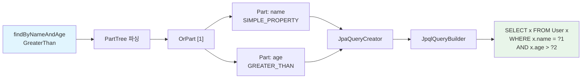
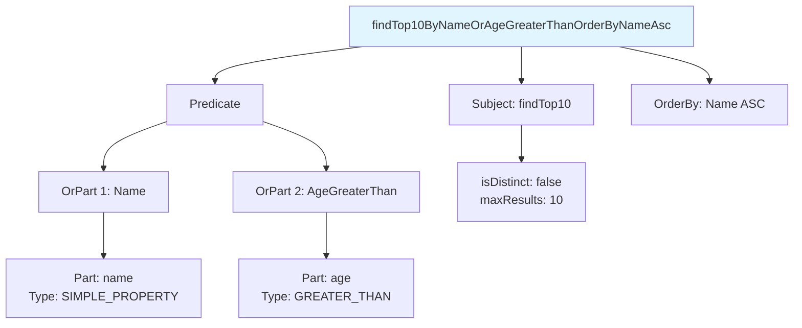

# PartTree 쿼리 생성: 메서드명에서 JPQL까지

`findByNameAndAgeGreaterThan` 같은 메서드명이 어떻게 JPQL 쿼리로 변환되는지, `PartTree` 파싱부터 `JpaQueryCreator`의 JPQL 렌더링까지 전 과정을 분석한다. Spring Data가 지원하는 30개 이상의 키워드 매핑 테이블도 함께 정리한다.

## 목차

1. [핵심 개념 (What)](#1-핵심-개념-what)
2. [왜 알아야 하는가 (Why)](#2-왜-알아야-하는가-why)
3. [내부 구현 분석 (How)](#3-내부-구현-분석-how)
4. [실전 예제](#4-실전-예제)
5. [정리](#5-정리)

---

## 1. 핵심 개념 (What)

### PartTree란?

`PartTree`는 Spring Data의 메서드명 파싱 엔진이다. Repository 메서드 이름을 구조화된 트리로 분해하고, 각 부분(Part)을 키워드와 프로퍼티로 매핑한다.

```
findByNameAndAgeGreaterThan
  |     |   |   |         |
  |     |   And |         +-- Type: GREATER_THAN
  |     |       +------------ Property: age
  |     +-------------------- Property: name (Type: SIMPLE_PROPERTY)
  +-------------------------- Subject: find...By
```

### 핵심 구성요소

| 구성요소 | 역할 |
|---------|------|
| `PartTree` | 메서드명을 Subject와 Predicate로 분리, OrPart 트리 구성 |
| `Part` | 개별 조건절 (프로퍼티 + 키워드 타입) |
| `Part.Type` | 30개 이상의 키워드 타입 정의 (BETWEEN, LIKE, IS_NULL 등) |
| `PartTreeJpaQuery` | PartTree 기반의 JPA Query 구현체 |
| `JpaQueryCreator` | PartTree를 순회하며 JPQL 문자열을 생성하는 크리에이터 |
| `JpqlQueryBuilder` | JPQL 문법에 맞는 쿼리 문자열을 조립하는 빌더 |

## 2. 왜 알아야 하는가 (Why)

1. **메서드명 설계**: 지원되는 키워드와 조합 규칙을 알아야 올바른 메서드명을 작성할 수 있다.
2. **에러 디버깅**: "No property 'greaterThan' found for type 'User'" 같은 에러는 PartTree 파싱 과정을 이해하면 원인을 빠르게 파악할 수 있다.
3. **성능 판단**: 메서드명으로 생성된 JPQL이 기대한 쿼리와 다를 수 있다. 복잡한 쿼리는 `@Query`로 전환해야 하는 기준을 알 수 있다.
4. **한계 인식**: PartTree는 서브쿼리, GROUP BY, HAVING 등을 지원하지 않는다. 이 한계를 알아야 적절한 전략을 선택할 수 있다.

## 3. 내부 구현 분석 (How)

### 3.1 전체 변환 파이프라인



### 3.2 PartTree 파싱 구조

`PartTree`는 메서드명을 다음과 같은 구조로 분해한다:

```
메서드명 = Subject + "By" + Predicate
Predicate = OrPart ("Or" OrPart)*
OrPart = Part ("And" Part)*
Part = Property + Type
```



### 3.3 PartTreeJpaQuery: PartTree와 JPA의 연결

`PartTreeJpaQuery`는 `AbstractJpaQuery`를 상속하며, 메서드명 파싱 결과를 JPA 쿼리로 변환한다.

```java
// PartTreeJpaQuery.java (핵심 생성자)
public class PartTreeJpaQuery extends AbstractJpaQuery {

    private final PartTree tree;
    private final JpaParameters parameters;
    private final QueryPreparer queryPreparer;
    private final QueryPreparer countQuery;

    PartTreeJpaQuery(JpaQueryMethod method, EntityManager em,
                     EscapeCharacter escape) {
        super(method, em);

        this.em = em;
        this.escape = escape;
        this.parameters = method.getParameters();

        Class<?> domainClass = method.getEntityInformation().getJavaType();

        // 핵심: 메서드명을 PartTree로 파싱
        this.tree = new PartTree(method.getName(), domainClass);
        validate(tree, parameters);

        // 쿼리 준비자 생성
        this.countQuery = new CountQueryPreparer();
        this.queryPreparer = tree.isCountProjection()
            ? countQuery : new QueryPreparer();
    }
}
```

### 3.4 QueryPreparer: JPQL 생성

`QueryPreparer`는 매 호출 시 `JpaQueryCreator`를 사용하여 JPQL 문자열을 생성한다:

```java
// PartTreeJpaQuery.java (내부 클래스)
private class QueryPreparer {

    public Query createQuery(JpaParametersParameterAccessor accessor) {
        Sort sort = getDynamicSort(accessor);
        JpqlQueryCreator creator = createCreator(sort, accessor);

        // JPQL 문자열 생성
        String jpql = creator.createQuery(sort);

        // EntityManager로 Query 생성
        Query query = creator.useTupleQuery()
            ? em.createQuery(jpql, Tuple.class)
            : em.createQuery(jpql);

        // 파라미터 바인딩
        ParameterBinder binder = creator.getBinder();
        return restrictMaxResultsIfNecessary(
            binder.bindAndPrepare(query, accessor), scrollPosition);
    }

    protected JpqlQueryCreator createCreator(Sort sort,
            JpaParametersParameterAccessor accessor) {

        ParameterMetadataProvider provider =
            new ParameterMetadataProvider(accessor, escape, templates,
                persistenceProvider);
        ReturnedType returnedType = getQueryMethod()
            .getResultProcessor()
            .withDynamicProjection(accessor)
            .getReturnedType();

        return new JpaQueryCreator(tree, false, returnedType, provider,
            templates, entityInformation.get(), em.getMetamodel());
    }
}
```

### 3.5 JpaQueryCreator: PartTree에서 JPQL로

`JpaQueryCreator`는 `AbstractQueryCreator<String, JpqlQueryBuilder.Predicate>`를 상속하여 PartTree를 순회하면서 JPQL 조각을 조립한다.

```java
// JpaQueryCreator.java (핵심 메서드)
public class JpaQueryCreator
        extends AbstractQueryCreator<String, JpqlQueryBuilder.Predicate>
        implements JpqlQueryCreator {

    @Override
    protected JpqlQueryBuilder.Predicate create(Part part,
            Iterator<Object> iterator) {
        return toPredicate(part);  // 첫 번째 Part
    }

    @Override
    protected JpqlQueryBuilder.Predicate and(Part part,
            JpqlQueryBuilder.Predicate base, Iterator<Object> iterator) {
        return base.and(toPredicate(part));  // AND 조합
    }

    @Override
    protected JpqlQueryBuilder.Predicate or(
            JpqlQueryBuilder.Predicate base,
            JpqlQueryBuilder.Predicate predicate) {
        return base.or(predicate);  // OR 조합
    }

    @Override
    protected final String complete(
            JpqlQueryBuilder.Predicate predicate, Sort sort) {
        JpqlQueryBuilder.AbstractJpqlQuery query =
            createQuery(predicate, sort);
        return query.render();  // 최종 JPQL 문자열 렌더링
    }
}
```

### 3.6 Part.Type별 Predicate 변환

`PredicateBuilder`에서 `Part.Type`에 따라 JPQL 조건절이 생성된다:

```java
// JpaQueryCreator.java (PredicateBuilder 내부)
public JpqlQueryBuilder.Predicate build() {
    PropertyPath property = part.getProperty();
    Type type = part.getType();

    JpqlQueryBuilder.WhereStep where = JpqlQueryBuilder.where(path);

    switch (type) {
        case BETWEEN:
            return where.between(
                placeholder(provider.next(part)),
                placeholder(provider.next(part)));
        case GREATER_THAN:
        case AFTER:
            return where.gt(placeholder(provider.next(part)));
        case GREATER_THAN_EQUAL:
            return where.gte(placeholder(provider.next(part)));
        case LESS_THAN:
        case BEFORE:
            return where.lt(placeholder(provider.next(part)));
        case LESS_THAN_EQUAL:
            return where.lte(placeholder(provider.next(part)));
        case IS_NULL:
            return where.isNull();
        case IS_NOT_NULL:
            return where.isNotNull();
        case IN:
            return where.in(placeholder(provider.next(part, Collection.class)));
        case NOT_IN:
            return where.notIn(placeholder(provider.next(part, Collection.class)));
        case LIKE:
        case CONTAINING:
        case STARTING_WITH:
        case ENDING_WITH:
            return where.like(parameterExpression, escapeChar);
        case NOT_LIKE:
        case NOT_CONTAINING:
            return where.notLike(parameterExpression, escapeChar);
        case TRUE:
            return where.isTrue();
        case FALSE:
            return where.isFalse();
        case SIMPLE_PROPERTY:
            return where.eq(expression);
        case NEGATING_SIMPLE_PROPERTY:
            return where.neq(expression);
        case IS_EMPTY:
            return where.isEmpty();
        case IS_NOT_EMPTY:
            return where.isNotEmpty();
        // ... 기타 타입
    }
}
```

### 3.7 Part.Type 전체 키워드 매핑 테이블

| Part.Type | 메서드명 키워드 | JPQL 변환 | 파라미터 수 |
|-----------|---------------|----------|-----------|
| `BETWEEN` | `Between` | `x.age BETWEEN ?1 AND ?2` | 2 |
| `IS_NOT_NULL` | `IsNotNull`, `NotNull` | `x.name IS NOT NULL` | 0 |
| `IS_NULL` | `IsNull`, `Null` | `x.name IS NULL` | 0 |
| `LESS_THAN` | `LessThan`, `IsBefore`, `Before` | `x.age < ?1` | 1 |
| `LESS_THAN_EQUAL` | `LessThanEqual` | `x.age <= ?1` | 1 |
| `GREATER_THAN` | `GreaterThan`, `IsAfter`, `After` | `x.age > ?1` | 1 |
| `GREATER_THAN_EQUAL` | `GreaterThanEqual` | `x.age >= ?1` | 1 |
| `BEFORE` | `Before`, `IsBefore` | `x.date < ?1` | 1 |
| `AFTER` | `After`, `IsAfter` | `x.date > ?1` | 1 |
| `NOT_LIKE` | `NotLike`, `IsNotLike` | `x.name NOT LIKE ?1` | 1 |
| `LIKE` | `Like`, `IsLike` | `x.name LIKE ?1` | 1 |
| `STARTING_WITH` | `StartingWith`, `IsStartingWith`, `StartsWith` | `x.name LIKE ?1` (prefix%) | 1 |
| `ENDING_WITH` | `EndingWith`, `IsEndingWith`, `EndsWith` | `x.name LIKE ?1` (%suffix) | 1 |
| `CONTAINING` | `Containing`, `IsContaining`, `Contains` | `x.name LIKE ?1` (%keyword%) | 1 |
| `NOT_CONTAINING` | `NotContaining`, `IsNotContaining` | `x.name NOT LIKE ?1` | 1 |
| `IN` | `In`, `IsIn` | `x.status IN (?1)` | 1 (Collection) |
| `NOT_IN` | `NotIn`, `IsNotIn` | `x.status NOT IN (?1)` | 1 (Collection) |
| `NEAR` | `Near`, `IsNear` | Vector distance function | 1-2 |
| `WITHIN` | `Within`, `IsWithin` | Vector distance function | 1-2 |
| `TRUE` | `True`, `IsTrue` | `x.active = TRUE` | 0 |
| `FALSE` | `False`, `IsFalse` | `x.active = FALSE` | 0 |
| `NEGATING_SIMPLE_PROPERTY` | `Not`, `IsNot` | `x.name <> ?1` | 1 |
| `SIMPLE_PROPERTY` | `Is`, `Equals` (또는 키워드 없음) | `x.name = ?1` | 1 |
| `IS_EMPTY` | `IsEmpty`, `Empty` | `x.items IS EMPTY` | 0 (Collection 프로퍼티) |
| `IS_NOT_EMPTY` | `IsNotEmpty`, `NotEmpty` | `x.items IS NOT EMPTY` | 0 (Collection 프로퍼티) |

### 3.8 Subject 키워드

메서드명의 Subject 부분에서 사용할 수 있는 키워드:

| Subject 키워드 | 동작 |
|--------------|------|
| `findBy`, `readBy`, `getBy`, `queryBy`, `searchBy`, `streamBy` | 엔티티 조회 |
| `countBy` | COUNT 프로젝션 |
| `existsBy` | EXISTS 프로젝션 |
| `deleteBy`, `removeBy` | 삭제 쿼리 |
| `findDistinctBy` | DISTINCT 조회 |
| `findFirst`, `findTop` | `LIMIT 1` |
| `findFirst10By`, `findTop5By` | `LIMIT N` |

### 3.9 IgnoreCase 처리

```java
// JpaQueryCreator.java (PredicateBuilder 내부)
private JpqlQueryBuilder.Expression potentiallyIgnoreCase(
        PropertyPath path, JpqlQueryBuilder.Expression expression) {

    switch (part.shouldIgnoreCase()) {
        case ALWAYS:
            Assert.isTrue(canUpperCase(path),
                "Unable to ignore case of non-String types");
            return JpqlQueryBuilder.function(
                templates.getIgnoreCaseOperator(), expression);
        case WHEN_POSSIBLE:
            if (canUpperCase(path)) {
                return JpqlQueryBuilder.function(
                    templates.getIgnoreCaseOperator(), expression);
            }
        case NEVER:
        default:
            return expression;
    }
}
```

`findByNameIgnoreCase` -> `UPPER(x.name) = UPPER(?1)`로 변환된다.

### 3.10 파라미터 바인딩 및 Null 처리

`SIMPLE_PROPERTY` 타입에서 파라미터가 `null`일 때 특별한 처리가 있다:

```java
case SIMPLE_PROPERTY:
case NEGATING_SIMPLE_PROPERTY:
    PartTreeParameterBinding simple = provider.next(part);

    // null이 전달되면 IS NULL로 변환
    if (simple.isIsNullParameter()) {
        return type.equals(SIMPLE_PROPERTY)
            ? where.isNull()
            : where.isNotNull();
    }

    return type.equals(SIMPLE_PROPERTY)
        ? whereIgnoreCase.eq(expression)
        : whereIgnoreCase.neq(expression);
```

즉 `findByName(null)` 호출 시 `WHERE x.name IS NULL`로 자동 변환된다.

## 4. 실전 예제

### 4.1 다양한 쿼리 메서드와 생성되는 JPQL

```java
public interface ProductRepository extends JpaRepository<Product, Long> {

    // SELECT x FROM Product x WHERE x.name = ?1 AND x.price > ?2
    List<Product> findByNameAndPriceGreaterThan(String name, BigDecimal price);

    // SELECT x FROM Product x
    //   WHERE x.category IN (?1) AND x.name LIKE ?2 ESCAPE '\'
    List<Product> findByCategoryInAndNameContaining(
        List<Category> categories, String name);

    // SELECT x FROM Product x
    //   WHERE x.createdAt BETWEEN ?1 AND ?2
    //   ORDER BY x.price DESC
    List<Product> findByCreatedAtBetweenOrderByPriceDesc(
        LocalDateTime start, LocalDateTime end);

    // SELECT DISTINCT x FROM Product x
    //   WHERE UPPER(x.name) = UPPER(?1)
    List<Product> findDistinctByNameIgnoreCase(String name);

    // SELECT x FROM Product x WHERE x.active = TRUE AND x.stock IS NOT NULL
    List<Product> findByActiveTrueAndStockIsNotNull();

    // SELECT x FROM Product x WHERE x.tags IS NOT EMPTY
    List<Product> findByTagsIsNotEmpty();

    // DELETE FROM Product x WHERE x.active = FALSE
    @Transactional
    long deleteByActiveFalse();

    // SELECT count(x) FROM Product x WHERE x.category = ?1
    long countByCategory(Category category);

    // SELECT x.id FROM Product x WHERE x.name = ?1 (EXISTS)
    boolean existsByName(String name);

    // SELECT x FROM Product x WHERE x.name = ?1
    // .setMaxResults(1)
    Optional<Product> findFirstByName(String name);

    // SELECT x FROM Product x WHERE x.price < ?1
    // .setMaxResults(10)
    List<Product> findTop10ByPriceLessThan(BigDecimal maxPrice);
}
```

### 4.2 실행 시 생성된 JPQL 확인

```yaml
# application.yml - 쿼리 로그 활성화
logging:
  level:
    org.springframework.data.jpa.repository.query.PartTreeJpaQuery: DEBUG
```

DEBUG 로그에서 다음과 같이 생성된 JPQL을 확인할 수 있다:

```
DEBUG PartTreeJpaQuery$QueryPreparer: Derived query for query method [findByNameAndPriceGreaterThan]:
  'SELECT x FROM Product x WHERE x.name = ?1 AND x.price > ?2'
```

### 4.3 PartTree의 한계와 @Query 전환 기준

```java
public interface OrderRepository extends JpaRepository<Order, Long> {

    // PartTree로 가능
    List<Order> findByStatusAndTotalAmountGreaterThanEqual(
        OrderStatus status, BigDecimal minAmount);

    // PartTree로 불가능 -> @Query 필요
    // 서브쿼리
    @Query("SELECT o FROM Order o WHERE o.totalAmount > " +
           "(SELECT AVG(o2.totalAmount) FROM Order o2)")
    List<Order> findAboveAverage();

    // GROUP BY + HAVING
    @Query("SELECT o.customer, SUM(o.totalAmount) FROM Order o " +
           "GROUP BY o.customer HAVING SUM(o.totalAmount) > :threshold")
    List<Object[]> findBigSpenders(@Param("threshold") BigDecimal threshold);

    // JOIN이 필요한 복잡한 쿼리
    @Query("SELECT DISTINCT o FROM Order o JOIN o.items i " +
           "WHERE i.product.category = :category")
    List<Order> findByItemCategory(@Param("category") Category category);
}
```

**@Query 전환이 필요한 경우:**
- 서브쿼리 (IN subquery, EXISTS subquery)
- GROUP BY / HAVING
- 명시적 JOIN (JOIN FETCH 포함)
- CASE WHEN 표현식
- 집계 함수 (SUM, AVG, MAX, MIN)를 WHERE에 사용
- 3개 이상의 OR 조건이 중첩되는 경우 (가독성)

## 5. 정리

| 항목 | 설명 |
|-----|------|
| 파싱 엔진 | `PartTree` - 메서드명을 Subject + Predicate(OrPart -> Part)로 분해 |
| JPA 변환 | `PartTreeJpaQuery` -> `JpaQueryCreator` -> `JpqlQueryBuilder` -> JPQL 문자열 |
| 키워드 종류 | `Part.Type`에 25개 이상의 키워드 타입 정의 |
| Subject 키워드 | find/read/get/query/search/stream/count/exists/delete + By |
| 수량 제한 | `findFirst`, `findTop`, `findTop10` -> `query.setMaxResults(N)` |
| IgnoreCase | `UPPER(x.prop) = UPPER(?1)` 변환 |
| Null 처리 | `SIMPLE_PROPERTY`에 null 전달 시 `IS NULL`로 자동 변환 |
| 캐싱 | `CacheableJpqlQueryCreator`로 동일 Sort 패턴의 JPQL 문자열 캐싱 |
| 한계 | 서브쿼리, GROUP BY, HAVING, 명시적 JOIN 불가 -> `@Query` 사용 |

---
*참고: Spring Data JPA 3.x / Hibernate 6.x 기준*
