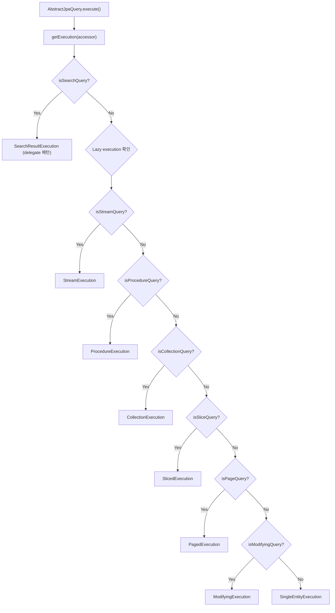

# Query Execution Pipeline: 반환 타입이 실행 전략을 결정한다

Spring Data JPA의 쿼리 메서드는 반환 타입에 따라 서로 다른 실행 전략(Execution Strategy)을 선택한다. `JpaQueryExecution`의 내부 클래스들이 이 전략을 구현하며, `AbstractJpaQuery`가 반환 타입을 분석하여 적절한 전략을 매핑한다.

## 목차

1. [핵심 개념 (What)](#1-핵심-개념-what)
2. [왜 알아야 하는가 (Why)](#2-왜-알아야-하는가-why)
3. [내부 구현 분석 (How)](#3-내부-구현-분석-how)
4. [실전 예제](#4-실전-예제)
5. [정리](#5-정리)

---

## 1. 핵심 개념 (What)

Spring Data JPA에서 Repository 인터페이스에 선언한 메서드의 **반환 타입**은 단순히 결과를 담는 그릇이 아니다. 반환 타입이 곧 **쿼리 실행 방식**을 결정하는 핵심 입력값이다.

`JpaQueryExecution`은 추상 클래스로, 각 실행 전략을 내부 static class로 정의한다:

| 실행 전략 클래스 | 역할 |
|---|---|
| `CollectionExecution` | `List`, `Collection` 등 컬렉션 반환 |
| `SingleEntityExecution` | 단일 엔티티 또는 `Optional` 반환 |
| `StreamExecution` | `Stream<T>` 반환 (트랜잭션 필수) |
| `PagedExecution` | `Page<T>` 반환 (count 쿼리 포함) |
| `SlicedExecution` | `Slice<T>` 반환 (N+1 방식) |
| `ModifyingExecution` | `@Modifying` 쿼리 (UPDATE/DELETE) |
| `ProcedureExecution` | `@Procedure` 저장 프로시저 호출 |
| `DeleteExecution` | `deleteBy...` 파생 삭제 쿼리 |
| `ExistsExecution` | `existsBy...` 존재 여부 확인 |
| `ScrollExecution` | `Window<T>` 스크롤 기반 페이지네이션 |
| `SearchResultExecution` | 벡터 검색 결과 (`SearchResults`) |

## 2. 왜 알아야 하는가 (Why)

### 성능 차이를 이해해야 한다

- `Page<T>`를 반환하면 **항상 count 쿼리가 추가 실행**된다. 대용량 테이블에서 count 쿼리는 심각한 병목이 된다.
- `Slice<T>`를 반환하면 count 쿼리 없이 `pageSize + 1`개만 조회하여 다음 페이지 존재 여부를 판단한다.
- `Stream<T>`를 반환하면 커서 기반으로 데이터를 가져오지만, **반드시 트랜잭션 내에서 소비**해야 한다.

### 잘못된 반환 타입 선택의 결과

```java
// 안티패턴: 전체 count가 필요 없는데 Page를 사용
Page<Order> findByStatus(OrderStatus status, Pageable pageable);

// 개선: 무한 스크롤 UI에는 Slice가 적합
Slice<Order> findByStatus(OrderStatus status, Pageable pageable);
```

## 3. 내부 구현 분석 (How)

### 3.1 실행 전략 선택 흐름

`AbstractJpaQuery` 생성자에서 `Lazy<JpaQueryExecution>`을 초기화하며, 반환 타입을 기반으로 전략을 결정한다.

```java
// AbstractJpaQuery.java (line 98-115)
this.execution = Lazy.of(() -> {
    if (method.isStreamQuery()) {
        return new StreamExecution();
    } else if (method.isProcedureQuery()) {
        return new ProcedureExecution(method.isCollectionQuery());
    } else if (method.isCollectionQuery() || method.isSearchQuery()) {
        return new CollectionExecution();
    } else if (method.isSliceQuery()) {
        return new SlicedExecution();
    } else if (method.isPageQuery()) {
        return new PagedExecution(this.provider);
    } else if (method.isModifyingQuery()) {
        return null; // ModifyingExecution은 getExecution()에서 지연 생성
    } else {
        return new SingleEntityExecution();
    }
});
```



### 3.2 execute() 메서드의 흐름

```java
// AbstractJpaQuery.java (line 151-155)
@Override
public @Nullable Object execute(Object[] parameters) {
    JpaParametersParameterAccessor accessor = obtainParameterAccessor(parameters);
    return doExecute(getExecution(accessor), accessor);
}
```

`doExecute()`는 실행 전략의 `execute()`를 호출한 뒤, `ResultProcessor`로 결과를 후처리한다:

```java
// AbstractJpaQuery.java (line 162-169)
private @Nullable Object doExecute(JpaQueryExecution execution,
                                    JpaParametersParameterAccessor accessor) {
    Object result = execution.execute(this, accessor);
    ResultProcessor withDynamicProjection =
        method.getResultProcessor().withDynamicProjection(accessor);
    return withDynamicProjection.processResult(result,
        new LazyTupleConverter(withDynamicProjection.getReturnedType(),
                               method.isNativeQuery()));
}
```

### 3.3 주요 실행 전략 상세

#### CollectionExecution - 가장 단순한 전략

```java
// JpaQueryExecution.java (line 128-134)
static class CollectionExecution extends JpaQueryExecution {
    @Override
    protected Object doExecute(AbstractJpaQuery query,
                                JpaParametersParameterAccessor accessor) {
        return query.createQuery(accessor).getResultList();
    }
}
```

JPA `Query.getResultList()`를 그대로 호출한다. `List<T>`, `Collection<T>`, `Set<T>` 등 모든 컬렉션 타입에 사용된다.

#### SlicedExecution - count 없는 페이지네이션

```java
// JpaQueryExecution.java (line 244-267)
static class SlicedExecution extends JpaQueryExecution {
    @Override
    protected Object doExecute(AbstractJpaQuery query,
                                JpaParametersParameterAccessor accessor) {
        Pageable pageable = accessor.getPageable();
        Query createQuery = query.createQuery(accessor);

        int pageSize = 0;
        if (pageable.isPaged()) {
            pageSize = pageable.getPageSize();
            createQuery.setMaxResults(pageSize + 1); // N+1 트릭
        }

        List<Object> resultList = createQuery.getResultList();
        boolean hasNext = pageable.isPaged()
                          && resultList.size() > pageSize;

        return new SliceImpl<>(
            hasNext ? resultList.subList(0, pageSize) : resultList,
            pageable, hasNext);
    }
}
```

핵심: `pageSize + 1`개를 요청하여, 결과가 `pageSize`보다 많으면 다음 페이지가 존재한다고 판단한다. count 쿼리가 전혀 없다.

#### PagedExecution - count 쿼리 포함

```java
// JpaQueryExecution.java (line 273-318)
static class PagedExecution extends JpaQueryExecution {
    private final PersistenceProvider provider;

    @Override
    protected Object doExecute(AbstractJpaQuery repositoryQuery,
                                JpaParametersParameterAccessor accessor) {
        Query query = repositoryQuery.createQuery(accessor);
        return PageableExecutionUtils.getPage(
            query.getResultList(),
            accessor.getPageable(),
            () -> count(query, repositoryQuery, accessor));
    }

    private long count(Query resultQuery, AbstractJpaQuery repositoryQuery,
                        JpaParametersParameterAccessor accessor) {
        if (repositoryQuery.hasDeclaredCountQuery()) {
            return doCount(repositoryQuery, accessor);
        }
        return provider.getResultCount(resultQuery,
            () -> doCount(repositoryQuery, accessor));
    }
}
```

`PageableExecutionUtils.getPage()`는 lazy count를 사용한다 - 결과가 첫 페이지에 모두 담기면 count 쿼리를 생략할 수 있다.

#### StreamExecution - 트랜잭션 필수

```java
// JpaQueryExecution.java (line 502-528)
static class StreamExecution extends JpaQueryExecution {
    @Override
    protected @Nullable Object doExecute(AbstractJpaQuery query,
                                          JpaParametersParameterAccessor accessor) {
        if (!SurroundingTransactionDetectorMethodInterceptor
                .INSTANCE.isSurroundingTransactionActive()) {
            throw new InvalidDataAccessApiUsageException(
                NO_SURROUNDING_TRANSACTION);
        }
        Query jpaQuery = query.createQuery(accessor);
        if (streamMethod != null) {
            return ReflectionUtils.invokeMethod(streamMethod, jpaQuery);
        }
        // fallback...
    }
}
```

`Stream`을 반환할 때는 트랜잭션이 활성 상태여야 한다. 트랜잭션 없이 Stream을 소비하면 Connection이 이미 닫혀 있어 데이터를 읽을 수 없다.

#### ModifyingExecution - flush/clear 제어

```java
// JpaQueryExecution.java (line 335-381)
static class ModifyingExecution extends JpaQueryExecution {
    private final EntityManager em;
    private final boolean flush;
    private final boolean clear;

    @Override
    protected Object doExecute(AbstractJpaQuery query,
                                JpaParametersParameterAccessor accessor) {
        if (flush) { em.flush(); }
        int result = query.createQuery(accessor).executeUpdate();
        if (clear) { em.clear(); }
        return result;
    }
}
```

`@Modifying(flushAutomatically = true, clearAutomatically = true)` 옵션이 여기서 적용된다. `flush()`는 쿼리 전에, `clear()`는 쿼리 후에 실행된다.

#### ExistsExecution - 결과 존재 여부

```java
// JpaQueryExecution.java (line 436-442)
static class ExistsExecution extends JpaQueryExecution {
    @Override
    protected Object doExecute(AbstractJpaQuery query,
                                JpaParametersParameterAccessor accessor) {
        return !query.createQuery(accessor).getResultList().isEmpty();
    }
}
```

결과 리스트가 비어 있는지 확인하여 `boolean`을 반환한다.

### 3.4 공통 실행 흐름: JpaQueryExecution.execute()

모든 전략은 기본 클래스의 `execute()` 메서드를 통해 호출된다:

```java
// JpaQueryExecution.java (line 94-115)
public @Nullable Object execute(AbstractJpaQuery query,
                                 JpaParametersParameterAccessor accessor) {
    Object result = doExecute(query, accessor);
    if (result == null) { return null; }

    JpaQueryMethod queryMethod = query.getQueryMethod();
    Class<?> requiredType = queryMethod.getReturnType();

    if (ClassUtils.isAssignable(requiredType, void.class)
        || ClassUtils.isAssignableValue(requiredType, result)) {
        return result;
    }

    return CONVERSION_SERVICE.canConvert(result.getClass(), requiredType)
        ? CONVERSION_SERVICE.convert(result, requiredType)
        : result;
}
```

`doExecute()`의 결과를 `ConversionService`로 자동 변환한다. 예를 들어 `Blob` -> `byte[]` 변환이 여기서 처리된다.

## 4. 실전 예제

### 4.1 상황별 최적 반환 타입 선택

```java
public interface OrderRepository extends JpaRepository<Order, Long> {

    // 전체 목록 조회: CollectionExecution
    List<Order> findByCustomerId(Long customerId);

    // 무한 스크롤: SlicedExecution (count 쿼리 없음)
    Slice<Order> findByStatus(OrderStatus status, Pageable pageable);

    // 관리자 페이지: PagedExecution (총 건수 필요)
    Page<Order> findByCreatedAtBetween(LocalDateTime from,
                                       LocalDateTime to,
                                       Pageable pageable);

    // 대용량 배치 처리: StreamExecution
    @QueryHints(@QueryHint(name = HINT_FETCH_SIZE, value = "50"))
    Stream<Order> findByStatusAndCreatedAtBefore(OrderStatus status,
                                                  LocalDateTime before);

    // 벌크 업데이트: ModifyingExecution
    @Modifying(clearAutomatically = true)
    @Query("UPDATE Order o SET o.status = :status WHERE o.id IN :ids")
    int updateStatusByIds(@Param("ids") List<Long> ids,
                          @Param("status") OrderStatus status);

    // 존재 여부: ExistsExecution
    boolean existsByCustomerIdAndStatus(Long customerId, OrderStatus status);
}
```

### 4.2 Stream 사용 시 트랜잭션 주의

```java
@Service
@RequiredArgsConstructor
public class OrderExportService {

    private final OrderRepository orderRepository;

    @Transactional(readOnly = true) // 반드시 트랜잭션 내에서
    public void exportOldOrders(LocalDateTime cutoff, Writer writer) {
        try (Stream<Order> orders = orderRepository
                .findByStatusAndCreatedAtBefore(OrderStatus.COMPLETED, cutoff)) {
            orders.map(this::toCsvLine)
                  .forEach(line -> writeLine(writer, line));
        } // try-with-resources로 반드시 닫기
    }
}
```

### 4.3 Page vs Slice 성능 비교

```java
@Service
@RequiredArgsConstructor
public class OrderSearchService {

    private final OrderRepository orderRepository;

    // 관리자 화면 - 총 건수 표시 필요
    @Transactional(readOnly = true)
    public Page<OrderDto> searchForAdmin(OrderSearchCriteria criteria,
                                          Pageable pageable) {
        return orderRepository
            .findByCreatedAtBetween(criteria.from(), criteria.to(), pageable)
            .map(OrderDto::from);
    }

    // 모바일 앱 - 무한 스크롤, 총 건수 불필요
    @Transactional(readOnly = true)
    public Slice<OrderDto> searchForMobile(OrderStatus status,
                                            Pageable pageable) {
        return orderRepository
            .findByStatus(status, pageable)
            .map(OrderDto::from);
        // count 쿼리가 실행되지 않아 대용량 테이블에서 훨씬 빠름
    }
}
```

## 5. 정리

| 반환 타입 | 실행 전략 | count 쿼리 | 트랜잭션 필수 | 적합한 상황 |
|---|---|---|---|---|
| `List<T>` | `CollectionExecution` | X | X | 전체 목록 |
| `T`, `Optional<T>` | `SingleEntityExecution` | X | X | 단건 조회 |
| `Stream<T>` | `StreamExecution` | X | **O** | 대용량 배치 |
| `Page<T>` | `PagedExecution` | **O** | X | 관리자 페이지 |
| `Slice<T>` | `SlicedExecution` | X | X | 무한 스크롤 |
| `int`/`void` + `@Modifying` | `ModifyingExecution` | X | X | 벌크 UPDATE/DELETE |
| `@Procedure` | `ProcedureExecution` | X | **O** | 저장 프로시저 |
| `deleteBy...` | `DeleteExecution` | X | X | 파생 삭제 |
| `boolean existsBy...` | `ExistsExecution` | X | X | 존재 여부 |
| `Window<T>` | `ScrollExecution` | X | X | Keyset 페이지네이션 |

> **핵심 원칙**: 반환 타입을 먼저 결정하라. 반환 타입이 곧 실행 전략이고, 실행 전략이 곧 성능 특성이다.

---
*참고: Spring Data JPA 3.x / Hibernate 6.x 기준*
