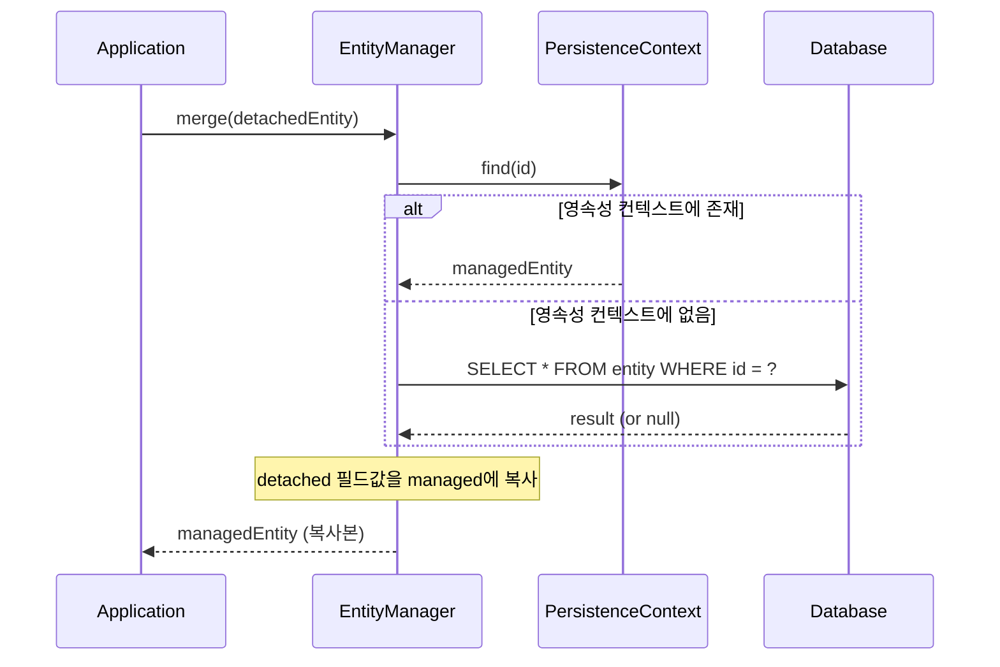

# save() 내부: persist vs merge 결정 트리

`SimpleJpaRepository.save()`는 단 10줄이지만, 그 안에 숨겨진 `isNew()` 판단 로직과 `merge()`의 SELECT 동작은 운영 환경에서 심각한 성능 이슈를 일으킬 수 있다. 특히 UUID를 ID로 사용하는 엔티티에서 이 문제가 빈번하게 발생한다.

## 목차

1. [핵심 개념 (What)](#1-핵심-개념-what)
2. [왜 알아야 하는가 (Why)](#2-왜-알아야-하는가-why)
3. [내부 구현 분석 (How)](#3-내부-구현-분석-how)
4. [실전 예제](#4-실전-예제)
5. [정리](#5-정리)

---

## 1. 핵심 개념 (What)

`save()` 메서드는 엔티티가 새로운(new) 것인지 기존(existing) 것인지에 따라 JPA의 `persist()`와 `merge()` 중 하나를 호출한다.

```java
// SimpleJpaRepository.java (line 658-669)
@Override
@Transactional
public <S extends T> S save(S entity) {
    Assert.notNull(entity, ENTITY_MUST_NOT_BE_NULL);

    if (entityInformation.isNew(entity)) {
        entityManager.persist(entity);
        return entity;
    } else {
        return entityManager.merge(entity);
    }
}
```

두 연산의 차이:

| | `persist()` | `merge()` |
|---|---|---|
| 대상 | 새 엔티티 | 기존(detached) 엔티티 |
| SELECT 발생 | X | **O** (항상) |
| 반환 | void (파라미터 객체가 managed) | **새 managed 복사본** 반환 |
| ID 생성 | persist 시점에 생성 | 이미 존재한다고 가정 |

## 2. 왜 알아야 하는가 (Why)

### merge()의 숨겨진 SELECT

`merge()`는 항상 데이터베이스에서 해당 ID의 엔티티를 먼저 SELECT한다. 이는 JPA 스펙의 동작이다:

1. 영속성 컨텍스트에서 같은 ID의 엔티티를 찾는다
2. 없으면 **데이터베이스에서 SELECT**한다
3. SELECT 결과에 전달받은 엔티티의 필드값을 복사한다
4. 복사된 managed 엔티티를 반환한다

### UUID ID 엔티티의 함정

```java
@Entity
public class Article {
    @Id
    private UUID id = UUID.randomUUID(); // 생성 시점에 ID가 이미 존재
    private String title;
}
```

이 엔티티를 `save()`하면:
1. `isNew()` 호출 -> ID(`uuid`)가 null이 아님 -> **false 반환**
2. `merge()` 호출 -> DB에서 SELECT 실행 -> 결과 없음 -> INSERT 실행

**새 엔티티인데도 불필요한 SELECT가 매번 실행된다.**

대량 INSERT 시 이 문제는 치명적이다. 1,000건 INSERT에 1,000번의 불필요한 SELECT가 추가된다.

## 3. 내부 구현 분석 (How)

### 3.1 isNew() 판단 흐름

`isNew()` 판단은 `JpaEntityInformation` 계층 구조를 따라 3단계로 이루어진다.

```mermaid
flowchart TD
    A["save(entity)"] --> B["entityInformation.isNew(entity)"]
    B --> C{Persistable 구현?}
    C -->|Yes| D["entity.isNew() 직접 호출<br/>JpaPersistableEntityInformation"]
    C -->|No| E{@Version 필드 존재?<br/>+ non-primitive?}
    E -->|Yes| F{"version == null?<br/>JpaMetamodelEntityInformation"}
    E -->|No| G{"ID == null?<br/>AbstractEntityInformation"}
    F -->|null| H["true (새 엔티티)"]
    F -->|not null| I["false (기존 엔티티)"]
    G -->|null| H
    G -->|not null| J{"primitive ID?<br/>(long, int 등)"}
    J -->|Yes| K{"value == 0?"}
    J -->|No| I
    K -->|Yes| H
    K -->|No| I
    H --> L["persist()"]
    I --> M["merge()"]
```

### 3.2 JpaMetamodelEntityInformation.isNew()

```java
// JpaMetamodelEntityInformation.java (line 249-259)
@Override
public boolean isNew(T entity) {
    // 1단계: @Version 필드가 없거나 primitive 타입이면 -> 부모 위임 (ID 기반)
    if (versionAttribute.isEmpty()
            || versionAttribute.map(Attribute::getJavaType)
                               .map(Class::isPrimitive).orElse(false)) {
        return super.isNew(entity); // AbstractEntityInformation.isNew()
    }
    // 2단계: @Version 필드가 존재하고 wrapper 타입이면 -> version null 체크
    BeanWrapper wrapper = new DirectFieldAccessFallbackBeanWrapper(entity);
    return versionAttribute
        .map(it -> wrapper.getPropertyValue(it.getName()) == null)
        .orElse(true);
}
```

판단 우선순위:
1. `@Version` 필드가 wrapper 타입(Long, Integer)이면 -> **version이 null인지 확인**
2. `@Version`이 없거나 primitive(long, int)이면 -> **ID가 null(또는 0)인지 확인**
3. 엔티티가 `Persistable`을 구현하면 -> **entity.isNew() 직접 호출** (최우선)

### 3.3 JpaPersistableEntityInformation - Persistable 우선

```java
// JpaPersistableEntityInformation.java (line 62-64)
@Override
public boolean isNew(T entity) {
    return entity.isNew(); // Persistable.isNew()에 완전히 위임
}
```

`Persistable` 인터페이스를 구현하면 `isNew()` 판단을 엔티티가 직접 제어할 수 있다. 이것이 UUID 함정의 해결책이다.

### 3.4 JpaEntityInformationSupport - 팩토리 메서드

`getEntityInformation()`에서 `Persistable` 구현 여부에 따라 적절한 구현체를 선택한다:

```java
// JpaEntityInformationSupport.java (line 86-107)
public static <T> JpaEntityInformation<T, ?> getEntityInformation(
        Class<T> domainClass, Metamodel metamodel,
        PersistenceUnitUtil persistenceUnitUtil) {

    ManagedType<T> type = metamodel.managedType(domainClass);

    if (type instanceof EntityType<T> entityType) {
        if (Persistable.class.isAssignableFrom(domainClass)) {
            return new JpaPersistableEntityInformation(entityType,
                metamodel, persistenceUnitUtil);
        } else {
            return new JpaMetamodelEntityInformation(entityType,
                metamodel, persistenceUnitUtil);
        }
    }
    // ...
}
```

### 3.5 merge()가 SELECT를 하는 이유

JPA 스펙에 따르면 `merge()`는 다음 과정을 거친다:



**새 엔티티에 `merge()`가 호출되면**: DB에서 SELECT -> 결과 없음 -> INSERT를 실행하게 된다. persist()라면 SELECT 없이 바로 INSERT한다.

## 4. 실전 예제

### 4.1 UUID ID의 함정과 Persistable 해결책

```java
// 문제: UUID ID는 생성 시점에 이미 값이 있어 merge()가 호출됨
@Entity
public class Document {
    @Id
    private UUID id = UUID.randomUUID();
    private String content;
    // save() 할 때마다 불필요한 SELECT 발생!
}
```

```java
// 해결: Persistable<UUID> 구현
@Entity
public class Document implements Persistable<UUID> {

    @Id
    private UUID id = UUID.randomUUID();
    private String content;

    @Transient
    private boolean isNew = true;

    @Override
    public UUID getId() {
        return id;
    }

    @Override
    public boolean isNew() {
        return isNew;
    }

    @PostPersist
    @PostLoad
    void markNotNew() {
        this.isNew = false;
    }
}
```

핵심 포인트:
- `@Transient` 필드로 새 엔티티 여부를 직접 관리
- `@PostPersist`: persist 완료 후 `isNew = false`
- `@PostLoad`: DB에서 로드 후 `isNew = false`

### 4.2 @Version 기반의 더 간단한 방법

```java
@Entity
public class Document {

    @Id
    private UUID id = UUID.randomUUID();

    @Version
    private Long version; // wrapper 타입 사용 (Long, not long)

    private String content;
    // version이 null이면 isNew() -> true -> persist() 호출
}
```

`@Version`이 `Long`(wrapper) 타입이면, 새 엔티티의 version은 null이므로 `isNew()`가 `true`를 반환한다. `long`(primitive)이면 기본값 0이라 이 전략이 작동하지 않는다.

### 4.3 대량 INSERT 최적화

```java
@Service
@RequiredArgsConstructor
public class BulkDocumentService {

    private final EntityManager em;

    @Transactional
    public void bulkInsert(List<DocumentCreateRequest> requests) {
        int batchSize = 50;
        for (int i = 0; i < requests.size(); i++) {
            Document doc = requests.get(i).toEntity();
            em.persist(doc); // 직접 persist() 호출 - SELECT 없음

            if (i > 0 && i % batchSize == 0) {
                em.flush();
                em.clear(); // 메모리 관리
            }
        }
    }
}
```

대량 INSERT 시에는 `save()` 대신 `EntityManager.persist()`를 직접 호출하는 것이 안전하다. 새 엔티티임이 확실하면 `isNew()` 판단 과정 자체가 불필요하다.

### 4.4 save() 후 반환값 사용 주의

```java
@Transactional
public Document createDocument(String content) {
    Document doc = new Document();
    doc.setContent(content);

    // persist: 파라미터 객체가 그대로 managed 상태
    // merge: 새 복사본이 반환됨 (파라미터 객체는 여전히 detached)
    Document saved = documentRepository.save(doc);

    // 항상 반환값을 사용해야 안전함
    saved.setTitle("Updated"); // OK
    // doc.setTitle("Updated"); // merge 경우 반영 안 될 수 있음

    return saved;
}
```

## 5. 정리

| 상황 | isNew() 결과 | 실행 메서드 | SELECT 발생 | 해결책 |
|---|---|---|---|---|
| `@GeneratedValue` + ID null | true | `persist()` | X | 기본 동작 (문제 없음) |
| UUID ID (non-null) | **false** | `merge()` | **O** | `Persistable` 구현 |
| `@Version Long` + null | true | `persist()` | X | @Version wrapper 타입 |
| `@Version long` + 0 | **false** | `merge()` | **O** | Long으로 변경 또는 Persistable |
| `Persistable.isNew() = true` | true | `persist()` | X | 최우선 판단 |

> **핵심 원칙**: `save()`는 만능이 아니다. 엔티티의 ID 전략에 따라 `isNew()` 판단이 달라지고, 잘못된 판단은 불필요한 SELECT를 유발한다. UUID ID를 사용한다면 반드시 `Persistable`을 구현하거나 `@Version Long`을 추가하라.

---
*참고: Spring Data JPA 3.x / Hibernate 6.x 기준*
