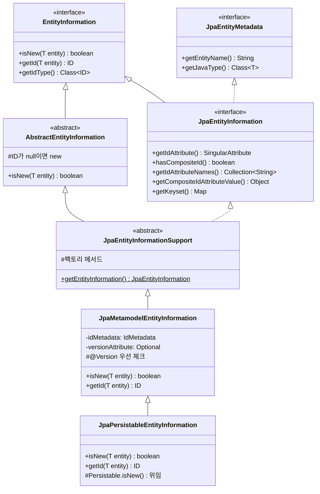
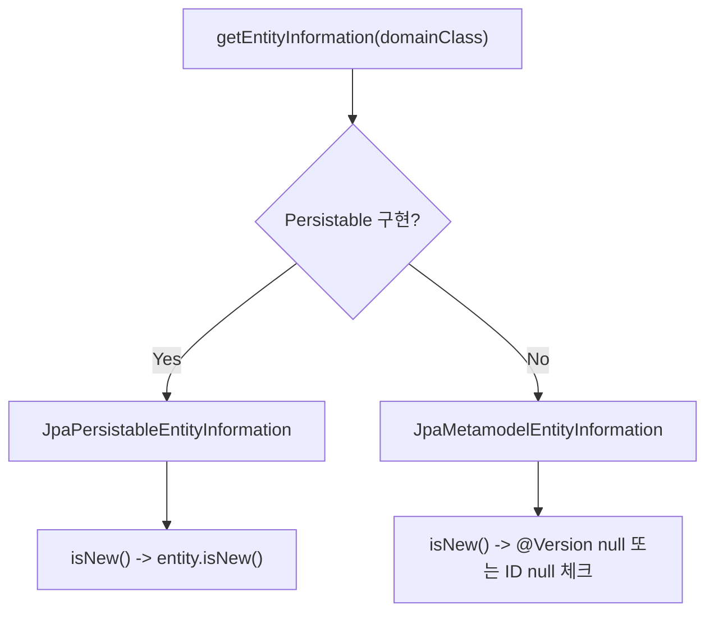

# JpaEntityInformation 계층 구조와 Newness Detection

Spring Data JPA가 엔티티의 "새로운 객체" 여부를 판단하는 메커니즘은 `JpaEntityInformation` 계층 구조에 의해 결정된다. 이 문서는 계층 구조 전체를 분석하고, `isNew()` 판단 로직의 3단계 과정을 소스 코드 수준에서 추적한다.

## 목차

1. [핵심 개념 (What)](#1-핵심-개념-what)
2. [왜 알아야 하는가 (Why)](#2-왜-알아야-하는가-why)
3. [내부 구현 분석 (How)](#3-내부-구현-분석-how)
4. [실전 예제](#4-실전-예제)
5. [정리](#5-정리)

---

## 1. 핵심 개념 (What)

`JpaEntityInformation`은 엔티티에 대한 메타데이터를 제공하는 인터페이스다. Spring Data JPA의 `SimpleJpaRepository`는 이 인터페이스를 통해 다음을 결정한다:

- 엔티티가 **새로운 것인지**(isNew) - `save()` 시 persist vs merge 결정
- 엔티티의 **ID 값** 추출 - `getId()`
- **복합 키** 여부 확인 - `hasCompositeId()`
- 엔티티 이름, ID 속성 이름 등 JPA 메타데이터 접근

### 계층 구조



## 2. 왜 알아야 하는가 (Why)

### isNew() 판단이 중요한 이유

`SimpleJpaRepository.save()`에서 `isNew()`가 `true`면 `persist()`, `false`면 `merge()`를 호출한다. 이 판단이 잘못되면:

- **새 엔티티에 merge()가 호출**: 불필요한 SELECT 발생 (성능 저하)
- **기존 엔티티에 persist()가 호출**: `EntityExistsException` 또는 데이터 중복

### 복합 키 처리의 복잡성

`@IdClass`나 `@EmbeddedId`를 사용하는 복합 키 엔티티는 ID 추출과 newness 판단이 단순 키보다 훨씬 복잡하다. `IdMetadata` 클래스가 이 복잡성을 캡슐화한다.

## 3. 내부 구현 분석 (How)

### 3.1 팩토리 메서드: 어떤 구현체가 선택되는가

`JpaEntityInformationSupport.getEntityInformation()`이 엔티티 클래스를 분석하여 적절한 구현체를 생성한다:

```java
// JpaEntityInformationSupport.java (line 86-107)
public static <T> JpaEntityInformation<T, ?> getEntityInformation(
        Class<T> domainClass, Metamodel metamodel,
        PersistenceUnitUtil persistenceUnitUtil) {

    ManagedType<T> type = metamodel.managedType(domainClass);

    if (type instanceof EntityType<T> entityType) {
        if (Persistable.class.isAssignableFrom(domainClass)) {
            return new JpaPersistableEntityInformation(
                entityType, metamodel, persistenceUnitUtil);
        } else {
            return new JpaMetamodelEntityInformation(
                entityType, metamodel, persistenceUnitUtil);
        }
    }

    if (Persistable.class.isAssignableFrom(domainClass)) {
        return new JpaPersistableEntityInformation(
            domainClass, metamodel, persistenceUnitUtil);
    } else {
        return new JpaMetamodelEntityInformation(
            domainClass, metamodel, persistenceUnitUtil);
    }
}
```



### 3.2 isNew() 3단계 판단 로직

#### 1단계: Persistable 인터페이스 (최우선)

엔티티가 `Persistable`을 구현하면 `JpaPersistableEntityInformation`이 선택되고, `isNew()`를 완전히 엔티티에 위임한다:

```java
// JpaPersistableEntityInformation.java (line 62-64)
@Override
public boolean isNew(T entity) {
    return entity.isNew(); // 엔티티가 직접 결정
}
```

#### 2단계: @Version 필드 (non-primitive wrapper 타입)

`Persistable`이 아니면 `JpaMetamodelEntityInformation.isNew()`가 호출된다:

```java
// JpaMetamodelEntityInformation.java (line 249-259)
@Override
public boolean isNew(T entity) {
    // @Version이 없거나 primitive 타입이면 -> 3단계(ID 기반)로
    if (versionAttribute.isEmpty()
            || versionAttribute.map(Attribute::getJavaType)
                               .map(Class::isPrimitive).orElse(false)) {
        return super.isNew(entity);
    }

    // @Version이 wrapper 타입이면 -> null 체크
    BeanWrapper wrapper =
        new DirectFieldAccessFallbackBeanWrapper(entity);
    return versionAttribute
        .map(it -> wrapper.getPropertyValue(it.getName()) == null)
        .orElse(true);
}
```

`@Version Long version` (wrapper)이면 null 체크. `@Version long version` (primitive)이면 이 단계를 건너뛴다.

#### 3단계: ID null 체크 (기본)

`AbstractEntityInformation.isNew()`는 Spring Data Commons에 정의되어 있으며, ID 값의 null 여부로 판단한다:

```
// AbstractEntityInformation (Spring Data Commons)
public boolean isNew(T entity) {
    ID id = getId(entity);
    Class<ID> idType = getIdType();

    if (!idType.isPrimitive()) {
        return id == null;
    }

    if (id instanceof Number n) {
        return n.longValue() == 0L;
    }

    throw new IllegalArgumentException(
        "Unsupported primitive id type");
}
```

primitive ID(long, int)는 0이면 new, wrapper ID(Long, Integer)는 null이면 new로 판단한다.

### 3.3 @Version 발견 로직

```java
// JpaMetamodelEntityInformation.java (line 137-167)
private static <T> Optional<SingularAttribute<? super T, ?>>
    findVersionAttribute(IdentifiableType<T> type, Metamodel metamodel) {

    try {
        return Optional.ofNullable(type.getVersion(Object.class));
    } catch (IllegalArgumentException o_O) {
        // Hibernate < 4.3 workaround
    }

    // 모든 singular attribute를 순회하며 @Version 탐색
    Set<SingularAttribute<? super T, ?>> attributes =
        type.getSingularAttributes();
    for (SingularAttribute<? super T, ?> attribute : attributes) {
        if (attribute.isVersion()) {
            return Optional.of(attribute);
        }
    }

    // 부모 클래스에서도 탐색
    Class<?> superType = type.getJavaType().getSuperclass();
    if (!JpaMetamodel.of(metamodel).isJpaManaged(superType)) {
        return Optional.empty();
    }
    // 재귀적으로 부모 타입에서 @Version 탐색
    ManagedType<?> managedSuperType = metamodel.managedType(superType);
    if (!(managedSuperType instanceof IdentifiableType)) {
        return Optional.empty();
    }
    return findVersionAttribute(
        (IdentifiableType<T>) managedSuperType, metamodel);
}
```

상속 계층을 재귀적으로 탐색하여 `@Version` 필드를 찾는다.

### 3.4 IdMetadata: 복합 키 메타데이터

`IdMetadata`는 `JpaMetamodelEntityInformation`의 내부 클래스로, ID 관련 메타데이터를 캡슐화한다:

```java
// JpaMetamodelEntityInformation.java (line 302-371)
private static class IdMetadata<T>
        implements Iterable<SingularAttribute<? super T, ?>> {

    private final IdentifiableType<T> type;
    private final Set<SingularAttribute<? super T, ?>> idClassAttributes;
    private final Set<SingularAttribute<? super T, ?>> attributes;
    private @Nullable Class<?> idType;

    IdMetadata(IdentifiableType<T> source,
               PersistenceProvider persistenceProvider) {
        this.type = source;
        this.idClassAttributes =
            persistenceProvider.getIdClassAttributes(source);
        this.attributes = source.hasSingleIdAttribute()
            ? Collections.singleton(
                source.getId(source.getIdType().getJavaType()))
            : source.getIdClassAttributes();
    }

    boolean hasSimpleId() {
        return idClassAttributes.isEmpty() && attributes.size() == 1;
    }

    SingularAttribute<? super T, ?> getSimpleIdAttribute() {
        return attributes.iterator().next();
    }
}
```

- `hasSimpleId()`: 단일 ID인지 복합 ID인지 판별
- `attributes`: 단일 ID면 1개, 복합 ID면 `@IdClass`의 모든 속성
- `getType()`: ID 타입 반환 (단일이면 필드 타입, 복합이면 `@IdClass` 클래스)

### 3.5 복합 키 ID 추출

```java
// JpaMetamodelEntityInformation.java (line 170-210)
@Override
public @Nullable ID getId(T entity) {
    PersistenceProvider persistenceProvider =
        PersistenceProvider.fromMetamodel(metamodel);

    // 프록시 객체면 프록시 메커니즘으로 ID 접근
    if (persistenceProvider.shouldUseAccessorFor(entity)) {
        return (ID) persistenceProvider.getIdentifierFrom(entity);
    }

    // 단순 ID면 PersistenceUnitUtil에 위임
    if (idMetadata.hasSimpleId()) {
        if (entity instanceof Tuple t) {
            return (ID) t.get(idMetadata.getSimpleIdAttribute().getName());
        }
        if (getJavaType().isInstance(entity)) {
            return (ID) persistenceUnitUtil.getIdentifier(entity);
        }
    }

    // 복합 ID: 부분적으로 채워진 필드가 있는지 확인
    BeanWrapper entityWrapper =
        new DirectFieldAccessFallbackBeanWrapper(entity);
    boolean partialIdValueFound = false;

    for (SingularAttribute<? super T, ?> attribute : idMetadata) {
        Object propertyValue =
            entityWrapper.getPropertyValue(attribute.getName());
        if (propertyValue != null) {
            partialIdValueFound = true;
        }
    }

    return partialIdValueFound
        ? (ID) persistenceUnitUtil.getIdentifier(entity)
        : null;
}
```

복합 키에서는 모든 ID 구성 필드를 순회하며, 하나라도 값이 있으면 ID가 존재하는 것으로 판단한다. 모든 필드가 null이면 ID도 null로 반환한다.

### 3.6 전체 isNew() 판단 플로우

```mermaid
flowchart TD
    A["save(entity) 호출"] --> B["entityInformation.isNew(entity)"]

    B --> C{엔티티가 Persistable 구현?}
    C -->|Yes| D["JpaPersistableEntityInformation"]
    D --> E["entity.isNew() 반환"]

    C -->|No| F["JpaMetamodelEntityInformation"]
    F --> G{@Version 필드 존재?}

    G -->|No| H["AbstractEntityInformation.isNew()"]
    G -->|Yes| I{@Version 타입?}

    I -->|primitive<br/>long, int| H
    I -->|wrapper<br/>Long, Integer| J{"version == null?"}

    J -->|null| K["true - 새 엔티티"]
    J -->|not null| L["false - 기존 엔티티"]

    H --> M{ID 타입?}
    M -->|wrapper| N{"id == null?"}
    M -->|primitive| O{"id == 0?"}

    N -->|null| K
    N -->|not null| L
    O -->|0| K
    O -->|not 0| L

    K --> P["persist()"]
    L --> Q["merge()"]
```

## 4. 실전 예제

### 4.1 @IdClass 복합 키 엔티티

```java
// 복합 키 클래스
@EqualsAndHashCode
public class OrderItemId implements Serializable {
    private Long orderId;
    private Long productId;
}

@Entity
@IdClass(OrderItemId.class)
public class OrderItem {

    @Id
    private Long orderId;

    @Id
    private Long productId;

    private int quantity;
    private BigDecimal price;
}
```

이 엔티티의 `isNew()` 판단:
- `hasCompositeId()` = true
- `getId()`는 `orderId`와 `productId`를 모두 순회
- 둘 다 null이면 -> `getId()` = null -> `isNew()` = true
- 하나라도 값이 있으면 -> `getId()` = 복합ID 객체 -> `isNew()` = false

### 4.2 @EmbeddedId 복합 키와 Persistable

```java
@Embeddable
@EqualsAndHashCode
public class SubscriptionId implements Serializable {
    private Long userId;
    private Long planId;
}

@Entity
public class Subscription implements Persistable<SubscriptionId> {

    @EmbeddedId
    private SubscriptionId id;

    private LocalDateTime subscribedAt;

    @Transient
    private boolean isNew = true;

    @Override
    public SubscriptionId getId() {
        return id;
    }

    @Override
    public boolean isNew() {
        return isNew;
    }

    @PostPersist
    @PostLoad
    void markNotNew() {
        this.isNew = false;
    }
}
```

복합 키 + 할당형 ID 조합에서는 `Persistable` 구현이 거의 필수적이다. ID 구성 필드가 모두 non-null 상태로 생성되기 때문에, 기본 isNew() 로직은 항상 false를 반환한다.

### 4.3 @Version을 활용한 간편한 해결

```java
@Entity
public class Article {

    @Id
    private String slug; // 할당형 ID (예: "my-first-post")

    @Version
    private Long version; // Long (wrapper) - null이면 new

    private String title;
    private String content;
}
```

`@Version Long`을 추가하면 별도의 `Persistable` 구현 없이도 올바른 `isNew()` 판단이 가능하다. 다만 **반드시 wrapper 타입**이어야 한다.

### 4.4 getIdAttributeNames() 활용 - 동적 쿼리

```java
@Service
@RequiredArgsConstructor
public class EntityMetadataService {

    private final EntityManager em;

    /**
     * 엔티티 클래스의 ID 속성 이름을 반환한다.
     * 복합 키면 여러 개, 단순 키면 1개.
     */
    public Collection<String> getIdFields(Class<?> entityClass) {
        JpaEntityInformation<?, ?> info =
            JpaEntityInformationSupport.getEntityInformation(
                entityClass, em);
        return info.getIdAttributeNames();
    }
}
```

## 5. 정리

| 구현체 | 선택 조건 | isNew() 판단 기준 | ID 추출 방식 |
|---|---|---|---|
| `JpaPersistableEntityInformation` | `Persistable` 구현 | `entity.isNew()` 직접 위임 | `entity.getId()` |
| `JpaMetamodelEntityInformation` | 일반 엔티티 | @Version null > ID null | `PersistenceUnitUtil` 또는 BeanWrapper |

| isNew() 단계 | 조건 | 판단 기준 |
|---|---|---|
| 1단계 (최우선) | `Persistable` 구현 | `entity.isNew()` |
| 2단계 | `@Version` wrapper 타입 존재 | `version == null` |
| 3단계 (기본) | 위 조건 불일치 | `id == null` (또는 primitive 0) |

| ID 구조 | 메타데이터 | hasCompositeId() | IdMetadata.attributes |
|---|---|---|---|
| `@Id Long id` | 단순 키 | false | 1개 (id) |
| `@IdClass(PK.class)` | 복합 키 | true | N개 (각 @Id 필드) |
| `@EmbeddedId PK id` | 복합 키 | true | N개 (Embeddable 필드) |

> **핵심 원칙**: `isNew()` 판단은 `Persistable` > `@Version(wrapper)` > `ID null` 순서로 이루어진다. 할당형 ID(UUID, 비즈니스 키)를 사용할 때는 이 순서를 이해하고 적절한 전략을 선택해야 한다.

---
*참고: Spring Data JPA 3.x / Hibernate 6.x 기준*
