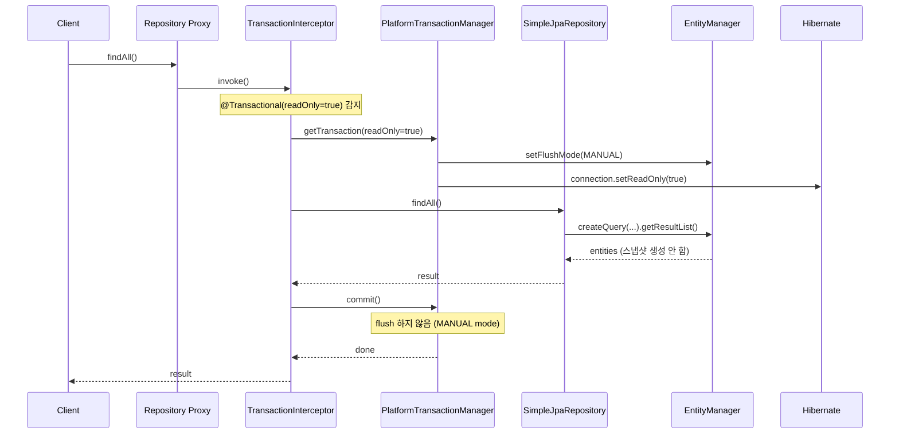
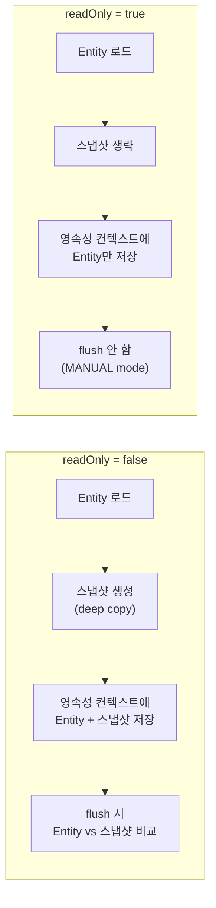
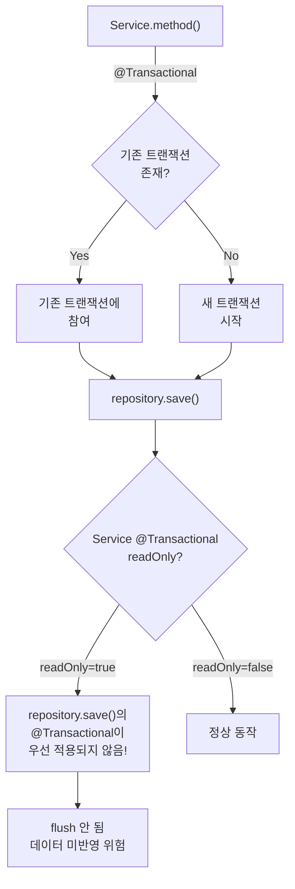

# SimpleJpaRepository의 트랜잭션 관리 내부 구조

`SimpleJpaRepository`는 클래스 레벨에 `@Transactional(readOnly = true)`를 선언하고, 쓰기 메서드에만 `@Transactional`을 오버라이드하는 패턴을 사용한다. 이 패턴은 단순해 보이지만, `readOnly = true`가 Hibernate 내부에서 flush mode와 dirty checking에 미치는 영향을 이해해야 실질적인 성능 최적화를 할 수 있다.

## 목차

1. [핵심 개념 (What)](#1-핵심-개념-what)
2. [왜 알아야 하는가 (Why)](#2-왜-알아야-하는가-why)
3. [내부 구현 분석 (How)](#3-내부-구현-분석-how)
4. [실전 예제](#4-실전-예제)
5. [정리](#5-정리)

---

## 1. 핵심 개념 (What)

### 클래스 레벨 readOnly + 메서드 레벨 오버라이드 패턴

```java
// SimpleJpaRepository.java (line 109-111)
@Repository
@Transactional(readOnly = true)  // 클래스 레벨: 모든 메서드 기본 readOnly
public class SimpleJpaRepository<T, ID>
        implements JpaRepositoryImplementation<T, ID> {
    // ...

    @Override
    @Transactional  // 메서드 레벨: readOnly=false로 오버라이드
    public <S extends T> S save(S entity) { /* ... */ }

    @Override
    @Transactional  // 메서드 레벨: readOnly=false로 오버라이드
    public void deleteById(ID id) { /* ... */ }

    @Override       // @Transactional 없음 -> 클래스 레벨 readOnly=true 적용
    public Optional<T> findById(ID id) { /* ... */ }
}
```

이 패턴의 핵심:
- **읽기 메서드**: 클래스 레벨 `@Transactional(readOnly = true)` 자동 적용
- **쓰기 메서드**: `@Transactional` (readOnly=false)으로 명시적 오버라이드

### @Transactional이 적용된 메서드 목록

| 메서드 | @Transactional | readOnly |
|---|---|---|
| `save()` | `@Transactional` | false |
| `saveAndFlush()` | `@Transactional` | false |
| `saveAll()` | `@Transactional` | false |
| `saveAllAndFlush()` | `@Transactional` | false |
| `delete()` | `@Transactional` | false |
| `deleteById()` | `@Transactional` | false |
| `deleteAll()` | `@Transactional` | false |
| `deleteAllById()` | `@Transactional` | false |
| `deleteAllInBatch()` | `@Transactional` | false |
| `deleteAllByIdInBatch()` | `@Transactional` | false |
| `flush()` | `@Transactional` | false |
| `update()` | `@Transactional` | false |
| `delete(DeleteSpecification)` | `@Transactional` | false |
| `findById()` | 없음 (클래스 레벨) | **true** |
| `findAll()` | 없음 (클래스 레벨) | **true** |
| `count()` | 없음 (클래스 레벨) | **true** |
| `existsById()` | 없음 (클래스 레벨) | **true** |
| `findOne(Specification)` | 없음 (클래스 레벨) | **true** |

## 2. 왜 알아야 하는가 (Why)

### readOnly=true의 실질적 최적화

`readOnly = true`는 단순한 힌트가 아니다. Hibernate에서 구체적인 최적화를 트리거한다:

1. **Flush mode를 MANUAL로 설정**: 트랜잭션 종료 시 자동 flush가 발생하지 않는다
2. **Dirty checking 스냅샷 생략**: 엔티티를 영속성 컨텍스트에 넣을 때 원본 복사본(스냅샷)을 만들지 않는다
3. **JDBC Connection 힌트**: 드라이버 레벨에서 `connection.setReadOnly(true)` 호출 (MySQL의 경우 레플리카 라우팅 가능)

### 성능 차이

10,000건 엔티티를 조회할 때:

| | readOnly=false | readOnly=true |
|---|---|---|
| 스냅샷 생성 | 10,000개 복사본 | **없음** |
| Dirty checking | 10,000건 비교 | **없음** |
| Flush | 자동 실행 | **실행 안 됨** |
| 메모리 사용 | 엔티티 + 스냅샷 (2배) | **엔티티만** |

## 3. 내부 구현 분석 (How)

### 3.1 @Transactional 처리 흐름

Spring의 `@Transactional`은 AOP 프록시를 통해 처리된다. Repository 프록시가 생성될 때 트랜잭션 인터셉터가 추가된다.



### 3.2 readOnly=true가 Hibernate에 미치는 영향

#### Flush Mode 변경

`readOnly = true`일 때 Hibernate의 Session flush mode가 `MANUAL`로 설정된다. 이는 `JpaTransactionManager`에서 처리된다:

```
// JpaTransactionManager (Spring Framework)
if (txObject.isNewEntityManagerHolder()) {
    if (definition.isReadOnly()) {
        // Hibernate Session의 flush mode를 MANUAL로 설정
        session.setHibernateFlushMode(FlushMode.MANUAL);
    }
}
```

`FlushMode.MANUAL`이면:
- 트랜잭션 커밋 전 자동 flush가 발생하지 않는다
- JPQL 쿼리 실행 전 자동 flush도 발생하지 않는다
- 명시적으로 `entityManager.flush()`를 호출해야만 flush된다

#### Dirty Checking 스냅샷 생략

Hibernate는 `readOnly` 힌트가 설정된 엔티티를 로드할 때 원본 상태의 스냅샷(deep copy)을 만들지 않는다. 이는 대량 조회 시 메모리 사용량을 약 50% 줄인다.



### 3.3 SimpleJpaRepository의 쓰기 메서드 트랜잭션

쓰기 메서드는 메서드 레벨 `@Transactional`로 readOnly를 오버라이드한다:

```java
// SimpleJpaRepository.java
@Override
@Transactional  // readOnly=false (기본값)
public <S extends T> S save(S entity) {
    Assert.notNull(entity, ENTITY_MUST_NOT_BE_NULL);
    if (entityInformation.isNew(entity)) {
        entityManager.persist(entity);
        return entity;
    } else {
        return entityManager.merge(entity);
    }
}

@Override
@Transactional  // readOnly=false
public void deleteById(ID id) {
    Assert.notNull(id, ID_MUST_NOT_BE_NULL);
    findById(id).ifPresent(this::delete);
}

@Override
@Transactional  // readOnly=false
public void delete(T entity) {
    Assert.notNull(entity, ENTITY_MUST_NOT_BE_NULL);
    doDelete(entityManager, entityInformation, entity);
}
```

### 3.4 커스텀 Repository 메서드의 트랜잭션

사용자가 정의한 쿼리 메서드에도 클래스 레벨 `@Transactional(readOnly = true)`가 적용된다:

```java
public interface UserRepository extends JpaRepository<User, Long> {

    // readOnly=true가 자동 적용 (파생 쿼리)
    List<User> findByEmail(String email);

    // readOnly=true가 자동 적용 (@Query)
    @Query("SELECT u FROM User u WHERE u.active = true")
    List<User> findActiveUsers();

    // @Modifying + @Transactional 필수
    @Modifying
    @Transactional  // 명시적으로 readOnly=false 설정 필요
    @Query("UPDATE User u SET u.active = false WHERE u.lastLoginAt < :cutoff")
    int deactivateInactiveUsers(@Param("cutoff") LocalDateTime cutoff);
}
```

### 3.5 트랜잭션 전파(Propagation) 동작

`SimpleJpaRepository`의 메서드는 `@Transactional`의 기본 전파 속성인 `REQUIRED`를 사용한다:



**주의**: Service 레벨에서 `@Transactional(readOnly = true)`로 시작하면, 그 안에서 호출되는 `save()`의 `@Transactional`은 **기존 트랜잭션에 참여**하므로 readOnly가 해제되지 않는다. 전파 속성이 `REQUIRED`(기본값)이기 때문이다.

## 4. 실전 예제

### 4.1 올바른 Service 레이어 트랜잭션 패턴

```java
@Service
@RequiredArgsConstructor
public class UserService {

    private final UserRepository userRepository;

    // 읽기 전용: readOnly=true로 최적화
    @Transactional(readOnly = true)
    public UserDto findUser(Long id) {
        return userRepository.findById(id)
            .map(UserDto::from)
            .orElseThrow(() -> new UserNotFoundException(id));
    }

    // 쓰기: readOnly=false (기본값)
    @Transactional
    public UserDto createUser(UserCreateRequest request) {
        User user = request.toEntity();
        User saved = userRepository.save(user);
        return UserDto.from(saved);
    }

    // 읽기 + 쓰기 혼합: readOnly=false 사용
    @Transactional  // readOnly=false 필수!
    public UserDto updateEmail(Long id, String newEmail) {
        User user = userRepository.findById(id)
            .orElseThrow(() -> new UserNotFoundException(id));
        user.changeEmail(newEmail);
        // dirty checking으로 자동 UPDATE
        return UserDto.from(user);
    }
}
```

### 4.2 readOnly 트랜잭션에서 쓰기 시도 시 문제

```java
@Service
public class BrokenService {

    @Transactional(readOnly = true) // 실수!
    public void updateUserName(Long id, String name) {
        User user = userRepository.findById(id).orElseThrow();
        user.setName(name); // 변경은 되지만...

        // 트랜잭션 종료 시:
        // - FlushMode가 MANUAL이므로 자동 flush 안 됨
        // - dirty checking이 있어도 flush가 안 되니 DB에 반영 안 됨
        // - 예외 없이 조용히 실패!
    }
}
```

이것이 `readOnly = true`의 위험한 측면이다. 예외 없이 변경사항이 무시된다.

### 4.3 대량 조회 시 readOnly 성능 최적화

```java
@Service
@RequiredArgsConstructor
public class ReportService {

    private final OrderRepository orderRepository;

    @Transactional(readOnly = true) // 필수: 대량 조회 성능 최적화
    public ReportDto generateMonthlyReport(YearMonth month) {
        LocalDateTime start = month.atDay(1).atStartOfDay();
        LocalDateTime end = month.atEndOfMonth().atTime(23, 59, 59);

        // 10,000건 조회 시:
        // readOnly=true:  엔티티만 메모리에 (스냅샷 없음)
        // readOnly=false: 엔티티 + 스냅샷 = 2배 메모리
        List<Order> orders = orderRepository
            .findByCreatedAtBetween(start, end);

        return calculateReport(orders);
    }
}
```

### 4.4 REQUIRES_NEW로 트랜잭션 분리

```java
@Service
@RequiredArgsConstructor
public class OrderService {

    private final OrderRepository orderRepository;
    private final AuditLogRepository auditLogRepository;

    @Transactional(readOnly = true)
    public OrderDto findOrder(Long id) {
        Order order = orderRepository.findById(id).orElseThrow();
        // 읽기 전용 트랜잭션 내에서 로그를 쓰고 싶다면?
        // auditLogRepository.save(...); // 동작하지 않음!
        return OrderDto.from(order);
    }
}

@Service
@RequiredArgsConstructor
public class AuditService {

    private final AuditLogRepository auditLogRepository;

    // REQUIRES_NEW: 호출자의 readOnly 트랜잭션과 별도
    @Transactional(propagation = Propagation.REQUIRES_NEW)
    public void log(String action, String details) {
        auditLogRepository.save(new AuditLog(action, details));
    }
}
```

### 4.5 MySQL 레플리카 라우팅 활용

```java
@Configuration
public class DataSourceConfig {

    @Bean
    public DataSource routingDataSource(
            DataSource primaryDataSource,
            DataSource replicaDataSource) {

        Map<Object, Object> targetDataSources = Map.of(
            "primary", primaryDataSource,
            "replica", replicaDataSource
        );

        AbstractRoutingDataSource router = new AbstractRoutingDataSource() {
            @Override
            protected Object determineCurrentLookupKey() {
                // readOnly=true이면 레플리카로 라우팅
                return TransactionSynchronizationManager
                    .isCurrentTransactionReadOnly()
                    ? "replica" : "primary";
            }
        };

        router.setTargetDataSources(targetDataSources);
        router.setDefaultTargetDataSource(primaryDataSource);
        return router;
    }
}
```

`@Transactional(readOnly = true)`가 `TransactionSynchronizationManager`에 readOnly 플래그를 설정하므로, `AbstractRoutingDataSource`에서 이를 감지하여 읽기 트래픽을 레플리카로 분산할 수 있다.

## 5. 정리

| 항목 | readOnly = true | readOnly = false |
|---|---|---|
| Flush Mode | **MANUAL** (자동 flush 안 함) | AUTO (쿼리 전/커밋 전 자동 flush) |
| Dirty Checking 스냅샷 | **생략** (메모리 절약) | 생성 (엔티티 2배 메모리) |
| JDBC readOnly 힌트 | **설정됨** (레플리카 라우팅 가능) | 설정 안 됨 |
| 변경사항 반영 | **반영 안 됨** (조용히 무시) | 자동 반영 |
| 적용 대상 | 조회 메서드 | save, delete 등 쓰기 메서드 |

| 패턴 | 설명 | 주의사항 |
|---|---|---|
| 클래스 레벨 readOnly | `SimpleJpaRepository` 기본 전략 | 쓰기 메서드는 반드시 오버라이드 |
| 전파 속성 REQUIRED | 기존 트랜잭션에 참여 | 외부 readOnly 내에서 쓰기 불가 |
| REQUIRES_NEW | 독립 트랜잭션 생성 | readOnly 분리 필요 시 사용 |
| 레플리카 라우팅 | readOnly 플래그 기반 분산 | `AbstractRoutingDataSource` 활용 |

> **핵심 원칙**: `@Transactional(readOnly = true)`는 단순한 어노테이션이 아니라, Hibernate의 flush mode, dirty checking, 메모리 사용량, JDBC 힌트까지 영향을 미치는 강력한 최적화 도구다. 읽기 메서드에는 반드시 적용하고, 쓰기가 섞인 메서드에서는 절대 사용하지 마라.

---
*참고: Spring Data JPA 3.x / Hibernate 6.x 기준*
