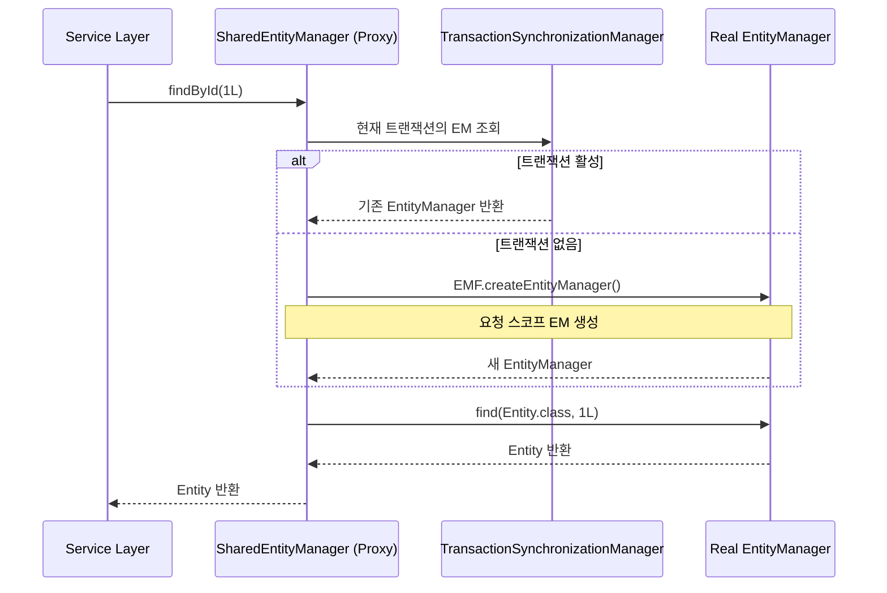
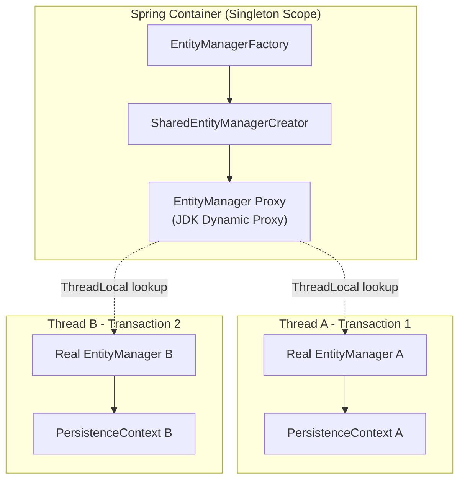

# EntityManager 프록시와 PersistenceProvider 탐지

Spring Data JPA는 `EntityManager`를 직접 주입하지 않고 스레드 안전한 프록시를 통해 제공하며, `PersistenceProvider` enum을 통해 Hibernate/EclipseLink 등 구현체를 자동 탐지한다.

## 목차

1. [핵심 개념 (What)](#1-핵심-개념-what)
2. [왜 알아야 하는가 (Why)](#2-왜-알아야-하는가-why)
3. [내부 구현 분석 (How)](#3-내부-구현-분석-how)
4. [실전 예제](#4-실전-예제)
5. [정리](#5-정리)

---

## 1. 핵심 개념 (What)

### SharedEntityManagerCreator의 역할

JPA 스펙에서 `EntityManager`는 **스레드 안전하지 않다**. 하나의 `EntityManager` 인스턴스는 하나의 영속성 컨텍스트에 바인딩되어, 동시에 여러 스레드에서 사용하면 데이터 정합성이 깨진다.

Spring은 이 문제를 `SharedEntityManagerCreator`로 해결한다. 이 클래스는 **JDK Dynamic Proxy**를 생성하여, 모든 `EntityManager` 메서드 호출을 **현재 트랜잭션에 바인딩된 실제 EntityManager**로 위임한다.

### PersistenceProvider enum

`PersistenceProvider`는 Spring Data JPA가 내부적으로 사용하는 enum으로, 현재 JPA 구현체가 **Hibernate**인지 **EclipseLink**인지 **Generic JPA**인지를 자동 탐지한다. 구현체마다 쿼리 추출, count 쿼리 플레이스홀더, 스트리밍 방식이 다르기 때문에 이 탐지가 필요하다.

```
PersistenceProvider enum
├── HIBERNATE        → SessionFactory 기반 탐지
├── ECLIPSELINK      → JpaEntityManagerFactory 기반 탐지
└── GENERIC_JPA      → fallback (표준 JPA만 사용)
```

### EntityManager 생명주기



---

## 2. 왜 알아야 하는가 (Why)

### 스레드 안전성 오해 방지

```java
@Repository
public class OrderDao {
    @PersistenceContext
    private EntityManager em; // 실제로는 Proxy!
}
```

이 코드에서 `em`은 싱글턴 빈에 주입되지만, 실제로는 **프록시**이므로 스레드 안전하다. 이 메커니즘을 모르면 "싱글턴에 EntityManager를 주입해도 되는가?"라는 혼란에 빠진다.

### 트랜잭션 없는 읽기에서의 동작 이해

트랜잭션 밖에서 `EntityManager`를 사용하면, 프록시가 **요청마다 새 EntityManager를 생성**하고 사용 후 즉시 닫는다. 이 때 **영속성 컨텍스트가 매번 새로 만들어지므로** 1차 캐시의 혜택을 받지 못한다.

### PersistenceProvider별 동작 차이

- **Hibernate**: count 쿼리에서 `*` 플레이스홀더 사용 (`HHH-4044` 이슈 대응)
- **Hibernate**: `HibernateProxy`에서 ID 직접 추출 (lazy 초기화 회피)
- **EclipseLink**: ScrollableCursor 기반 스트리밍
- **Generic JPA**: 기본 JPA 스펙만 사용, 쿼리 추출 불가

---

## 3. 내부 구현 분석 (How)

### 3.1 SharedEntityManagerCreator의 프록시 생성

Spring ORM의 `SharedEntityManagerCreator`는 `EntityManagerFactory`에서 **공유 프록시 EntityManager**를 생성한다. Spring Data JPA에서는 `EntityManagerBeanDefinitionRegistrarPostProcessor`가 이 과정을 자동화한다.

```java
// EntityManagerBeanDefinitionRegistrarPostProcessor.java (간략화)
@Override
public void postProcessBeanFactory(ConfigurableListableBeanFactory beanFactory) {
    for (EntityManagerFactoryBeanDefinition definition :
            getEntityManagerFactoryBeanDefinitions(beanFactory, decoratorPredicate)) {

        String entityManagerBeanName = "jpaSharedEM_AWC_" + definition.getBeanName();

        BeanDefinitionBuilder builder = BeanDefinitionBuilder
            .rootBeanDefinition("org.springframework.orm.jpa.SharedEntityManagerCreator");
        builder.setFactoryMethod("createSharedEntityManager");
        builder.addConstructorArgReference(definition.getBeanName());

        // EMF마다 SharedEntityManager를 자동 등록
        definitionRegistry.registerBeanDefinition(entityManagerBeanName, emBeanDefinition);
    }
}
```

**핵심 동작 원리**: `SharedEntityManagerCreator.createSharedEntityManager()`은 JDK Proxy를 반환하며, 이 프록시의 `InvocationHandler`는 매 호출마다 `TransactionSynchronizationManager`에서 **현재 트랜잭션에 바인딩된 EntityManager**를 찾아 위임한다.



### 3.2 PersistenceProvider 탐지 메커니즘

`PersistenceProvider.fromEntityManager()` 메서드는 `EntityManager`로부터 `EntityManagerFactory`를 얻고, 이 팩토리의 실제 타입을 검사하여 어떤 JPA 구현체인지 판별한다.

```java
// PersistenceProvider.java:304
public static PersistenceProvider fromEntityManager(EntityManager em) {
    Assert.notNull(em, "EntityManager must not be null");
    return fromEntityManagerFactory(em.getEntityManagerFactory());
}
```

`fromEntityManagerFactory()` 메서드에서는 프록시를 unwrap하고, 실제 `EntityManagerFactory` 타입에 대해 각 `PersistenceProvider`의 `entityManagerFactoryClassNames`를 비교한다.

```java
// PersistenceProvider.java:319 (핵심 로직)
public static PersistenceProvider fromEntityManagerFactory(EntityManagerFactory emf) {
    EntityManagerFactory unwrapped = emf;

    // 1단계: Proxy/AOP Proxy unwrap
    while (Proxy.isProxyClass(unwrapped.getClass()) || AopUtils.isAopProxy(unwrapped)) {
        // JDK Proxy → unwrap(null) or unwrap(EntityManagerFactory.class)
        // AOP Proxy → AopProxyUtils.getSingletonTarget()
    }

    // 2단계: 캐시 확인
    Class<?> entityManagerType = unwrapped.getClass();
    PersistenceProvider cachedProvider = CACHE.get(entityManagerType);
    if (cachedProvider != null) return cachedProvider;

    // 3단계: 타입 매칭
    for (PersistenceProvider provider : ALL) {  // HIBERNATE, ECLIPSELINK, GENERIC_JPA
        for (String emfClassName : provider.entityManagerFactoryClassNames) {
            if (isOfType(unwrapped, emfClassName, ...)) {
                return cacheAndReturn(entityManagerType, provider);
            }
        }
    }

    return cacheAndReturn(entityManagerType, GENERIC_JPA);  // fallback
}
```

### 3.3 탐지에 사용되는 상수값

```java
// PersistenceProvider.Constants 인터페이스
interface Constants {
    // Hibernate
    String HIBERNATE_ENTITY_MANAGER_FACTORY_INTERFACE = "org.hibernate.SessionFactory";
    String HIBERNATE_JPA_METAMODEL_TYPE =
        "org.hibernate.metamodel.model.domain.JpaMetamodel";

    // EclipseLink
    String ECLIPSELINK_ENTITY_MANAGER_FACTORY_INTERFACE =
        "org.eclipse.persistence.jpa.JpaEntityManagerFactory";
    String ECLIPSELINK_JPA_METAMODEL_TYPE =
        "org.eclipse.persistence.internal.jpa.metamodel.MetamodelImpl";

    // Generic JPA
    String GENERIC_JPA_ENTITY_MANAGER_FACTORY_INTERFACE =
        "jakarta.persistence.EntityManagerFactory";
}
```

`ClassUtils.isPresent()`를 사용하여 클래스패스에 해당 클래스가 존재하는지를 체크하므로, **런타임에 자동 탐지**된다. `ConcurrentReferenceHashMap`을 캐시로 사용하여 반복 탐지 비용을 줄인다.

### 3.4 PersistenceProvider 활용 지점

`JpaRepositoryFactory` 생성 시점에 `PersistenceProvider`가 결정되고, 이후 여러 곳에서 활용된다.

```java
// JpaRepositoryFactory.java:89
public JpaRepositoryFactory(EntityManager entityManager) {
    this.entityManager = entityManager;
    PersistenceProvider extractor = PersistenceProvider.fromEntityManager(entityManager);

    this.queryMethodFactory = new DefaultJpaQueryMethodFactory(extractor);

    if (extractor.equals(PersistenceProvider.ECLIPSELINK)) {
        addQueryCreationListener(new EclipseLinkProjectionQueryCreationListener(entityManager));
    }
}
```

`SimpleJpaRepository`에서도 count 쿼리 플레이스홀더를 가져올 때 사용된다.

```java
// SimpleJpaRepository.java:145
this.provider = PersistenceProvider.fromEntityManager(entityManager);

// count 쿼리 생성 시
this.countQueryString = Lazy.of(() ->
    getQueryString(String.format(COUNT_QUERY_STRING,
        provider.getCountQueryPlaceholder(), "%s"),  // Hibernate: "*", 기타: "x"
        entityInformation.getEntityName()));
```

---

## 4. 실전 예제

### 예제 1: EntityManager 주입 방식의 이해

```java
@Service
@Transactional(readOnly = true)
public class OrderService {

    private final EntityManager em; // SharedEntityManager 프록시

    // 생성자 주입 (Spring Data JPA가 SharedEntityManagerCreator로 프록시 생성)
    public OrderService(EntityManager em) {
        this.em = em;
    }

    public Order findOrder(Long id) {
        // 프록시 → TransactionSynchronizationManager → 실제 EM
        return em.find(Order.class, id);
    }

    @Transactional
    public void updateOrder(Long id, String status) {
        // 쓰기 트랜잭션 내에서 같은 프록시가 다른 실제 EM에 위임
        Order order = em.find(Order.class, id);
        order.setStatus(status);
        // dirty checking으로 자동 UPDATE
    }
}
```

### 예제 2: 커스텀 PersistenceProvider 확인

```java
@Component
public class JpaEnvironmentLogger implements ApplicationListener<ContextRefreshedEvent> {

    @PersistenceContext
    private EntityManager entityManager;

    @Override
    public void onApplicationEvent(ContextRefreshedEvent event) {
        PersistenceProvider provider = PersistenceProvider
            .fromEntityManager(entityManager);

        log.info("Detected JPA Provider: {}", provider.name());
        log.info("Count placeholder: {}", provider.getCountQueryPlaceholder());
        log.info("Can extract query: {}", provider.canExtractQuery());
    }
}
```

### 예제 3: 트랜잭션 유무에 따른 EntityManager 동작 차이

```java
@Service
public class ProductService {

    private final EntityManager em;

    public ProductService(EntityManager em) {
        this.em = em;
    }

    // 트랜잭션 없음 → 매 호출마다 새 EM 생성/폐기
    public Product findWithoutTx(Long id) {
        Product p = em.find(Product.class, id);
        // 여기서 EM이 닫히므로 LAZY 연관관계 접근 시 LazyInitializationException
        return p;
    }

    // 트랜잭션 있음 → 트랜잭션 범위 동안 동일 EM 재사용
    @Transactional(readOnly = true)
    public Product findWithTx(Long id) {
        Product p = em.find(Product.class, id);
        p.getOrderItems().size(); // LAZY 로딩 정상 동작
        return p;
    }
}
```

---

## 5. 정리

| 구분 | 설명 |
|------|------|
| **SharedEntityManagerCreator** | JDK Dynamic Proxy로 스레드 안전한 EntityManager 프록시 생성 |
| **프록시 동작** | 매 호출마다 `TransactionSynchronizationManager`에서 트랜잭션 바인딩된 EM 조회 |
| **트랜잭션 있을 때** | 트랜잭션 범위 내 동일 EM 재사용 (1차 캐시 공유) |
| **트랜잭션 없을 때** | 호출마다 새 EM 생성, 사용 후 즉시 폐기 |
| **PersistenceProvider** | `HIBERNATE`, `ECLIPSELINK`, `GENERIC_JPA` 3가지 enum |
| **탐지 방식** | `EntityManagerFactory`의 실제 타입을 `ClassUtils.isPresent()`로 비교 |
| **캐시** | `ConcurrentReferenceHashMap`으로 탐지 결과 캐싱 |
| **Hibernate 특화** | count 쿼리 `*` 플레이스홀더, `HibernateProxy` ID 추출, `ScrollableResults` 스트리밍 |
| **EclipseLink 특화** | `ScrollableCursor` 스트리밍, JPQL/SQL 쿼리 문자열 추출 |
| **등록 자동화** | `EntityManagerBeanDefinitionRegistrarPostProcessor`가 EMF마다 SharedEM 빈 등록 |

---
*참고: Spring Data JPA 3.x / Hibernate 6.x 기준*
