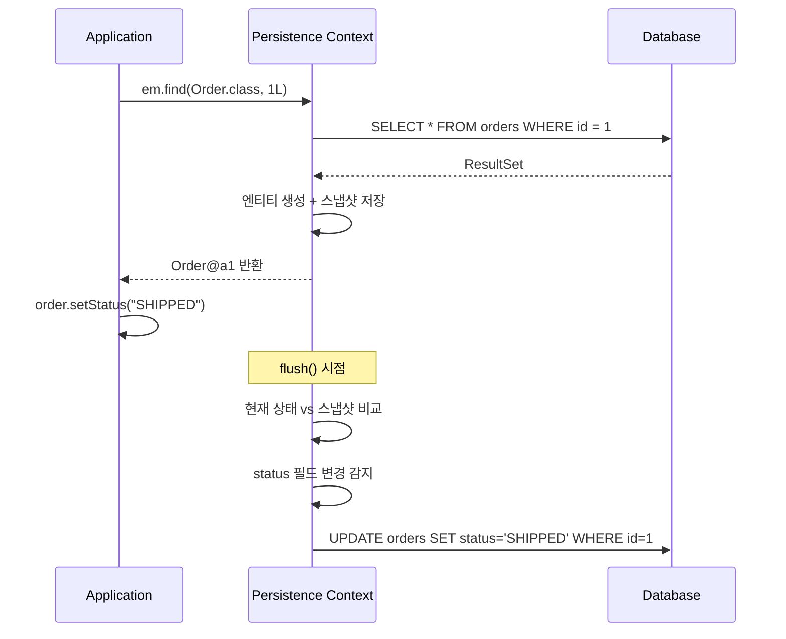
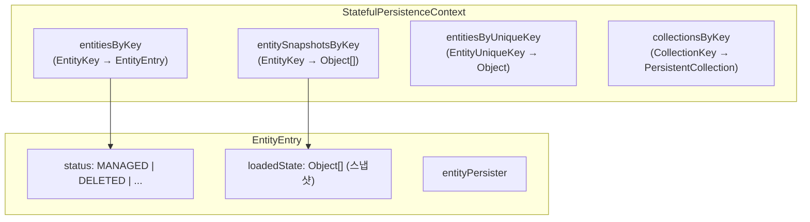
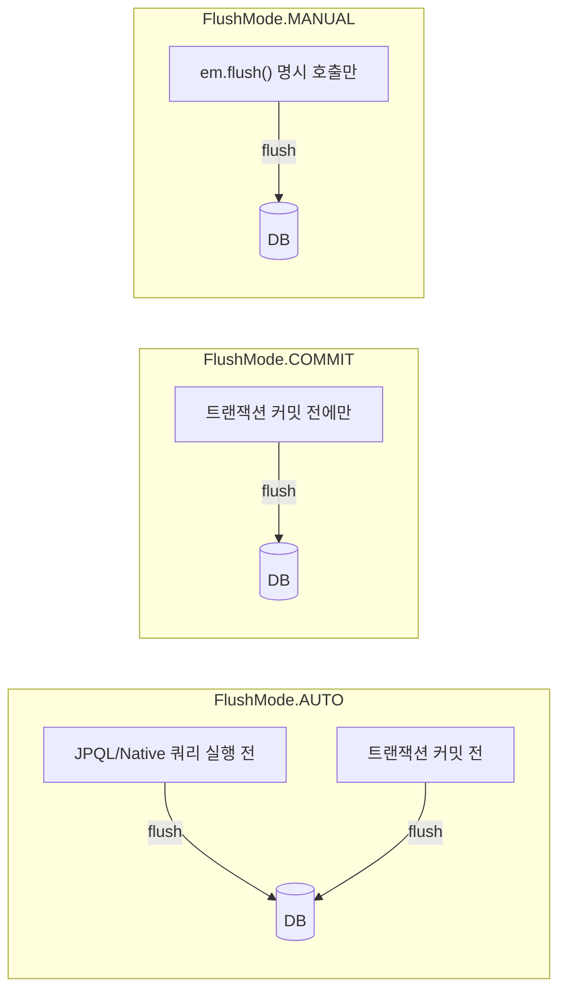
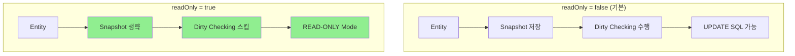

# 1차 캐시와 Dirty Checking

영속성 컨텍스트는 Identity Map 패턴으로 엔티티를 캐싱하고, 스냅샷 비교를 통해 변경된 엔티티를 자동으로 UPDATE SQL로 변환한다. Flush Mode와 readOnly 최적화를 이해하면 JPA 성능을 크게 개선할 수 있다.

## 목차

1. [핵심 개념 (What)](#1-핵심-개념-what)
2. [왜 알아야 하는가 (Why)](#2-왜-알아야-하는가-why)
3. [내부 구현 분석 (How)](#3-내부-구현-분석-how)
4. [실전 예제](#4-실전-예제)
5. [정리](#5-정리)

---

## 1. 핵심 개념 (What)

### 1차 캐시 = Identity Map

영속성 컨텍스트(Persistence Context)는 내부적으로 **Identity Map**을 유지한다. 이 맵은 `(EntityType, PrimaryKey)` 쌍을 키로, 엔티티 인스턴스를 값으로 저장한다.

```
영속성 컨텍스트 (1차 캐시)
┌───────────────────────────────────────┐
│  Key: (Order.class, 1L) → Order@a1   │
│  Key: (Order.class, 2L) → Order@b2   │
│  Key: (Member.class, 5L) → Member@c3 │
└───────────────────────────────────────┘
```

**동일 트랜잭션 내**에서 같은 PK로 `find()`를 호출하면 DB 쿼리 없이 캐시된 인스턴스를 반환한다. 이를 **Repeatable Read** 보장이라 한다.

### Dirty Checking (변경 감지)

JPA는 엔티티를 영속화할 때 **스냅샷(snapshot)**을 내부에 저장한다. 이후 flush 시점에 현재 엔티티 상태와 스냅샷을 필드별로 비교하여, 변경이 감지되면 자동으로 UPDATE SQL을 생성한다.



### Flush Mode

| 모드 | 동작 | 사용 시점 |
|------|------|-----------|
| `AUTO` (기본값) | 쿼리 실행 전 + 트랜잭션 커밋 전 자동 flush | 대부분의 경우 |
| `COMMIT` | 트랜잭션 커밋 전에만 flush | 쿼리 전 flush가 불필요한 경우 |
| `MANUAL` | 명시적 `em.flush()` 호출 시에만 flush | 배치 처리, 성능 최적화 |

---

## 2. 왜 알아야 하는가 (Why)

### 불필요한 UPDATE 방지

Dirty Checking은 `setter`를 호출하기만 해도 UPDATE SQL이 발생할 수 있다. 같은 값으로 설정해도 Hibernate의 기본 전략은 **모든 컬럼을 포함한 UPDATE**를 생성한다 (컴파일된 SQL 재사용을 위해). 이를 알면 `@DynamicUpdate`를 활용한 최적화를 적용할 수 있다.

### readOnly 최적화의 효과

`@Transactional(readOnly = true)`를 사용하면 Spring Data JPA가 Hibernate에 힌트를 전달하여 **스냅샷 생성을 생략**한다. 대량 읽기 작업에서 메모리 사용량과 flush 비용을 크게 줄일 수 있다.

### 메모리 관리

대량 데이터를 처리할 때 영속성 컨텍스트에 수만 개의 엔티티와 스냅샷이 쌓이면 OOM이 발생할 수 있다. 주기적인 `em.flush()` + `em.clear()`가 필요한 이유를 이해해야 한다.

### Write-behind와 SQL 배칭

JPA는 **Write-behind** 전략을 사용한다. INSERT/UPDATE/DELETE SQL을 즉시 실행하지 않고 flush 시점까지 모아둔다. 이를 JDBC 배칭과 결합하면 네트워크 라운드트립을 크게 줄일 수 있다.

---

## 3. 내부 구현 분석 (How)

### 3.1 Hibernate의 영속성 컨텍스트 내부 구조

Hibernate의 `StatefulPersistenceContext`가 1차 캐시를 구현한다. 내부적으로 여러 맵을 유지한다.



**EntityKey**는 `(entityName, identifier)` 쌍으로 구성되며, 이것이 바로 Identity Map의 키다.

### 3.2 스냅샷 비교 과정

flush 시 Hibernate의 `DefaultFlushEntityEventListener`가 다음 과정을 수행한다.

```
1. ActionQueue에서 flush 대상 엔티티 수집
2. 각 엔티티에 대해:
   a. EntityEntry에서 loadedState(스냅샷) 조회
   b. EntityPersister.getPropertyValues()로 현재 상태 추출
   c. 필드별 비교 (deepEquals 아닌 == 비교가 기본)
   d. 변경 감지 시 → ActionQueue에 EntityUpdateAction 추가
3. ActionQueue 실행 → SQL 생성/전송
```

```java
// Hibernate 내부 의사코드 (DefaultFlushEntityEventListener)
Object[] currentState = persister.getPropertyValues(entity);
Object[] loadedState = entry.getLoadedState();

// 필드별 비교
int[] dirtyProperties = persister.findDirty(currentState, loadedState, entity, session);

if (dirtyProperties != null) {
    // 변경된 필드가 있으면 UPDATE action 등록
    session.getActionQueue().addAction(
        new EntityUpdateAction(id, currentState, dirtyProperties,
                               loadedState, version, entity, persister, session)
    );
}
```

### 3.3 Flush Mode별 동작



**AUTO 모드의 함정**: JPQL 쿼리 실행 전에 자동 flush가 발생하므로, 대량 INSERT 후 JPQL 조회를 반복하면 매번 flush가 트리거되어 성능이 저하된다.

### 3.4 Write-behind와 SQL 배칭

```
ActionQueue (Write-behind 큐)
┌──────────────────────────────────────────┐
│ 1. EntityInsertAction(Order#1)           │
│ 2. EntityInsertAction(Order#2)           │
│ 3. EntityInsertAction(Order#3)           │
│ 4. EntityUpdateAction(Member#5)          │
│ 5. CollectionUpdateAction(Order#1.items) │
└──────────────────────────────────────────┘
         │
         ▼  flush() 호출 시
┌──────────────────────────────────────────┐
│ INSERT → INSERT → INSERT (batched)       │
│ UPDATE (single)                          │
│ Collection UPDATE                        │
└──────────────────────────────────────────┘
```

Hibernate는 같은 타입의 INSERT를 모아서 JDBC batch로 실행한다. `spring.jpa.properties.hibernate.jdbc.batch_size=50`으로 배칭 크기를 설정할 수 있다.

**실행 순서 보장**: ActionQueue는 `INSERT → UPDATE → CollectionUpdate → CollectionRemove → DELETE` 순서로 실행하여 FK 제약 조건 위반을 방지한다.

### 3.5 readOnly=true에서의 스냅샷 생략 최적화

Spring Data JPA의 `SimpleJpaRepository`는 클래스 레벨에 `@Transactional(readOnly = true)`가 선언되어 있다.

```java
// SimpleJpaRepository.java:109-111
@Repository
@Transactional(readOnly = true)
public class SimpleJpaRepository<T, ID> implements JpaRepositoryImplementation<T, ID> {
```

`readOnly = true`가 설정되면 Spring은 `TransactionSynchronizationManager`에 `readOnly` 플래그를 설정한다. Hibernate의 `DefaultLoadEventListener`는 이 플래그를 확인하여:

1. **스냅샷 생성을 생략**한다 (메모리 절약)
2. **dirty checking을 스킵**한다 (CPU 절약)
3. **JDBC Connection에 readOnly 힌트**를 전달한다 (DB 레벨 최적화, MySQL의 경우 InnoDB 버퍼 풀 최적화)



---

## 4. 실전 예제

### 예제 1: Dirty Checking을 활용한 엔티티 수정

```java
@Service
@Transactional
public class OrderService {

    private final OrderRepository orderRepository;

    public OrderService(OrderRepository orderRepository) {
        this.orderRepository = orderRepository;
    }

    // save() 호출 없이도 UPDATE SQL 자동 생성
    public void shipOrder(Long orderId) {
        Order order = orderRepository.findById(orderId)
            .orElseThrow(() -> new EntityNotFoundException("Order not found"));

        order.setStatus(OrderStatus.SHIPPED);
        order.setShippedAt(LocalDateTime.now());

        // 트랜잭션 커밋 시 dirty checking → UPDATE SQL 자동 실행
        // 별도의 save() 호출이 필요 없다
    }
}
```

### 예제 2: 대량 배치 처리에서의 메모리 관리

```java
@Service
public class BatchService {

    @PersistenceContext
    private EntityManager em;

    @Transactional
    public void importProducts(List<ProductDto> products) {
        int batchSize = 50;

        for (int i = 0; i < products.size(); i++) {
            ProductDto dto = products.get(i);
            Product product = new Product(dto.getName(), dto.getPrice());
            em.persist(product);

            if (i > 0 && i % batchSize == 0) {
                // 1) 쌓인 INSERT를 DB로 전송
                em.flush();
                // 2) 영속성 컨텍스트 초기화 (1차 캐시 + 스냅샷 해제)
                em.clear();
            }
        }
    }
}
```

**application.yml 배칭 설정**:

```yaml
spring:
  jpa:
    properties:
      hibernate:
        jdbc:
          batch_size: 50
          order_inserts: true    # 같은 타입 INSERT 재정렬로 배칭 효율 극대화
          order_updates: true    # 같은 타입 UPDATE 재정렬
        order_inserts: true
```

### 예제 3: readOnly를 활용한 대량 조회 최적화

```java
@Service
public class ReportService {

    private final OrderRepository orderRepository;

    public ReportService(OrderRepository orderRepository) {
        this.orderRepository = orderRepository;
    }

    // readOnly = true → 스냅샷 생략, dirty checking 스킵
    @Transactional(readOnly = true)
    public OrderSummary generateMonthlySummary(YearMonth month) {
        LocalDateTime start = month.atDay(1).atStartOfDay();
        LocalDateTime end = month.atEndOfMonth().atTime(23, 59, 59);

        // 수천 건을 조회해도 스냅샷이 없으므로 메모리 효율적
        List<Order> orders = orderRepository
            .findByCreatedAtBetween(start, end);

        return OrderSummary.builder()
            .totalCount(orders.size())
            .totalAmount(orders.stream()
                .map(Order::getTotalAmount)
                .reduce(BigDecimal.ZERO, BigDecimal::add))
            .build();
    }
}
```

---

## 5. 정리

| 구분 | 설명 |
|------|------|
| **1차 캐시** | `(EntityType, PK)` → 엔티티 인스턴스의 Identity Map |
| **Repeatable Read** | 동일 트랜잭션 내 같은 PK 조회 시 캐시에서 반환 (DB 쿼리 없음) |
| **스냅샷** | 엔티티 로딩 시 필드값의 복사본 저장 (`EntityEntry.loadedState`) |
| **Dirty Checking** | flush 시점에 현재 상태 vs 스냅샷 필드별 비교 → 변경 시 UPDATE SQL 생성 |
| **FlushMode.AUTO** | 쿼리 실행 전 + 커밋 전 자동 flush (기본값) |
| **FlushMode.COMMIT** | 커밋 전에만 flush (쿼리 전 flush 생략으로 성능 향상) |
| **FlushMode.MANUAL** | `em.flush()` 명시 호출 시에만 flush |
| **Write-behind** | SQL을 ActionQueue에 모아두었다가 flush 시 한번에 실행 |
| **SQL 배칭** | `hibernate.jdbc.batch_size`로 같은 타입 INSERT/UPDATE를 JDBC batch 실행 |
| **readOnly=true** | 스냅샷 생성 생략 + dirty checking 스킵 + JDBC readOnly 힌트 |
| **메모리 관리** | 대량 처리 시 `flush()` + `clear()`로 영속성 컨텍스트 주기적 초기화 필수 |

---
*참고: Spring Data JPA 3.x / Hibernate 6.x 기준*
