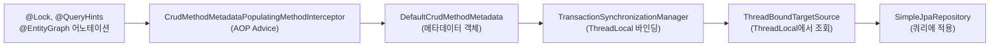
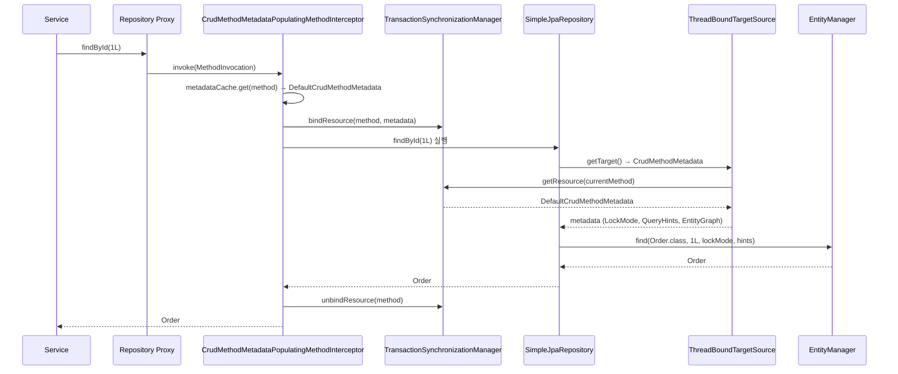

# CrudMethodMetadata 인터셉터 체인

`@Lock`, `@QueryHints`, `@EntityGraph` 어노테이션이 리포지토리 메서드에서 실제 JPA 쿼리에 적용되기까지의 전체 과정을 분석한다. `CrudMethodMetadataPostProcessor`가 AOP 인터셉터로 메타데이터를 수집하고, `ThreadLocal`을 통해 `SimpleJpaRepository`에 전달하는 메커니즘이다.

## 목차

1. [핵심 개념 (What)](#1-핵심-개념-what)
2. [왜 알아야 하는가 (Why)](#2-왜-알아야-하는가-why)
3. [내부 구현 분석 (How)](#3-내부-구현-분석-how)
4. [실전 예제](#4-실전-예제)
5. [정리](#5-정리)

---

## 1. 핵심 개념 (What)

### 문제 상황

Spring Data JPA의 `SimpleJpaRepository`는 모든 리포지토리 인터페이스의 기본 구현체다. 그런데 사용자가 인터페이스에서 CRUD 메서드를 **재선언**하면서 `@Lock`, `@QueryHints`, `@EntityGraph` 등의 어노테이션을 붙일 수 있다.

```java
public interface OrderRepository extends JpaRepository<Order, Long> {

    @Lock(LockModeType.PESSIMISTIC_WRITE)
    @QueryHints(@QueryHint(name = "jakarta.persistence.lock.timeout", value = "3000"))
    Optional<Order> findById(Long id);  // CRUD 메서드 재선언
}
```

문제는 `SimpleJpaRepository.findById()`의 실제 구현은 이 어노테이션들을 직접 읽지 않는다는 것이다. **인터페이스의 어노테이션 정보를 구현체의 쿼리 실행에 어떻게 전달할 것인가?**

### 해결: AOP 인터셉터 + ThreadLocal



---

## 2. 왜 알아야 하는가 (Why)

### CRUD 메서드에 커스텀 설정 적용

`@Lock`으로 비관적 락을 걸거나, `@QueryHints`로 쿼리 타임아웃을 설정하거나, `@EntityGraph`로 fetch 전략을 오버라이드하는 것은 실무에서 매우 흔하다. 이 메커니즘을 이해해야 왜 **인터페이스에 어노테이션을 붙이는 것만으로** 동작하는지 알 수 있다.

### 디버깅

`@Lock`이 동작하지 않거나, `@QueryHints`가 무시되는 상황에서 원인을 파악하려면 인터셉터 체인의 동작 방식을 알아야 한다. 예를 들어, **쿼리 메서드**(파생 쿼리, `@Query`)에는 이 메커니즘이 적용되지 않고 다른 경로로 처리된다.

### 성능 영향 인지

`CrudMethodMetadataPopulatingMethodInterceptor`는 매 호출마다 `TransactionSynchronizationManager`에 리소스를 바인딩/언바인딩한다. 메타데이터 자체는 `ConcurrentHashMap`에 캐싱되므로 반복 리플렉션 비용은 없지만, ThreadLocal 조작 비용이 존재한다.

---

## 3. 내부 구현 분석 (How)

### 3.1 전체 아키텍처



### 3.2 CrudMethodMetadataPostProcessor

이 클래스는 `RepositoryProxyPostProcessor`를 구현하여, 리포지토리 프록시 생성 시 두 가지를 한다.

```java
// CrudMethodMetadataPostProcessor.java:72
@Override
public void postProcess(ProxyFactory factory, RepositoryInformation repositoryInformation) {
    factory.addAdvice(new CrudMethodMetadataPopulatingMethodInterceptor(repositoryInformation));
}
```

1. **인터셉터 등록**: `CrudMethodMetadataPopulatingMethodInterceptor`를 프록시의 AOP advice로 추가
2. **프록시 메타데이터 객체 생성**: `ThreadBoundTargetSource`를 사용하는 `CrudMethodMetadata` 프록시 생성

```java
// CrudMethodMetadataPostProcessor.java:80
CrudMethodMetadata getCrudMethodMetadata() {
    ProxyFactory factory = new ProxyFactory();
    factory.addInterface(CrudMethodMetadata.class);
    factory.setTargetSource(new ThreadBoundTargetSource());
    return (CrudMethodMetadata) factory.getProxy(this.classLoader);
}
```

### 3.3 CrudMethodMetadataPopulatingMethodInterceptor

이 인터셉터는 **핵심 워크플로우**를 수행한다.

```java
// CrudMethodMetadataPostProcessor.java:132
@Override
public @Nullable Object invoke(MethodInvocation invocation) throws Throwable {
    Method method = invocation.getMethod();

    // 1. 쿼리 메서드는 스킵 (CRUD 구현 메서드만 처리)
    if (!implementations.contains(method)) {
        return invocation.proceed();
    }

    // 2. 현재 MethodInvocation을 ThreadLocal에 저장
    MethodInvocation oldInvocation = currentInvocation.get();
    currentInvocation.set(invocation);

    try {
        // 3. 이미 바인딩된 메타데이터가 있으면 재사용
        CrudMethodMetadata metadata = (CrudMethodMetadata)
            TransactionSynchronizationManager.getResource(method);
        if (metadata != null) {
            return invocation.proceed();
        }

        // 4. 메타데이터 캐시에서 조회 또는 새로 생성
        CrudMethodMetadata methodMetadata = metadataCache.get(method);
        if (methodMetadata == null) {
            methodMetadata = new DefaultCrudMethodMetadata(method);
            CrudMethodMetadata tmp = metadataCache.putIfAbsent(method, methodMetadata);
            if (tmp != null) methodMetadata = tmp;
        }

        // 5. ThreadLocal에 바인딩하고 실행
        TransactionSynchronizationManager.bindResource(method, methodMetadata);
        try {
            return invocation.proceed();
        } finally {
            TransactionSynchronizationManager.unbindResource(method);
        }
    } finally {
        currentInvocation.set(oldInvocation);
    }
}
```

**중요 포인트**: `implementations` Set은 **쿼리 메서드가 아닌 CRUD 메서드만** 포함한다. `RepositoryInformation.isQueryMethod()`가 false인 메서드, 즉 `findById()`, `save()`, `delete()` 등 `CrudRepository`에서 정의된 메서드의 재선언만 이 인터셉터의 대상이 된다.

### 3.4 DefaultCrudMethodMetadata

어노테이션을 실제로 읽어내는 데이터 클래스다.

```java
// CrudMethodMetadataPostProcessor.java:196
DefaultCrudMethodMetadata(Method method) {
    this.lockModeType = findLockModeType(method);       // @Lock
    this.queryHints = findQueryHints(method, it -> true); // @QueryHints
    this.queryHintsForCount = findQueryHints(method, QueryHints::forCounting);
    this.comment = findComment(method);                   // @Meta
    this.entityGraph = findEntityGraph(method);           // @EntityGraph
    this.method = method;
}
```

각 어노테이션 탐색은 `AnnotatedElementUtils.findMergedAnnotation()`을 사용하므로, **메타 어노테이션**이나 **커스텀 조합 어노테이션**도 지원한다.

```java
// @Lock 탐색
private static @Nullable LockModeType findLockModeType(Method method) {
    Lock annotation = AnnotatedElementUtils.findMergedAnnotation(method, Lock.class);
    return annotation == null ? null : (LockModeType) AnnotationUtils.getValue(annotation);
}

// @EntityGraph 탐색
private static @Nullable EntityGraph findEntityGraph(Method method) {
    return AnnotatedElementUtils.findMergedAnnotation(method, EntityGraph.class);
}
```

### 3.5 ThreadBoundTargetSource

`SimpleJpaRepository`에 주입되는 `CrudMethodMetadata`는 실제 객체가 아니라 **프록시**다. 이 프록시의 `TargetSource`가 `ThreadBoundTargetSource`이며, 매 호출마다 ThreadLocal에서 실제 메타데이터를 조회한다.

```java
// CrudMethodMetadataPostProcessor.java:279
private static class ThreadBoundTargetSource implements TargetSource {

    @Override
    public @Nullable Object getTarget() {
        // 1. 현재 ThreadLocal에서 MethodInvocation 조회
        MethodInvocation invocation =
            CrudMethodMetadataPopulatingMethodInterceptor.currentInvocation();
        // 2. 해당 메서드에 바인딩된 메타데이터 반환
        return TransactionSynchronizationManager.getResource(invocation.getMethod());
    }
}
```

### 3.6 SimpleJpaRepository에서의 적용

`SimpleJpaRepository`는 주입받은 `CrudMethodMetadata` 프록시를 통해 메타데이터를 읽고, 쿼리에 적용한다.

```java
// SimpleJpaRepository.java:328
@Override
public Optional<T> findById(ID id) {
    Class<T> domainType = getDomainClass();

    if (metadata == null) {
        return Optional.ofNullable(entityManager.find(domainType, id));
    }

    // metadata 프록시 → ThreadBoundTargetSource → 실제 DefaultCrudMethodMetadata
    LockModeType type = metadata.getLockModeType();
    Map<String, Object> hints = getHints();

    return Optional.ofNullable(
        type == null
            ? entityManager.find(domainType, id, hints)
            : entityManager.find(domainType, id, type, hints)  // @Lock 적용
    );
}
```

쿼리 힌트와 EntityGraph 적용:

```java
// SimpleJpaRepository.java:1031
private void applyQueryHints(Query query) {
    if (metadata == null) return;

    // QueryHints + EntityGraph를 쿼리에 적용
    getQueryHints().withFetchGraphs(entityManager).forEach(query::setHint);
    applyComment(metadata, query::setHint);
}
```

### 3.7 DefaultQueryHints의 힌트 합성

`DefaultQueryHints`는 `CrudMethodMetadata`의 `@QueryHints` 값과 `@EntityGraph` 값을 합성한다.

```java
// DefaultQueryHints.java:92
private QueryHints combineHints() {
    return QueryHints.from(
        forCounts ? metadata.getQueryHintsForCount() : metadata.getQueryHints(),
        getFetchGraphs()  // @EntityGraph → JPA hint로 변환
    );
}

private QueryHints getFetchGraphs() {
    if (entityManager != null && metadata.getEntityGraph() != null) {
        return Jpa21Utils.getFetchGraphHint(
            entityManager,
            getEntityGraph(metadata.getEntityGraph()),
            information.getJavaType()
        );
    }
    return new MutableQueryHints();
}
```

---

## 4. 실전 예제

### 예제 1: 비관적 락 + 타임아웃

```java
public interface OrderRepository extends JpaRepository<Order, Long> {

    @Lock(LockModeType.PESSIMISTIC_WRITE)
    @QueryHints({
        @QueryHint(name = "jakarta.persistence.lock.timeout", value = "3000"),
        @QueryHint(name = "org.hibernate.comment", value = "Lock order for update")
    })
    Optional<Order> findById(Long id);
}
```

**동작 흐름**:
1. `CrudMethodMetadataPopulatingMethodInterceptor`가 `findById` 메서드의 `@Lock`과 `@QueryHints`를 `DefaultCrudMethodMetadata`에 캐싱
2. ThreadLocal에 바인딩
3. `SimpleJpaRepository.findById()`가 `metadata.getLockModeType()` → `PESSIMISTIC_WRITE` 적용
4. `getHints()`가 `lock.timeout=3000`과 comment 힌트를 Map으로 반환
5. `EntityManager.find(Order.class, id, PESSIMISTIC_WRITE, hints)` 실행

### 예제 2: EntityGraph로 N+1 방지

```java
public interface OrderRepository extends JpaRepository<Order, Long> {

    @EntityGraph(attributePaths = {"member", "orderItems", "orderItems.product"})
    Optional<Order> findById(Long id);

    @EntityGraph(attributePaths = {"member"})
    List<Order> findAll();
}
```

`@EntityGraph`는 `DefaultCrudMethodMetadata`에서 읽혀 `DefaultQueryHints.getFetchGraphs()`를 통해 JPA의 `jakarta.persistence.fetchgraph` 힌트로 변환된다.

### 예제 3: 커스텀 조합 어노테이션

`AnnotatedElementUtils.findMergedAnnotation()`을 사용하므로 메타 어노테이션 조합이 가능하다.

```java
@Target(ElementType.METHOD)
@Retention(RetentionPolicy.RUNTIME)
@Lock(LockModeType.PESSIMISTIC_WRITE)
@QueryHints(@QueryHint(name = "jakarta.persistence.lock.timeout", value = "5000"))
public @interface PessimisticLockWithTimeout {
}

public interface OrderRepository extends JpaRepository<Order, Long> {

    @PessimisticLockWithTimeout
    Optional<Order> findById(Long id);
}
```

---

## 5. 정리

| 구분 | 설명 |
|------|------|
| **CrudMethodMetadataPostProcessor** | `RepositoryProxyPostProcessor` 구현체, 프록시에 인터셉터 등록 |
| **CrudMethodMetadataPopulatingMethodInterceptor** | AOP `MethodInterceptor`, CRUD 메서드 호출 시 메타데이터를 ThreadLocal에 바인딩 |
| **DefaultCrudMethodMetadata** | `@Lock`, `@QueryHints`, `@EntityGraph`, `@Meta` 어노테이션을 리플렉션으로 읽어 캐싱 |
| **ThreadBoundTargetSource** | `CrudMethodMetadata` 프록시의 `TargetSource`, ThreadLocal에서 실제 메타데이터 조회 |
| **TransactionSynchronizationManager** | `Method` 객체를 키로, `CrudMethodMetadata`를 값으로 ThreadLocal에 저장 |
| **적용 대상** | CRUD 메서드 재선언만 (쿼리 메서드는 별도 경로) |
| **캐싱** | `ConcurrentHashMap`으로 `Method` → `DefaultCrudMethodMetadata` 캐싱 |
| **DefaultQueryHints** | `@QueryHints` + `@EntityGraph`를 합성하여 JPA 쿼리 힌트로 변환 |
| **MutableQueryHints** | 힌트 키-값 쌍을 `LinkedMultiValueMap`으로 관리 (동일 키 복수 값 지원) |
| **어노테이션 탐색** | `AnnotatedElementUtils.findMergedAnnotation()` 사용 → 메타 어노테이션 지원 |

---
*참고: Spring Data JPA 3.x / Hibernate 6.x 기준*
