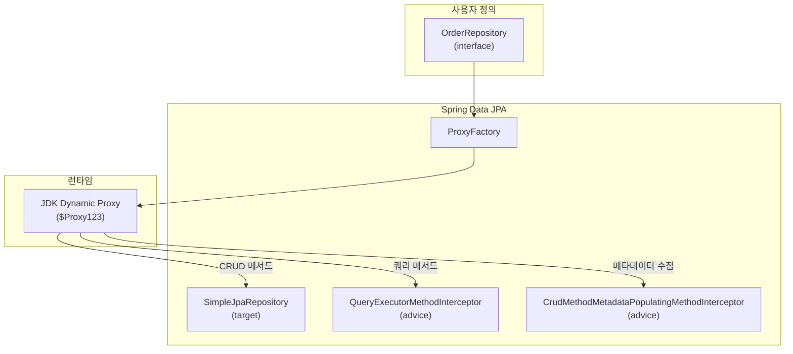
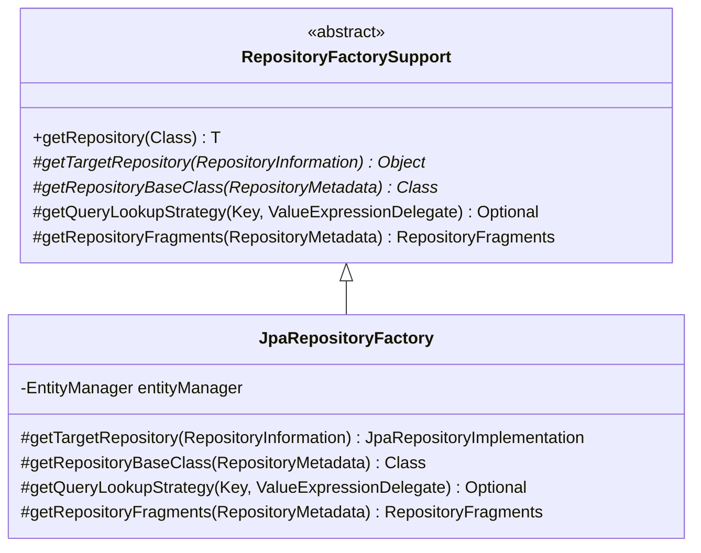
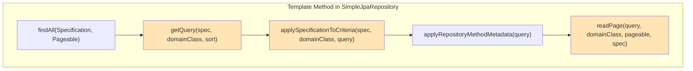
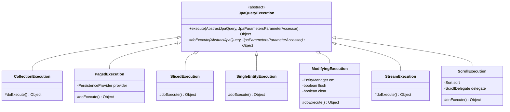
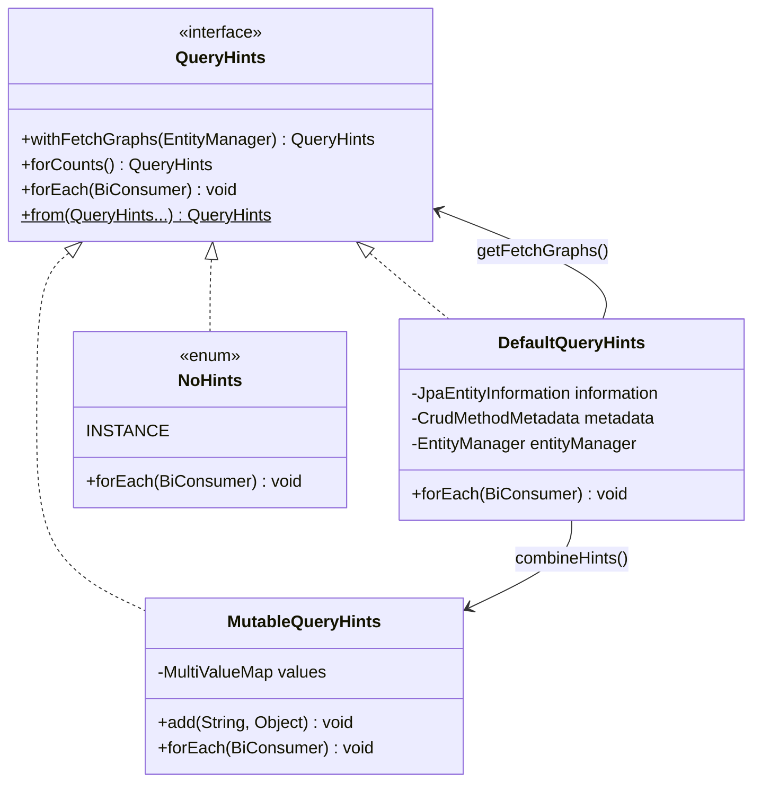
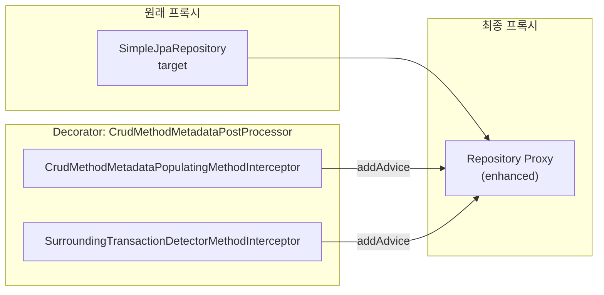
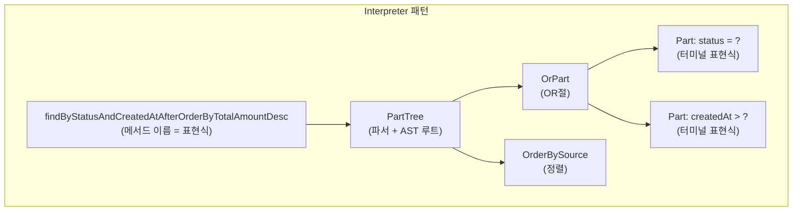
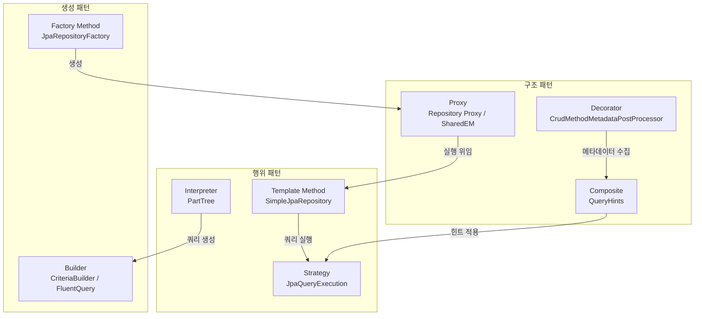

# Spring Data JPA에서 발견되는 GoF 디자인 패턴

Spring Data JPA 소스코드 전반에 적용된 8가지 GoF 디자인 패턴을 분석한다. 각 패턴이 실제로 어떤 클래스에서 어떻게 적용되었는지를 소스코드와 다이어그램으로 확인하고, 프레임워크의 설계 철학을 이해한다.

## 목차

1. [핵심 개념 (What)](#1-핵심-개념-what)
2. [왜 알아야 하는가 (Why)](#2-왜-알아야-하는가-why)
3. [내부 구현 분석 (How)](#3-내부-구현-분석-how)
4. [실전 예제](#4-실전-예제)
5. [정리](#5-정리)

---

## 1. 핵심 개념 (What)

Spring Data JPA는 개발자가 인터페이스만 선언하면 런타임에 완전한 리포지토리 구현체를 제공한다. 이 마법 같은 동작 뒤에는 GoF 디자인 패턴이 체계적으로 적용되어 있다.

| 패턴 | Spring Data JPA에서의 역할 | 핵심 클래스 |
|------|---------------------------|-------------|
| **Proxy** | 인터페이스로부터 런타임 구현체 생성 | `ProxyFactory`, `SharedEntityManagerCreator` |
| **Factory Method** | 리포지토리/쿼리 객체 생성의 확장 지점 | `JpaRepositoryFactory` |
| **Template Method** | CRUD 공통 로직과 확장 훅 분리 | `SimpleJpaRepository` |
| **Strategy** | 쿼리 실행 방식의 교체 가능한 캡슐화 | `JpaQueryExecution` 계층 |
| **Composite** | 여러 쿼리 힌트의 투명한 합성 | `QueryHints`, `DefaultQueryHints` |
| **Decorator** | 기존 기능에 횡단 관심사 추가 | `CrudMethodMetadataPostProcessor` |
| **Builder** | 복잡한 쿼리 객체의 단계적 구성 | `CriteriaBuilder`, `FluentQuery` |
| **Interpreter** | 메서드 이름을 쿼리 AST로 변환 | `PartTree` |

---

## 2. 왜 알아야 하는가 (Why)

### 프레임워크 확장의 핵심

Spring Data JPA를 커스터마이징할 때 — 예를 들어 커스텀 `RepositoryFactoryBean`이나 `QueryLookupStrategy`를 만들 때 — 어떤 패턴이 적용되었는지 알아야 올바른 확장 지점을 찾을 수 있다.

### 소스코드 탐색 효율

"이 기능은 어떤 패턴으로 구현되었을까?"를 떠올릴 수 있다면, 처음 보는 코드에서도 구조를 빠르게 파악할 수 있다. 예를 들어 "쿼리 실행 방식이 여러 가지인데?"라는 질문에 "Strategy 패턴이겠군, `JpaQueryExecution`의 서브클래스를 찾아보자"라고 추론할 수 있다.

### 자신의 코드에 적용

Spring Data JPA에서 검증된 패턴 적용 방식을 학습하여, 자신의 프로젝트 설계에 활용할 수 있다.

---

## 3. 내부 구현 분석 (How)

### 3.1 Proxy 패턴

> "대리 객체를 통해 실제 객체에 대한 접근을 제어한다"

Spring Data JPA에서 Proxy 패턴은 두 곳에서 핵심적으로 사용된다.

#### (1) Repository Proxy

사용자가 선언한 인터페이스로부터 JDK Dynamic Proxy를 생성한다.



#### (2) SharedEntityManager Proxy

스레드 안전한 EntityManager 프록시를 생성한다. 매 호출마다 현재 트랜잭션의 실제 EntityManager로 위임한다.

```java
// Spring ORM - SharedEntityManagerCreator (간략화)
// JDK Proxy의 InvocationHandler가 매 호출마다
// TransactionSynchronizationManager에서 실제 EM을 조회
public static EntityManager createSharedEntityManager(EntityManagerFactory emf) {
    return (EntityManager) Proxy.newProxyInstance(
        emf.getClass().getClassLoader(),
        new Class<?>[] { EntityManager.class },
        new SharedEntityManagerInvocationHandler(emf)
    );
}
```

### 3.2 Factory Method 패턴

> "객체 생성을 서브클래스에 위임하여 생성 로직의 변경 없이 생성되는 객체를 바꿀 수 있다"

`JpaRepositoryFactory`는 `RepositoryFactorySupport`의 **Factory Method**들을 오버라이드한다.



```java
// JpaRepositoryFactory.java:238
@Override
protected Class<?> getRepositoryBaseClass(RepositoryMetadata metadata) {
    return SimpleJpaRepository.class;  // Factory Method: 기본 구현 클래스 결정
}

// JpaRepositoryFactory.java:258
@Override
protected Optional<QueryLookupStrategy> getQueryLookupStrategy(
        @Nullable Key key, ValueExpressionDelegate valueExpressionDelegate) {
    // Factory Method: 쿼리 조회 전략 생성
    return Optional.of(JpaQueryLookupStrategy.create(
        entityManager, queryMethodFactory, key, queryConfiguration));
}
```

커스텀 확장 시 `JpaRepositoryFactory`를 상속하여 Factory Method를 오버라이드하면 된다.

### 3.3 Template Method 패턴

> "알고리즘의 골격을 정의하고, 일부 단계를 서브클래스에서 재정의할 수 있게 한다"

`SimpleJpaRepository`의 쿼리 실행 흐름이 Template Method 패턴이다.



노란색으로 표시된 메서드들은 `protected`로 선언되어 서브클래스에서 오버라이드 가능하다.

```java
// SimpleJpaRepository.java:787 - protected 확장 포인트
protected <S extends T> TypedQuery<S> getQuery(
        Specification<S> spec, Class<S> domainClass, Sort sort) {
    // 서브클래스에서 쿼리 생성 로직 변경 가능
}

// SimpleJpaRepository.java:735 - protected 확장 포인트
protected <S extends T> Page<S> readPage(
        TypedQuery<S> query, Class<S> domainClass,
        Pageable pageable, Specification<S> spec) {
    // 서브클래스에서 페이징 결과 변환 로직 변경 가능
}
```

### 3.4 Strategy 패턴

> "알고리즘 군을 정의하고, 각각을 캡슐화하여 교체 가능하게 한다"

`JpaQueryExecution`은 쿼리 실행 전략의 추상 클래스이며, 반환 타입에 따라 다른 전략이 선택된다.



```java
// JpaQueryExecution.java:94 - Template + Strategy 결합
public @Nullable Object execute(AbstractJpaQuery query,
                                 JpaParametersParameterAccessor accessor) {
    Object result = doExecute(query, accessor);  // Strategy의 핵심 메서드

    if (result == null) return null;

    // 공통 후처리: 타입 변환
    Class<?> requiredType = query.getQueryMethod().getReturnType();
    if (ClassUtils.isAssignableValue(requiredType, result)) return result;

    return CONVERSION_SERVICE.canConvert(result.getClass(), requiredType)
        ? CONVERSION_SERVICE.convert(result, requiredType)
        : result;
}
```

각 전략의 `doExecute()` 구현:

```java
// CollectionExecution - 컬렉션 반환
protected Object doExecute(AbstractJpaQuery query, ...) {
    return query.createQuery(accessor).getResultList();
}

// SingleEntityExecution - 단일 엔티티 반환
protected @Nullable Object doExecute(AbstractJpaQuery query, ...) {
    return query.createQuery(accessor).getSingleResultOrNull();
}

// ModifyingExecution - UPDATE/DELETE 실행
protected Object doExecute(AbstractJpaQuery query, ...) {
    if (flush) em.flush();
    int result = query.createQuery(accessor).executeUpdate();
    if (clear) em.clear();
    return result;
}
```

### 3.5 Composite 패턴

> "개별 객체와 복합 객체를 동일하게 다룰 수 있게 한다"

`QueryHints` 인터페이스와 그 구현체들이 Composite 패턴이다. `MutableQueryHints`(단일 힌트)와 `DefaultQueryHints`(합성 힌트)를 동일한 인터페이스로 다룬다.



```java
// QueryHints.java:43 - Composite 합성
static QueryHints from(QueryHints... sources) {
    MutableQueryHints result = new MutableQueryHints();
    for (QueryHints queryHints : sources) {
        queryHints.forEach(result.getValues()::add);  // 여러 QueryHints를 하나로 합성
    }
    return result;
}
```

`DefaultQueryHints.combineHints()`에서 `@QueryHints` 어노테이션 힌트와 `@EntityGraph` 힌트를 투명하게 합성한다.

```java
// DefaultQueryHints.java:92
private QueryHints combineHints() {
    return QueryHints.from(
        forCounts ? metadata.getQueryHintsForCount() : metadata.getQueryHints(),
        getFetchGraphs()  // EntityGraph → QueryHints로 변환
    );
}
```

### 3.6 Decorator 패턴

> "객체에 동적으로 새로운 책임을 추가한다"

`CrudMethodMetadataPostProcessor`는 리포지토리 프록시에 **메타데이터 수집 기능을 추가**하는 Decorator다. `RepositoryProxyPostProcessor` 인터페이스를 통해 프록시 생성 후 AOP advice를 추가한다.



```java
// JpaRepositoryFactory.java:100
addRepositoryProxyPostProcessor(crudMethodMetadataPostProcessor);
addRepositoryProxyPostProcessor((factory, repositoryInformation) -> {
    if (isTransactionNeeded(repositoryInformation.getRepositoryInterface())) {
        factory.addAdvice(SurroundingTransactionDetectorMethodInterceptor.INSTANCE);
    }
});
```

### 3.7 Builder 패턴

> "복잡한 객체의 생성 과정을 단계적으로 분리한다"

JPA의 `CriteriaBuilder`가 대표적이며, Spring Data JPA에서는 `FluentQuery` API가 Builder 패턴을 제공한다.

```java
// FluentQuery를 활용한 빌더 패턴 사용 예
orderRepository.findBy(
    OrderSpecifications.hasStatus(OrderStatus.PENDING),
    query -> query
        .sortBy(Sort.by("createdAt").descending())   // step 1
        .project("id", "status", "totalAmount")       // step 2
        .limit(100)                                    // step 3
        .all()                                         // terminal operation
);
```

`SimpleJpaRepository` 내부에서도 `CriteriaBuilder`를 사용하여 쿼리를 단계적으로 구성한다.

```java
// SimpleJpaRepository.java:807 (간략화)
CriteriaBuilder builder = entityManager.getCriteriaBuilder();
CriteriaQuery<S> query = builder.createQuery(domainClass);      // 1. 쿼리 생성
Root<S> root = applySpecificationToCriteria(spec, domainClass, query); // 2. WHERE
query.select(root);                                               // 3. SELECT
if (sort.isSorted()) {
    query.orderBy(toOrders(sort, root, builder));                 // 4. ORDER BY
}
return applyRepositoryMethodMetadata(entityManager.createQuery(query)); // 5. 실행
```

### 3.8 Interpreter 패턴

> "언어의 문법을 정의하고 그 문법에 대한 해석기를 만든다"

`PartTree`가 리포지토리 메서드 이름을 파싱하여 쿼리 AST(Abstract Syntax Tree)로 변환한다.

```
메서드 이름 문법:
  findBy{속성}{조건}[And|Or]{속성}{조건}[OrderBy{속성}{방향}]

예시: findByStatusAndCreatedAtAfterOrderByTotalAmountDesc

파싱 결과:
  Subject: find
  Predicate:
    ├── OrPart
    │   ├── Part(status, SIMPLE_PROPERTY)
    │   └── Part(createdAt, AFTER)
    └── OrderBy
        └── Order(totalAmount, DESC)
```



`PartTreeJpaQuery`가 이 AST를 `CriteriaQuery`로 변환한다. `Part.Type` enum이 각 조건 키워드를 JPA `Predicate`로 해석하는 **Interpreter**의 역할을 한다.

---

## 4. 실전 예제

### 예제 1: Factory Method 패턴을 활용한 커스텀 리포지토리 구현

```java
// 커스텀 Repository 기본 구현체
public class CustomSimpleJpaRepository<T, ID> extends SimpleJpaRepository<T, ID> {

    private final EntityManager entityManager;

    public CustomSimpleJpaRepository(
            JpaEntityInformation<T, ?> entityInformation,
            EntityManager entityManager) {
        super(entityInformation, entityManager);
        this.entityManager = entityManager;
    }

    // Template Method 오버라이드: 소프트 삭제 적용
    @Override
    @Transactional
    public void delete(T entity) {
        if (entity instanceof SoftDeletable sd) {
            sd.markDeleted();
            entityManager.merge(entity);
        } else {
            super.delete(entity);
        }
    }
}

// Factory Method 오버라이드: 커스텀 구현체 사용
public class CustomJpaRepositoryFactory extends JpaRepositoryFactory {

    public CustomJpaRepositoryFactory(EntityManager entityManager) {
        super(entityManager);
    }

    @Override
    protected Class<?> getRepositoryBaseClass(RepositoryMetadata metadata) {
        return CustomSimpleJpaRepository.class; // Factory Method
    }
}

// FactoryBean 등록
public class CustomJpaRepositoryFactoryBean<T extends Repository<S, ID>, S, ID>
        extends JpaRepositoryFactoryBean<T, S, ID> {

    public CustomJpaRepositoryFactoryBean(Class<? extends T> repositoryInterface) {
        super(repositoryInterface);
    }

    @Override
    protected RepositoryFactorySupport createRepositoryFactory(EntityManager em) {
        return new CustomJpaRepositoryFactory(em);
    }
}
```

### 예제 2: Strategy 패턴의 활용

```java
// 쿼리 실행 전략 선택이 반환 타입으로 결정되는 것을 활용
public interface OrderRepository extends JpaRepository<Order, Long> {

    // → CollectionExecution 전략
    List<Order> findByStatus(OrderStatus status);

    // → PagedExecution 전략
    Page<Order> findByStatus(OrderStatus status, Pageable pageable);

    // → SlicedExecution 전략
    Slice<Order> findByStatus(OrderStatus status, Pageable pageable);

    // → StreamExecution 전략
    @Transactional(readOnly = true)
    Stream<Order> findByCreatedAtAfter(LocalDateTime date);

    // → SingleEntityExecution 전략
    Optional<Order> findByOrderNumber(String orderNumber);

    // → ModifyingExecution 전략
    @Modifying
    @Query("UPDATE Order o SET o.status = :status WHERE o.id = :id")
    int updateStatus(@Param("id") Long id, @Param("status") OrderStatus status);
}
```

---

## 5. 정리

| 디자인 패턴 | 적용 위치 | 핵심 클래스/인터페이스 | 효과 |
|-------------|-----------|----------------------|------|
| **Proxy** | Repository 프록시, SharedEntityManager | `ProxyFactory`, `SharedEntityManagerCreator` | 인터페이스만으로 구현체 제공, 스레드 안전한 EM |
| **Factory Method** | 리포지토리/쿼리 생성 | `JpaRepositoryFactory`, `RepositoryFactorySupport` | 구현체 교체를 위한 확장 지점 제공 |
| **Template Method** | CRUD 쿼리 실행 흐름 | `SimpleJpaRepository` (`getQuery`, `readPage`) | 공통 로직 재사용 + 서브클래스 확장 |
| **Strategy** | 쿼리 실행 방식 | `JpaQueryExecution` 계층 7개 서브클래스 | 반환 타입별 실행 로직 캡슐화 |
| **Composite** | 쿼리 힌트 합성 | `QueryHints`, `DefaultQueryHints`, `MutableQueryHints` | 개별/합성 힌트를 동일 인터페이스로 처리 |
| **Decorator** | 프록시 후처리 | `CrudMethodMetadataPostProcessor`, `RepositoryProxyPostProcessor` | 런타임에 메타데이터 수집 기능 추가 |
| **Builder** | 쿼리 구성 | `CriteriaBuilder`, `FluentQuery` | 복잡한 쿼리를 단계적으로 구성 |
| **Interpreter** | 메서드 이름 파싱 | `PartTree`, `Part`, `Part.Type` | 메서드 이름 → 쿼리 AST → JPA 쿼리 변환 |



---
*참고: Spring Data JPA 3.x / Hibernate 6.x 기준*
