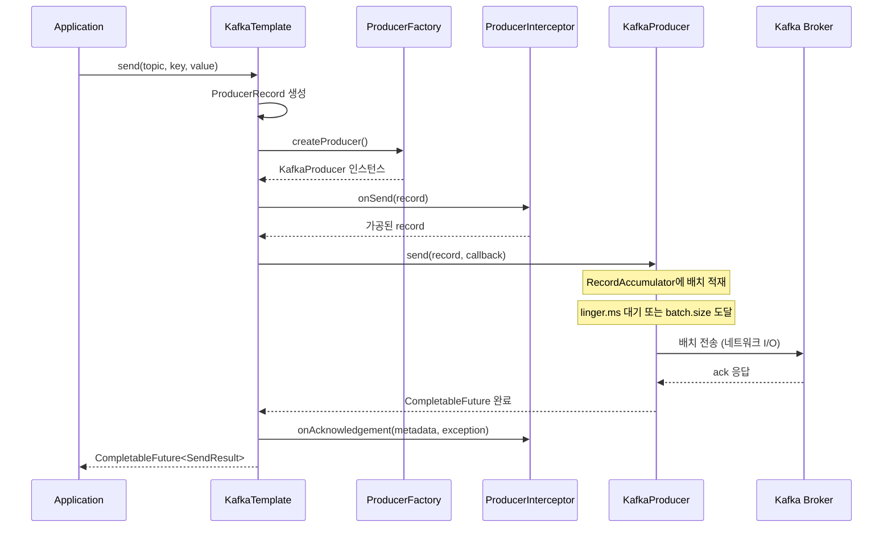
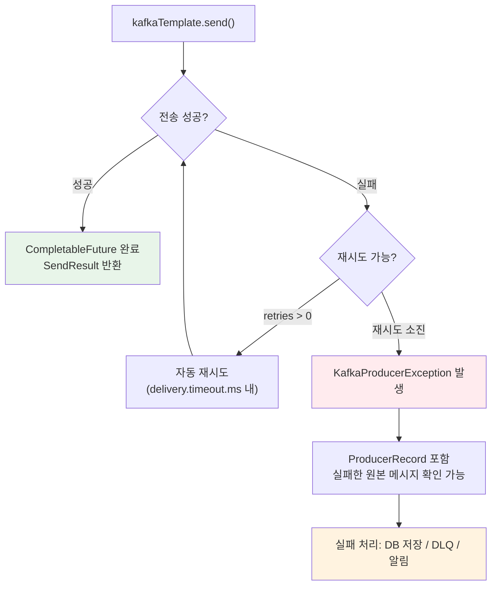

# Spring Kafka Producer 심화: KafkaTemplate과 메시지 발행 전략

Spring Kafka의 Producer는 `KafkaTemplate`을 중심으로 동기/비동기 전송, 배치 최적화, 인터셉터, 에러 처리까지 다양한 메시지 발행 전략을 제공한다. 이 문서에서는 `ProducerFactory` 설정부터 프로덕션 수준의 주문 이벤트 발행 시스템 구현까지 심층적으로 분석한다.

## 목차

1. [핵심 개념 (What)](#1-핵심-개념-what)
2. [왜 알아야 하는가 (Why)](#2-왜-알아야-하는가-why)
3. [내부 구현 분석 (How)](#3-내부-구현-분석-how)
4. [실전 예제](#4-실전-예제)
5. [정리](#5-정리)

---

## 1. 핵심 개념 (What)

### Spring Kafka Producer란?

Spring Kafka는 Apache Kafka의 Java Producer Client를 Spring 생태계에 통합한 추상화 계층이다. `KafkaTemplate`이 핵심 진입점이며, Spring Boot의 자동 구성을 통해 `spring.kafka.producer.*` 프로퍼티만으로 즉시 사용할 수 있다.

### 핵심 구성요소

| 구성요소 | 역할 |
|---------|------|
| `KafkaTemplate` | 메시지 전송의 핵심 API. `send()`, `sendDefault()`, `executeInTransaction()` 제공 |
| `ProducerFactory` | Kafka Producer 인스턴스를 생성하는 팩토리 인터페이스 |
| `DefaultKafkaProducerFactory` | `ProducerFactory`의 기본 구현체. Producer 설정과 직렬화기 관리 |
| `ProducerRecord` | 토픽, 파티션, 키, 값, 헤더를 포함하는 전송 단위 |
| `ProducerInterceptor` | 메시지 전송 전/후 가로채기를 위한 인터페이스 |
| `KafkaProducerException` | 전송 실패 시 발생하는 예외. 원본 `ProducerRecord` 포함 |

### 의존성과 자동 구성

```xml
<!-- pom.xml -->
<dependency>
    <groupId>org.springframework.kafka</groupId>
    <artifactId>spring-kafka</artifactId>
</dependency>
```

Spring Boot는 `KafkaAutoConfiguration`을 통해 다음을 자동 생성한다:
- `ProducerFactory<?, ?>` (DefaultKafkaProducerFactory)
- `KafkaTemplate<?, ?>`
- `KafkaAdmin` (토픽 자동 생성)

## 2. 왜 알아야 하는가 (Why)

### 실무에서 만나는 상황

1. **처리량 최적화**: `batch.size`와 `linger.ms` 설정에 따라 초당 전송 가능한 메시지 수가 10배 이상 달라질 수 있다. 기본값이 항상 최적은 아니다.
2. **데이터 유실 방지**: `acks=0`이나 `acks=1`로 설정하면 Broker 장애 시 메시지가 유실된다. 금융/결제 도메인에서는 `acks=all` + `min.insync.replicas=2` 조합이 필수다.
3. **비동기 전송 후 결과 추적**: `CompletableFuture` 기반 콜백을 올바르게 처리하지 않으면 전송 실패를 감지하지 못해 데이터가 조용히 사라진다.
4. **직렬화 오류 디버깅**: `JsonSerializer` 설정 오류로 메시지가 깨지는 문제는 Producer 측 설정을 정확히 이해해야 해결할 수 있다.

## 3. 내부 구현 분석 (How)

### 3.1 KafkaTemplate 전송 흐름



### 3.2 KafkaTemplate 주요 메서드

```java
public class KafkaTemplate<K, V> {

    // 토픽, 키, 값을 지정하여 전송
    CompletableFuture<SendResult<K, V>> send(String topic, K key, V data);

    // 토픽, 파티션, 키, 값을 지정하여 전송
    CompletableFuture<SendResult<K, V>> send(String topic, Integer partition, K key, V data);

    // 기본 토픽으로 전송 (spring.kafka.template.default-topic)
    CompletableFuture<SendResult<K, V>> sendDefault(K key, V data);

    // ProducerRecord를 직접 구성하여 전송
    CompletableFuture<SendResult<K, V>> send(ProducerRecord<K, V> record);

    // 트랜잭션 내에서 실행
    <T> T executeInTransaction(OperationsCallback<K, V, T> callback);
}
```

### 3.3 DefaultKafkaProducerFactory 설정

`DefaultKafkaProducerFactory`는 싱글톤 Producer를 관리하며, 트랜잭션 모드에서는 요청마다 새 Producer를 생성한다.

```java
@Configuration
public class KafkaProducerConfig {

    @Bean
    public ProducerFactory<String, Object> producerFactory() {
        Map<String, Object> props = new HashMap<>();
        props.put(ProducerConfig.BOOTSTRAP_SERVERS_CONFIG, "localhost:9092");

        // 직렬화 설정
        props.put(ProducerConfig.KEY_SERIALIZER_CLASS_CONFIG, StringSerializer.class);
        props.put(ProducerConfig.VALUE_SERIALIZER_CLASS_CONFIG, JsonSerializer.class);

        // 안정성 설정
        props.put(ProducerConfig.ACKS_CONFIG, "all");
        props.put(ProducerConfig.ENABLE_IDEMPOTENCE_CONFIG, true);
        props.put(ProducerConfig.RETRIES_CONFIG, 3);
        props.put(ProducerConfig.MAX_IN_FLIGHT_REQUESTS_PER_CONNECTION, 5);

        return new DefaultKafkaProducerFactory<>(props);
    }

    @Bean
    public KafkaTemplate<String, Object> kafkaTemplate() {
        KafkaTemplate<String, Object> template = new KafkaTemplate<>(producerFactory());
        template.setDefaultTopic("default-topic");
        return template;
    }
}
```

### 3.4 Producer 설정 튜닝

| 설정 | 기본값 | 설명 | 권장값 (고처리량) |
|------|--------|------|-------------------|
| `batch.size` | 16384 (16KB) | 배치 버퍼 크기. 가득 차면 전송 | 32768~65536 |
| `linger.ms` | 0 | 배치 전송 대기 시간. 0이면 즉시 전송 | 5~20 |
| `compression.type` | none | 압축 알고리즘 (gzip, snappy, lz4, zstd) | snappy 또는 lz4 |
| `buffer.memory` | 33554432 (32MB) | Producer 전체 버퍼 메모리 | 67108864 (64MB) |
| `max.block.ms` | 60000 | 버퍼 가득 시 최대 대기 시간 | 10000~30000 |
| `acks` | all | 브로커 확인 수준 (0, 1, all) | all |
| `retries` | 2147483647 | 재시도 횟수 | 기본값 유지 |
| `delivery.timeout.ms` | 120000 | 전송 완료 제한 시간 | 120000 |

```yaml
# application.yml - 고처리량 Producer 설정
spring:
  kafka:
    bootstrap-servers: localhost:9092,localhost:9093,localhost:9094
    producer:
      key-serializer: org.apache.kafka.common.serialization.StringSerializer
      value-serializer: org.springframework.kafka.support.serializer.JsonSerializer
      acks: all
      properties:
        enable.idempotence: true
        linger.ms: 10
        batch.size: 32768
        compression.type: snappy
        buffer.memory: 67108864
        max.block.ms: 15000
        delivery.timeout.ms: 120000
```

### 3.5 ProducerInterceptor: 전송 전후 가로채기

`ProducerInterceptor`는 Kafka 네이티브 인터페이스로, 메시지 전송 전후에 공통 로직을 삽입할 수 있다.

```java
public class TracingProducerInterceptor implements ProducerInterceptor<String, Object> {

    @Override
    public ProducerRecord<String, Object> onSend(ProducerRecord<String, Object> record) {
        // 전송 전: 헤더에 추적 정보 추가
        record.headers().add("trace-id",
            UUID.randomUUID().toString().getBytes(StandardCharsets.UTF_8));
        record.headers().add("send-timestamp",
            String.valueOf(System.currentTimeMillis()).getBytes(StandardCharsets.UTF_8));
        return record;
    }

    @Override
    public void onAcknowledgement(RecordMetadata metadata, Exception exception) {
        // 전송 후: 성공/실패 메트릭 기록
        if (exception != null) {
            Metrics.counter("kafka.producer.errors").increment();
        } else {
            Metrics.counter("kafka.producer.success").increment();
        }
    }

    @Override
    public void close() { }

    @Override
    public void configure(Map<String, ?> configs) { }
}
```

인터셉터 등록:

```java
props.put(ProducerConfig.INTERCEPTOR_CLASSES_CONFIG,
    TracingProducerInterceptor.class.getName());
```

### 3.6 CompletableFuture 기반 비동기 전송

Spring Kafka 3.x부터 `ListenableFuture` 대신 `CompletableFuture`를 반환한다.

```java
// 비동기 전송과 콜백 처리
public void sendAsync(String topic, String key, Object value) {
    CompletableFuture<SendResult<String, Object>> future =
        kafkaTemplate.send(topic, key, value);

    future.whenComplete((result, ex) -> {
        if (ex != null) {
            log.error("전송 실패 - topic: {}, key: {}", topic, key, ex);
            // 실패 처리: DLQ 저장, 알림 발송 등
        } else {
            RecordMetadata metadata = result.getRecordMetadata();
            log.info("전송 성공 - topic: {}, partition: {}, offset: {}",
                metadata.topic(), metadata.partition(), metadata.offset());
        }
    });
}

// 동기 전송 (CompletableFuture.get() 블로킹)
public SendResult<String, Object> sendSync(String topic, String key, Object value) {
    try {
        return kafkaTemplate.send(topic, key, value).get(10, TimeUnit.SECONDS);
    } catch (ExecutionException | InterruptedException | TimeoutException e) {
        throw new KafkaProducerException("메시지 전송 실패", e);
    }
}
```

### 3.7 에러 처리와 재시도



## 4. 실전 예제

### 4.1 주문 이벤트 발행 시스템

```java
// 주문 이벤트 DTO
@Getter
@Builder
@NoArgsConstructor
@AllArgsConstructor
public class OrderEvent {
    private String orderId;
    private String customerId;
    private String orderType;         // CREATED, CONFIRMED, SHIPPED, CANCELLED
    private BigDecimal totalAmount;
    private List<OrderItem> items;
    private LocalDateTime orderedAt;
}
```

```java
// 주문 이벤트 Producer 서비스
@Service
@RequiredArgsConstructor
@Slf4j
public class OrderEventProducer {

    private static final String TOPIC_ORDER_EVENTS = "order-events";
    private final KafkaTemplate<String, Object> kafkaTemplate;

    /**
     * 주문 생성 이벤트 발행 (비동기)
     * - key: customerId (같은 고객의 주문은 같은 파티션으로 보장)
     * - 헤더: event-type, trace-id 추가
     */
    public void publishOrderCreated(OrderEvent event) {
        ProducerRecord<String, Object> record = new ProducerRecord<>(
            TOPIC_ORDER_EVENTS,
            null,                              // partition (키 기반 자동 배정)
            event.getCustomerId(),             // key
            event                              // value
        );

        record.headers()
            .add("event-type", "ORDER_CREATED".getBytes(StandardCharsets.UTF_8))
            .add("trace-id", MDC.get("traceId").getBytes(StandardCharsets.UTF_8));

        kafkaTemplate.send(record).whenComplete((result, ex) -> {
            if (ex != null) {
                log.error("주문 이벤트 발행 실패 - orderId: {}", event.getOrderId(), ex);
                saveToOutboxForRetry(event);
            } else {
                RecordMetadata metadata = result.getRecordMetadata();
                log.info("주문 이벤트 발행 완료 - orderId: {}, partition: {}, offset: {}",
                    event.getOrderId(), metadata.partition(), metadata.offset());
            }
        });
    }

    /**
     * Outbox 패턴: 전송 실패 시 DB에 저장 후 스케줄러로 재전송
     */
    private void saveToOutboxForRetry(OrderEvent event) {
        log.warn("Outbox 저장 - orderId: {}", event.getOrderId());
        // outboxRepository.save(new OutboxMessage(TOPIC_ORDER_EVENTS, event));
    }
}
```

### 4.2 ProducerFactory 멀티 설정 (토픽별 다른 설정)

```java
@Configuration
public class MultiProducerConfig {

    @Bean
    public ProducerFactory<String, Object> highThroughputProducerFactory() {
        Map<String, Object> props = new HashMap<>();
        props.put(ProducerConfig.BOOTSTRAP_SERVERS_CONFIG, "localhost:9092");
        props.put(ProducerConfig.KEY_SERIALIZER_CLASS_CONFIG, StringSerializer.class);
        props.put(ProducerConfig.VALUE_SERIALIZER_CLASS_CONFIG, JsonSerializer.class);
        props.put(ProducerConfig.ACKS_CONFIG, "1");
        props.put(ProducerConfig.LINGER_MS_CONFIG, 20);
        props.put(ProducerConfig.BATCH_SIZE_CONFIG, 65536);
        props.put(ProducerConfig.COMPRESSION_TYPE_CONFIG, "lz4");
        return new DefaultKafkaProducerFactory<>(props);
    }

    @Bean
    public ProducerFactory<String, Object> reliableProducerFactory() {
        Map<String, Object> props = new HashMap<>();
        props.put(ProducerConfig.BOOTSTRAP_SERVERS_CONFIG, "localhost:9092");
        props.put(ProducerConfig.KEY_SERIALIZER_CLASS_CONFIG, StringSerializer.class);
        props.put(ProducerConfig.VALUE_SERIALIZER_CLASS_CONFIG, JsonSerializer.class);
        props.put(ProducerConfig.ACKS_CONFIG, "all");
        props.put(ProducerConfig.ENABLE_IDEMPOTENCE_CONFIG, true);
        props.put(ProducerConfig.RETRIES_CONFIG, 5);
        return new DefaultKafkaProducerFactory<>(props);
    }

    @Bean("highThroughputKafkaTemplate")
    public KafkaTemplate<String, Object> highThroughputKafkaTemplate() {
        return new KafkaTemplate<>(highThroughputProducerFactory());
    }

    @Bean("reliableKafkaTemplate")
    public KafkaTemplate<String, Object> reliableKafkaTemplate() {
        return new KafkaTemplate<>(reliableProducerFactory());
    }
}
```

## 5. 정리

| 항목 | 설명 |
|-----|------|
| KafkaTemplate | `send()`, `sendDefault()`, `executeInTransaction()` 기반 메시지 전송 API |
| ProducerFactory | `DefaultKafkaProducerFactory`가 기본 구현. 싱글톤 또는 트랜잭션 모드 지원 |
| 직렬화 | `StringSerializer`, `JsonSerializer`, `KafkaAvroSerializer` 등 선택 |
| 배치 최적화 | `batch.size` + `linger.ms` 조합으로 처리량과 지연 시간 트레이드오프 |
| 압축 | `compression.type`을 snappy/lz4로 설정하면 네트워크 사용량 50~70% 절감 |
| 비동기 전송 | `CompletableFuture<SendResult>` 반환. `whenComplete()`로 성공/실패 콜백 |
| ProducerInterceptor | `onSend()`/`onAcknowledgement()`로 전송 전후 공통 로직 삽입 |
| 에러 처리 | 재시도 소진 시 `KafkaProducerException` 발생. 원본 `ProducerRecord` 포함 |
| 멱등성 | `enable.idempotence=true`로 Producer 측 중복 전송 방지 |
| Outbox 패턴 | 전송 실패 시 DB에 저장 후 스케줄러로 재전송하는 안정적 발행 전략 |

---
*참고: Spring Boot 3.x / Spring Kafka 3.x 기준*
